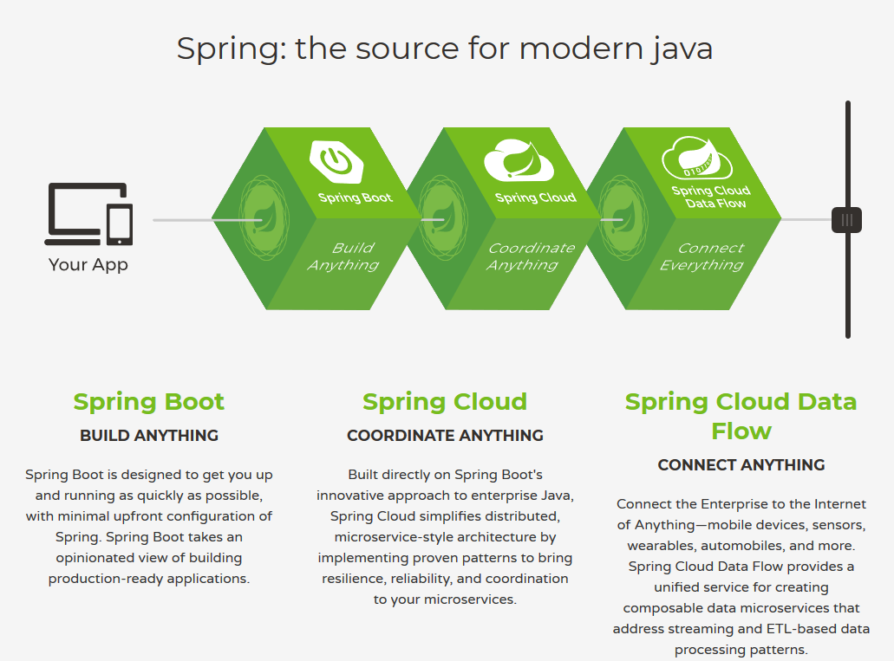
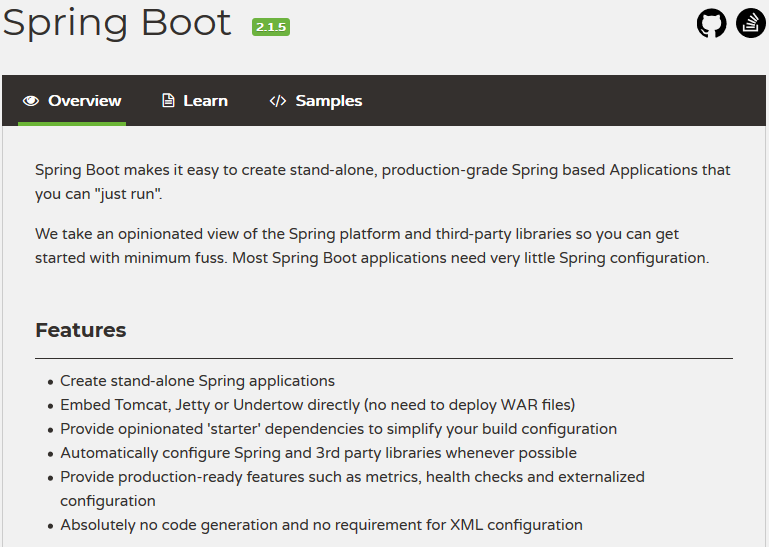

# SpringBoot介绍

## 1.SpringBoot前世今生

学习**Spring**+**SpringMVC**后，来看看**Spring Boot**到底有何魅力。

目前Spring给出的技术栈，对于**Spring Boot**的定位已经非常清晰`Build Anything`。Spring Boot是基于Spring技术栈项目的启动点，它用来快速的构建项目。相较于原先的Spring+SpringMVC它又解决了什么问题呢？

### 1.1 SpringBoot由来

以下部分为摘取：

> 2012 年 10 月，Mike Youngstrom 在 Spring jira 中创建了一个功能请求，要求在 Spring  框架中支持无容器 Web 应用程序体系结构。他谈到了在主容器引导 spring 容器内配置 Web 容器服务。这是 jira 请求的摘录：
>
> > 我认为 Spring 的 Web 应用体系结构可以大大简化，如果它提供了从上到下利用 Spring 组件和配置模型的工具和参考体系结构。在简单的 main（）方法引导的 Spring 容器内嵌入和统一这些常用Web 容器服务的配置。
>
> 这一要求促使了 2013 年初开始的 Spring Boot 项目的研发。2014 年 4 月，Spring Boot 1.0.0 发布。从那以后，一些 Spring Boot 版本出来了：
>
> - Spring boot 1.1（2014 年 6 月） - 改进的模板支持，gemfire 支持，elasticsearch 和 apache solr 的自动配置。
> - Spring Boot 1.2（2015 年 3 月） - 升级到 servlet 3.1 / tomcat 8 / jetty 9，spring 4.1 升级，支持 banner / jms / SpringBootApplication 注解。
> - Spring  Boot 1.3（2016 年 12 月） - Spring 4.2 升级，新的  spring-boot-devtools，用于缓存技术（ehcache，hazelcast，redis 和  infinispan）的自动配置以及完全可执行的 jar 支持。
> - Spring boot 1.4（2017年1月） - spring 4.3 升级，支持 couchbase / neo4j，分析启动失败和RestTemplateBuilder。
> - Spring boot 1.5（2017年2月） - 支持 kafka / ldap，第三方库升级，弃用 CRaSH 支持和执行器记录器端点以动态修改应用程序日志级别。
> - Spring boot 2.0（2018 年 03 月）-基于 Java 8，支持 Java 9，支持 Quartz ，调度程序大大简化了安全自动配置，支持嵌入式 Netty
>
> Spring Boot 简单性使 java 开发人员能够快速大规模地采用该项目。Spring Boot 可以说是在 Java 中开发基于 REST 的微服务 Web 应用程序的最快方法之一。

原文链接：<https://www.choupangxia.com/topic/detail/85>

如果基于Spring来进行开发，那么相信你一定对于那繁多的`xml`配置文件并不陌生，利用Spring的IOC容器来管理各种Bean整合三方lib库，避免重复造轮子的Spring为我们提供了非常强大的功能。但是各种`xml`文件的配制却又成为了我们快速构建项目的障碍。在完成项目开发后还需要打成war包部署到servlet容器上运行。

从摘取的介绍中可以看出Spring Boot并不是要取代Spring而是要快速构建应用，在其“约定大于配置”的思想下去繁就简，让开发者更多的去关注直接的应用开发而不是**环境**或者**部署**的问题。

### 1.2 什么是Spring Boot

上图是我从官网摘取的。开篇第一句就已经说的非常明白：使用Spring Boot你可以容易的构建**单体**-**企业级**-**基于Spring**的应用，并且你可以**直接运行**。

Spring Boot是J2EE的一站式解决方案。

### 1.3 如今最火的微服务框架(2019)

> In short, the microservice architectural style is an approach to developing a single application as a **suite of small services**, each **running in its own process** and communicating with lightweight mechanisms, often an HTTP resource API. These services are **built around business capabilities** and **independently deployable** by fully automated deployment machinery. There is a **bare minimum of centralized management** of these services, which may be written in different programming languages and use different data storage technologies.

简单点说就是拆，不过这个到底怎么拆，拆了有什么好处有什么问题这里不展开讨论了，可以阅读https://martinfowler.com/microservices/。这里介绍了什么是微服务、微服务与**分布式**系统以及**SOA**的关系、应用场景、如何构建、已在用的情况。

by the way以下这句思考思路也让我受益良多。

> But to gain any benefit from microservice thinking, you have to understand what it is, how to do it, and why you should usually do something else.

