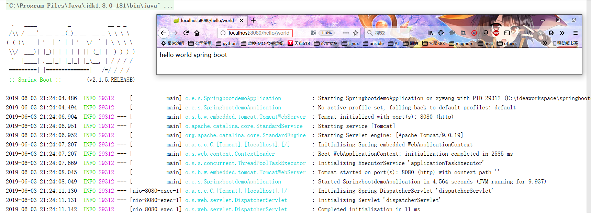
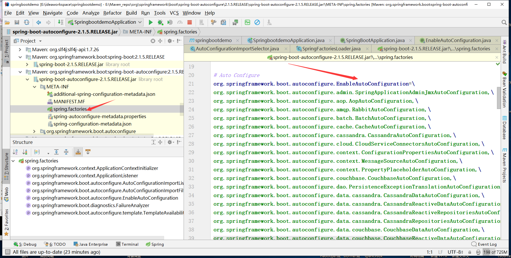
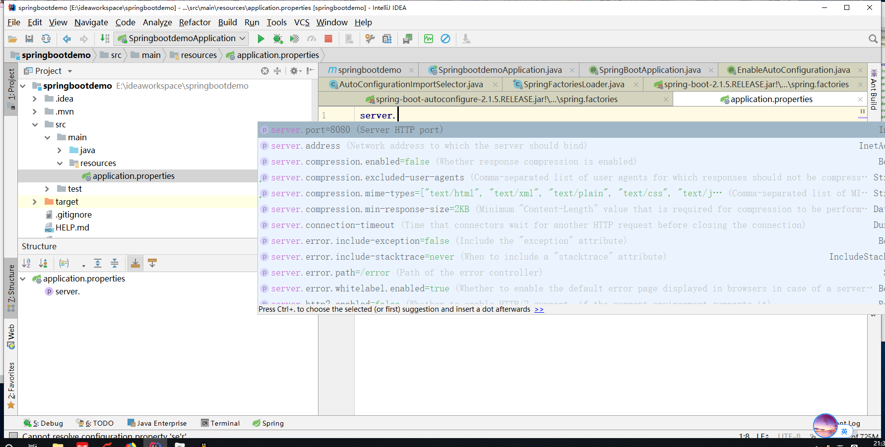

# Spring Boot快速构建

## 1 基本要素与使用

### 1.1 环境：

1. java 8
2. maven 3.2.1
3. idea 2018
4. spring boot 2.1.5

### 1.2 maven配置文件如下:

```xml
<?xml version="1.0" encoding="UTF-8"?>
<project xmlns="http://maven.apache.org/POM/4.0.0" xmlns:xsi="http://www.w3.org/2001/XMLSchema-instance"
         xsi:schemaLocation="http://maven.apache.org/POM/4.0.0 http://maven.apache.org/xsd/maven-4.0.0.xsd">
    <modelVersion>4.0.0</modelVersion>
    <parent>
        <groupId>org.springframework.boot</groupId>
        <artifactId>spring-boot-starter-parent</artifactId>
        <version>2.1.5.RELEASE</version>
        <relativePath/> <!-- lookup parent from repository -->
    </parent>
    <groupId>com.example</groupId>
    <artifactId>springbootdemo</artifactId>
    <version>0.0.1-SNAPSHOT</version>
    <name>springbootdemo</name>
    <description>Demo project for Spring Boot</description>

    <properties>
        <java.version>1.8</java.version>
    </properties>

    <dependencies>
        <dependency>
            <groupId>org.springframework.boot</groupId>
            <artifactId>spring-boot-starter</artifactId>
        </dependency>

        <dependency>
            <groupId>org.springframework.boot</groupId>
            <artifactId>spring-boot-starter-test</artifactId>
            <scope>test</scope>
        </dependency>

        <dependency>
            <groupId>org.springframework.boot</groupId>
            <artifactId>spring-boot-starter-web</artifactId>
        </dependency>
    </dependencies>

    <build>
        <plugins>
            <plugin>
                <groupId>org.springframework.boot</groupId>
                <artifactId>spring-boot-maven-plugin</artifactId>
            </plugin>
        </plugins>
    </build>

</project>
```

上面的配置文件为idea自动生成，手动加入了spring-boot-starter-web的依赖

### 1.3 启动类：

```java
package com.example.springbootdemo;

import org.springframework.boot.SpringApplication;
import org.springframework.boot.autoconfigure.SpringBootApplication;

@SpringBootApplication
public class SpringbootdemoApplication {

    public static void main(String[] args) {
        SpringApplication.run(SpringbootdemoApplication.class, args);
    }

}
```

### 1.4 controller(代码)

```java
package com.example.springbootdemo.controller;

import org.springframework.web.bind.annotation.RequestMapping;
import org.springframework.web.bind.annotation.RestController;

@RestController
@RequestMapping("/hello")
public class HelloWorldController {

    @RequestMapping("/world")
    public String helloWord(){
        return "hello world spring boot";
    }
}
```

### 1.5 运行结果




## 2. 分析说明

上面实践中真正写的代码只有controller中的几行，然后直接运行就可以看到服务启动了(包括servlet容器-tomcat、spring的IOC容器以及在访问后使用到的SpringMVC相关服务)。那么来看看里面的相关信息。

### 2.1 从POM文件说起

可以在POM文件中看到有<parent>和<dependencies>两个重要的标签，定义了父工程信息和依赖工程信息。

而对依赖的工程我们并没有定义版本号，实际用过maven我们知道，我们会在parent工程定义好版本号以方便版本的统一管理。来看看Spring Boot是不是也是这样做的。

在**spring-boot-starter-parent**的POM文件中定义了其父工程**spring-boot-dependencies**

```xml
<parent>
    <groupId>org.springframework.boot</groupId>
    <artifactId>spring-boot-dependencies</artifactId>
    <version>2.1.5.RELEASE</version>
    <relativePath>../spring-boot-dependencies</relativePath>
</parent>
```

**spring-boot-dependencies**中就定义了所依赖的项目和版本信息

再来看看**spring-boot-starter-web**，下面只留下了项目名，这里可以看到熟悉的SpringMVC的jar包。这就不难理解它到底是做什么的了。

```xml
<artifactId>spring-boot-starter</artifactId>

<artifactId>spring-boot-starter-json</artifactId>

<artifactId>spring-boot-starter-tomcat</artifactId>

<artifactId>hibernate-validator</artifactId>

<artifactId>spring-web</artifactId>

<artifactId>spring-webmvc</artifactId>
```

明白了jar包的引入，在看看这些Starter

> Starters are a set of convenient dependency descriptors that you can include in your
> application. You get a one-stop shop for all the Spring and related technologies that you
> need without having to hunt through sample code and copy-paste loads of dependency
> descriptors.

Sprint Boot将所有的功能场景都抽取出来做成了一个个的启动器。简单点说，starter一站式解决了相关技术的依赖问题。比如要用SpringMVC直接引入spring-boot-starter-web就有了相关jar包和整合。这里有相关starter的对照表不展开讨论。https://docs.spring.io/spring-boot/docs/current/reference/html/using-boot-build-systems.html#using-boot-starter

### 2.2 入口主程序

```java
@SpringBootApplication
public class SpringbootdemoApplication {

    public static void main(String[] args) {
        SpringApplication.run(SpringbootdemoApplication.class, args);
    }

}
```

#### 2.2.1 注解与加载的源码分析

**`@SpringBootApplication`** : Spring Boot的配置类；标注在类上表明是Spring Boot的配置类。其由以下注解组成：

```java
@SpringBootConfiguration
@EnableAutoConfiguration
@ComponentScan(excludeFilters = {
		@Filter(type = FilterType.CUSTOM, classes = TypeExcludeFilter.class),
		@Filter(type = FilterType.CUSTOM,
				classes = AutoConfigurationExcludeFilter.class) })
```

**`@SpringBootConfiguration`** ： 也是一个组合注解，表明是配置类主要含有**`@Configuration`**。配置类也是容器中的一个组件。

**`@EnableAutoConfiguration`** : 开启自动配置。之前在spring需要配置的东西由Spring Boot自动配置

```java
@AutoConfigurationPackage
@Import(AutoConfigurationImportSelector.class)
```

@AutoConfigurationPackage ： 自动配置包 

​	@Import(AutoConfigurationPackages.Registrar.class)，导入了自动配置包的注册器。

这个类干了什么呢，来看下源码，它向registry中添加了包名i信息，向容器中添加了一个单例的元数据包。

> ```java
> static class Registrar implements ImportBeanDefinitionRegistrar, DeterminableImports {
> 
> @Override
> public void registerBeanDefinitions(AnnotationMetadata metadata,
>       BeanDefinitionRegistry registry) {
>    register(registry, new PackageImport(metadata).getPackageName());
> }
> 
> @Override
> public Set<Object> determineImports(AnnotationMetadata metadata) {
>    return Collections.singleton(new PackageImport(metadata));
> }
> 
> }
> /**
> @org.springframework.boot.autoconfigure.SpringBootApplication(scanBasePackageClasses=[], exclude=[], excludeName=[], scanBasePackages=[])
> class com.example.springbootdemo.SpringbootdemoApplication
> 
> new PackageImport(metadata).getPackageName() -> com.example.springbootdemo
> **/
> ```

这样就拿到了启动类的路径信息。

**`@Import(AutoConfigurationImportSelector.class)`** ： 自动导入组件

> ```java
> public String[] selectImports(AnnotationMetadata annotationMetadata) {
> if (!isEnabled(annotationMetadata)) {
>    return NO_IMPORTS;
> }
> AutoConfigurationMetadata autoConfigurationMetadata = AutoConfigurationMetadataLoader
>       .loadMetadata(this.beanClassLoader);
> AutoConfigurationEntry autoConfigurationEntry = getAutoConfigurationEntry(
>       autoConfigurationMetadata, annotationMetadata);
> return StringUtils.toStringArray(autoConfigurationEntry.getConfigurations());
> }
> 
> protected AutoConfigurationEntry getAutoConfigurationEntry(
>     AutoConfigurationMetadata autoConfigurationMetadata,
>     AnnotationMetadata annotationMetadata) {
>     if (!isEnabled(annotationMetadata)) {
>         return EMPTY_ENTRY;
>     }
>     AnnotationAttributes attributes = getAttributes(annotationMetadata);
>     List<String> configurations = getCandidateConfigurations(annotationMetadata,
>                                                              attributes);
>     configurations = removeDuplicates(configurations);
>     Set<String> exclusions = getExclusions(annotationMetadata, attributes);
>     checkExcludedClasses(configurations, exclusions);
>     configurations.removeAll(exclusions);
>     configurations = filter(configurations, autoConfigurationMetadata);
>     fireAutoConfigurationImportEvents(configurations, exclusions);
>     return new AutoConfigurationEntry(configurations, exclusions);
> }
> /***
> configurations = {LinkedList@3586} size = 118
> 导入了大量组件：org.springframework.boot.autoconfigure.xxx.XxxAutoConfiguration
> 属于自动配置的组件，业务相关的还未导入
>  ***/
> 
> protected List<String> getCandidateConfigurations(AnnotationMetadata metadata,
>     AnnotationAttributes attributes) {
>     List<String> configurations = SpringFactoriesLoader.loadFactoryNames(
>         getSpringFactoriesLoaderFactoryClass(), getBeanClassLoader());
>     Assert.notEmpty(configurations,
>                     "No auto configuration classes found in META-INF/spring.factories. If you "
>                     + "are using a custom packaging, make sure that file is correct.");
>     return configurations;
> }
> /***
> 这里向Spring容器中加载Class
> ***/
> 
> /***
> SpringFactoriesLoader.loadFactoryNames
> ***/
> //FACTORIES_RESOURCE_LOCATION获取到url
> //public static final String FACTORIES_RESOURCE_LOCATION = "META-INF/spring.factories";
> Enumeration<URL> urls = (classLoader != null ?
> 					classLoader.getResources(FACTORIES_RESOURCE_LOCATION) :
> 					ClassLoader.getSystemResources(FACTORIES_RESOURCE_LOCATION));
> //通过url将资源作为properties加载
> URL url = urls.nextElement();
> UrlResource resource = new UrlResource(url);
> Properties properties = PropertiesLoaderUtils.loadProperties(resource);
> //获取工厂类名与工厂名
> String factoryClassName = ((String) entry.getKey()).trim();
> for (String factoryName : StringUtils.commaDelimitedListToStringArray((String) entry.getValue())) {
>     result.add(factoryClassName, factoryName.trim());
> }
> ```



这些自动配置类就帮我们配置了以前需要的东西了。类似于配置文件。

**`@ComponentScan`** ： 是定义**扫描的路径**从中找出标识了**需要装配**的类自动装配到spring的bean容器中

### 2.3 resources

static放静态资源

templates放模版文件

application.properties可以改变默认配置

