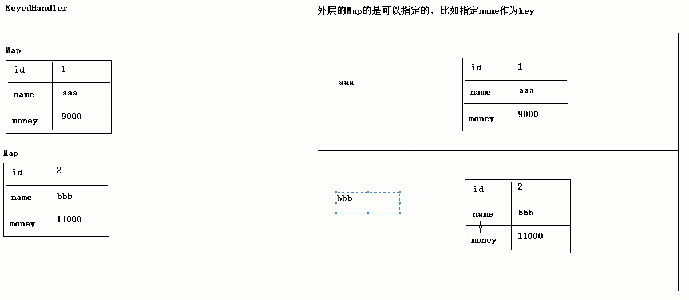

## jdbc管理事务

准备环境：

```{}
create database web_test4;
use web_test4;
create table account(
	id int primary key,
	name varchar(15),
	account decimal
);
insert into account values(null,'aaa',500);
insert into account values(null,'bbb',600);
```

后面操作与11中纪录基本相同


## 连接池与工具

#### 1. 连接池

###### 1.1 what

连接池是创建和管理连接缓冲池的技术，这些连接被任何需要他们的线程使用。

###### 1.2 why

​	连接对象创建和销毁比较耗时，在服务器初始化时就初始化一些连接。把这些连接放入内存使用时可以从内存中获取。从而节省下创建和销毁连接对象Connection的时间。


#### 2.Druid

###### 2.1 what

阿里旗下的连接池，可以与spring快速整合

###### 2.2 使用

**手动配置**

```java
DruidDataSource dds = new DruidDataSource();
dds.setDriverClassName("com.mysql.jdbc.Driver");
dds.setUrl("jdbc:mysql:///test1");
dds.setUsername("root");
dds.setPassword("1234");
Connection conn = dds.getConnection();
```

配置文件

```java
Properties prop = new Properties();
prop.load(new FileInputStream("src/druid.properties"));
DruidDataSourceFactory ddsf = new DruidDataSourceFactory();
DataSource dds = ddsf.createDataSource(prop);
Connection conn = dds.getConnection();
```


#### 3.C3P0

###### 1.what

实现了数据源与JNDI绑定，用在hiberbate，spring等

2.手动

```java
DruidDataSource dds = new DruidDataSource();
dds.setDriverClassName("com.mysql.jdbc.Driver");
dds.setUrl("jdbc:mysql:///test1");
dds.setUsername("root");
dds.setPassword("1234");
Connection conn = dds.getConnection();
```

3.配置文件

```java
// 获得连接：从连接池中获取：
// 创建连接池：//创建连接池默认去类路径下查找c3p0-config.xmljava
ComboPooledDataSource dataSource = new ComboPooledDataSource();
// 从连接池中获得连接:
conn = dataSource.getConnection();
```

```xml
<c3p0-config>
	<default-config>
		<property name="driverClass">com.mysql.jdbc.Driver</property>
		<property name="jdbcUrl">jdbc:mysql:///test</property>
		<property name="user">root</property>
		<property name="password">1234</property>
		
		<property name="initialPoolSize">5</property>
		<property name="minPoolSize">5</property>
		<property name="maxPoolSize">20</property>
	</default-config> 
	
	<!-- This app is massive! -->
<!-- 	<named-config name="oracle">
		<property name="driverClass">com.mysql.jdbc.Driver</property>
		<property name="jdbcUrl">jdbc:mysql:///web_test4</property>
		<property name="user">root</property>
		<property name="password">abc</property>
	</named-config> -->
</c3p0-config>
```

#### 4.DButils

| return      | description                                                  |
| ----------- | ------------------------------------------------------------ |
| ` int`      | `**update**(String sql,Object... params)`              Executes the given INSERT, UPDATE, or DELETE SQL statement. |
| ` int`      | `**update**(Connection conn,String sql,Object param)`              Execute an SQL INSERT, UPDATE, or DELETE query with a single replacement  parameter. |
| ` <T> T   ` | `**query**(String sql, ResultSetHandler<T> rsh, Object... params)`              Executes the given SELECT SQL query and returns a result object. |
| ` <T> T   ` | `**query**(Connection conn,String sql,ResultSetHandler<T> rsh,Object... params)`              Execute an SQL SELECT query with replacement parameters.事务相关 |


```java
public void useDBUtils() throws SQLException {
    QueryRunner queryRunner = new QueryRunner(JDBCUtils.getDataSource());
    queryRunner.update("update user set name=? where id=?","da","1");

    queryRunner.query("select * from user whre id=?", new ResultSetHandler<T>() {
        @Override
        public T handle(ResultSet arg0) throws SQLException {
        return null;
    }
}, 1);
```


##### 4.1 几个实现类对象

|return| **Constructor** |  |
| ------------------------ | ------------------------------------------------------------ | ------------------------ |
| BeanHandler<T>     | `**BeanHandler(Class<T> type)**` Creates a new instance of BeanHandler. | T |
| BeanListHandler<T> | `**BeanListHandler**(Class<T> type)`             Creates a new instance of BeanListHandler. | List<T> |
| MapHandler | `**MapHandler**()`    Creates a new instance of MapHandler using a `BasicRowProcessor` for conversion. | Map<String,Object> |
| MapListHandler | `**MapListHandler**()`             Creates a new instance of MapListHandler using a `BasicRowProcessor` for conversion. | Map<String,Object> |
|  | **上面2对用的最多** |  |
| ArrayHandler | `**ArrayHandler**()`             Creates a new instance of ArrayHandler using a `BasicRowProcessor` for conversion. | Object[] |
| ArrayListHandler | `**ArrayListHandler**()`             Creates a new instance of ArrayListHandler using a `BasicRowProcessor` for conversions. | List<Object> |
| ScalarHandler | `**ScalarHandler**()`             Creates a new instance of ScalarHandler. | Object |
| ColumnListHandler | `**ColumnListHandler**(String columnName)`             Creates a new instance of ColumnListHandler. | List<Object> |
| KeyedHandler | `**KeyedHandler**(String columnName)`             Creates a new instance of KeyedHandler. | <Map<Object,Map<String,Object>>> |


**BeanListHandler**

```java
@Test
public void demo1() throws SQLException {
    QueryRunner queryRunner = new QueryRunner(JDBCUtils.getDataSource());
    queryRunner.update("update user set name=? where id=?", "da", "1");

    List<User> list = queryRunner.query("select * from user where id=?", new BeanListHandler<User>(User.class), 1);
    list.forEach(System.out::println);
}
```

**MapListHandler**

```java
@Test
public void demo2() throws SQLException {
    QueryRunner queryRunner = new QueryRunner(JDBCUtils.getDataSource());
    queryRunner.update("update user set name=? where id=?", "da", "1");

    List<Map<String, Object>> list = queryRunner.query("select * from user where id>?", new MapListHandler(), 1);
    list.forEach(System.out::println);
}
```

​	

- 单值封装

  *ScalarHandler*	

- 列记录封装

  *ColumnListHandler*		

- 将一条记录封装到一个Map集合中。将多条记录封装到一个装有Map集合的Map集合中。而且外面的Map的key是可以指定的。

  *KeyedHandler* 



