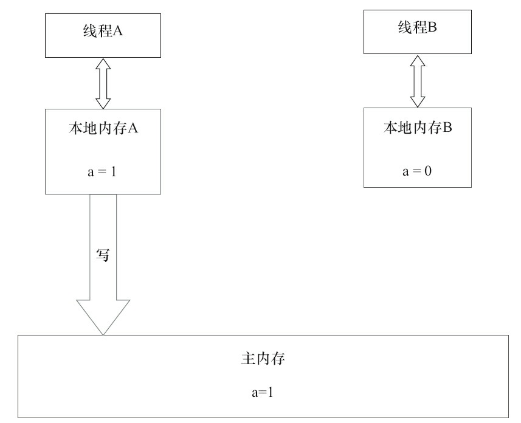
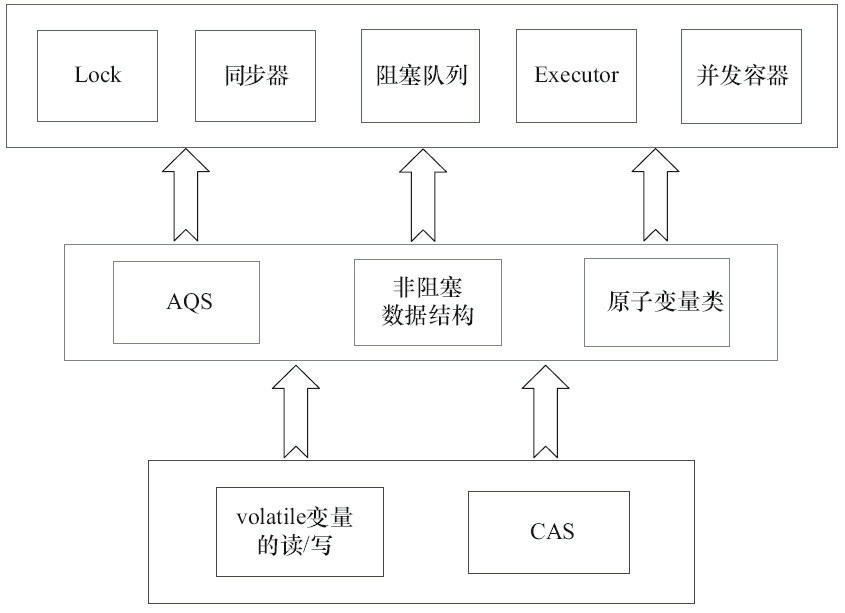

# 内存模型

```
线程之间如何通信及线程之间如何同步（这里的线程是指并发执行的活动实体）。通信是指线程之间以何种机制来交换信息。在命令式编程中，线程之间的通信机制有两种：共享内存和消息传递。
```


现代的处理器使用写缓冲区临时保存向内存写入的数据。写缓冲区可以保证指令流水线持续运行，它可以避免由于处理器停顿下来等待向内存写入数据而产生的延迟。同时，通过以批处理的方式刷新写缓冲区，以及合并写缓冲区中对同一内存地址的多次写，减少对内存总线的占用。虽然写缓冲区有这么多好处，但每个处理器上的写缓冲区，仅仅对它所在的处理器可见。这个特性会对内存操作的执行顺序产生重要的影响：处理器对内存的读/写操作的执行顺序，不一定与内存实际发生的读/写操作顺序一致！


由于写缓冲区仅对自己的处理器可见，它会导致处理器执行内存操作的顺序可能会与内存实际的操作执行顺序不一致。由于现代的处理器都会使用写缓冲区，因此现代的处理器都会允许对写-读操作进行重排序。

happens-before

两个操作之间具有happens-before关系，并不意味着前一个操作必须要在后一个操作之前执行！happens-before仅仅要求前一个操作（执行的结果）对后一个操作可见，且前一个操作按顺序排在第二个操作之前（the first is visible to and ordered before the second）。

## 1. 重排序

重排序是指编译器和处理器为了优化程序性能而对指令序列进行重新排序的一种手段。

### 1.1 as-if-serial

as-if-serial语义的意思是：不管怎么重排序（编译器和处理器为了提高并行度），（单线程）程序的执行结果不能被改变。编译器、runtime和处理器都必须遵守as-if-serial语义。

```java
double pi = 3.14; // A
double r = 1.0; // B
double area = pi * r * r; // C
```


根据happens-before的程序顺序规则，上面计算圆的面积的示例代码存在3个happens-
before关系。

1. A　happens-before B。
2. B　happens-before C。
3. A　happens-before C。

如果A happens-before B，JMM并不要求A一定要在B之前执行。JMM仅仅要求前一个操作（执行的结果）对后一个操作可见，且前一个操作按顺序排在第二个操作之前。这里操作A的执行结果不需要对操作B可见；而且重排序操作A和操作B后的执行结果，与操作A和操作B按happens-before顺序执行的结果一致。在这种情况下，JMM会认为这种重排序并不非法（not illegal），JMM允许这种重排序。

### 1.2 重排序影响多线程

```java
class ReorderExample {
    int a = 0;
    boolean flag = false;
    public void writer() {
            a = 1; 				// 1
            flag = true; 		// 2
        }
        Public void reader() {
            if (flag) { 		// 3
            	int i = a * a; 	// 4
            ……
        }
    }
}
```

这里假设有两个线程A和B，A首先执行writer()方法，随后B线程接着执行reader()方法。线程B在执行操作4时，能否看到线程A在操作1对共享变量a的写入呢？


在程序中，操作3和操作4存在控制依赖关系。当代码中存在控制依赖性时，会影响指令序列执行的并行度。为此，编译器和处理器会采用猜测（Speculation）执行来克服控制相关性对并行度的影响。以处理器的猜测执行为例，执行线程B的处理器可以提前读取并计算a*a，然后把计算结果临时保存到一个名为重排序缓冲（Reorder Buffer，ROB）的硬件缓存中。当操作3的条件判断为真时，就把该计算结果写入变量i中。

### 1.2 顺序一致性

​	顺序一致性内存模型是说在设计的时候，处理器的内存模型和编程语言的内存模型都会以顺序一致性内存模型作为参照。

1）一个线程中的所有操作必须按照程序的顺序来执行。
2）（不管程序是否同步）所有线程都只能看到一个单一的操作执行顺序。在顺序一致性内
存模型中，每个操作都必须原子执行且立刻对所有线程可见。

顺序一致性内存模型为程序员提供的视图如图


在概念上，顺序一致性模型有一个单一的全局内存，这个内存通过一个左右摆动的开关可以连接到任意一个线程，同时每一个线程必须按照程序的顺序来执行内存读/写操作。


现在我们再假设这两个线程没有做同步


```java
class SynchronizedExample {
    int a = 0;
    boolean flag = false;
    public synchronized void writer() { // 获取锁
        a = 1;
        flag = true;
    } // 释放锁
    public synchronized void reader() { // 获取锁
        if (flag) {
            int i = a;
            ……
    	} // 释放锁
    }
}
```


从这里我们可以看到，JMM在具体实现上的基本方针为：在不改变（正确同步的）程序执行结果的前提下，尽可能地为编译器和处理器的优化打开方便之门。


### 1.3 volatile的内存语义

理解volatile特性的一个好方法是把对volatile变量的单个读/写，看成是使用同一个锁对这些单个读/写操作做了同步

```java
class VolatileFeaturesExample {
    volatile long vl = 0L; 			// 使用volatile声明64位的long型变量
    public void set(long l) {
    	vl = l; 					// 单个volatile变量的写
    }
    public void getAndIncrement () {
   	 	vl++; 						// 复合（多个）volatile变量的读/写
    }
    public long get() {
    	return vl; 					// 单个volatile变量的读
    }
}

//等价
class VolatileFeaturesExample {
    long vl = 0L; 				// 使用volatile声明64位的long型变量
    public synchronized void set(long l) {
    	vl = l; 						// 单个volatile变量的写
    }
    public void getAndIncrement () {
    	long temp = get(); // 调用已同步的读方法
		temp += 1L; // 普通写操作
		set(temp); // 调用已同步的写方法
    }
    public synchronized long get() {
    	return vl; 						// 单个volatile变量的读
    }
}
```

可见性。对一个volatile变量的读，总是能看到（任意线程）对这个volatile变量最后的写入。
原子性：对任意单个volatile变量的读/写具有原子性，但类似于volatile++这种复合操作不具有原子性。


volatile写的内存语义如下。
**当写一个volatile变量时，JMM会把该线程对应的本地内存中的共享变量值刷新到主内存。**

**当读一个volatile变量时，JMM会把该线程对应的本地内存置为无效。线程接下来将从主内存中读取共享变量。**

```java
class VolatileExample {
    int a = 0;
    volatile boolean flag = false;
    public void writer() {
        a = 1;　　　　　	  // 1
        flag = true;　　　// 2
    }
    public void reader() {
        if (flag) {　　　　// 3
            int i = a;　　// 4
            ……
        }
    }
}
```

1）根据程序次序规则，1 happens-before 2;3 happens-before 4。
2）根据volatile规则，2 happens-before 3。
3）根据happens-before的传递性规则，1 happens-before 4。


线程A写一个volatile变量，实质上是线程A向接下来将要读这个volatile变量的某个线程发出了（其对共享变量所做修改的）消息。
线程B读一个volatile变量，实质上是线程B接收了之前某个线程发出的（在写这个volatile变量之前对共享变量所做修改的）消息。
线程A写一个volatile变量，随后线程B读这个volatile变量，这个过程实质上是线程A通过主内存向线程B发送消息。


由于volatile仅仅保证对单个volatile变量的读/写具有原子性，而锁的互斥执行的特性可以确保对整个临界区代码的执行具有原子性。在功能上，锁比volatile更强大；在可伸缩性和执行性能上，volatile更有优势。


### 1.4 锁的内存语义

众所周知，锁可以让临界区互斥执行。这里将介绍锁的另一个同样重要，但常常被忽视的功能：锁的内存语义。

```java
class MonitorExample {
    int a = 0;
    public synchronized void writer() {　　　// 1
    	a++;　　　　　　　　　　				 // 2
    }　　　　　　　　　　　　					// 3
    public synchronized void reader() {　　　// 4
    	int i = a;　　　　　　　　			   // 5
    	……
    }　　　　　　　　　　　　					// 6
}
```

假设线程A执行writer()方法，随后线程B执行reader()方法。

1）根据程序次序规则，1 happens-before 2,2 happens-before 3;4 happens-before 5,5 happens-before 6。
2）根据监视器锁规则，3 happens-before 4。
3）根据happens-before的传递性，2 happens-before 5。

在线程A释放了锁之后，随后线程B获取同一个锁。因此，线程A在释放锁之前所有可见的共享变量，在线程B获取同一个锁之后，将立刻变得对B线程可见。

#### 1.4.1 释放获取锁

当线程释放锁时，JMM会把该线程对应的本地内存中的共享变量刷新到主内存中。以上面的MonitorExample程序为例，A线程释放锁后，共享数据的状态示意图如图



当线程释放锁时，JMM会把该线程对应的本地内存中的共享变量刷新到主内存中。


当线程获取锁时，JMM会把该线程对应的本地内存置为无效。从而使得被监视器保护的临界区代码必须从主内存中读取共享变量。

对比锁释放-获取的内存语义与volatile写-读的内存语义可以看出：锁释放与volatile写有相同的内存语义；锁获取与volatile读有相同的内存语义。


### 1.5 锁的内存实现

将借助ReentrantLock的源代码，来分析锁内存语义的具体实现机制。

```java
class ReentrantLockExample {
    int a = 0;
    ReentrantLock lock = new ReentrantLock();
    public void writer() {
        lock.lock();　　　　// 获取锁
        try {
            a++;
        } finally {
            lock.unlock();　　// 释放锁
        }
    }
    public void reader () {
        lock.lock();　　　　// 获取锁
        try {
            int i = a;
            ……
        } finally {
        	lock.unlock();　// 释放锁
        }
    }
}
```


### 1.6 concurrent包的实现

由于Java的CAS同时具有volatile读和volatile写的内存语义，因此Java线程之间的通信现在有了下面4种方式。
1）A线程写volatile变量，随后B线程读这个volatile变量。
2）A线程写volatile变量，随后B线程用CAS更新这个volatile变量。
3）A线程用CAS更新一个volatile变量，随后B线程用CAS更新这个volatile变量。
4）A线程用CAS更新一个volatile变量，随后B线程读这个volatile变量。


如果我们仔细分析concurrent包的源代码实现，会发现一个通用化的实现模式。

```java
1.首先，声明共享变量为volatile。
2.然后，使用CAS的原子条件更新来实现线程之间的同步。
3.同时，配合以volatile的读/写和CAS所具有的volatile读和写的内存语义来实现线程之间的通信。
```

AQS，非阻塞数据结构和原子变量类（java.util.concurrent.atomic包中的类），这些concurrent包中的基础类都是使用这种模式来实现的，而concurrent包中的高层类又是依赖于这些基础类来实现的。从整体来看，concurrent包的实现示意图如3-28所示。



### 1.6 final域的内存语义

对于final域，编译器和处理器要遵守两个重排序规则。
1）在构造函数内对一个final域的写入，与随后把这个被构造对象的引用赋值给一个引用变量，这两个操作之间不能重排序。
2）初次读一个包含final域的对象的引用，与随后初次读这个final域，这两个操作之间不能重排序。

```java
public class FinalExample {
    int i;　　　　　　　　　　// 普通变量
    final int j;　　　　　　　　// final变量
    static FinalExample obj;
    public FinalExample () {　　// 构造函数
        i = 1;　　　　　　　　// 写普通域
        j = 2;　　　　　　　　// 写final域
    }
    public static void writer () {　// 写线程A执行
    	obj = new FinalExample ();
    }
    public static void reader () {　// 读线程B执行
        FinalExample object = obj; // 读对象引用
        int a = object.i;　　　　　// 读普通域
        int b = object.j;　　　　　// 读final域
    }
}
```

#### 1.6.1 final写操作

写final域的重排序规则禁止把final域的写重排序到构造函数之外。

1）JMM禁止编译器把final域的写重排序到构造函数之外。
2）编译器会在final域的写之后，构造函数return之前，插入一个StoreStore屏障。这个屏障禁止处理器把final域的写重排序到构造函数之外。


#### 1.6.2 读final

读final域的重排序规则是，在一个线程中，初次读对象引用与初次读该对象包含的final域，JMM禁止处理器重排序这两个操作（注意，这个规则仅仅针对处理器）。编译器会在读final域操作的前面插入一个LoadLoad屏障。

初次读对象引用与初次读该对象包含的final域，这两个操作之间存在间接依赖关系。由于编译器遵守间接依赖关系，因此编译器不会重排序这两个操作。

reader()方法包含3个操作。
·初次读引用变量obj。
·初次读引用变量obj指向对象的普通域j。
·初次读引用变量obj指向对象的final域i。
现在假设写线程A没有发生任何重排序，同时程序在不遵守间接依赖的处理器上执行，图是一种可能的执行时序。


读final域的重排序规则可以确保：在读一个对象的final域之前，一定会先读包含这个final域的对象的引用。在这个示例程序中，如果该引用不为null，那么引用对象的final域一定已经被A线程初始化过了。

#### 1.6.4 final域为引用类型

```java
public class FinalReferenceExample {
    final int[] intArray; // final是引用类型
    static FinalReferenceExample obj;
    public FinalReferenceExample () { // 构造函数
        intArray = new int[1]; // 1
        intArray[0] = 1; // 2
    }
    public static void writerOne () { // 写线程A执行
    	obj = new FinalReferenceExample (); // 3
    }
    public static void writerTwo () { // 写线程B执行
    	obj.intArray[0] = 2; // 4
    }
    public static void reader () { // 读线程C执行
        if (obj != null) { // 5
        	int temp1 = obj.intArray[0]; // 6
        }
    }
}
```

对于引用类型，写final域的重排序规则对编译器和处理器增加了如下约束：在构造函数内对一个final引用的对象的成员域的写入，与随后在构造函数外把这个被构造对象的引用赋值给一个引用变量，这两个操作之间不能重排序。


### 1.7 双重检查锁定与延迟初始化

在Java多线程程序中，有时候需要采用延迟初始化来降低初始化类和创建对象的开销。双重检查锁定是常见的延迟初始化技术，但它是一个错误的用法。本文将分析双重检查锁定的错误根源，以及两种线程安全的延迟初始化方案。

**错误示例**：

```java
public class DoubleCheckedLocking { 						// 1
    private static Instance instance; 						// 2
    public static Instance getInstance() { 					// 3
        if (instance == null) { 							// 4:第一次检查
        	synchronized (DoubleCheckedLocking.class) { 	// 5:加锁
        	if (instance == null) 							// 6:第二次检查
        		instance = new Instance(); 					// 7:问题的根源出在这里
        	} 												// 8
        } 													// 9
        return instance; 									// 10
    } 														// 11
}
```

前面的双重检查锁定示例代码的第7行（instance=new Singleton();）创建了一个对象。这一行代码可以分解为如下的3行伪代码。

```java
memory = allocate();　　 // 1：分配对象的内存空间
ctorInstance(memory);　 // 2：初始化对象
instance = memory;　　  // 3：设置instance指向刚分配的内存地址
```

intra-thread semantics保证重排序不会改变单线程内的程序执行结果。换句话说，intra-thread semantics允许那些在单线程内，不会改变单线程程序执行结果的重排序。上面3行伪代码的2和3之间虽然被重排序了，但这个重排序并不会违反intra-thread semantics。这个重排序在没有改变单线程程序执行结果的前提下，可以提高程序的执行性能。

```java
memory = allocate();　　// 1：分配对象的内存空间
instance = memory;　　  // 3：设置instance指向刚分配的内存地址
// 注意，此时对象还没有被初始化！
ctorInstance(memory);　 // 2：初始化对象
```


**解决方案**：

```java
public class SafeDoubleCheckedLocking {
    private volatile static Instance instance;
    public static Instance getInstance() {
        if (instance == null) {
            synchronized (SafeDoubleCheckedLocking.class) {
                if (instance == null)
                instance = new Instance(); // instance为volatile，现在没问题了
            }
        }
        return instance;
    }
}
```


这个方案本质上是通过禁止图3-39中的2和3之间的重排序，来保证线程安全的延迟初始化。

