#### 1mysql基本架构

**理解查询的流程**

#### 2mysql引擎


一般默认使用innodb

|        | MyISAM                              | InnoDB                                                       |
| ------ | ----------------------------------- | ------------------------------------------------------------ |
| 外键   | 不支持                              | 支持                                                         |
| 事务   | 不支持                              | 支持                                                         |
| 行表锁 | 表锁（不适合高并发，类比Hashtable） | 行级锁（适合高并发，类比ConcurrentHashMap1.8之前）           |
| 缓存   | 缓存索引，但是不缓存数据            | 缓存索引，缓存数据。对内存需求更大，而且内存对性能有决定性影响 |
| 关注点 | 读性能                              | 并发写，事务                                                 |
| 安装？ | 默认安装                            | 默认安装                                                     |
| 默认   | 否                                  | 是                                                           |

在访问量不大的情况下可以使用MyISAM，如mysql的user表使用的就是。

##### Archive引擎

Archive只支持insert和select操作，在mysql5.1之前不支持索引。

Archive适合不长期访问但是数据量又很大的数据。比如日志，采集数据。

测试上表明Archive表比MyISAM小75%，比支持事务的InnoDB小83%。

**Blackhole引擎**

丢弃所有数据，但是会有服务器日志记录，不推荐

**CSV引擎**

可以将普通CSV文件做MySQL表来处理

很有趣

#### 3数据库问题

- 性能下降，执行时间长，等待时间长
  - 数据过多 -- 分库分表
  - 关联太多表，太多join -- sql优化
  - 没有充分利用索引 -- 索引建立
  - 服务器调优及参数设置 -- my.ini


**访问对比**


#### 4索引 --> Index

索引是帮助mysql高效获取数据的数据结构。

索引的优势：

- 索引可以提高检索效率，降低数据库的IO成本。
- 索引对数据进行排序，降低数据排序的成本，降低CPU的消耗

##### 4.1Mysql的索引结构

bTree --> b+Tree

理解数据结构以及b+Tree的优势


b+Tree特点

- 在叶子命中
- 前闭后开

##### 4.2 聚簇索引与非聚簇索引


聚簇索引的排序顺序基本和物理存储中一致，但是非聚簇索引没有这样的特性

按照聚簇索引查询一定范围的数据时由于数据紧密相连，可以节省大量IO

目前只有innodb支持，一般按主键排序，所以不建议用无序的组件。

`原则`：主键可以不连续，但是要有序。

全文索引一般使用solr或者es，涉及到分词。

##### 4.3 索引分类

1. 单值索引

   索引只包含一个列

2. 唯一索引

   索引列必须唯，可以为空

3. 主键索引

   设置主键后数据库会自动建立索引，innodb为聚簇索引

4. 复合索引

   索引包含多个列

```sql
--随表建立
create table customer (
id int(10) unsigned auto_increament,
customer_no varchar(20),
customer_name varchar(20)
key(customer_name),
unique(customer_name),
key(customer_name,customer_no)
);

--创建
create [unique可选参数] index [indexname] on table_name(column);
--删除
drop index [indexname] on [tablename]
--查看
show index from tablename；
```

##### 4.4使用索引场景

过滤

​	join xxx on xxx=xx

 排序

​	order by xxx

​	group by xxx

**使用情况**

1.主键自动建立唯一索引

2.频繁查询的字段建立索引

3.查询与其他表有关的字段，外部关系建立索引

4.查询排序的字段

5.查询统计或者分组的字段

##### 不适用情况

1.表记录少

2.经常增删改的表或者字段

3.where条件用不到的字段

 

#### 5 explain

`explain select * from user；`

**id**

select查询或者操作表的顺序

- id相同，由上到下
- id不同，子查询id的序号会递增，id大的先执行
- id部分相同，id大的先执行

**select_type**

| 类型                 | 说明                                                         |
| -------------------- | ------------------------------------------------------------ |
| SIMPLE               | 简单select查询，无子查询或者UNION                            |
| PRIMARY              | 查询中包含复杂子部分，外层查询被标记为Primary                |
| DERIVED              | 在FROM列表中被标记为DERIVED(衍生)，mysql会递归执行把结果放在临时表中 |
| SUBQUERY             | select或者where中的子查询                                    |
| DEPENDENT SUBQUERY   | 找select或者where列表中有子查询，子查询基于外层              |
| UNCACHEABLE SUBQUERY |                                                              |
| UNION                | 若第二个select出现在UNION之后，被标记为UNION；若UNION包含在FROM子句中，外层select被标记为DERIVED |
| UNION RESULT         | 从UNION表中获取结果的select                                  |

**type**

查询使用的何种类型

system  const  eq_ref  ref  range  index  all  越来越差


#### 6 批量执行脚本

往表里插入50w数据

1. 建表
2. 设置参数log_bin_trust_function_creators
3. 创建函数，保证每条数据不同
4. 创建存储过程
5. 调用存储过程

批量删除

1. 存储过程
2. 执行存储过程


#### 7 使用索引优化


执行时间又明显下降。

索引要按顺序满足，不然后面的用不上。意识是中间的字段在条件中不能漏，可以由优化器在不影响结果的情况下调整顺序。最左前缀法则。

**索引失效的条件：**

1. 不在索引上做操作(计算、函数、类型转换)
2. 存储银枪不能使用索引中范围条件(eg:id>10,那么后面的索引就用不了了)右边的列-->可以在建立key时放在后面
3. mysql中使用!=或者是<>会使索引失效，变成全局
4. like以通配符开头（'%123'）
5. 字符串不加单引号

###### 注意

1.单键索引：使用过滤性好的

2.组合索引：使用query过滤性好的放在前面

3.组合索引：劲量包含query的过滤字段

4.组合索引：出现范围查询的放后面

5.书写sql时：劲量避免索引失效。


#### 8查询语句的优化

**关联查询优化**

能够一次多表关联的，劲量不要使用子查询 

子查询劲量放到驱动表，把被驱动表使用索引的机会留给实体表

**子查询优化**

不要使用not in或者not exists

这种情况下会进行遍历

```sql
--选取所有不为掌门的员工
select age，count(*) from emp a where a.id not in 
(
	select ceo from dept b where ceo is not null
)
group by age;

--转换  ：  not in -->  left jion ... where xxx is null;

select * from t_emp a left jion t_dept b on a.id=b.ceo where b.id is null 
group by age;

```

**order by和group by优化**

order：

因为索引用于筛选和排序，这时一般要加上过滤筛选条件。

1. 比如 where 条件，limit条件
2. 要求先过滤 后排序，比如key_age_deptno那么要先按照age过滤再按deptno排序才能用索引
3. order by或者group by后面排序分组的顺序要和key索引一致。
   1. 特例是过滤的值固定，那么排序不受到影响
4. order by的方向要一致，不然不可用索引


如果不在索引列上，filesort有两种算法：msql有双路排序和单路排序两种

双路排序：两次IO

​	先读取排序字段，在buffer对齐进行排序

​	再扫描磁盘读取其他字段

单路排序：一次IO

​	一次取出所有需要的字段，按照order by排序

​	避免了第二次读


group by是先排序后分组，

group by几乎和order by相同，不过group by不过滤也可以用到索引。

where高于having，优先用where


优化：

- 增大sort_buffer_size
- 增大max_length_for_sort_data
- 减少select后面的字段


#### 9 慢查询日志与全局日志

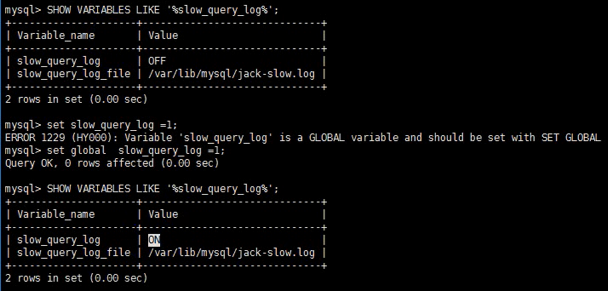

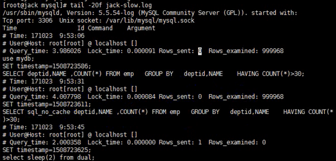

```sql
--1.首先开启
set slow_query_log=1;
--2.参看日志位置
show variables like '%slow_query_log%';
--3.查看多久算慢
show variables like '%long_query_time%';
--4.设置阈值，单位是秒
set long_query_time=1；
```

**全局查询日志**

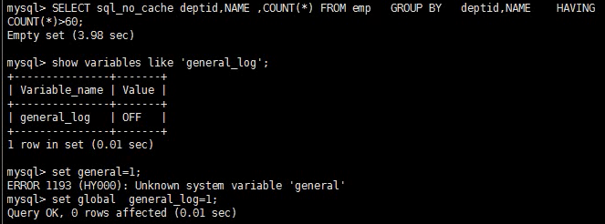

记录密度很高，一般不开，调试和debug有用

###### **覆盖索引**

select 到from之间查询的列<=使用的索引列+主键

```
从select * from t where name like '%alice%';
改到有索引覆盖的
从select id,age,deptid from t where name like '%alice%';
```

###### show processlist

展示线程（连接到数据库的线程）列表

```
kill [id];
```


### 10 mysql锁

锁死计算机协调多个进程或者线程并发访问某一资源的机制

##### 10.1 锁的分类

操作类型分：

- 读锁(共享锁)：针对同一份数据，多个读操作可以同时进行而互不影响
- 写锁(排它锁)：当前写操作没有完成前它会阻断其他写锁和读锁

对数据操作的粒度分：

- 表锁
- 行级锁

都属于`悲观锁`

######  10.1.1表锁

偏向MyISAM，开销小，加锁快，无死锁；

锁定粒度打发生锁冲突的概率最高，并发低


- Table Read lock

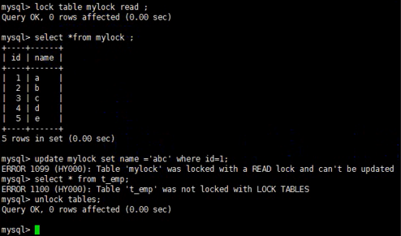

- Table Write lock

```
lock table mylock write；
```


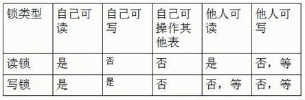


###### 10.1.2 行锁

偏向InnnoDB存储引擎，开销打，加锁慢；

会出现死锁，粒度最小，发生锁冲突的概率最低，并发最高

InnnoDB与MyISAM的最大不同有两点：

1. 支持事务
2. 采用行级锁

行级锁支持事务

- 行级读锁在读时加，读完释放。
- 写锁在写时加，完成写后事务提交才释放。

测试：

1.关闭自动提交，本线程写

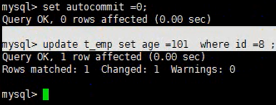

2.其他线程读（排他），可以修改其他行数据

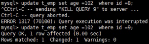


###### select可以加锁

select.. lock in share mode;

select.. for update;

**行级锁会引发死锁**

``` id
set autocommit =0；
select * from t_emp where id=1 for update;
--等待另一个线程完成select ... for update
update t_emp set age=55 where id=2;
--阻塞


set autocommit =0；
select * from t_emp where id=2 for update;
--等待另一个线程完成select ... for update
update t_emp set age=55 where id=1;
--阻塞
--会有死锁检测
```

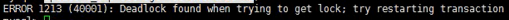


##### 无索引的字段行锁升级为表锁

```
--Thread-1
update t_emp set age=111 where empno=100;

--Thread-2
update t_emp set age=111 where empno=101;
--阻塞
```

解决方式，建立索引


##### 间隙锁

在范围上的不管有没有都会锁上

```
--Thread-1
select * from t_emp where id>2 and id<5;
--34在间隙中都被锁了

--Thread-2
insert into t_emp values(3,'bob',103);
--阻塞
```

事务等级越高，则锁成本越高。


#### 11 视图 view

###### 11.1 what

将一段查询sql封装成一个虚拟的表，这个虚拟的表只会保存sql而不会保存查询结果

###### 11.2 用处

1. 封装复杂sql提高灵活性
2. 逻辑放在数据库中。更新不需要发布程序，面对复杂的需求变更更加灵活

###### 11.3 使用场景

1. 很多地方可以共用一组查询结构
2. 报表

###### 11.4 创建视图

```sql
create view v_vname 
as
select语句
```

注意：mysql不允许有from后面的子查询，但是oracle可以


#### 12.触发器 trigger

###### 12.1 what

当一张表出现，insert，update，delete来触发另外一些操作

###### 12.2 使用场景

冗余数据同步

###### 12.3 语法

```sql
delimiter $$
create trigger tr_afterupdate_t_dept
after update on t_dept
for each row
 begin
 	--具体操作语句
 end $$
delimiter;
```


```sql

select a.name,a.age,a.ceoname newceo,c.name ceoname form t_emp a
left join t_dept b on a.deptid=b.id
left join t_emp c on b.ceo=c.id

--冗余字段
alter table t_temp add ceoname varchar(20);
--跨表更新
select a.name,a.age,a.ceoname newceo form 
update t_emp a
left join t_dept b on a.deptid=b.id
left join t_emp c on b.ceo=c.id
set a.ceoname=c.name

--创建触发器来更新
create trigger tr_afterupdate_t_dept
after update on t_dept
for each row
 begin
 	update t_emp a
		left join t_dept b on a.deptid=b.id
		left join t_emp c on b.ceo=c.id
	set a.ceoname=c.name
	where a.deptid=New.ceo OLD.ceo
 end
```

触发器能不能尽量不要用：

- trigger触发器不利于维护
- 影响数据库性能
- 难以被日志追踪
- 触发了事件的表不能利用触发器对自己做操作


#### 13 事件


#### 14 定时备份

每天凌晨两点，将数据库备份到/backup/mysql

```shell
mysqldump -uroot -pxxxx db_name > /backup/mysql/db_name时间.sql
```
shell脚本

```bash
#!/bin/sh
DIR=/backup/mysql/`data+%Y%m`
DATABASE=mydb
if[! -d $DIR]
then
	mkdir -p $DIR
else
	echo "exits"
fi
echo "start backup"
mysqldump -uroot -pxxxx $DATABASE > %DIR'/'$DATABASE`data+%Y%m%d`'.sql'

echo %DIR'/'$DATABASE`data+%Y%m%d`'.sql'
```

crond，crondtab

```shell
30 2  *  *  * sh 目录/sh脚本
分 时 日 月 周 (命令)
```


#### 15. 主从复制

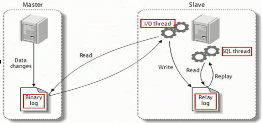


#### 16.Mycat

##### 16.1 what

数据库中间件

##### 16.2 作用

读写分离

数据库分片

- 垂直
- 水平
- 垂直+水平

多数据源整合

##### 16.3 原理

拦截

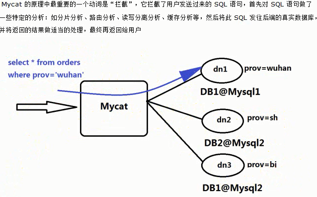

**读写分离**

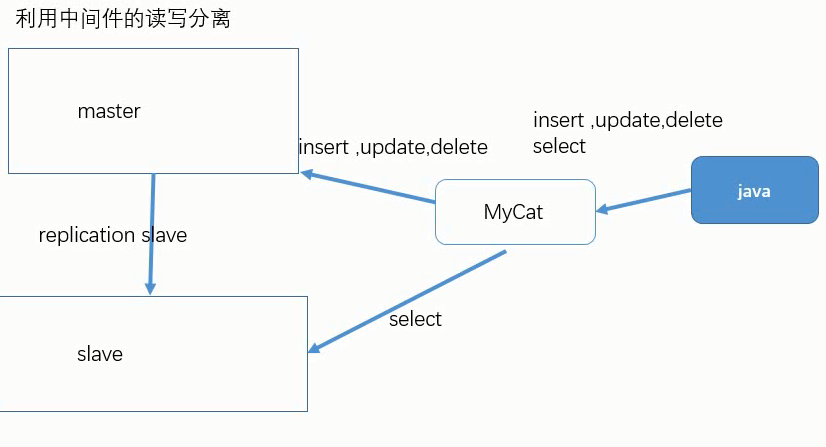

**Mycat分库**


**Mycat分表**


