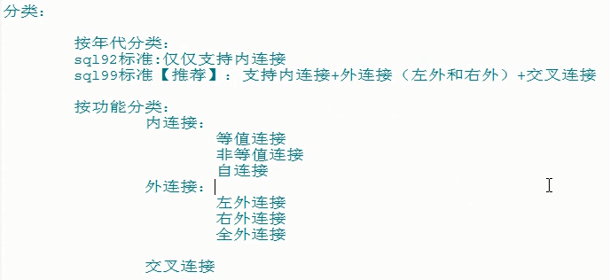
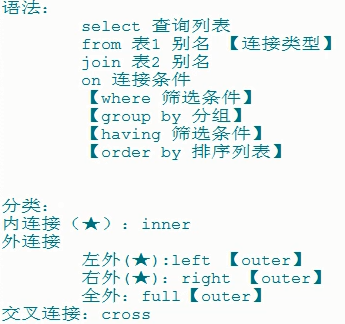
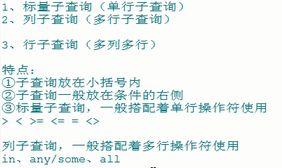
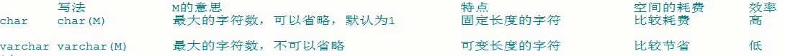
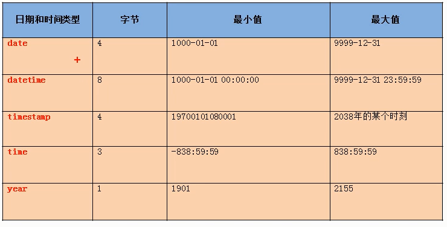
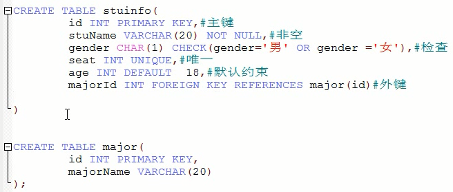
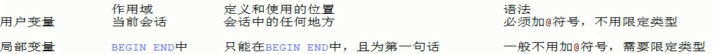
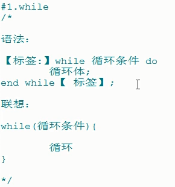
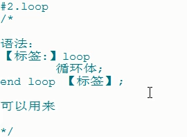

## Mysql细节详解（不涉及高级优化）

### A.几个概念（DB，DBMS，SQL）

1. **DB**：database

   

2. **DBMS**：database manager system

   - mysql--开源，5.7后收费
   - Oracle--Oracle
   - DB2--IBM
   - SqlServer--微软

3. **SQL**：Struct query language

------

### B.语言规范

1. 不区分大小写，但是建议关键字大写，表名列名小写
2. 每天命令最好用分号结尾
3. 每条命令可以根据需要缩进换行
4. 注释：
   - 单行：`#注释文字`，`--注释文字`
   - 多行：/* 注释文字 */

------

### C.SQL分类

### c1. DQL

### database query language

| 基础查询          | 条件查询     | 排序查询     |
| ----------------- | ------------ | ------------ |
| **常见函数**      | **分组查询** | **分组函数** |
| **连接查询**      | **子查询**   | **分页查询** |
| **union联合查询** |              |              |

### c2. DML

### database manipulate language

| 插入语句     | 修改语句 |
| ------------ | -------- |
| **删除语句** |          |

### c3. DDL

### database define language

| 库和表的管理 | 常见数据库类型 |
| ------------ | -------------- |
| **常见约束** |                |

### c4. DCL

### database control language

------

### D.基本注意事项

### d1. 查询相关（关键字与使用）

| what            | desc                                                         |
| :-------------- | ------------------------------------------------------------ |
| 查询列表可以是  | 表中字段、常量、表达式、函数                                 |
| 查询的结果是    | 一个虚拟表格                                                 |
| 起别名          | 1. select name as alis from t_table；  2.select name alis，sex from t_table；特殊情况使用''引起来 |
| 去重            | select distinct name from t_table;                           |
| '+'就仅是运算符 | 会将非数值型的转换为数值型，转换失败则替换为0；**只要其中一方为null则结果为null** |
| concat(a,b)     | SELECT CONCAT(id,NAME,age) FROM `tb_test`;**拼接为null则结果为null** |
|                 |                                                              |

------

### E.DQL

| 基础查询          | 条件查询     | 排序查询     |
| ----------------- | ------------ | ------------ |
| **常见函数**      | **分组查询** | **分组函数** |
| **连接查询**      | **子查询**   | **分页查询** |
| **union联合查询** |              |              |

### E1. 基础查询

```sql
select * from t；
select field from t；
--使用default_value来替代字段的null
select IFNULL(field,default_value) from t;
```

### E2. 条件查询

```sql
--语法
select 
	field_list 
from
	t_name 
where 筛选条件;
```

筛选条件会用到以下三类筛选

| 类型       | 条件                                         |
| ---------- | -------------------------------------------- |
| 条件运算符 | >  <  =  <>  >=  <=                          |
| 逻辑运算   | &&  \|\|  !  and  or  not                    |
| 模糊查询   | like      between and       in       is null |

like

between and是包含临界值的

in列表的值列表必须统一或者兼容，必须是等于

**安全等于**  <=>

可以用于null的判断等价于is null

### E3. 排序查询

```sql
select field_list 
from t_name
【where 筛选条件】
order by 排序列表 【asc|desc】
```

eg：

```sql
select * from emp order by sal;--默认升序
select * from emp order by sal desc;--设置降序
select * from emp order by sal desc,emp_id;
```

order by都是放在最后，limit子句除外

可以用having来进行过滤。

支持多个字段、表达式、函数、别名

### E4. 常见函数

**单行函数**

- 字符函数
- 数序函数
- 日期函数
- 其他函数
- 流程控制函数

**分组函数**

#### E4.1 字符函数

```sql
#length 获取参数的字节个数
--utf8 3*2+3=9| gbk 2*2+3=7
select length('阿里123')；

#concat 拼接字符串
select concat(lastnamt,'_',firstname) from emp;

#upper/lower
select upper(lastname),lower(firstname) from emp;

#substr/substring
--截取其后的
select substr('1234567',2) output;
--截取其后的num个
select substr('1234567',2，5) output;

#instr 返回索引第一次出现的位置，找不到返回0；
select instr('1234','2');

#trim() 去前后
select trim('  12 ');
select trim('a' from 'aaaaliaaaliaaa');

#lpad rpad 填充到num长度

#replace 
select replace('12345678','1','9');

```

#### E4.2 数学函数

```
#round

#ceil 向上取整合

#floor

#truncate 截断

#mod
```

#### E4.3 日期函数

```
now当前系统日期+时间
curdate当前系统日期
curtime当前系统时间
str_to_date 将字符转换成日期
date_format将日期转换成字符
```

序号 格式符 功能
1 %Y 四位的年份
2 %y 2位的年份
3 %m 月份（01,02…11,12）
4 %c 月份（1,2,…11,12）
5 %d 日（01,02,…）
6 %H 小时（24小时制）
7 %h 小时（12小时制）
8 %i 分钟（00,01…59）
9 %s 秒（00,01,…59）

#### E4.4 其他函数

```
version();
database();
user();
```

####  E4.5 流程控制函数

end后面可以接别名

```
#语法：
CASE expr 
WHEN comparison_expr1 THEN return_expr1
[WHEN comparison_expr2 THEN return_expr2
WHEN comparison_exprn THEN return_exprn
ELSE else_expr]
END

#eg：
SELECT last_name, job_id, salary,
	CASE job_id 
	WHEN 'IT_PROG' THEN 1.10*salary
	WHEN 'ST_CLERK' THEN 1.15*salary
	WHEN 'SA_REP' THEN 1.20*salary
	ELSE salary END "REVISED_SALARY"
FROM employees;
```

#### E4.6 分组函数

sum

avg

max

min

count

都忽略null值

```
#分组前用where

#分组后用having
```

### E5. 连接查询






### E6. 子查询



1.对于固定值

2.对比使用的in，any/some，all

3.多个子查询，换成一个括号比较（由于条件限制比较死必须满足相同的比较方式所以用的较少）

```
select * from employee where(id,sal) > (
	select min(id),avg(sal) from employee
);
```

放where后面做匹配筛选

放select后面直接筛选匹配

放from后面做临时表

### E8 分页查询

limit关键字,其实索引为0；

```
select * from employee limit 5；
select * from employee limit 0,5；

#工资最高的5个人
select * from employee order by sal limit 0,5；
```

### E9 联合查询

例如应用场景：两张拆分的不同区域信息的表。

默认是去重的，union all则是包括重复项

```
查询语句1
union
查询语句2；
```


### F DML

```
insert into 表名 values (?,?,?,?);
insert into 表名(列名，列名，列名) values (?,?,?);

delete from where 筛选条件

update 表名 set 列名=value where 筛选条件；
```


### G DDL

```
基本见jobday的笔记
```

表copy

```sql
#复制表的结构
create table t_copy like t_name;

#复制部分结构
create table t_copy
select id,age 
from t_name
where 1=2;

#复制结构+数据
create table t_copy select * from t_name;

#复制部分加上where子句

#复制部分结构+数据
create table t_copy 
select id,age 
from t_name
where id>15;
```


### H 数据类型

| 类型     | 种类                                                         |                                                              |
| -------- | ------------------------------------------------------------ | ------------------------------------------------------------ |
| 数值     | **整形** tinyint(1)、smallint(2)、mediumint(3)、int(4)、bigint(8) **unsigned** 来表示不要负数     **zerofill **填充未满足的长度 | **小数**：float(4)、doubl(8)、DEC(M,D)、DECIMAL(M,D)          定点行的长度是M+2，最大取值范围与double相同，有效范围由M、D决定。M是全部合起来位数，D是小数部分的位数。默认为deciaml(10,0) |
| 字**符** | **短文本**char(M)、varchar(M)、binary、varbinary(m)、enum 、set | **长文本**                                                   |
| 日期     |                                                              |                                                              |
|          |                                                              |                                                              |
|          |                                                              |                                                              |
|          |                                                              |                                                              |
|          |                                                              |                                                              |
|          |                                                              |                                                              |

定点型精度较高，货币运算考虑






### I 约束

#### 列级约束



#### 表级约束

```
constraint 约束名 约束类型(字段)；
```


```sql
create table if not exits stuinfo(
	id int primary key,
	name varchar(20) not null,
	sex char(1) check(sex='男' or sex='女')，
    seat int unique,
	majorid int,
    constraint fk_stuinfo_major foreign key(majorid) references major(id)
);
```


修改表添加约束

```SQL
alter table tb_test modify age int not null

alter table 表名 modify 字段名 字段类型 新约束
alter table 表名 add 【constraint 约束名】 约束类型(字段名) 【外键引用】

alter table 表名 modify 字段名 字段类型 【去掉约束】
alter table 表名 drop primary key/index name/foreign key fk_name
```


### J 事务

ACID

- atomicity
- consistency
- isolation
- durability

```sql
set autocommit=0;
start transaction;
xxx
xxx
xxx
commit;
```

```sql
commit
rollback
savepoint name;--设置回滚点
```

###  

### k 视图

```sql
#create
create view v_name
as
select语句；
```

1.复用

2.保护数据，提高安全性

```sql
#改
alter view v_name
as
新的select

#删
drop view view_name1,view_name2;

#更新
create or replace view view_name
as
select语句；

update myview set columnname=xxx where xxx=xxx;
```

一般视图添加只读权限


### L 存储过程与函数

#### 变量

系统变量和会话变量，默认是session

```sql
/*
1.查看系统变量
show global|【session】 variables；

2.查看部分
show global|【session】variables like "%char%";

3.查看指定	global|【session】.	可以省略
show global|【session】.varname;

4.设定值	global|【session】.	在@@后面可以省略
set global|【session】 varname=value;
set @@global|【session】.varname=value；
*/
```

自定义变量，当前会话有效

```sql
/*
1.声明
set @varname=value;
set @varname:=value;
select @varname:=value;

2.赋值
set @varname=value;
set @varname:=value;
select @varname:=value;
特别的赋值：select count(*) into @count from tablename;

3.使用
select @varname；
*/
```

局部变量在begin end有效

```sql
/*
1.声明
declare varname 类型 【default 值】；

2.赋值
set varname=value;
set varname:=value;
select @varname:=value;
select count(*) into count from tablename;
*/
```




### M 流程控制结构

#### 存储过程

```sql
--创建
create procedure 存储过程(参数列表)
begin
	过程 
end $

--调用
call 存储过程名(参数列表)$

--删除
drop procedure 存储过程名

--查看创建
show create procedure 存储过程名
```

**参数列表种有三部分**

参数模式		参数名	 	参数类型

IN			stuname	varchar(20)


IN:传入参数

OUT:传出参数

INOUT:即使传入又是传出

**存储过程**

存储过程每句结尾都要分号

存储过程结尾可以使用delimiter重新设置


#### 函数

有且仅有一个返回

```sql
--创建
create function 函数名(参数列表) returns 返回类型
begin
	函数
end $

--删除
drop function 存储过程名

--查看创建
show create function 存储过程名
```


##### 流程控制

##### 分支

```sql
--if
if(表达式1,表达式2,表达式3)
类比3元运算符，表达式1为条件

--if
if 条件1 then 语句1；
elseif 条件2 then 语句2；
xxx
【else 语句n】
else if；

--case
case
when 条件1 then 返回1
when 条件2 then 返回2
xxx
else 返回n
end case;

--case
case 表达式
when 值1 then 返回1
when 值2 then 返回2
xxx
else 返回n
end case;
```

##### 循环




```sql
/*一、已知表stringcontent
其中字段：
id 自增长
content varchar(20)

向该表插入指定个数的，随机的字符串
*/
DROP TABLE IF EXISTS stringcontent;
CREATE TABLE stringcontent(
	id INT PRIMARY KEY AUTO_INCREMENT,
	content VARCHAR(20)
	
);
DELIMITER $
CREATE PROCEDURE test_randstr_insert(IN insertCount INT)
BEGIN
	DECLARE i INT DEFAULT 1;
	DECLARE str VARCHAR(26) DEFAULT 'abcdefghijklmnopqrstuvwxyz';
	DECLARE startIndex INT;#代表初始索引
	DECLARE len INT;#代表截取的字符长度
	WHILE i<=insertcount DO
		SET startIndex=FLOOR(RAND()*26+1);#代表初始索引，随机范围1-26
		SET len=FLOOR(RAND()*(20-startIndex+1)+1);#代表截取长度，随机范围1-（20-startIndex+1）
		INSERT INTO stringcontent(content) VALUES(SUBSTR(str,startIndex,len));
		SET i=i+1;
	END WHILE;

END $

CALL test_randstr_insert(10)$
```

