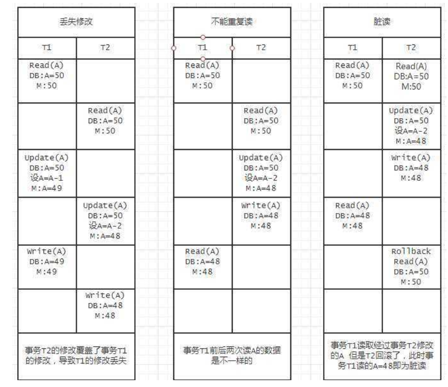

## mysql高级

#### 1.多表设计

##### 1.1约束

单表:unique,not null,primary key

多表：foreign key

###### 添加外键约束

`alter table add foreign key (dno) references dept(did);`

​	设置非空约束

​	alter table employee modify dno int not null；

##### 1.2表与表之间的关系

###### 一对多

在数据多的一方使用外键references另一方的primary key/unique

###### 多对多

需要第3张表分别存放另外两张多对多数据表的数据

使用外键references另两方的primary key/unique

###### 一对一

人为分开的 

分为 唯一外键 和 primary key 对应

`比如`：网站上个人基本信息（稳定），个人浏览记录与收益（波动）


###### 具体创建表

### 2 多表查询

#### 2.1连接查询

1. **交叉连接**cross jion（cross jion可以不写）：返回笛卡尔积，即为A*B的量级

- 语法：
  - select xxxxxx from 表1 cross jion 表2；
  - select xxxxxx from 表1，表2；


2. **内连接**inner join(inner可以不写)

- 显示内连接：select * from 表1  inner jion 表2 on 关联条件；
  - `Select * from A JOIN B ON A.Aid=B.Bnameid `
- 隐式内连接：select * from 表1，表2 where 关联条件；
  - `select * from A,B where A.Aid=B.Bnameid`

​        内连接是要严格匹配双方都有的数据，连接后形成新的数据表，如果没有满足匹配则忽略这条数据。

3. **外连接**outer join（outer 可以不写）

- 左外连接
  - select xxxxx from 表1 left outer join 表2 on 关联条件；
    - `select * from A Left JOIN B ON A.Aid=B.Bnameid m`
- 右外连接

  - select xxxxx from 表1 right outer join 表2 on 关联条件；

​        左右外连接即为将一方作为参考源，对另外一方符合关联条件的书籍进行匹配连接，形成新的数据表的过程，若没有满足条件的则匹配一条null


#### 2.2 子查询

​	一个查询依赖另外一个查询

##### 2.2.1 带in的子查询

​	在子查询中进行匹配，选择匹配的数据

```sql
select * from classes where cid in（select cno from student where age>20）
```

##### 2.2.2 带exists的子查询

​	如果记录存在，前面的SQL语句就会执行

```sql
select * from classes where exists (SELECT cno FROM student WHERE birthday > '1991-01-01');
```

##### 2.2.3 带any的子查询

满足任意的一个

```sql
SELECT * FROM classes WHERE cid > ANY (SELECT cno FROM student )
```

##### 2.2.4 带all的子查询

满足所有的

```sql
SELECT * FROM classes WHERE cid > ALL (SELECT cno FROM student)
```

举例：查询学生平均成绩，但是平均成绩大于01班的任何一个学生的平均成绩。

```sql
--sql先查询班级为1的学生的平均成绩
SELECT AVG(sc.score) FROM student s,stu_cour sc WHERE s.studentid=sc.studentid AND s.classesid=1 GROUP BY s.sname;

--再查询所有学生的平均成绩
SELECT s.sname,AVG(sc.score) FROM student s,stu_cour sc WHERE s.studentid=sc.studentid  GROUP BY s.sname;

--然后对上述语句进行过滤 使用 having 
SELECT s.sname,AVG(sc.score) FROM student s,stu_cour sc WHERE sqls.studentid=sc.studentid  GROUP BY s.snamesc.
HAVING AVG(sc.score)  > ANY
(
SELECT AVG(sc.score) FROM student s,stu_cour sc WHERE s.studentid=sc.studentid AND s.classesid=1 GROUP BY s.sname
)
```

练习

```sql
-- 01、返回部门号及其本部门的最低工资。
SELECT  FROM dept,emp WHERE emp.DEPTNO=dept.DEPTNO GROUP BY emp.SAL;
-- 02、计算出员工的年薪，并且以年薪排序。
SELECT ename,sal*12+IFNULL(comm,0) total FROM emp ORDER BY total DESC;
-- 03、返回员工工作及其从事此工作的最低工资。
SELECT job,MIN(sal) FROM emp GROUP BY job;
-- 04、查找和SCOTT从事相同工作的员工信息
SELECT * FROM emp WHERE job=(SELECT job FROM emp WHERE ename='scott') AND ename<>'scott';
-- 05、工资水平多于JAMES的员工信息。
SELECT * FROM emp WHERE sal>(SELECT sal FROM emp WHERE ename='james');
-- 06、返回工资大于平均工资的员工信息。
EXPLAIN SELECT * FROM emp WHERE sal>(SELECT AVG(sal) FROM emp);
-- 07、返回销售部(SALES)所有员工的姓名。
SELECT * FROM emp WHERE deptno=(SELECT deptno FROM dept WHERE dname='sales');
-- 08、返回工资高于30部门所有员工工资水平的员工信息。
SELECT * FROM emp WHERE sal>ALL(SELECT sal FROM emp WHERE deptno=30);
-- 09、返回查找最高工资和最低工资的职员信息
SELECT * FROM emp WHERE sal = (SELECT MIN(sal) FROM emp) OR sal = (SELECT MAX(sal) FROM emp);
-- 10、返回拥有员工的部门名、部门号。
SELECT deptno FROM emp GROUP BY deptno HAVING COUNT(*)>0
SELECT * FROM dept WHERE deptno IN (SELECT deptno FROM emp GROUP BY deptno HAVING COUNT(*)>0);
-- 11、返回员工的姓名、所在部门名及其工资。
SELECT e.ename,d.dname,e.sal FROM emp e,dept d WHERE e.DEPTNO=d.DEPTNO;
-- 12、返回从事职员工作的员工姓名和所在部门名称。
SELECT e.ename,d.dname FROM emp e,dept d WHERE e.DEPTNO=d.DEPTNO AND e.job='职员';
-- 13、返回部门号、部门名、部门所在位置及其每个部门的员工总数。
SELECT e.deptno,d.dname,d.LOC,COUNT(*) FROM emp e,dept d WHERE e.DEPTNO=d.DEPTNO GROUP BY e.DEPTNO;
-- 14、返回员工(职员或者销售员)和所属经理的姓名。
SELECT e1.ENAME employee,e2.ENAME manager FROM emp e1,emp e2 WHERE e1.DEPTNO=e2.DEPTNO AND (e1.job='职员' OR e1.job='销售员') AND e2.job='经理';
-- 15、返回员工(职员或者销售员)的入职日期早于其经理入职日期的员工及其经理姓名。
SELECT e1.ENAME employee,e2.ENAME manager FROM emp e1,emp e2 WHERE e1.DEPTNO=e2.DEPTNO AND (e1.job='职员' OR e1.job='销售员') AND e2.job='经理' AND e1.HIREDATE<e2.HIREDATE;
-- 16、返回工资处于第四级别的员工的姓名和工资。
SELECT e.ename,e.sal FROM emp e WHERE sal>(SELECT losal FROM salgrade WHERE grade=4) AND sal<(SELECT hisal FROM salgrade WHERE grade=4)
```


### 3.Mysql事务

##### 3.1 **事务的概念**transaction

事务：指的是逻辑上的一组操作，组成这组操作的各个逻辑单元，要么全都成功，要么全都失败。

1. 开启事务：

   start transaction;

2. 提交事务

   commit;

3. 回滚事务

   rollback;

##### 3.2事务的特性

###### 原子性(Atomicity)：事务不可分割

###### 一致性(Consistency)：事务执行前后数据完整性一致

###### 隔离性(Isolation)：事务之间不应该相互影响

- 如果不考虑隔离性会引发安全问题
  - 脏读：一个事务读到另一个事务未提交的数据
  - 不可重复读：一个事务读到另一个事务提交update的数据，导致多次读数据不一致
  - 虚读：一个事务读到另一个事务提交insert的数据，导致多次读数据不一致

###### 持久性(Durability)：事务执行结束，数据就持久化到数据库

##### 3.3 设置事务隔离级别

设置事务隔离级别：

事务的隔离级别从低到高有
 读未提交（Read uncommitted）、读提交（read committed）、可重复读（repeatable read）和串行化（Serializable）

- **Read Uncommitted**：事务读数据时不会加锁，写数据时会有行级共享锁。假设事务1先于事务2，当事务1更新数据的时候，事务2可以读取事务1未提交的数据，但是不能更新事务1正在更新的数据。而如果事务1只是读数据，那么事务2既可以读数据，也可以更新数据。
   这种情况下无法规避脏读，不可重复读的问题。
- **Read Committed**：即在一个事务修改数据过程中，如果事务还没提交，其他事务不能读该数据，或者说只能读取committed的数据。事务读数据的瞬间会加行级共享锁，一旦读完该行，立即释放该行级共享锁；而写数据的瞬间会加行级排它锁，直到事务结束。这种情况下就避免了脏读，但是却不能避免不可重复读的问题
- **Repeatable Read**：当然就再升一级，为的就是避免不可重复读的问题，所以名字叫repeatable read。怎么实现的呢，我们知道read committed是，事务读操作只在读的一瞬间加锁，读完这行就释放锁了，而repeatable read级别是读的一瞬间加锁，但是一直到事务结束才释放锁。但是repeatable read不能解决幻读的问题，因为幻读是增加记录，并不是更改原先的记录。
- **Serializable**：到达这一级别的隔离，可以彻底解决一致性的所有问题。一般来说是通过加表锁来解决串行化的问题。

性能依次降低，安全提高。最高的serializable会使多线程的事务串行执行。

**问题发生原因：**



**1.修改丢失**：丢失修改是事务A和B先后更改数据数据x（假设初始是x0)，但是在A未正式更改前，B已经读取了原先的数据x0，最后A更改后为x1，B更改的并不是A更新后的x1，而是更改的x0，更改后假设为x2，这时x2将x1覆盖了，相当于事务A针对x的更改丢失了。

**2.脏读：** 事务T1读取了T2更改的x，但是T2在实际存储数据时可能出错回滚了，这时T1读取的实际是无效的数据，这种情况下就是脏读

**3.不可重复读：**是说在T1读取x时，由于中间T2更改了x，所以T1前后两次读取的x值不相同，这就是所谓的不可重复读

**4.幻读：**在T1读取符合某个条件的所有记录时，T2增加了一条符合该条件的记录，这就导致T1执行过程中前后读取的记录可能不一致，即T2之后读取时会多出一条记录。

其中前三种（丢失修改、不能重复读、脏读）都是由于并发事务在修改同一份数据的时候导致的问题，此类问题可以通过对同一个资源加锁的方式来解决，而最后一种情况是由于不同事务并发时，新增数据导致的问题，对于新增的记录是无法加锁的，此种情况只能通过事务的串行化来解决。而串行化与并发是矛盾的，所以要在性能和事务的一致性强度上取得一个平衡，就涉及到不同的隔离等级，关于隔离等级，详见*理解隔离性*一节。

 

参看 `select @@tx_isolation`

设置`set global transaction isolation level [4种隔离级别]`


 

 

 

 