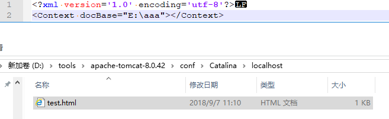

### web基础介绍

### 1.**软件架构**

**CS结构的软件**

CS：Client/Server 客户端和服务器，这种软件往往需要安装。比如QQ、迅雷、播放器。

- 优缺点：
  -  优点：
    - 可以减轻服务器端压力，将部分代码写到客户端。
    - 界面很美观。
  - 缺点：
    - 一旦服务器更新了，客户端也需要更新。
    - 分布式开发比较弱。

**BS结构的软件**

BS：Browser/Server 浏览器和服务器，这种软件不需要安装，只需要通过浏览器就可以访问。

- 优缺点：
  - 优点：
    - 服务器一旦更新，不需要更新客户端，因为客户端就是浏览器
    - 比较强的分布式能力
  - 缺点：
    - 服务器端压力会比较大。
    - 界面效果不如CS结构软件。

------

### 2 **WEB服务器**

服务器：

- 硬件：其实就是一台电脑（这台电脑配置要求很高）。
- 软件：需要在这台电脑上安装web服务器的软件。

#### 2.1 **常见哪些web服务器**

| web server | description                                                  |
| ---------- | ------------------------------------------------------------ |
| Tomcat     | Apache组织提供的一个开源的免费的web服务器。满足EE的Serlet和JSP的规范。 |
| WebSphere  | IBM公司开发的一个收费的大型web服务器。满足了EE开发的所有规范。 |
| WebLogic   | BEA公司开发的一个收费的大型web服务器。满足了EE开发的所有规范。 |
| IIS        | 应用在.NET平台上。                                           |
| Apache     | 应用在PHP平台上。                                            |

#### 2.2 **WEB开发中的资源**

| 静态web资源 | 动态web资源  |
| ----------- | ------------ |
| HTML        | Servlet、JSP |
| CSS         | PHP          |
| JS          | ASP          |

------

### 3. TOMCAT

##### 3.1 文件夹目录


```java
bin		 :二进制文件（命令文件：开启和关闭）
conf	 :配置文件
lib		 :tomcat所需要的jar包
logs	 :tomcat服务器日志文件
temp	 :tomcat运行产生临时文件
webapps	 :需要发布的项目需要放在webapps下
work	 :JSP翻译（编译）成Servlet产生的代码

一个项目的文件夹目录如下
website
	|------静态页面（HTML、CSS、JS、图片）
	|------JSP页面
	|------WEB-INF
			|-----web.xml	（必须的）配置文件
			|-----classes	（可选的）所完成的java的字节码文件
			|-----lib		（可选的）依赖的jar包
```

##### 3.2 部署项目的方式

部署的3种方式

| 方式说明                                                    |
| ----------------------------------------------------------- |
| 1. 直接将项目复制到tomcat/webapps下                         |
| 2. 在tomcat/conf/server.xml配置tomcat的虚拟路径             |
| 3.  在tomcat/conf/Catalina/localhost/下配置tomcat的虚拟路径 |

**方式1说明**


**方式2说明**

```
tomcat目录下
  /conf/server.xml中进行配置（可以在tomcat的文档中找到）。
	1.创建一个项目
	2.配置虚拟路径
```


**方式3说明**

```
1.创建web项目
2.创建一个xml（在tomcat/conf/Catalina/localhost）

文件名及为对应的虚拟路径名
```





**3.3 eclipse集成tomcat**

server调整。参数配置


http 1.1：建立一个长连接，经历多久才会断开

------

### 4.HTTP

超文本传输协议

规定了浏览器和服务器端数据交互的格式。


- 基于请求和响应模型
  - 必须要先有请求，后有响应。
  - 请求和响应必须成对出现。
- 简单快捷
  - 因为发送请求的时候只需要发送请求方式和请求路径即可

**请求信息**

```
***** GET方式的请求
GET /web_test/demo2.html?name=aaa&name=man HTTP/1.1
Accept: text/html, application/xhtml+xml, */*
X-HttpWatch-RID: 9561-10011
Referer: http://localhost:8080/web_test/demo1.html
Accept-Language: zh-CN
User-Agent: Mozilla/5.0 (Windows NT 6.3; WOW64; Trident/7.0; rv:11.0) like Gecko
Accept-Encoding: gzip, deflate
Host: localhost:8080
DNT: 1
Connection: Keep-Alive

***** POST方式的请求
POST /web_test/demo2.html HTTP/1.1
Accept: text/html, application/xhtml+xml, */*
X-HttpWatch-RID: 9561-10041
Referer: http://localhost:8080/web_test/demo1.html
Accept-Language: zh-CN
User-Agent: Mozilla/5.0 (Windows NT 6.3; WOW64; Trident/7.0; rv:11.0) like Gecko
Content-Type: application/x-www-form-urlencoded
Accept-Encoding: gzip, deflate
Host: localhost:8080
Content-Length: 19
DNT: 1
Connection: Keep-Alive
Cache-Control: no-cache

name=bbb&name=woman
```

1. **请求行**

- 请求方式
  - 请求方式有很多种，常用就两种GET和POST。
- 请求路径；
- 协议版本

2. **请求头**：代表客户端的基本信息

- 请求头的格式一般都是一个key对应一个value的，也有一个key对应多个value的情况。
  - 记住一些请求头：
    - Referer ：代表网页的来源。（防盗链）。
    	 User-Agent	：获得客户端浏览器类型。

3. **请求体**

- 只有POST请求方式才有请求体，而且请求体是POST方式请求参数。

**响应**

```
HTTP/1.1 200 OK
Server: Apache-Coyote/1.1
Accept-Ranges: bytes
ETag: W/"151-1484111223984"
Last-Modified: Wed, 11 Jan 2017 05:07:03 GMT
Content-Type: text/html
Content-Length: 151
Date: Wed, 11 Jan 2017 05:14:00 GMT

<!DOCTYPE html>
<html>
<head>
<meta charset="UTF-8">
<title>Insert title here</title>
</head>
<body>
<h1>Success锛侊紒锛?/h1>
</body>
</html>
```

1. **响应行**

- 协议版本

  - 状态码

  ```
    200	：代表响应成功
    302	：需要进行重定向操作
    304	：需要查找本地缓存
    404	：请求资源不存在
    500	：服务器内部错误
  ```

2. **响应头**：服务器控制浏览器的行为，重定向、定时跳转、下载

- 通常一个key对应一个value，也有一个key对应多个value。
  - 记住响应头：
    - Location	：重定向的路径。
    	 Refresh	：定时刷新。
    - Content-Disposition：文件下载的时候使用。

3. **响应体**

- 就是显示到浏览器上页面的代码。

**http协议一次访问的流程**

 

```java
//1.DNS域名解析:递归查询、迭代查询
	递归查询:客户端向第一个服务器查询,给最终结果 
	迭代查询:第一个服务器向根查询 
//2.建立连接:
	接收或拒绝连接请求:三次握手的过程
//3.接收请求:接收客户端请求报文中对某资源的一次请求的过程,请求报文
//4.处理请求
	服务器对请求报文进行解析,并获取请求的资源及请求方法等相关信息 ,根据方法,资源,首部和可选的主体部分对请求进行处理
//5.访问资源:
	服务器获取请求报文中请求的资源web 服务器,即存放了web 资源的服务器,负责向请求者提供对方请求的静态资源,或动态运行后生成的资源
//6.构建响应报文:
	一旦Web 服务器识别出了资源,就执行请求方法中描述中的动作,并返回响应报文。响应报文中 ,包含有响应状态码、响应首部,如果生成了响应主体的话,还包括响应主体。
//7.发送响应报文
	Web 服务器通过连接发送数据时也会面临与接收数据一样的问题。服务器可能有很多条到各个客户端的连接, 有些是空闲的,有些在向服务器发送数据,还有一些在向客户端回送响应数据 。服务器 要记录连接的状态,还要特别注意对持久连接的处理。对非持久连接而言,服务器应该在发送了整条报文之后,关闭自己这一端的连接 。对持久连接来说,连接可能仍保持打开状态,在这种情况下, 服务器要 正确地计算Content-Length 首部,不然客户端就无法知道响应什么时候结束了
```

 

------

### 5.servlet

**servlet的uml例图**


**servlet的映射过程**


#### 5.1 Servlet

##### 1.生命周期

生命周期：以下方法都是由Servlet容器负责调用

1.构造器：只在第一次请求servlet时被调用一次

2.init：只被调用一次，创建好实例后立刻被调用

3.service：被多次调用，每次都会请求都会调用service方法，实际响应请求

4.destroy：只被掉用一次，在当前Servlet所在的WEB应用被卸载前调用，释放资源。

##### 2.启动加载

```xml
<!-- 
load-on-startup： 
	设定加载时间
	为负数是在第一次请求servlet时加载
	为正数或0在Servlet容器加载WEB容器时加载，优先级
-->

<servlet>
  	<servlet-name>hello</servlet-name>
  	<servlet-class>servlet.HelloServlet</servlet-class>
  	<load-on-startup>1</load-on-startup>
  </servlet>
  
  <servlet-mapping>
  	<servlet-name>hello</servlet-name>
  	<url-pattern>/hello</url-pattern>
  </servlet-mapping>
```

```java
//同上，loadOnStartup也不能为负数
@WebServlet(value="/servletpath",loadOnStartup=1)
```

##### 3.访问路径配置（url-Pattern匹配）

```
完全路径匹配
	以 / 开始		比如：/ServletDemo1	/aaa/ServletDemo2
目录匹配
	以 / 开始		比如：/ServletDemo1.*	/aaa/ServletDemo2.*
扩展名匹配
	以*开始		比如：*.action	*.do		*.jsp
```

**优先级**

完全路径匹配  >  目录匹配  >  扩展名匹配

**GenericServlet**

**HttpServlet**

1. 在service()方法中吧ServletReques和ServletResponse装换为了HttpServletReques以及HttpServletResponse并调用了重载的service方法
2. 在service(HttpServletReques,HttpServletResponse)获取了请求方式，request.getMethod().根据请求方式创建了doXxx()

#### 5.2 ServletConfig（了解） 

封装了本Servlet配置信息可以获取ServletContext对象

##### 1.ServletConfig对象的获取

可以通过GenericServlet的getServletConfig()获取

##### 2.获取Servlet相关信息

​	getServletName()		* Servlet的名称

| return         | 方法                                   |
| -------------- | -------------------------------------- |
| Enumeration<T> | getInitParameterNames()                |
| String         | getInitParameter(string parameterName) |
| String         | getServletName()                       |
| ServletContext | getServletContext()                    |

##### 3.获取初始化参数

```java
//注解行
@WebServlet(value="/scd",initParams=@WebInitParam(name="a",value="a-value"))

//复写无参的，有参的本身会传入ServletConfig对象
@Override
public void init() throws ServletException {
    ServletConfig sc = this.getServletConfig();
    System.out.println(sc.getServletName());
    System.out.println(sc.getInitParameter("a"));
}
```

#### 5.3 ServletContext

| return         | 方法                                                         |
| -------------- | ------------------------------------------------------------ |
| `String`       | `getRealPath(String path)`             Returns a `String` containing the real path for a given  virtual path. |
| Enumeration<T> | getInitParameterNames()                                      |
| `String`       | `getMimeType(String file)`             Returns the MIME type of the specified file, or `null`  if the MIME type is not known. |
| ` String`      | `getContextPath()`             Returns the context path of the web application. |
| ` void`        | `setAttribute(String name,  Object object)`             Binds an object to a given attribute name in this servlet context. |
| `void`         | `removeAttribute(String name)`             Removes the attribute with the given name from the servlet  context. |
| `Object`       | `getAttribute(String name)`             Returns the servlet container attribute with the given name, or  `null` if there is no attribute by that name. |
| `Enumeration`  | `getAttributeNames()`             Returns an `Enumeration` containing the attribute names  available within this servlet context. |

##### ServletContext作用范围

> 域对象：指的是将数据存入到域对象中，这个数据就会有一定的作用范围。域指的是一定的作用范围。

ServletContext可以获取到当前WEB应用的信息

一个WEB应用程序中所有Servlet共享ServletContext对象，所以它被称为application对象（Web应用程序）

ServletContext是在服务器启动的时候为每个web项目单独创建一个ServletContext对象。当web项目从服务器中移除，或者是关闭服务器的时候ServletContext对象会被销毁。向ServletContext中保存的数据一直存在（当服务器关闭的时候ServletContext对象被销毁，然后里面数据才会失效）。**范围：整个web应用。**

##### ServletContext作为域对象

```java
1、获取WEB工程信息				
    * 获取工程名 this.getServletContext().getContextPath()
    * 获取全局初始化参数 String value = this.getServletContext().getInitParameter(String name);
    * 获得文件MIME类型 servletContext.getMimeType("a.jpg")
2、读取WEB工程下的文件
    * String realPath = servletContext.getRealPath(String path);
    * InputStream is = servletContext.getResourceAsStream(String path);
    * 注意：path的写法，一定要以/开始，/代表进入到工程里面去了
    * 类加载器ClassLoader读取WEB工程下的资源(******)
    * InputStream is = this.getClass().getClassLoader().getResourceAsStream("a.txt");
3、域对象存取数据
```


|return|method|
| -------------- | ------------------------------------------------------------ |
| ` void`        | `setAttribute(String name,  Object object)`             Binds an object to a given attribute name in this servlet context. |
| `void`         | `removeAttribute(String name)`             Removes the attribute with the given name from the servlet  context. |
| `Object`       | `getAttribute(String name)`             Returns the servlet container attribute with the given name, or  `null` if there is no attribute by that name. |
| `Enumeration`  | `getAttributeNames()`             Returns an `Enumeration` containing the attribute names  available within this servlet context. |

##### ServletContext获取文件路径

this.getClass().getClassLoader()类加载器目录由类所在目录(classes)开始

`getResourceAsStream`

ServletContext是属于web项目的，他的路径会定位到web项目的根目录(tomcat/webapps/工程)，而且类加载器返回的是缓冲输入流

`getResourceAsStream`、`getRealPath`

```java
@Override
protected void doGet(HttpServletRequest req, HttpServletResponse resp) throws ServletException, IOException {
    ServletContext sContext = this.getServletContext();
    InputStream resourceAsStream = sContext.getResourceAsStream("/WEB-INF/prop.properties");
    System.out.println("resourceAsStream"+resourceAsStream);

    InputStream resourceAsStream1 = getClass().getClassLoader().getResourceAsStream("../prop.properties");
    System.out.println("resourceAsStream1"+resourceAsStream1);

    String path = sContext.getRealPath("/WEB-INF/prop.properties");
    InputStream resourceAsStream2 = new FileInputStream(path);
    System.out.println("resourceAsStream2"+resourceAsStream2);
}
```

**结果：**

```java
resourceAsStreamjava.io.ByteArrayInputStream@2175a46a
resourceAsStream1java.io.BufferedInputStream@1dc8fae5
resourceAsStream2java.io.FileInputStream@36efd551
```

#### 5.4 ServletRequest

封装了请求信息，可以获取任何请求信息

|return|desc|
| -------------- | ------------------------------------------------------------ |
| ` String`      | `**getParameter**(String name)`             Returns the value of a request parameter as a `String`,  or `null` if the parameter does not exist. |
| ` Map<String,String[]>` | `**getParameterMap**()`             Returns a java.util.Map of the parameters of this  request. |
| ` Enumeration` | `**getParameterNames**()`             Returns an `Enumeration` of `String` objects  containing the **names of the parameters** contained in this request. |
| ` String[]`    | `**getParameterValues**(String name)`             Returns an array of `String` objects containing all of  the values the given request parameter has, or `null` if the  parameter does not exist. |

**HttpServletRequest**

是ServletRequest的子接口

|return|desc|
| --------- | ------------------------------------------------------------ |
| ` String` | `**getQueryString**()`             Returns the query string that is contained in the request URL  after the path. |
| `String`        | `**getRequestURI**()`             Returns the part of this request's URL from the protocol name up  to the query string in the first line of the HTTP request. |
| ` StringBuffer` | `**getRequestURL**()`             Reconstructs the URL the client used to make the  request. |
| ` String`       | `**getServletPath**()`             Returns the part of this request's URL that calls the servlet. |
| ` String` | `**getMethod**()`             Returns the name of the HTTP method with which this request was  made, for example, GET, POST, or PUT. |
|  |  |


#### 5.5 ServletResponse

封装了响应信息，可以给用户提供响应

|return|desc|
| -------------- | ------------------------------------------------------------ |
|`void`|`**setStatus**(int sc)`             Sets the status code for this response.|
|`void`|`**setHeader**(String name,  String value)`             Sets a response header with the given name and value.|
| ` PrintWriter` | `**getWriter**()`             Returns a `PrintWriter` object that can send character  text to the client. |
| `ServletOutputStream` | `**getOutputStream**()`             Returns a [`ServletOutputStream`](../../javax/servlet/ServletOutputStream.html)  suitable for writing binary data in the response. |
| ` void` | `**setContentLength**(int len)`             Sets the length of the content body in the response In HTTP  servlets, this method sets the HTTP Content-Length header. |
| ` void` | `**setContentType**(String type)`             Sets the content type of the response being sent to the client, if  the response has not been committed yet. |

##### 1.重定向与定时跳转

```

```

##### 2.解决乱码问题

**response**

```java
//设置response缓冲区编码为utf-8
response.setCharacterEncoding("utf-8");
//设置返回头为utf-8
response.setHeader("content-type","text/html;charset=utf-8")；
    
 //简化
 response.setContentType("text/html;charset=utf-8");
```

```java
protected void doGet(HttpServletRequest request, HttpServletResponse response) throws ServletException, IOException {
    response.setContentType("text/html;charset=utf-8");
    response.getWriter().append("Served at: ").append(request.getContextPath())
        .append("中文");
}
```

ps:不要把字节流和字符流一起使用

**request**

get请求：

post请求：放在首行`request.setCharaterEncoding("utf-8");`

```java
/**
	 * 演示get方式处理中文乱码
	 */
protected void doGet(HttpServletRequest request, HttpServletResponse response) throws ServletException, IOException {
    // 接收数据：
    // request.setCharacterEncoding("UTF-8");
    /**
		 * 产生乱码原因：
		 * * get方式提交的数据在请求行的url后面，在地址栏上其实就已经进行了一次URL的编码了。
		 * 解决方案:
		 * * 将存入到request缓冲区中的值以ISO-8859-1的方式获取到，以UTF-8的方式进行解码。
		 */
    String name = request.getParameter("name");
    /*String encode = URLEncoder.encode(name, "ISO-8859-1");
		String decode = URLDecoder.decode(encode, "UTF-8");
		System.out.println("姓名:"+decode);*/
    String value = new String(name.getBytes("ISO-8859-1"),"UTF-8");
    System.out.println("姓名:"+value);
}

/**
	 * 演示post方式处理中文乱码
	 */
protected void doPost(HttpServletRequest request, HttpServletResponse response) throws ServletException, IOException 
	{
		// 接收数据：
		/**
		 * 产生乱码的原因：
		 * * post方式提交的数据是在请求体中，request对象接收到数据之后，放入request的缓冲区中。缓冲区就有编码（默认ISO-8859-1:不支持中文）.
		 * 解决方案：
		 * * 将request的缓冲区的编码修改了即可。
		 */
		// 设置缓冲区的编码
		request.setCharacterEncoding("UTF-8");
		String name = request.getParameter("name");
		System.out.println("姓名:"+name);
	}
```

##### HttpServletResponse

 封装Http相关响应

|return|desc|
| ------- | ------------------------------------------------------------ |
| ` void` | `sendRedirect(String location)`             Sends a temporary redirect response to the client using the  specified redirect location URL. |


**练习一个实际的验证**

```java
protected void doGet(HttpServletRequest request, HttpServletResponse response) throws ServletException, IOException {
    request.setCharacterEncoding("utf-8");
    response.setContentType("text/html;charset=utf-8");
    response.getWriter().append("Served at: ").append(request.getContextPath())
        .append("中文");

    String username = request.getParameter("username");
    String password = request.getParameter("password");

    QueryRunner qRunner = new QueryRunner(JDBCUtils.getDataSource());
    String sql = "select password from users where username=?";
    String queryResult = null;
    try {
        queryResult = (String) qRunner.query(sql,  new ScalarHandler(), username);
    } catch (SQLException e1) {
        // TODO Auto-generated catch block
        e1.printStackTrace();
    }
    if (queryResult != null && password.equals(queryResult)) {
        response.getWriter().append("<br/>sccusses ");
    } else {
        response.getWriter().append("<br/>用户名或密码正确 ");
    }
}
```

