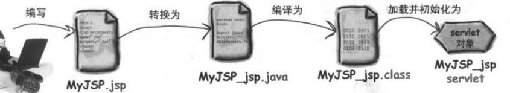
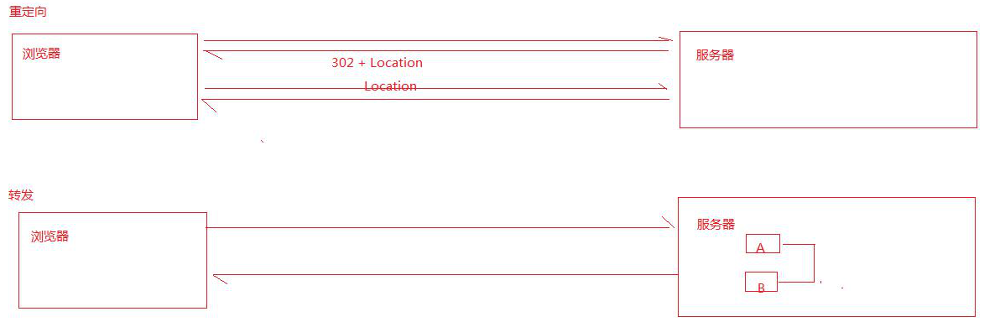

## JSP

### 1.jsp入门

##### 1.1 what

java server pages，是一个简化的servlet设计

SUN公司提供了动态网页开发技术：Servlet。Servlet自身有一些缺点，SUN公司发现了这些问题，推出了一个新的动态网页开发技术JSP。

Servlet的缺点：

- Servlet需要进行配置，不方便维护
- Servlet很难向网页中输出HTML页面内容

##### 1.2 流程




### 2.路径写法

##### 2.1 相对路径

目前使用资源与目标访问资源的位置关系

##### 2.2 绝度路径

以项目根路径开始

分为客户端路径和服务器端路径(**使用者**)

- 客户端路径**需要**带工程名
- 服务器端路径**不需要**带工程名

```java
http://localhost:8080/web01/demojsp/demojsp.jsp

客户端路径：/web01/demojsp/demojsp.jsp
服务器端路径：/demojsp/demojsp.jsp
```

##### 请求转发与重定向



区别：

1. 重定向地址栏会改变
2. 重定向是两次"请求/响应"
3. 重定向可以跳转到其他任何地方，转发可以进入WEB-INF
4. 重定向使用客户端路径，转发使用服务器路径

### 3.登录案列