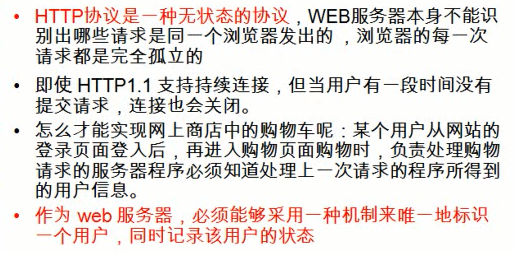
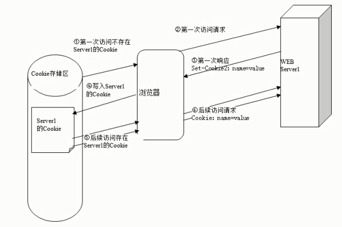

## cookie_session



### 1. 会话

web应用中会话是客户端与服务端连续发生的一系列请求响应的过程。

借助会话状态web服务器可以把属于同一会话的一系列请求和响应过程关联起来。

为了能识别不同的会话，需要浏览器对其发出的每个请求消息都进行标识。相应的标识号就称为会话ID

### 2.Cookie技术

#### 2.1 说明

Cookie机制采用的是**客户端保持**HTTP状态信息的方案

WEB服务器通过在HTTP相应消息中添加Set-Cookie响应头字段将Cookie信息发给浏览器，浏览器通过HTTP请求中添加Cookie请求头字段将Cookie回传给WEB服务器。

一个WEB站点可以给一个浏览器发多个Cooke，一个WEB浏览器也可以存储多个WEB站点提供的Cookie。

浏览器存储Cookie是有大小(4k)和数量限制的



2.2 servlet中使用cookie

 

| **Method Summary** |                                                              |
| ------------------ | ------------------------------------------------------------ |
| ` String`          | `**getComment**()`             Returns the comment describing the purpose of this cookie, or  `null` if the cookie has no comment. |
| ` String`          | `**getDomain**()`             Returns the domain name set for this cookie. |
| ` int`             | `**getMaxAge**()`             Returns the maximum age of the cookie, specified in seconds, By  default, `-1` indicating the cookie will persist until browser  shutdown. |
| ` String`          | `**getName**()`             Returns the name of the cookie.  |
| ` String`          | `**getPath**()`             Returns the path on the server to which the browser returns this  cookie. |
| ` String`          | `**getValue**()`             Returns the value of the cookie. |
| ` int`             | `**getVersion**()`             Returns the version of the protocol this cookie complies  with. |
| ` void`            | `**setComment**(String purpose)`             Specifies a comment that describes a cookie's purpose. |
| ` void`            | `**setDomain**(String pattern)`             Specifies the domain within which this cookie should be  presented. |
| ` void`            | `**setMaxAge**(int expiry)`             Sets the maximum age of the cookie in seconds. |
| ` void`            | `**setPath**(String uri)`             Specifies a path for the cookie to which the client should return  the cookie. |
| ` void`            | `**setValue**(String newValue)`             Assigns a new value to a cookie after the cookie is  created. |
| ` void`            | `**setVersion**(int v)`             Sets the version of the cookie protocol this cookie complies  with. |

HttpServletResponse定义了一个addCookie的方法用于添加Set-Cookie响应头字段

HttpServletRequest中定义了一个getCookies方法用户获取请求头中所有的Cookie项


默认情况下cookie是一个会话级别的对象，存在浏览器内存中，用户退出浏览器后被删除。maxAge给出一个以秒为单位的时间，会将cookie存在磁盘上。如果时效设置为0是命令浏览器删除该cookie，负数表示不保存。

addCookie是创建新的Set-Cookie头，不会修改之前的报头。


**实例：**

```java
protected void doGet(HttpServletRequest request, HttpServletResponse response) throws ServletException, IOException {
    response.setContentType("text/html;charset=utf-8");

    Cookie[] cookies = request.getCookies();
    if(cookies != null && cookies.length>0) {
        for (Cookie cookie : cookies) {
            if ("visited".equals(cookie.getName())) {
                response.getWriter().append("欢迎回来");
            }
        }
    } else {
        response.getWriter().append("欢迎您首次访问");
    }

    Cookie cookie4Add = new Cookie("visited", "true");
    response.addCookie(cookie4Add );
}
```


### 3.Session技术

cookie有大小和数量限制，保存在客户端不太安全。

Session没有大小与数量限制，保存在服务端。


### 4.servlet域对象的总结

**请求范围（ServletRequest）**

- 何时创建和销毁
  - 创建：当用户向服务器发出一次请求，服务器创建一个request对象
  - 销毁：服务器做出了响应，就会销毁这个request对象
- 如何存取数据
  - setAttribute
  - getAttribute
- 作用范围
  - 一次请求

**会话范围（HttpSession）**

- 何时创建和销毁
  - 创建：服务器第一次调用getSession
    - jsp:是否是第一资源，是访问的第一个资源JSP的page指定的session属性值为true
    - servlet：是否是第一个资源，是访问的第一个资源servlet调用getSession()或getSession（true）
  - 销毁：3种情况
    - Session过期，默认过期30分钟
    - 非正常关闭服务器。（正常关闭服务器-->Session序列化）
    - 手动调用session.invalidate()
- 如何存取数据
  - setAttribute
  - getAttribute
- 作用范围
  - 一次会话：多次“请求/响应“的过程

**应用范围（ServletContext）**

- 何时创建和销毁
  - 创建：服务器启动就会创建，每个web项目有且仅有一个
  - 销毁：服务器关闭，或者项目从服务器中移除
- 如何存取数据
  - setAttribute
  - getAttribute
- 作用范围
  - 整个应用