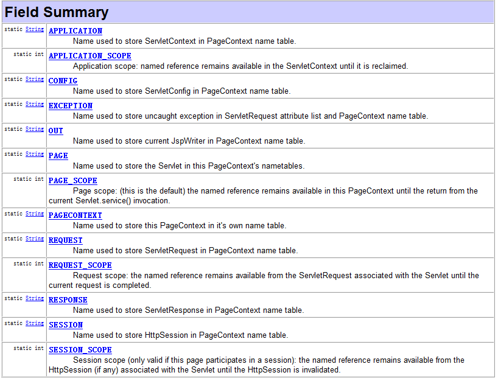

## jsp

### 1. jsp	1.40

JSP：Java Server Pages Java服务器端页面。

JSP 就是 HTML + Java代码 + JSP自身东西。

​	Servlet技术生成动态网页的时候很麻烦，需要通过response获得输出流，调用print方法进行打印的。这种编程方式很麻烦，而且美工也不容易处理。SUN公司为了简化动态网页开发，推出JSP。

**jsp注释**

```jsp
1.html注释：
写法:
	<!--HTML的注释 -->
存在时机
	存在JSP的源码中，翻译成Servlet后这个注释也存在，在生成HTML响应到页面的时候这个注释也会存在。

2.Java代码的注释
写法:
	<% // 单行注释 
	/* 多行注释 */ 
	/**文档注释*/
	 %>
存在时机
	存在JSP的源码中，翻译成Servlet后Java代码的注释也会存在，但是生成HTML响应到页面后，这种注释就消失了。
	
3 JSP代码的注释
写法:
	<%-- JSP的注释 --%>
存在时机:
	存在JSP的源码中，翻译Servlet后注释就没有了。
```

#### 1.1三大指令

语法：

`<%@ 指令名称 属性名称=属性的值 属性名称=属性的值 %>`

- page指令：指示JSP的页面设置属性和行为
- include指令：指示JSP包含哪些其他页面
- taglib指令：指示JSP页面包含哪些标签库

**page**

	<%@ page 属性名=属性值 %>

Page指令用来定义JSP文件的全局属性。

这些属性可以单独使用，也可以几个或多个同时使用。

在JSP页面中，只有import属性可以出现多次，其他属性都只能出现一次


| 属性 | 说明 |
| ---- | ---- |
|language属性：|	声明使用脚本的语言。只能是java。|
|extends属性：|	标明JSP编译成Servlet的时候继承的类。默认值：HttpJspBase。|
| session属性：	|	标明JSP中是否可以直接使用session对象。默认值是true。|
| buffer属性：	|	标明JSP对客户端输出缓冲区大小。默认值8kb。|
|autoFlush属性：|	如果缓冲区大小溢出，是否自动刷出。默认true。|
| **import属性：**	|	**用于导入Java包或类。**|
| **contentType属性：** |**标明JSP被浏览器解析和打开的时候采用的默认的字符集**|
| **pageEncoding属性：** |**JSP文件及JSP翻译后的Servlet保存到硬盘上采用字符集**|
| isErrorPage属性：|	处理JSP页面异常。|
| errorPage属性：|	处理JSP页面异常。|
| isELIgnored属性：|	通知JSP是否忽略EL表达式。|

**include**

```jsp
<%@ include 属性名=属性值 %>

eg：
<%@ include file="foot.jsp" %>
```

file属性：jsp页面路径

其原理是代码的拷贝。

**taglib**

| 属性  | 值  |
| ---- | ---- |
| uri  | 库   |
|prefix|前缀|


#### 1.2 四大域对象

pageContext < request < session < application

#### 1.3 九个内置对象

```
对象：|1.request | 2.response | 3.session | 4.application |
	5.config | 6.page | 7.out | 8.pageContext | 9.exception
	
类型：|1.ServletRequest|2.ServletResponse|3.HttpSession|4.ServletContext|
	5.ServletConfig|6.Servlet|7.JspWriter|8.pageContext|9.Exception
```

javax.servlet.jsp.**pageContext**

方法：

1.获取其他8个对象

|return|desc|
| ------------------ | ------------------------------------------------------------ |
|  | `**getXxxx**()`             The current value of the Xxxx object |

2.域对象操作变量

|return|desc|
| ------------------ | ------------------------------------------------------------ |
| `abstract  Object` | `**findAttribute**(String name)`             Searches for the named attribute in page, request, session (if  valid), and application scope(s) in order and returns the value associated or  null. |
| `abstract  Object` | `**getAttribute**(String name)`             Returns the object associated with the name in the page scope or  null if not found. |
| `abstract   void` | `**removeAttribute**(String name)`             Remove the object reference associated with the given name from  all scopes. |
| `abstract   void` | `**removeAttribute**(String name,  int scope)`            Remove the object reference associated with the  specified name in the given scope. |
| `abstract   void` | `**setAttribute**(String name,  Object value)`             Register the name and value specified with page scope  semantics. |
| `abstract   void` | `**setAttribute**(String name,  Object value,  int scope)`            Register the name and value specified with  appropriate scope semantics. |



#### 1.4 动作标签

- **`<jsp:forward/>`：请求转发。**
  - `<jsp:param/>`：传递参数。
- **`<jsp:include/>`：包含（动态包含）。**

## EL

Expression Language

语法：${EL表达式	}

主要和JSTL来取代传统页面上直接嵌入Java代码写法。提升程序可读性、维护性和便捷性。

1.**获取数据的方法**

```
EL表达式语句在执行的时候，会调用pageContext.findAttribute()方法。分别从page、request、session、application范围查找相应对象，找到就会返回相应对象，找不到返回””(不是null，是空的字符串)。EL所获取的数据需要在四个作用范围中。
```
```jsp
<!--1.获取域范围数据-->
<%="pageContext2: "+pageContext.getAttribute("age") %>--${ pageScope.age }<br>
<%="request : "+request.getAttribute("age") %>--${ requestScope.age }<br>
<%="session : "+session.getAttribute("age") %>--${ sessionScope.age }<br>
<%="application : "+application.getAttribute("age") %>--${ applicationScope.age }<br>
简写
${ name }

<!--2.获取数组数据-->
${ arrs[0] }

<!--3.获取List-->
${ List[0] }

<!--4.获取Map（如有特殊符号）-->
${ Map.name }
${ Map['a.key']}
```

**2.执行运算**

```jsp
<!--1.数运算-->
${ num1+num3 }

<!--2.关系运算-->
${ num1 < num3 } -- ${ num1 lt num3 }<br>
${ num1 > num3 } -- ${ num1 gt num3 }<br>
${ num1 = num3 } -- ${ num1 eq num3 }<br>
${ num1 <= num3 } -- ${ num1 le num3 }<br>
${ num1 >= num3 } -- ${ num1 ge num3 }<br>
${ num1 != num3 } -- ${ num1 ne num3 }<br>

<!--3.逻辑运算-->
${ expression1 && expression2} -- ${ expression1 and expression2}
${ expression1 || expression2} -- ${ expression1 or expression2}
${ !expression1 } -- ${ not expression1}

<!--4.三元运算-->
${ n1<n2 ? n1:n2 }

<!--5.空运算符  结果是true(空) or false(非空)-->
${ empty user }
```

**3.获取开发常用对象**


|对象|作用|
|--|--|
|pageContext	| 相当于JSP内置对象中pageContext |
|pageScope	| 获取指定域下的名称的数据(attribute) |
|requestScope		|获取指定域下的名称的数据(attribute)|
|sessionScope		|获取指定域下的名称的数据(attribute)|
|applicationScope	|获取指定域下的名称的数据(attribute)|
|**param**	| 在页面中接收请求参数（接收一个名称对应一个值参数） |
|paramValues		|在页面中接收请求参数（接收一个名称对应多个值参数）|
|**header**		| 在页面上获取请求头（获取一个key对应一个value 的头信息） |
|headerValues	| 在页面上获取请求头（获取一个key对应多个value 的头信息） |
|**cookie**	| 访问cookie的名称和值（`${cookie.`key`.name}`,` ${cookie.`key`.value}`） |
|**initParam**	| 获取全局初始化参数的值 |

## JSTL

JSP standard tag library。主要和EL来取代传统页面上直接嵌入Java代码写法。提升程序可读性、维护性和便捷性。

JSTL1.0、JSTL1.1和JSTL1.2版本

- 1.0版本不支持EL表达式。
- **1.1和1.2支持了EL表达式。**

**1.JSTL的标签库**

- **c标签（core标签库）**
- fmt标签（国际化标签库）
- xml标签
- sql标签
- **jstl函数库（EL函数）**

**2.使用**

```jsp
1.导入jar包

2.在jsp中引入标签库
<%@ taglib uri="http://java.sun.com/jsp/jstl/core" prefix="c"%>

3.使用JSTL
<c:set value="alibaba" var="name" scope="page"></c:set>
```

**3.`<c:if></c:if>`**

```jsp
<%-- 
    test：条件
    var：变量
    scope:范围
--%>

<c:set var="i" value="10" scope="page"></c:set>
<c:if test="${i>=10}">
    <font color="red">i</font>
</c:if>
<c:if test="${i<10}">
    <font color="blue">i</font>
</c:if>
```

**4.**`<c:foreach></c:foreach>`

```jsp
<c:foreach var="i" begin="100" end="200" step="1" varStatus="status">

</c:foreach>

<c:foreach items="${users}" var="user">
	${user.name},${user.age}<br/>
</c:foreach>
```

foreach标签中的varStatus说明：为一个字段status封装当前迭代状态

| 属性    | 说明                      |
| ------- | ------------------------- |
| begin   |  |
| end     |                           |
|  step   | 步长 |
| index   | 下标 |
| count   | 当前迭代次数，从1开始     |
| current | 当前迭代变量              |
| first   | 是否是第一次,true/false   |
| last    | 是否是最后一次,true/false |

**5.choose,when,otherwise**

```jsp
<c:choose>
	<c:when test="${var>10}">
		if
	</c:when>
	<c:when test="${var>5}">
		else if
	</c:when>
	<c:otherwise>
		else
	</c:otherwise>
</c:choose>
```

**6.set remove**

set在scope不指定是使用现在的作用域变量

remove如果不指定scope会移除所有域中的该变量

```jsp
<c:set var="demoVarialbe" value="set it to hello" scope="request">
	${demoVariable }
</c:set>

<c:remove var="demoVarialbe" scope="request"/>
```


## 案例

```jsp
<form action="${pageContext.request.contextPath}/HeroSearchServlet" method="get">
		<input type="text" name="heroName" placeholder="请输入英雄信息" value="${param.heroName }"><input type="submit" value="搜索">
</form>
<table border="1px solid black" cellspacing="0">
    <tr>
        <td>id</td>
        <td>name</td>
        <td>img</td>
        <td>desc</td>
    </tr>
    <c:forEach var="hero" items="${heroInfo}" varStatus="status">
        <tr style="background-color: ${status.count%2==0?'#c3f3c3':''}">
            <td width="5%">${hero.id }</td>
            <td width="8%">${hero.name }</td>
            <td style="width:105px"></td>
            <td title="${hero.desc }">${fn:substring(hero.desc,0,15) }</td>
        </tr>
    </c:forEach>
</table>
```

