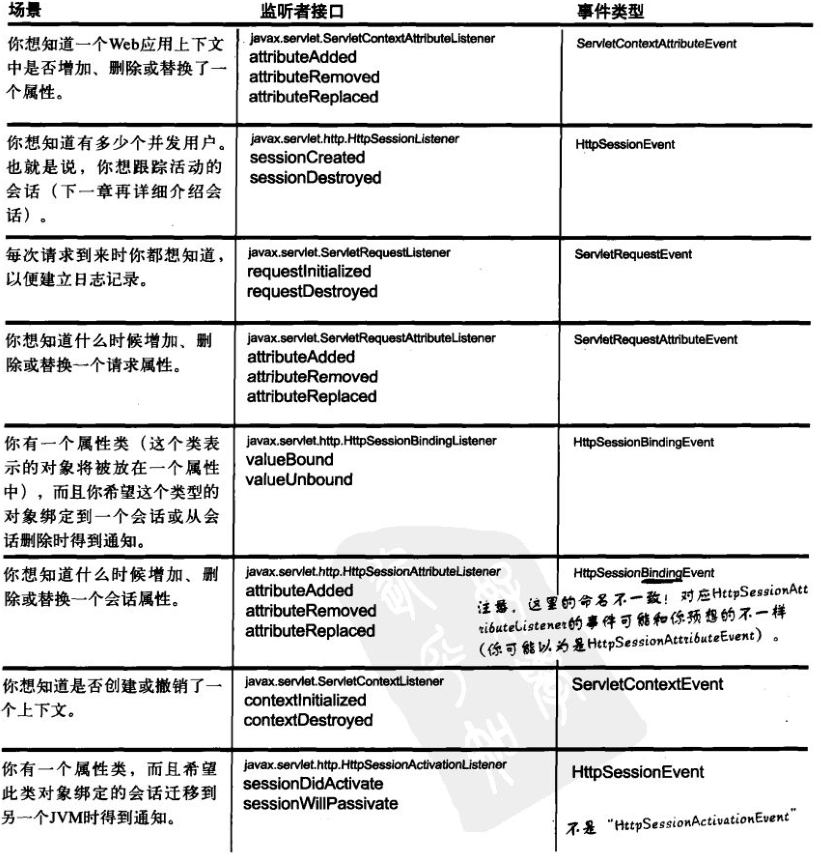
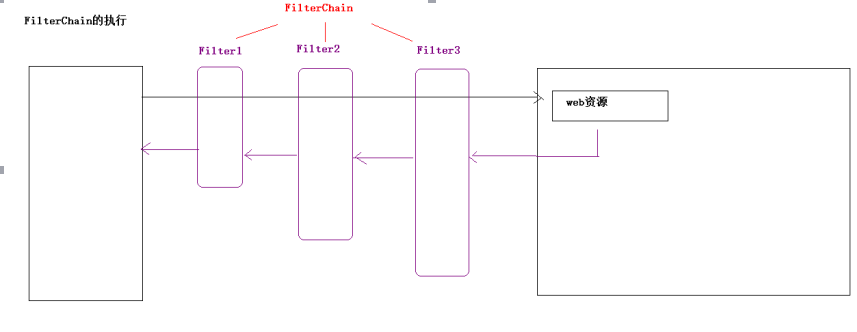

## 监听器listener

​	监听器就是一个实现了特定接口的Java类，这个Java类用于监听另一个Java类的方法调用或者属性的改变。当被监听对象发生上述事件后，监听器某个方法将会立即被执行。用来监听其他对象的变化的。主要应用在图形化界面开发上。Java中GUI，Android

**几个术语**

- 事件源：指的是被监听对象（汽车）
- 监听器：指的是监听的对象（报警器）
- 事件源和监听器绑定：在汽车上安装报警器
- 事件：指的是事件源对象的改变（踹了汽车一脚）----主要功能获得事件源对象

### 1.Servlet中的监听器

​	在Servlet中定义了多种类型的监听器，它们用于监听的事件源分别是ServletContext、HttpSession和ServletRequest这三个域对象。

#### **监听器分类**(3类8种)

- 一类：监听三个域对象的创建和销毁的监听器（三个）

- 二类：监听三个域对象的属性变更（属性添加、移除、替换）的监听器（三个）
- 三类：监听HttpSession中JavaBean的状态改变（钝化、活化、绑定、解除绑定）的监听（两个）

##### 1.ServletContextListener、HttpSessionListener、ServletRequestListener

监听对象的创建和销毁

 **javax.servlet  Interface ServletContextListener**

| **Method Summary** |                                                              |
| ------------------ | ------------------------------------------------------------ |
| ` void`            | `**contextDestroyed**(ServletContextEvent sce)`             Notification that the servlet context is about to be shut  down. |
| ` void`            | `**contextInitialized**(ServletContextEvent sce)`             Notification that the web application initialization process is  starting. |

**javax.servlet.http  Interface HttpSessionListener**

| **Method Summary** |                                                              |
| ------------------ | ------------------------------------------------------------ |
| ` void`            | `**sessionCreated**(HttpSessionEvent se)`             Notification that a session was created. |
| ` void`            | `**sessionDestroyed**(HttpSessionEvent se)`             Notification that a session is about to be invalidated. |

**javax.servlet  Interface ServletRequestListener**

| **Method Summary** |                                                              |
| ------------------ | ------------------------------------------------------------ |
| ` void`            | `**requestDestroyed**(ServletRequestEvent sre)`             The request is about to go out of scope of the web  application. |
| ` void`            | `**requestInitialized**(ServletRequestEvent sre)`             The request is about to come into scope of the web application. |

##### 2. ServletContextAttributeListener、HttpSessionAttributeListener、ServletRequestAttributeListener

| **Method Summary** |                                                              |
| ------------------ | ------------------------------------------------------------ |
| ` void`            | `**attributeAdded**(XxxxxAttributeEvent srae)`             Notification that a new attribute was added to the Xxxx request. |
| ` void`            | `**attributeRemoved**(XxxxxAttributeEventsrae)`             Notification that an existing attribute has been removed from the  Xxxx request. |
| ` void`            | `**attributeReplaced**(XxxxxAttributeEventsrae)`             Notification that an attribute was replaced on the Xxxx request. |

##### 3.HttpSessionBindingListener、HttpSessionActivationListener

不需要配置

**HttpSessionActivationListener**

| **Method Summary** |                                                              |
| ------------------ | ------------------------------------------------------------ |
| ` void`            | `**sessionDidActivate**(HttpSessionEvent se)`             Notification that the session has just been activated. |
| ` void`            | `**sessionWillPassivate**(HttpSessionEvent se)`             Notification that the session is about to be passivated. |

**HttpSessionBindingListener**

| **Method Summary** |                                                              |
| ------------------ | ------------------------------------------------------------ |
| ` void`            | `**valueBound**(HttpSessionBindingEvent event)`             Notifies the object that it is being bound to a session and  identifies the session. |
| ` void`            | `**valueUnbound**(HttpSessionBindingEvent event)`             Notifies the object that it is being unbound from a session and  identifies the session. |

##### 4.使用说明



## Filter

​	Filter称为过滤器，它是Servlet技术中最实用的技术，web开发人员通过Filter技术，对web服务器所管理的资源（JSP，Servlet，静态图片或静态html文件）进行拦截，从而实现一些特殊的功能。

​	Filter就是过滤从客户端向服务器发送的请求。

### 1.使用

​	创建filter

​	在web.xml中配置`<filter>`和`<filter-mapping>`

### 2.FilterChain

​	FilterChain过滤器链：在一个web应用中，可以开发编写多个Filter，这些Filter组合起来称为是一个过滤器链。

​	Web服务器根据Filter在web.xml文件中的注册顺序（mapping的配置顺序）决定先调用那个Filter。依次调用后面的过滤器，如果没有下一个过滤器，调用目标资源.



### 3.生命周期

​	Filter的创建和销毁是由web服务器负责。Web应用程序启动的时候，web服务器创建Filter的实例对象。并调用其init方法进行初始化（filter对象只会创建一次，init方法也只会执行一次）。

​	每次filter进行拦截(默认是REQUEST拦截)的时候，都会执行doFilter的方法。

​	当服务器关闭的时候，应用从服务器中移除的时候，服务器会销毁Filter对象。

### 4.FilterConfig对象的作用：

​	用来获得Filter的相关的配置的对象。

| **Method Summary** |                                                              |
| ------------------ | ------------------------------------------------------------ |
| ` String`          | `getFilterName()`             Returns the filter-name of this filter as defined in the  deployment descriptor. |
| ` String`          | `getInitParameter(String name)`             Returns a `String` containing the value of the named  initialization parameter, or `null` if the parameter does not  exist. |
| ` Enumeration`     | `getInitParameterNames()`             Returns the names of the filter's initialization parameters as an  `Enumeration` of `String` objects, or an empty  `Enumeration` if the filter has no initialization  parameters. |
| ` ServletContext`  | `getServletContext()`             Returns a reference to the [`ServletContext`](../../javax/servlet/ServletContext.html)  in which the caller is executing. |

### 5.过滤器的相关配置

#### 1. `<url-pattern>`的配置

- 完全路径匹配		：以/开始   比如/aaa  /aaa/bbb
	 目录匹配			：以/开始 以*结束  比如/*  /aaa/*  /aaa/bbb/*
	 扩展名匹配		：不能以/开始 以*开始 比如*.jsp  *.do   *.action

#### 2. `<servlet-name>`的配置

​	专门以Servlet的配置的名称拦截Servlet。

#### 3 .`<dispatcher>`的配置

​	默认的情况下过滤器会拦截请求。如果进行转发（需要拦截这次转发）。

​	dispatcher的取值

- **REQUEST**:默认值。默认过滤器拦截的就是请求。
- **FORWARD**:转发。
- INCLUDE:页面包含的时候进行拦截
- ERROR:页面出现全局错误页面跳转的时候进行拦截


	案例：权限校验过滤器		（编写一个Filter类，拦截指定的资源）
	案例：全站乱码过滤器		（难点）类似于包装Connection close
	案例：自动登录过滤器		（补充）
```java
@WebFilter("/main.jsp")
public class LoginFilter implements Filter {

	public void destroy() {
	}

	public void doFilter(ServletRequest request, ServletResponse response, FilterChain chain)
			throws IOException, ServletException {
		HttpServletRequest req = (HttpServletRequest) request;

		// 判断用户是否登录? 就是判断session中是否有user对象
		User user = (User) req.getSession().getAttribute("user");
		if (user == null) {
			// 没登录
			req.setAttribute("msg", "您没有权限访问!");
			req.getRequestDispatcher("/login.jsp").forward(req, response);
		} else {
			chain.doFilter(request, response);
		}
	}

	public void init(FilterConfig fConfig) throws ServletException {
	}

}
```

```java
ServletRequest proxy = (ServletRequest) Proxy.newProxyInstance(req.getClass().getClassLoader(),
						req.getClass().getInterfaces(), new InvocationHandler() {
	@Override
    public Object invoke(Object proxy, Method method, Object[] args) throws Throwable {
       if (method.getName().equals("getParameter") && req.getMethod().equalsIgnoreCase("GET")) {
          String value = (String) method.invoke(req, args);
          return new String(value.getBytes("iso-8859-1"), "utf-8");
       } else {
          return method.invoke(req, args);
       }
    }
});

chain.doFilter(proxy, response);
```

```java
public void doFilter(ServletRequest request, ServletResponse response, FilterChain chain)
		throws IOException, ServletException {
	HttpServletRequest req = (HttpServletRequest) request;
	User user = (User) req.getSession().getAttribute("user");
	Cookie auto = CookieUtils.findCookie(req.getCookies(), "autoLogin");

	/**
	 * 1.session中没有user对象
	 * 2.cookie中有user信息
	 */
	if (user == null && auto != null) {
		// 自动登录，往session中存一个user对象
		User u = new User();
		u.setUsername(auto.getValue().split("#")[0]);
		u.setPassword(auto.getValue().split("#")[1]);
        /*
         *	查询数据库
         *	查询到就放入，否则直接跳回登录界面
         */
		req.getSession().setAttribute("user", u);
	}

	chain.doFilter(request, response);
}
```

