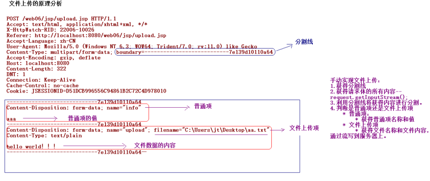

## file upload

**使用fileupload和commons-io**


### 1.**文件上传**

文件上传：将本地的文件通过流写入到服务器的过程。

### 1.1**为什么要学习文件上传**

实际开发中有很多应用：

- QQ空间上传图片

- 招聘网站上传简历

#### 1.2**文件上传的技术**

- JSPSmartUpload	：应用在JSP上的文件上传和下载的组件。
	 FileUpload		：应用在Java环境上的文件上传的功能。

	 Servlet3.0		：提供文件上传的功能

	 Struts2			：提供文件上传的功能

### 1.3**文件上传的要素**

文件上传的三个要素

1. 表单的提交的方式需要是POST

2. 表单中需要有`<input type=”file”>`元素，需要有name属性和值。
3. 表单`enctype="multipart/form-data"`


### 1.4理解核心API



#### 1.4.1DiskFileItemFactory：磁盘文件项工厂

构造函数

| **Constructor Summary**                                      |
| ------------------------------------------------------------ |
| `DiskFileItemFactory()`              Constructs an unconfigured instance of this class. |
| `DiskFileItemFactory(int sizeThreshold,java.io.File repository)`              Constructs a preconfigured instance of this class. |

后一个可以创建后再set


需要理解的方法

| **Method Summary**                             |                                                              |
| ---------------------------------------------- | ------------------------------------------------------------ |
| ` FileItem`                                    | `createItem(java.lang.String fieldName,java.lang.String contentType,boolean isFormField,java.lang.String fileName)`              Create a new `DiskFileItem` instance from the supplied parameters and the local factory  configuration. |
| org.apache.commons.io.     FileCleaningTracker | `getFileCleaningTracker()`              Returns the tracker, which is responsible for deleting temporary  files. |
| ` java.io.File`                                | `getRepository()`              Returns the directory used to temporarily store files that are larger  than the configured size threshold. |
| ` int`                                         | `getSizeThreshold()`              Returns the size threshold beyond which files are written directly to  disk. |
| ` void`                                        | `setFileCleaningTracker(org.apache.commons.io.FileCleaningTracker pTracker)`              Returns the tracker, which is responsible for deleting temporary  files. |
| ` void**`**                                    | **`setRepository(java.io.File repository)`**              Sets the directory used to temporarily store files that are larger  than the configured size threshold. |
| ` void**`**                                    | **`setSizeThreshold(int sizeThreshold)`**              Sets the size threshold beyond which files are written directly to disk. |

#### 1.4.2 ServletFileUpload

| **Constructor Summary**                                      |
| ------------------------------------------------------------ |
| `ServletFileUpload()`              Constructs an uninitialised instance of this class. |
| **`ServletFileUpload(FileItemFactory fileItemFactory)`**              Constructs an instance of this class which uses the supplied factory to  create `FileItem` instances. |

也可以先创建后设置


方法

|||
| ------------------- | ------------------------------------------------------------ |
| ` FileItemIterator` | `getItemIterator(javax.servlet.http.HttpServletRequest request)`              Processes an [RFC 1867](http://www.ietf.org/rfc/rfc1867.txt)  compliant `multipart/form-data` stream. |
| `static boolean`    | `isMultipartContent(javax.servlet.http.HttpServletRequest request)`              Utility method that determines whether the request contains multipart  content. |
| ` java.util.List`   | **`parseRequest(javax.servlet.http.HttpServletRequest request)`**              Processes an [RFC 1867](http://www.ietf.org/rfc/rfc1867.txt)  compliant `multipart/form-data` stream. |
| ` FileItemFactory` | `getFileItemFactory**()`              Returns the factory class used when creating file items. |
|  | org.apache.commons.fileupload   **Class FileUploadBase** |
| `abstract  void` | `setFileItemFactory(FileItemFactory factory)`              Sets the factory class to use when creating file items. |
| ` void`          | **`setFileSizeMax(long fileSizeMax)`**             Sets the maximum allowed size of a single uploaded file,  as opposed to `getSizeMax()` |
| ` void`          | **`setHeaderEncoding(java.lang.String encoding)`**              Specifies the character encoding to be used when reading the headers of  individual part. |
| ` void`          | **`setProgressListener(ProgressListener pListener)`**              Sets the progress listener. |
| ` void`          | **`setSizeMax(long sizeMax)`**              Sets the maximum allowed size of a complete request, as opposed  to `setFileSizeMax(long)` |
| ` ProgressListener` | **`getProgressListener()`**              Returns the progress listener. |

#### 1.4.3 FileItem

| **Method Summary**      |                                                              |
| ----------------------- | ------------------------------------------------------------ |
| ` void`                 | `delete()`              Deletes the underlying storage for a file item, including deleting any  associated temporary disk file. |
| ` byte[]`               | `get()`              Returns the contents of the file item as an array of bytes. |
| ` java.lang.String`     | `getContentType()`              Returns the content type passed by the browser or `null` if  not defined. |
| ` java.lang.String`     | `getFieldName()`              Returns the name of the field in the multipart form corresponding to  this file item. |
| ` java.io.InputStream`  | `getInputStream()`              Returns an `InputStream` that can be  used to retrieve the contents of the file. |
| ` java.lang.String`     | **`getName()`**              Returns the original filename in the client's filesystem, as provided by  the browser (or other client software). |
| ` java.io.OutputStream` | `getOutputStream()`              Returns an `OutputStream` that can  be used for storing the contents of the file. |
| ` long`                 | `getSize()`              Returns the size of the file item.  |
| ` java.lang.String`     | **`getString()`**              Returns the contents of the file item as a String, using the default  character encoding. |
| ` java.lang.String`     | `getString(java.lang.String encoding)`              Returns the contents of the file item as a String, using the specified  encoding. |
| ` boolean**`**          | **`isFormField()`**              Determines whether or not a `FileItem` instance represents  a simple form field. |

一个文件上传的例子

```java
protected void doGet(HttpServletRequest request, HttpServletResponse response) throws ServletException, IOException {
    request.setCharacterEncoding("utf-8");
    response.setContentType("utf-8");
    //1.创建工厂类
    DiskFileItemFactory diskFileItemFactory = new DiskFileItemFactory();
    //1.1 设置缓冲区大小
    diskFileItemFactory.setSizeThreshold(1024*1024*6);
    //1.2 设置临时文件目录
    diskFileItemFactory.setRepository(new File(getServletContext().getRealPath("/temp")));

    //2.获取文件上传对象
    ServletFileUpload upload = new ServletFileUpload(diskFileItemFactory);
    //List<FileItem> list = null;
    try {
        //3.获取文件列表
        List<FileItem> list = upload.parseRequest(request);
        for (FileItem fileItem : list) {
            if (fileItem.isFormField()) {
                //显示非文本信息
                System.out.println("name: "+fileItem.getFieldName());
                System.out.println("String: "+fileItem.getString());
                System.out.println("ContentType: "+fileItem.getContentType());
                System.out.println("getString(\"UTF-8\"): "+fileItem.getString("UTF-8"));
                System.out.println("--------");
            } else {
                //显示文本信息
                System.out.println(fileItem.getSize());
                System.out.println(fileItem.getName());

                //处理ie浏览器兼容
                int isIEBrowserInt = fileItem.getName().lastIndexOf("\\");
                String fileName = fileItem.getName().substring(isIEBrowserInt+1);
                System.out.println("after change:"+fileName);

                //处理文件名重名
                int idx = fileName.lastIndexOf(".");
                fileName = fileName.substring(0,idx-1)+UUID.randomUUID().toString()+fileName.substring(idx);

                //处理单文件夹下文件过多,文件分离
                String subPath = "";
                int fileHashcode = fileName.hashCode();
                subPath += "/"+(fileHashcode & 0xf);
                subPath += "/"+(fileHashcode>>>4 & 0xf);

                File uploadFilePath = new File("E:/test/"+subPath+"/");
                System.out.println(uploadFilePath.getAbsolutePath());
                uploadFilePath.mkdirs();

                //上传文件
                InputStream in = fileItem.getInputStream();//通过文件对象获取其输入流
                OutputStream out = new FileOutputStream(new File(uploadFilePath, fileName));//创建输出流指定输出文件路径
                IOUtils.copy(in, out);
                in.close();
                out.close();
                System.out.println("--------");
            }
        }
    } catch (FileUploadException e) {
        // TODO Auto-generated catch block
        e.printStackTrace();
    }
}
```


## file	download

文件下载：将服务器上的一个文件，通过流写入到客户端上。

很多应用包含有文件下载的功能

- 音乐的下载
- 应用的下载 

1. 使用超链接的方式实现文件的下载

   在`<a href=”文件的路径”>超链接</a>`

- 注意：超链接的方式，如果浏览器不能识别这种格式的文件，提示下载，如果支持该格式的文件，直接打开。


2. 通过手动编写代码的方式实现文件的下载**

- 设置两个头和一个流

  - **Content-Type**			:文件的MIME的类型
  - **Content-Disposition**	:浏览器支持该格式的文件，提示下载

  **设置代表该文件的输入流**(输出流是固定 **response.getOutputStream()**)