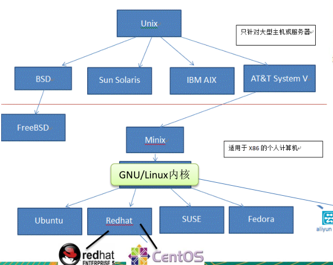
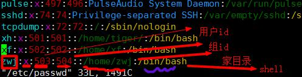
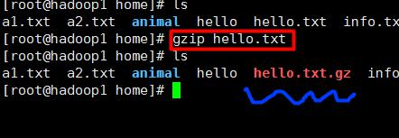
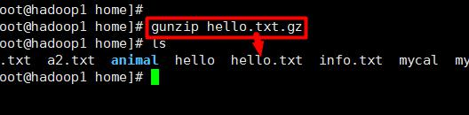
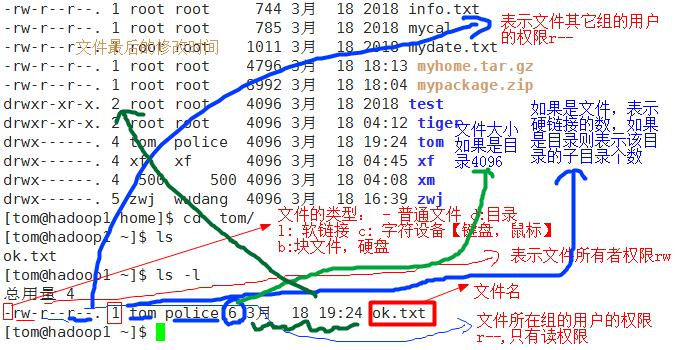
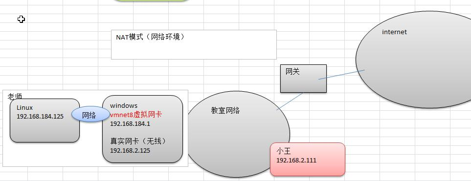
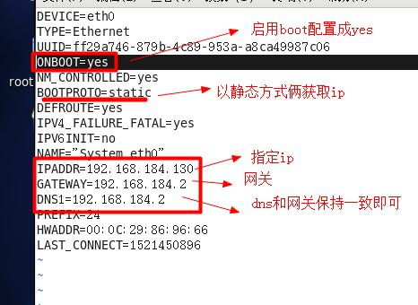

# Linux

# 第一部分 Linux基本命令

## 1.认识Linux

​	linux是一个开源、免费的操作系统，其稳定性、安全性、处理多并发已经得到了业界认可。

**linux的学习路径**

- 第1 阶段 ： linux环境下的基本操作命令，包括 文件操作命令(rm mkdir chmod, chown) 编
- 辑工具使用（vi vim）linux用户管理(useradd userdel usermod)等
- 第2 阶段 ： linux的各种配置（环境变量配置，网络配置，服务配置）
- 第3 阶段 ： linux下如何搭建对应语言的开发环境（大数据，JavaEE, Python等）
- 第4 阶段 ： 能编写shell脚本，对Linux服务器进行维护。
- 第5 阶 段 ： 能进行安全设置，防止攻击，保障服务器正常运行，能对系统调优。
- 第6 阶 段 ： 深入理解Linux系统（对内核有研究），熟练掌握大型网站应用架构组成、并熟
- 悉各个环节的部署和维护方法。

**linux和unix的关系**



**linux和windows的区别**

|比较| Window| Linux|
|-|-|-|
|免费与收费 |收费且很贵| Linux 免费或少许费用。|
|软件与支持 | 数量和质量的优势，不过大部分为收费软件；由微软官方提供支持和服务；|开源自由软件，用户可以修改定制和再发布，由于基本免费没有资金支持，部分软件质量和体验欠缺；有全球所有的Linux开发者和自由软件社区提供支持。|
|安全性 |三天两头打补丁安装系统安全更新，还是会中病毒木马；|要说 Linux 没有安全问题，那当然是不可能的，这一点仁者见仁智者见智，相对来说肯定比Windows 平台要更加安全|
|使用习惯|普通用户基本都是纯图形界面下操作使用，依靠鼠标和键盘完成一切操作，用户上手容易入门简单；|兼具图形界面操作和完全的命令行操作，可以只用键盘完成一切操作，新手入门较困难，需要一些学习和指导，一旦熟练之后效率极高。|
|可定制性 |封闭的，系统可定制性很差；| 开源，可定制化非常强。|
|应用场景 |桌面操作系统主要使用的是window。| 支撑百度，谷歌，淘宝等应用软件和服务的，是后台成千上万的Linux服务器主机。世界上大部分软件和服务都是运行在Linux之上的。|

## 2.Linux文件目录

linux的文件系统是采用级层式的树状目录结构，在此结构中的最上层是根目录“/”，然后在此目录下再创建其他的目录。

**`在Linux世界里，一切皆文件。`**


**/dev**
• 类似于windows的设备管理器，把所有的硬件用文件的形式存储。
**/media [重点]**
• linux系统会自动识别一些设备，例如U盘、光驱等等，当识别后，linux会把识别的设备挂载到这个目录下。
**/mnt [重点]**
• 系统提供该目录是为了让用户临时挂载别的文件系统的，我们可以将外部的存储挂载在/mnt/上，然后进入该目录就可以查看里的内容了。 d:/myshare
**/opt**
• 这是给主机额外安装软件所摆放的目录。如安装ORACLE数据库就可放到该目录下。
默认为空。
**/usr/local [重点]**
• 这是另一个给主机额外安装软件所安装的目录。一般是通过编译源码方式安装的程序。
**/var [重点]**
• 这个目录中存放着在不断扩充着的东西，习惯将经常被修改的目录放在这个目录下。
包括各种日志文件。
**/selinux [security-enhanced linux]**
• SELinux是一种安全子系统,它能控制程序只能访问特定文件 。


## 3.实际操作

### 3.1vi与vim

所有的 Linux 系统都会内建 vi 文本编辑器。

Vim 具有程序编辑的能力，可以看做是Vi的增强版本，可以主动的以字体颜色辨别
语法的正确性，方便程序设计。代码补完、编译及错误跳转等方便编程的功能特别
丰富，在程序员中被广泛使用。

#### 3.1.1 三种模式

1. 正常模式
   - 可以使用各种快捷键操作文件

2. 插入/编辑模式
   - i、I、a、A、o、O进入插入模式

3. 命令行模式
   - 使用各种命令

#### 3.1.2常用快捷键


### 3.2 关机与重启

shutdown：

- shutdown -h now		立刻关机
- shutdown -h 1              1min后关机
- shutdown -r now         1min后重启

halt

- 直接使用，关机

reboot

- 重启系统

sync

- 将内存数据同步到磁盘

建议：使用关机前使用sync同步


### 3.3 用户管理

用户登录和注销：logout（图形运行级别下无效）

#### 3.3.1添加用户：

```
user add 【username】
passwd 【username】
```

用户创建后会在`/home`下添加同名家目录

#### 3.3.2删除用户

```shell
#保留家目录
userdel 【username】

#删除级联家目录
userdel -r 【username】
```


#### 3.3.3查看用户信息

```xsh
id 【username】

[root@wxy guest]# id guest
uid=1001(guest) gid=1001(guest) 组=1001(guest)
```


在权限不够时可以使用**`su - 【username】`**切换用户，默认root

```
[guest@wxy /]$ su
密码：
[root@wxy /]# 
[root@wxy /]# exit
exit
[guest@wxy /]$ su - wxy
密码：
上一次登录：一 10月 15 15:03:49 CST 2018:0 上
[wxy@wxy ~]$ whoami
wxy
```


#### 3.3.4 用户组

##### 添加组

```
groupadd 【groupname】
```

##### 删除组

```
groupdel 【groupname】
```

##### 添加用户时指定组

```
useradd -g 【groupname】 【username】
```

##### 修改用户所属组

```
usermod -g 【groupname】 【username】
```


##### 用户和组的相关文

/etc/passwd  文件

- 用户（user）的配置文件，记录用户的各种信息
- 每行的含义： 用户名: 口令: 用户标识号: 组标识号: 注释性描述: 主目录: 登录Shell



/etc/shadow  文件

- 口令的配置文件
- 每行的含义： 登录名: 加密口令: 最后一次修改时间: 最小时间间隔: 最大时间间隔:警告时间: 不活动时间: 失效时间: 标志


/etc/group  文件

- 组(group)的配置文件，记录Linux包含的组的信息
- 每行含义： 组名: 口令: 组标识号: 组内用户列 表


### 4.实用指令

#### 4.1 指定运行级别

运行级别说明：
0 ：关机
1 ：单用户【找回丢失密码】
2：多用户状态没有网络服务
3：多用户状态有网络服务
4：系统未使用保留给用户
5：图形界面
6：系统重启
常用运行级别是3和5 ，要修改默认的运行级别可改文件

```shell
# inittab is no longer used when using systemd.
#
# ADDING CONFIGURATION HERE WILL HAVE NO EFFECT ON YOUR SYSTEM.
#
# Ctrl-Alt-Delete is handled by /usr/lib/systemd/system/ctrl-alt-del.target
#
# systemd uses 'targets' instead of runlevels. By default, there are two main targets:
#
# multi-user.target: analogous to runlevel 3
# graphical.target: analogous to runlevel 5
#
# To view current default target, run:
# systemctl get-default
#
# To set a default target, run:
# systemctl set-default TARGET.target
```


**`/etc/inittab`**的**`id:5:initdefault:`**这一行中的数字

基本命令：init [012356]


##### 找回root密码

进入到单一用户模式，修改root密码(进入单一用户模式不需要root密码)

过程：

```
1. 引导时  			 敲击		 enter
2. 在界面				 输入      e
3. 在界面选择kernel		输入		e
4. 在命令行				 输入      1（运行级别） + 回车
5. 引导完成后			输入		b
6. passwd root 		    输入	  【密码】
```


#### 4.2 帮助指令

**man**  获得帮助信 息
• 基本语法
man [命令或配置文件]（功能描述：获得帮助信息）
• 应用实例
案例：查看ls命令的帮助信息

**help**指 指 令
• 基本语法
help 命令 （功能描述：获得shell内置命令的帮助信息）
• 应用实例
案例：查看cd命令的帮助信息

**百度**帮助更直接
虽然上面两个都可以来获取指令帮助，但是需要英语功底，如果英语不太好的，我还是
推荐大家直接百度靠谱。


#### 4.3 文件目录相关

**pwd**

当前目录(绝对路径)


**ls** 【选项】 【目录或文件】

-a 全部包括隐藏

-l  列表显示

 

**cd**切换目录


**mkdir / rmdir**

```shell
mkdir -p 【目录路径】

#基本语法
rmdir 【选项】 要删除的空目录
#• 应用实例
#案例1:删除一个目录 /home/dog
#• 使用细节
rmdir 删除的是空目录，如果目录下有内容时无法删除的。
提示：如果需要删除非空目录，需要使用 
rm -rf 【要删除的目录】
```


**touch / cp**

```shell
#touch指令创建空文件
touch 【filename】
touch file1 file2

#cp拷贝文件到指定目录
cp【选项】 源文件 目标文件夹
cp -r 源文件夹 目标文件夹
#默认yes
\cp -r 源文件夹 目标文件夹
```


**rm / mv**

```
rm 指令移除文件或目录
• 基本语法
rm [选项] 要删除的文件或目录
• 常用选项
-r ：递归删除整个文件夹
-f ： 强制删除不提示
• 应用实例
案例1: 将 /home/aaa.txt 删除
案例2: 递归删除整个文件夹 /home/bbb
• 使用细节
强制删除不提示的方法：带上 -f 参数即可

mv 移动文件与目录或重命名
• 基本语法
mv oldNameFile newNameFile (功能描述：重命名)
mv /temp/movefile /targetFolder (功能描述：移动文件)
• 应用实例
案例1: 将 /home/aaa.txt 文件 重新命名为 pig.txt
案例2:将 /home/pig.txt 文件 移动到 /root 目录下
```


**cat / more / less**

```
cat [选项] 要查看的文件
• 常用选项
-n ：显示行号

more以全屏幕的方式按页显示文本文件的内容
more 要查看的文件

cat -n /etc/my.ini | more

less
用来分屏查看文件内容，它的功能与more指令类似，但是比more指令更加强大，支
持各种显示终端。less指令在显示文件内容时，并不是一次将整个文件加载之后才显示，而是
根据显示需要加载内容， 对于显示大型文件具有较高的效率。

```


**`>` / `>>`**

重定向：覆盖

追加：加在后面


**echo / head / tail**

```
head 文件 (功能描述：查看文件头10行内容)
head -n 5 文件 (功能描述：查看文件头5行内容，5可以是任意行数)


tail 文件 （功能描述：查看文件头10行内容）
tail -n 5 文件 （功能描述：查看文件头5行内容，5可以是任意行数）
tail -f 文件 （功能描述：实时追踪该文档的所有更新）
```


**ln  指令**
软链接也成为符号链接，类似于windows里的快捷方式，主要存放了链接其他文件的路径
• 基本语法
ln -s 【原文件或目录】【软链接名】 （功能描述：给原文件创建一个软链接）

**history 指令**
查看已经执行过历史命令,也可以执行历史指令
• 基本语法
history （功能描述：查看已经执行过历史命令）


#### 4.4 时间日期类

##### data

**查看**

基本语法
1) date （功能描述：显示当前时间）
2) date +%Y （功能描述：显示当前年份）
3) date +%m （功能描述：显示当前月份）
4) date +%d （功能描述：显示当前是哪一天）
5) date "+%Y-%m-%d %H:%M:%S"（功能描述：显示年月日时分秒）


**修改**

基本语法
date -s 字符串时间


##### cal

查看日历指令
• 基本语法
cal [选项] （功能描述：不加选项，显示本月日历）
• 应用实例
案例1: 显示当前日历
案例2: 显示2020年日历


#### 4.5 查找

##### find

find指令将从指定目录向下递归地遍历其各个子目录，将满足条件的文件或者目录显示在终
端。
• 基本语法
find 【搜索范围】【选项】
• 选项说明
• 应用实例
案例1: 按文件名：根据名称查找/home 目录下的hello.txt文件
案例2：按拥有者：查找/opt目录下，用户名称为 nobody的文件
案例3：查找整个linux系统下大于200m的文件（+n 大于 -n小于 n等于）

| 选项 | 功能 |
| ---- | ---- |
|-name|<查询方式> 按照指定的文件名查找模式查找文件|
|-user|<用户名> 查找属于指定用户名所有文件|
|-size|<文件大小> 按照指定的文件大小查找文件。|


##### locate

```
locaate指令可以快速定位文件路径。locate指令利用事先建立的系统中所有文件名称及路径
的locate数据库实现快速定位给定的文件。Locate指令无需遍历整个文件系统，查询速度较快。
为了保证查询结果的准确度，管理员必须定期更新locate时刻。

updatedb
locate a.txt
```


##### grep 指令和  管号 道符号 `|`

grep 过滤查找 ， 管道符，“|”，表示将前一个命令的处理结果输出传递给后面的命令处理。

|选项 |功能|
|-|-|
|-n| 显示匹配行及行号。|
|-i| 忽略字母大小写|


#### 4.6 压缩和解压缩

**gzip / gunzip**

gzip 用于压缩文件， gunzip 用于解压的
• 基本语法
​	gzip 文件 （功能描述：压缩文件，只能将文件压缩为*.gz文件）
​	gunzip 文件.gz （功能描述：解压缩文件命令）





gzip不会保存源文件


##### zip/unzip  指令

zip 用于压缩文件， unzip 用于解压的，这个在项目打包发布中很有用的

基本语法
​	zip [选项] XXX.zip 将要压缩的内容（功能描述：压缩文件和目录的命令）
​	unzip [选项] XXX.zip 			  （功能描述：解压缩文件）

- zip常用选项
  ​	-r：递归压缩，即压缩目录

- unzip的常用选项
  ​	-d<目录> ：指定解压后文件的存放目录


##### tar

tar 指令 是打包指令，最后打包后的文件是 .tar.gz 的文件。
• 基本语法

```
tar [选项] XXX.tar.gz 打包的内容 (功能描述：打包目录，压缩后的文件格式.tar.gz)
```

|选项 |功能|
|-|-|
|-c| 产生.tar打包文件|
|-v |显示详细信息|
|-f |指定压缩后的文件名|
|-z |打包同时压缩|
|-x| 解包.tar文件|

```shell
#压缩
[root@wxy tmp]# tar -zcvf test.tar.gz yum.log storage.log 
yum.log
storage.log
[root@wxy tmp]# ll | grep test
-rw-r--r--  1 root root     138 10月 22 11:13 test.tar.gz

[root@wxy tmp]# tar -zcf test.tar.gz ./
[root@wxy tmp]# ll | grep test
-rw-r--r--  1 root root 7060997 10月 22 11:14 test.tar.gz

#解压，不指定 -C 默认当前路径
[root@wxy tmp]# tar -zxvf test.tar.gz -C ./
yum.log
storage.log

```


### 5.组管理和权限管理

在linux中的每个用户必须属于一个组，不能独立于组外。在linux中每个文件
有所有者、所在组、其它组的概念。

- 1) 所有者
- 2) 所在组
- 3) 其它组


#### 5.1 用户管理

一般为文件的创建者,谁创建了该文件，就自然的成为该文件的所有者。

查看文件的所有者

- 1) 指令：ls –ahl

- 2) 应用实例

  修改文件所有者
  • 指令：chown 用户名 文件名

  ​		chown newowner:newgroup file 改变用户的所有者和所有组

```
chown tom a.txt
```


#### 5.2 **组的管理**

**组创建**

基本指令
groupadd 组名
应用实例:

```shell
#创建一个组, ,monster
group monster
#创建一个用户 fox ，并放入到 monster组中
user -g monster add fox
```

**修改文件所在的组**
• 基本指令
chgrp 组名 文件名

```shell
#• 应用实例
#使用root用户创建文件 orange.txt ,看看当前这个文件属于哪个组，然后将这个文件所在组，修改到 fruit组。
touch orange.txt
ll

chgrp fruit orange.txt
```


**改变用户所在组**
在添加用户时，可以指定将该用户添加到哪个组中，同样的用root的管理权限可以改变某
个用户所在的组。
改 变用户所在组
1) usermod –g 组名 用户名
2) usermod –d 目录名 用户名 改变该用户登陆的初始目录。

```shell
#将 zwj 这个用户从原来所在组，修改到 wudang 组。
groupadd bandit
usermod -g bandit tom
```


### 6.权限管理

ls -ahl的内容




第一种方式：+  、- 、=  变更权限
u:所有者 g:所有组 o:其他人 a:所有人(u、g、o的总和)
​	1) chmod u=rwx,g=rx,o=x 文件目录名
​	2) chmod o+w 文件目录名
​	3) chmod a-x 文件目录名


第二种 方式：通过数字变更权限
r=4 w=2 x=1 rwx=4+2+1=7
chmod u=rwx,g=rx,o=x 文件目录名
相当于 **chmod 751** 文件目录名


##### 实例

```shell
#police ， bandit
#jack, jerry: 警察
#xh, xq: 土匪
#(1) 创建组
group add polic
group add bandit

#(2) 创建用户
useradd -g polic jack
useradd -g polic jerry

useradd -g bandit xh
useradd -g bandit xq

passwd ....
#(3) jack 创建一个文件，自己可以读写，本组人可以读，其它组没人任何权限
su - jack
touch test.txt
chmod 640 test.txt

#(4) jack 修改该文件，让其它组人可以读, 本组人可以读写
chmod o=r,g=rw test.txt

#(5) xh 投靠 警察，看看是否可以读写.
usermod -g polic xh
```


### 7.磁盘

#### 7.1 查询系统整体磁盘使用情况

```shell
[root@wxy network-scripts]# df -h
文件系统                 容量  已用  可用 已用% 挂载点
/dev/mapper/cl_wxy-root   17G  4.9G   13G   29% /
devtmpfs                 897M     0  897M    0% /dev
tmpfs                    912M   84K  912M    1% /dev/shm
tmpfs                    912M  9.0M  903M    1% /run
tmpfs                    912M     0  912M    0% /sys/fs/cgroup
/dev/sda1               1014M  173M  842M   18% /boot
tmpfs                    183M     0  183M    0% /run/user/0
tmpfs                    183M   16K  183M    1% /run/user/42
```

#### 7.2 查询指定目录的磁盘占用情 况

```shell
du -h /目录
[root@wxy network-scripts]# du -ach --max-depth=1 /home
3.6M	/home/wxy
20K	/home/guest
3.6M	/home
3.6M	总用量
```


```shell
#1) 统计/home文件夹下文件的个数
[root@wxy network-scripts]# ls -l /tmp | grep '^-' | wc -l
10

#2) 统计/home文件夹下目录的个数
[root@wxy network-scripts]# ls -l /tmp | grep '^d' | wc -l
3

#3) 统计/home文件夹下文件的个数，包括子文件夹里的
[root@wxy network-scripts]# ls -lR /tmp | grep '^-' | wc -l
18

#4) 统计文件夹下目录的个数，包括子文件夹里的
[root@wxy network-scripts]# ls -lR /tmp | grep '^d' | wc -l
5

#5) 以树状显示目录结构
[root@wxy network-scripts]# yum install tree
[root@wxy home]# tree ./
./
├── guest
└── wxy
    ├── \345\205\254\345\205\261
    ├── \346\250\241\346\235\277
    ├── \350\247\206\351\242\221
    ├── \345\233\276\347\211\207
    ├── \346\226\207\346\241\243
    ├── \344\270\213\350\275\275
    ├── \351\237\263\344\271\220
    └── \346\241\214\351\235\242
```


### 8. 定时任务

#### crontab

```shell
Usage:
 crontab [options] file
 crontab [options]
 crontab -n [hostname]

Options:
 -u <user>  define user
 -e         edit user's crontab
 -l         list user's crontab
 -r         delete user's crontab
 -i         prompt before deleting
 -n <host>  set host in cluster to run users' crontabs
 -c         get host in cluster to run users' crontabs
 -s         selinux context
 -x <mask>  enable debugging


crontab –e
#接着输入任务到调度文件
*/1 * * * * ls –l /etc/ > /tmp/to.txt
#意思说每小时的每分钟执行ls –l /etc/ > /tmp/to.txt命令
```
每一个位置的含义

|项目| 含义 |范围|
|-|-|-|
|第一个“*”| 一小时当中的第几分钟 |0-59|
|第二个“*” |一天当中的第几小时| 0-23|
|第三个“*” |一个月当中的第几天 |1-31|
|第四个“*”| 一年当中的第几月 |1-12|
|第五个“*” |一周当中的星期几 0-7|（0和7都代表星期日）|

可以有哪些符号说明信息
|符号 |含义|
|-|-|
|*| 代表任何时间。比如第一个“*”就代表一小时中每分钟都执行一次的意思。|
|，| 代表不连续的时间。比如“0 8,12,16 * * * 命令”，就代表在每天的8点0分，12点0分，16点0分都执行一次命令|
|- |代表连续的时间范围。比如“0 5 * * 1-6命令”，代表在周一到周六的凌晨5点0分执行命令|
|*/n |代表每隔多久执行一次。比如“*/10 * * * * 命令”，代表每隔10分钟就执行一遍命令|

```shell
#实例：
#案例1 ：每隔1 分钟，就将当前的日期信息，追加到 /tmp/mydate  文件中
[root@wxy tmp]# vim mydatetask.sh
[root@wxy tmp]# crontab -e
no crontab for root - using an empty one
crontab: installing new crontab
[root@wxy tmp]# crontab -l
*/1 * * * * /tmp/mydatetask.sh

#案例2 ：每隔1 分钟， 到 将当前日期和日历都追加到 /home/mycal  文件中


#案例3: 每天凌晨2:00  将mysql 数据库 testdb 备份到文件中。
mysqldump -uroot -p【password】 test > /tmp/mysql_test.bak
```


### 9.网络配置





```
[root@wxy network-scripts]# cd /etc/sysconfig/network-scripts/
[root@wxy network-
TYPE="Ethernet"
BOOTPROTO="static"
DEFROUTE="yes"
PEERDNS="yes"
PEERROUTES="yes"
IPV4_FAILURE_FATAL="no"
IPV6INIT="yes"
IPV6_AUTOCONF="yes"
IPV6_DEFROUTE="yes"
IPV6_PEERDNS="yes"
IPV6_PEERROUTES="yes"
IPV6_FAILURE_FATAL="no"
IPV6_ADDR_GEN_MODE="stable-privacy"
NAME="ens33"
UUID="ea22b917-3fe9-4d7f-ae97-8397f01b35fe"
DEVICE="ens33"
ONBOOT="yes"
IPADDR=192.168.15.3
NETMASK=255.255.255.0
GATEWAY=192.168.15.2]# vim ifcfg-ens33
```


### 10. 进程管理

#### 10.1 查看进程

基本介绍
**ps**命令是用来查看目前系统中，有哪些正在执行，以及它们执行的状况。
可以不加任何参数.

```shell
[root@wxy home]# ps -aux
USER        PID %CPU %MEM    VSZ   RSS TTY      STAT START   TIME COMMAND
root          1  0.0  0.2 141852  4028 ?        Ss   09:54   0:02 /usr/lib/systemd/systemd --switched-root --system --deserialize 21
root          2  0.0  0.0      0     0 ?        S    09:54   0:00 [kthreadd]
root          3  0.0  0.0      0     0 ?        S    09:54   0:00 [ksoftirqd/0]

```

- USER：用户名称
- PID：进程号
- %CPU ：进程占用CPU 的百分比
- %MEM ：进程占用物理内存的百分比
- VSZ ：进程占用的虚拟内存大小（单位：KB） ）
- RSS ：进程占用的物理内存大小（单位：KB） ）
- TT：终端名称,缩写 .
- STAT：进程状态，其中S-睡眠，s-表示该进程是会话的先导进程，N-表示进程拥有比普通
  优先级更低的优先级，R-正在运行，D-短期等待，Z-僵死进程，T-被跟踪或者被停止等等
- STARTED：进程的启动时间
- TIME：CPU时间，即进程使用CPU的总时间
- COMMAND：启动进程所用的命令和参数 ，如果过长会被截断显


ps -ef是以全格式显示当前所有的进程
-e 显示所有进程。-f 全格式。

```shell
[root@wxy home]# ps -ef
UID         PID   PPID  C STIME TTY          TIME CMD
root          1      0  0 09:54 ?        00:00:02 /usr/lib/systemd/systemd --switched-root --system --deserialize 21
root          2      0  0 09:54 ?        00:00:00 [kthreadd]
root          3      2  0 09:54 ?        00:00:00 [ksoftirqd/0]
root          5      2  0 09:54 ?        00:00:00 [kworker/0:0H]
```

是BSD 风格

- UID：用户ID
- PID：进程ID
- PPID ：父进程ID
- C：CPU用于计算执行优先级的因子。数值越大，表明进程是CPU密集型运算，
  执行优先级会降低；数值越小，表明进程是I/O密集型运算，执行优先级会提高
- STIME：进程启动的时间
- TTY：完整的终端名称
- TIME：CPU时间
- CMD：启动进程所用的命令和参数

#### 10.2 进程结束

```
#（功能描述：通过进程号杀死进程）
kill [选项] 进程号

#（功能描述：通过进程名称杀死进程，也支持通配符，这在系统因负载过大而变得很慢时很有用）
killall 进程名称 


```

**pstree**
pstree [选项] ,可以更加直观的来看进程信息
常用选项：
-p :显示进程的PID
-u :显示进程的所属用户


#### 10.3 服务 服务(service)管理

介绍:
服务(service) 本质就是进程，但是是运行在后台的，通常都会监听某个端口，等待其它程序的请求，比如(mysql , sshd 防火墙等)，因此我们又称为守护进程，是Linux中非常重要的知识点。【原理图】

service 管理指令：
service 服务名 [start | stop | restart | reload | status]
在CentOS7.0后 不再使用service ,而是 **systemctl**
使 用案例：
1) 查看当前防火墙的状况，关闭防火墙和重启防火墙。

```
telnet ip port
```

##### 查看服务名:

方式1：使用setup -> 系统服务 就可以看到。
方式2: /etc/init.d/服务名称


##### 服务的运行级别(runlevel):

查看或者修改默认级别： vi /etc/inittab

Linux系统有7种运行级别(runlevel)：常用的是级别3和5
• 运行级别0：系统停机状态，系统默认运行级别不能设为0，否则不能正常启动
• 运行级别1：单用户工作状态，root权限，用于系统维护，禁止远程登陆
• 运行级别2：多用户状态(没有NFS)，不支持网络
• 运行级别3：完全的多用户状态(有NFS)，登陆后进入控制台命令行模式
• 运行级别4：系统未使用，保留
• 运行级别5：X11控制台，登陆后进入图形GUI模式
• 运行级别6：系统正常关闭并重启，默认运行级别不能设为6，否则不能正常启动

##### **开机流程**


#### 10.3 进程监控服务

##### 10.3.1 top [选项]

top与ps命令很相似。它们都用来显示正在执行的进程。Top与ps最大的不同之处，在于top
在执行一段时间可以更新正在运行的的进程。


##### 10.3.2 netstat

查看系 统网 络情况
netstat [选项]

- 选项说明
  -an 按一定顺序排列输出
  -p 显示哪个进程在调用

请查看服务名为 sshd 的服务的信息。

```bash
[root@wxy home]# netstat -anp | grep ssh
Proto Recv-Q Send-Q Local Address           Foreign Address         State       PID/Program name
tcp        0      0 0.0.0.0:22              0.0.0.0:*               LISTEN      988/sshd            
tcp        0     52 192.168.15.3:22         192.168.15.1:6221       ESTABLISHED 6977/sshd: root@pts 
tcp6       0      0 :::22                   :::*                    LISTEN      988/sshd            
unix  2      [ ]         DGRAM                    69082    6977/sshd: root@pts 
```


### 11. 安装

#### 11.1 RPM

RPM是RedHat Package Manager（RedHat软件包管理工具）的缩写，类似windows的setup.exe，这一文件格式名称虽然打上了RedHat的标志，但理念是通用的。

rpm 包的简单查询指令：

##### 11.1.1 查询已安装的rpm列表 

```shell
[root@wxy home]# rpm -qa | grep java
java-1.8.0-openjdk-1.8.0.102-4.b14.el7.x86_64
javapackages-tools-3.4.1-11.el7.noarch
java-1.8.0-openjdk-headless-1.8.0.102-4.b14.el7.x86_64
tzdata-java-2016g-2.el7.noarch
python-javapackages-3.4.1-11.el7.noarch
```

rpm 包名基本格式：
一个rpm包名：firefox-45.0.1-1.el6.centos.x86_64.rpm
名称:firefox
版本号：45.0.1-1
适用操作系统: el6.centos.x86_64
表示centos6.x的64位系统
如果是i686、i386表示32位系统，noarch表示通用。


##### 11.1.2 卸载rpm包：

• 基本语法
rpm -e RPM包的名称


##### 11.1.3 安装rpm包

基本语法
​	rpm -ivh RPM包全路径名称
参数说明

- i=install  安装
- v=verbose  提示
- h=hash 进度 条


#### 11.2 yum

介绍：Yum 是一个Shell前端软件包管理器。基于RPM包管理，能够从指定的服务器自动下载RPM包并且安装，可以自动处理依赖性关系，并且一次安装所有依赖的软件包。
yum 的基本指令

##### 11.2.1 查询yum服务器是否有需要安装的软件

yum list|grep xx软件列表

##### 11.2.2 安装指定的yum包

yum install xxx 下载安装


