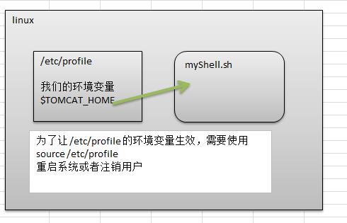

# Shell

系统跟计算机硬件交互时使用的中间介质，它只是系统的一个工具。实际上，在shell和计算机硬件之间还有一层东西那就是系统内核了。

Shell是一个命令行解释器，它为用户提供了一个向Linux内核发送请求以便运行程序的界面系统级程序，用户可以用Shell来启动、挂起、停止甚至是编写一些程序

## QuickStart

脚本格 式 要求

1. 脚本以#!/bin/bash开头
2. 脚本需要有可执行权限

编写 第 一个Shell脚本

- 需求说明
  创建一个Shell脚本，输出hello world!

脚本的常用执行方式

- 方式1(输入脚本的绝对路径或相对路径)
  1)首先要赋予helloworld.sh 脚本的+x权限
  2)执行脚本

- 方式2(sh+脚本)
  说明：不用赋予脚本+x权限，直接执行即可。

```shell
[root@wxy home]# sh helloword.sh
hello world
[root@wxy home]# cat helloword.sh 
#!/bin/bash

echo 'hello world'
```


## Shell变量

### Shell的 的变量的介绍

​	1）Linux Shell中的变量分为，系统变量和用户自定义变量。
​	2）系统变量：$HOME、$PWD、$SHELL、$USER等等
​		比如： echo $HOME 等等..
​	3）显示当前shell中所有变量：set

### shell 变量的定义

1.基本语法
​	1)定义变量：变量=值
​	2)撤销变量：unset 变量
​	3) 声明静态变量：readonly变量，注意：不能unset
2.定义变量的规则
​	1) 变量名称可以由字母、数字和下划线组成，但是不能以数字开头。
​	2) 等号两侧不能有空格
​	3) 变量名称一般习惯为大写
• 将命令的返回值赋给变量
​	1）A=**\`ls -la\`**反引号，运行里面的命令，并把结果返回给变量A
​	2）A=**$(ls -la)** 等价于反引号

• 快速入门
​	案例1：定义变量A
​	案例2：撤销变量A

```shell
[root@wxy home]# cat helloword.sh 
#!/bin/bash

#echo 'hello world'
A=100
echo 'A=$A'
echo "A=$A"
unset A
echo "A=$A"
[root@wxy home]# . helloword.sh 
A=$A
A=100
A=
```

案例3：声明静态的变量B=2，不能unset

```shell
[root@wxy home]# cat helloword.sh 
#!/bin/bash

#echo 'hello world'
readonly A=100
echo 'A=$A'
echo "A=$A"
unset A
echo "A=$A"
[root@wxy home]# . helloword.sh 
-bash: a: 只读变量
A=$A
A=100
-bash: unset: A: 无法反设定: 只读 variable
A=100
```

案例4：可把变量提升为全局环境变量，可供其他shell程序使用

设置环境变量

基本语法
​	1) export 变量名=变量值 （功能描述：将shell变量输出为环境变量）
​	2) source 配置文件 （功能描述：让修改后的配置信息立即生效）
​	3) echo $变量名 （功能描述：查询环境变量的值）



```
[root@wxy ~]# export TEST=testvar
[root@wxy ~]# echo $TEST
testvar
[root@wxy ~]# unset $TEST
```


### 位置参数变量

当我们执行一个shell脚本时，如果希望获取到命令行的参数信息，就可以使用到位置参数变量比如 ： ./myshell.sh 100 200 , 这个就是一个执行shell的命令行，可以在myshell 脚本中获取到参数信息
基本语法

`$n` （功能描述：n为数字，`$0`代表命令本身，$1-$9代表第一到第九个参数，十以上的参数，十以上的参
数需要用大括号包含，如`${10}`）

`$*` （功能描述：这个变量代表命令行中所有的参数，`$*`把所有的参数看成一个整体）
`$@`（功能描述：这个变量也代表命令行中所有的参数，不过`$@`把每个参数区分对待）
`$#`（功能描述：这个变量代表命令行中所有参数的个数）

```shell
[root@wxy tmp]# cat partitionParam.sh 
#!/bin/bash

echo $1
echo $*
echo $@

echo "params num：$#"
[root@wxy tmp]# . partitionParam.sh 100 200
100
100 200
100 200
params num：2
```


### 预定义变量

就是shell设计者事先已经定义好的变量，可以直接在shell脚本中使用
基本语 法
`$$` （功能描述：当前进程的进程号（PID））
`$!` （功能描述：后台运行的最后一个进程的进程号（PID））
`$？` （功能描述：最后一次执行的命令的返回状态。如果这个变量的值为0，证明上一个命令正
确执行；如果这个变量的值为非0（具体是哪个数，由命令自己来决定），则证明上一个命令执行不正
确了。）


### 运算符

学习如何在shell中进行各种运算操作。
基本语 法
1) “`$((运算式))`”或“`$[运算式]`”
2) expr m + n
注意expr运算符间要有空格
3) expr m - n
4) expr \*, /, % 乘，除，取余

```shell
[root@wxy tmp]# expr 1-2
1-2
[root@wxy tmp]# expr 1 - 2
-1
#案例1：计算（2+3）X4的值
[root@wxy tmp]# echo $(((1+2)*3))
9
[root@wxy tmp]# echo $[(1+2)*3]
9
[root@wxy tmp]# vartmp=`expr 1 + 2`
[root@wxy tmp]# expr $vartmp \* 3
9

#案例2：请求出命令行的两个参数[整数]的和

```


### 条件判断

基本语法
[ condition ]（注意condition前后要有空格）

非空返回true，可使用$?验证（0为true，>1为false）

• 应用实例
[ atguigu ]  返回true
[]  返回false
[condition] && echo OK || echo notok 条件满足，执行后面的语句


判断语句
|常用判断条件||
|-|-|
|**1) 两个整数的比较**||
|=| 字符串比较|
|-lt| 小于|
|-le| 小于等于|
|-eq| 等于|
|-gt |大于|
|-ge |大于等于|
|-ne |不等于|
|**2) 按照文件权限进行判断**||
|-r |有读的权限|
|-w |有写的权限|
|-x| 有执行的权限|
|**3) 按照文件类型进行判断**||
|-f| 文件存在并且是一个常规的文件|
|-e| 文件存在|
|-d |文件存在并是一个目录|

```java
[root@wxy tmp]# cat test.sh
#!/bin/bash

if [ -f ./test.txt ]
then
	echo yes
fi
[root@wxy tmp]# sh test.sh 
yes
```


### 流程控制

#### if  判断

基本语法

```shell
if [ 条件判断式 ];then
	程序
fi

#或者

if [ 条件判断式 ]
	then
		程序
	elif [条件判断式]
	then
		程序
fi
```

注意事项：

（1）[ 条件判断式 ]，中括号和条件判断式之间必须有空格

（2） 推荐使用第二种方式
• 应用实例
案例：请编写一个shell程序，如果输入的参数，大于等于60，则输出 "及格了"，如果小于60,则输出 "不及格"

```shell
if [ $1 -ge 60 ]
then
	echo 及格了
	elif [ $1 -lt 60 ]
	then
		echo 不及格
fi
```


#### case 语句

基本语法

```
case $变量名 in
"值1"）
如果变量的值等于值1，则执行程序1
;;
"值2"）
如果变量的值等于值2，则执行程序2
;;
…省略其他分支…
*）
如果变量的值都不是以上的值，则执行此程序
;;
esac
```

• 应用实例
案例1 ：当命令行参数是 1 时，输出 "周一", 是2 时，就输出"周二"， 其它情况输出 "other"

```shell
case $1 in
	"1")
		echo "周一"
		;;
	"2")
		echo "周二"
		;;
	"*")
		echo "other"
		;;
esac
```


### for循环

基本语法

```shell

for  变量 in  值1  值2  值3…
do
	程序
done


for (( 初始值;循环控制条件;变量变化))
do
	程序
done
```

案例1 ：打印命令行输入的参数

```shell
#!/bin/bash

echo 'test $*'
for i in "$*"
do
	echo "the num is $i"
done

echo 'test $@'
for i in "$@"
do
        echo "the num is $i"
done

[root@wxy tmp]# sh testFor.sh 1 2 3
test $*
the num is 1 2 3
test $@
the num is 1
the num is 2
the num is 3
```

```shell
[root@wxy tmp]# cat testFor2.sh 
#!/bin/bash

for((i=1;i<=100;i++))
do
	SUM=$[$SUM+$i]
done
echo $SUM
[root@wxy tmp]# sh testFor2.sh 
5050
```


### while 循环

```shell
while [ 条件判断式 ]
do
	程序
done
```

应用实例
案例1 ：从命令行输入一个数n，统计从 1+..+ n 的值是多少？

```shell
[root@wxy tmp]# sh testwhile.sh 3
6
[root@wxy tmp]# cat testwhile.sh 
#!/bin/bash

SUM=0
i=0
while [ $i -le $1 ]
do
	SUM=$[$SUM+$i]
	i=$[$i+1]
done
echo $SUM
```


### read读取控制台输入 读取控制台输入

基本语法

```shell
read(选项)(参数)
```
选项：
-p：指定读取值时的提示符；
-t：指定读取值时等待的时间（秒），如果没有在指定的时间内输入，就不再等待了。。
参数
变量：指定读取值的变量名
应用实例
案例1：读取控制台输入一个num值
案例2：读取控制台输入一个num值，在10秒内输入。

```shell
[root@wxy tmp]# sh testread.sh 
请输入一个num：1
你输入的是NUM=1
[root@wxy tmp]# cat testread.sh 
#!/bin/bash

read -p "请输入一个num：" NUM
echo "你输入的是NUM=$NUM"
```


### 函 数

函数介绍
shell编程和其它编程语言一样，有系统函数，也可以自定义函数。

#### 自定义函数

```shell
[ function ] funname[()]
{
	Action;
	[return int;]
}
调用直接写函数名：funname [值]
```

计算输入两个参数的和， getSum

```shell
[root@wxy tmp]# sh testfunction.sh 1 2
1+2=3
[root@wxy tmp]# cat testfunction.sh 
#!/bin/bsh

getSum(){
	SUM=$[$n1+$n2]
	echo "$n1+$n2=$SUM"
}

n1=$1
n2=$2
getSum $n1 $n2
```


## 综合案例

需求分析
1) 每天凌晨 2:10 备份 数据库 atguiguDB 到 /data/backup/db
2) 备份开始和备份结束能够给出相应的提示信息
3) 备份后的文件要求以备份时间为文件名，并打包成 .tar.gz 的形式，比如：
​	2018-03-12_230201.tar.gz
4) 在备份的同时，检查是否有10天前备份的数据库文件，如果有就将其删除。


##### 1.脚本开发

该脚本要传入数据库名称才能备份

```shell
#!/bin/bash

backUpPath=/data/mysqlback/db
dataTime=$(date +%Y_%m_%d_%H%M%S)

echo "=======start backup mysql database======="
echo "=======the path is  $backUpPath   ======="

host=127.0.0.1
user=root
passwd=1234

[ ! -d "$backUpPath/$dataTime" ] && {
	mkdir -p "$backUpPath/$dataTime"
}

#备份数据库,需要传入数据库名称
mysqldump -u${user} -p${passwd} --host=$host $1 | gzip > $backUpPath/$dataTime/$dataTime.sql.gz
cd $backUpPath
tar -zcvf  $dataTime.tar.gz $dataTime
#删除临时文件
rm -rf $backUpPath/$dataTime

if [ -f "$backUpPath/$dataTime.tar.gz" ]
then
	echo "=======back up success======"
	elif [ ! -f "$backUpPath/$dataTime.sql.gz" ]
	then
		echo "some error occur"
fi


#删除10天前的
find $backUpPath -mtime +10 -name "*.tar.gz" -exec rm -rf {} \;
echo "======检测旧文件备份完成======="
```

```shell
crontab -l
10 2 * * * sh /root/mysql_db_back.sh test
```

