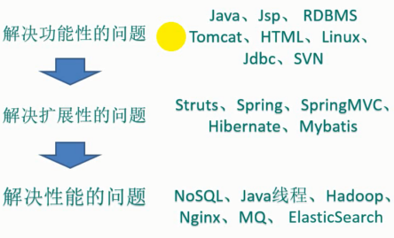
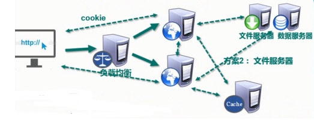
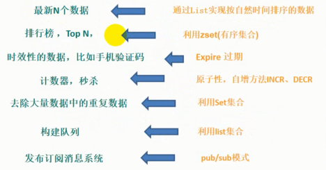
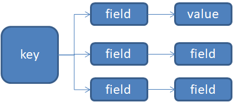
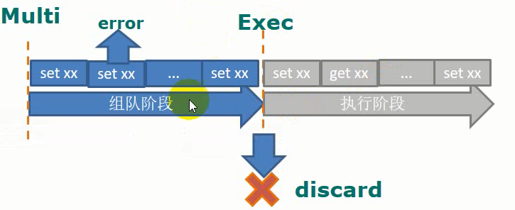
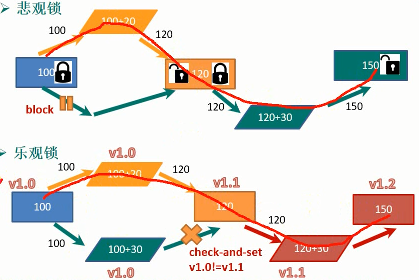
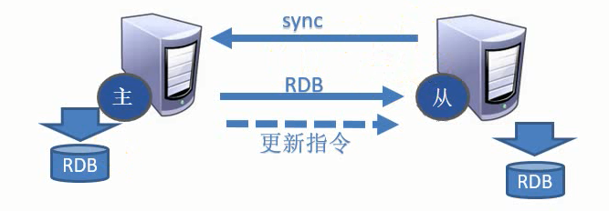

## redis



### 1.redis引入

为什么要redis？



​	随着数据量海量增加，所有互联网平台都面临挑战。

##### 解决服务器的CPU和内存的压力,负载均衡

解决方案：

1.存在cookie中

- 不安全
- 网络负担加重

2.文件服务器或者数据库

- 大量IO操作性能不好

3.session复制(tomcat等的官方解决方案，广播到整个集群)

- 节点数据冗余
- 节点越多浪费越大

4.缓存数据库

- 完全存在内存中速度快，
- 数据结构简单

##### 解决IO压力

基本读写比为：8:2

利用缓存解决读压力，可以对数据库本身进行优化


### 2.NoSQL介绍

not only sql（不仅仅是sql）泛指非关系型数据库

NoSQL不依赖业务逻辑方式存储，而是以简单的**key-value**模式存储，大大增加了数据库的扩展能力(用key-json存，随便加字段)

不支持ACID，不遵循SQL标准

远超SQL的性能 

#### 2.1NoSQL使用场景

- 对数据库并发的读写
- 海量数据的读写
- 对数据的高扩展性

#### 2.2NoSQL不适合场景

- 需要事务支持
- 基于sql的结构化查询存储，处理复杂关系，需要即席查询


------

#### 3 各种NoSQL

**Memcached**

- 数据都在内存中，不支持持久化
- 支持简单的key-value
- 一般作为缓存数据库辅助持久化的数据库

**Redis**

- 覆盖Memcached的绝大多数功能
- 数据存在内存中，支持持久化，主要是备份恢复
- 支持key-value，还是有其他多种数据结构list、set、hash、zset等
- 一般是作为缓存数据库辅助持久化的数据库

**mongoDB**

- 高性能、开源、shema free的文档型数据库
- 数据都在内存中，内存不足时，不常用的保存到硬盘中
- 为key-value(尤其是json)提供了丰富的查询功能
- 支持二进制数据及大型数据库
- 可以根据数据特点替代RDBMS，成为独立的数据库。或者配合RDBMS存储特定数据

**列式数据库**


列式数据库 --> OLAP 分析型处理

行式数据库 --> OLTP 事务性处理

#### HBASE

Hadoop中的数据库，对大量数据进行随机、实时的书写场景。可以处理庞大的表，使普通计算机具备处理超过billion级的行数据，而已处理数百万的列元素的数据表。

##### Cassandra

apache开源NoSQL使用庞大集群处理海量数据（PB）


------

### 4.Redis应用场景

高频次，热门访问数据，降低数据库IO

分布式架构做session共享

**多种功能场景**



#### 4.1redis安装

```shell
yum install redis
vim /etc/redis.conf
systemctl start redis
redis-cli
```

**二进制安装**

redis依赖gcc

1.make disclean再make 

2.make install

安装在了/usr/local/redis

3.复制redis.conf到上面的目录

##### redis常用命令

```shell
#redis默认有16个库0-15，其中默认连接0，切换使用select
select 1

#所有库使用同一密码管理

#查询匹配的key  key [pattern] 
key *
#判断key是否存在
exists k1
#删除key
del key
#时效性key  expire
expire k1 10
#ttl <key>判断key过期时间,-1代表永不过期，-2代表已经过期
ttl k1
#查看当前数据库的key的数量
dbsize
#清空当前和清空所有
flushdb
flushall
```

##### redis单线程+多路IO复用

单线程  --> 多线程+锁(memcached) --> 单线程+多路IO复用(redis)

多路io复用见引用

> https://www.cnblogs.com/aspirant/p/6877350.html?utm_source=itdadao&utm_medium=referral


------

### **5.Redis五大数据类型**

#### 5.1 String

介绍：

- String是二进制安全的，可以操作任何数据，比如jpg图片或者序列化对象
- String是Redis最基本的类型，一个Redis中字符串value最多512M

```shell
get <key>	#查询
set <key> <value> #设置或是覆盖
append <key> <value> #给定的<value>追加都原值的末尾
strlen <key> #获得值的长度
setnx <key> <value> #只有key不存在的时候才设置key值
incr <key>	+1，#只能操作数字或数值字符串，如果不存在设置为1
decr <key>	-1

mset <key1> <value1> <key2> <value2>...	#多设置
mget <key1> <key2> <key3>	#多获取
msetnx <key1> <value1> <key2> <value2>...	#（原子性）
getrange <key> <start> <end>	#包括头也包括尾
setrange <key> <start> <value>	#覆盖一段
setex <key> <过期时间>	#设置一个带过期时间的key（原子性）
getset <key> <value>	#以新换久，返回新
```


##### Redis的原子性

原子操作是指线程不会被调度机制打断，操作一旦开始就一直运行到结束。中间不会有context switch。

（1）在单线程中单条指令操作可以认为是原子性的

（2）多线程中，不能被其他进程（线程）打断的操作就叫原子操作

Redis的原子性得益于Redis是单线程+多路IO复用


#### 5.2 List

单键多列


List是一个双端队列，一个key代表的队列中放入多个value

```shell
lpush/rpush <key> <value1> <value2> <value3>
lpop/rpop <key>
rpoplpush <key1> <key2>	#一个列表右出到另一个列表的左（原子性）

lrange <key> <start> <end>	#end如果是-1表明取全集
lindex <key> <indext>
llen <key>
linsert l2 <before|after> <pivot> <value>
lrem <key> <n> <value>
```


#### 5.3 Hash

hash是一个键值对集合，适合存放值对象



存放值对象的问题：

1. json，每次都要序列化，读取要反序列化，改部分却要操作整体
2. custemer:01:name 对于string进行分割，不凡便维护
3. hash

```shell
hset <key> <field> <value>							#增加/赋值
hget <key> <field>									#查询field
hmset <key1> <field> <value> <key1> <field> <value>	#多增加/多设置
hsetnx <key> <field> <value>						#增加field-value
hexists <key> <field>								#field存在？
hkeys <key>											#获取key的field
hvals <key>											#获取key的val
hincrby <key> <field> <增加量>						  #field增加一个数量
```


#### 5.4 Set

无序不重复

```shell
sadd <key> <value1> <value2>	#增加
smembers <key>					#查询
sismenber <key> <value>			#查询是否有该元素

scard <key>						#返回集合元素个数
srem <key> <value1> <value2>	#删除某些元素
spop <key>						#随机取一个(随机是指不按存入顺序)		
srandmember						#随机取n个值

#集合操作
sinter <key1> <key2>			#返回两个的交集
sunion <key1> <key2>			#返回两个的并集
sdiff  <key1> <key2>			#此差集是key1 - key1&key2
```

#### 5.5 ZSet/SortedSet

 一个按score排序的Set


```shell
zadd <key> <score1> <value1> <score2> <value2>		#增加
zrange <key> <start> <stop> [withscores]		#获取一段,可以带score
zrangebyscore <key> <min> <max> [withscores]	#【min，max】由小->大
zrerangebycore <key> <min> <max> [withscores]	#【min，max】由大->小
zincrby <key> <increment> <value>				#为元素score增加
zrem <key> <value>								#移除
zcount <key> <min> <max>						#【min，max】元素个数
zrank <key> <value>								#一个元素的排名(0开始)
```

### 6.Redis配置文件

```shell
#1.ip绑定
bind 
#2.保护模式
protected-mod
#3.端口
port
#4.连接超时时间
timeout
#5.tcp存活时长，发心跳
tcp-keepalive
#6.后台运行
daemonize
#7.进程文件
pidfile
#8.password
requirepass
#9.最大连接数
maxclient
#10.最大memory
maxmemory
#11.淘汰策略
# volatile-lru -> remove the key with an expire set using an LRU algorithm
# allkeys-lru -> remove any key according to the LRU algorithm
# volatile-random -> remove a random key with an expire set
# allkeys-random -> remove a random key, any key
# volatile-ttl -> remove the key with the nearest expire time (minor TTL)
# noeviction -> don't expire at all, just return an error on write operations
maxmemory-policy
#12.丢弃选取样本数
maxmemory-samples
```


------

### 7.Redis事务

Redis事务是一个单独的隔离操作：事务的所有命令都会序列化按顺序来执行，事务在执行过程中，不会被其他客户端发的命令请求打断。

Redis事务是串联多个命令防止别的命令插队

**步骤**

1. Redis通过Multi命令开始将接下来的命令放入命令队列，但是并不会执行，
   - 命令会返回queue

2. 到输入Exec后Redis才会将之前的命令队列的命令依次执行。

组队过程可以由discard来放弃


事务的两种错误：

1. **组队阶段报错**

   事务命令入队时发现错误，整个事务执行时被取消



2. 执行阶段命令报错，除了本条以外其他正常执行，不会回滚。
  

#### 锁机制(悲观锁和乐观锁)



**悲观锁**（pessimistic lock）获取资源时认为会被并发修改，直接对数据上锁，其他线程向获取该数据资源就会block直到上线程释放资源。传统关系型数据库都是这种锁机制，表锁、行锁、读锁、写锁，都是在操作之前上锁

**乐观锁**CAS又称无锁，实际上它是在更新时判断其他线程有没有更新这个数据，可以使用版本号等机制。乐观锁适合多读的场景，可以提高并发性能。Redis就是通过CAS来实现事务的。

#### Redis锁机制

Redis就是通过CAS来实现事务的。

在multi开始事务组队之前先`watch <key1> [<key2> <key3>]`若执行前这些key被其他命令修改，那么事务将会被打断。

可以通过unwatch取消对所有key的监视。exec、discard不用显示uncatch


Redis事务的几个特性：

1. 单独的隔离操作
   - 事务所有命令会序列化按顺序执行，事务在执行过程中不会被打断
2. 没有隔离级别
   - 队列中的命令没有exec不会执行，就不存在事务中查询和事务外查询的问题
3. 不保证原子性
   - Redis如果执行过程中有命令失败，其他命令正常执行，没有回滚


------

### 8.Redis持久化

#### 8.1RBD

​	Redis DataBase会在指定的时间间隔内将数据集快照写入磁盘，也就是做Snapshot快照。恢复时是将快照文件读到内存中。

​	Redis单独创建(fork)一个子进程，将数据写入临时文件，在持久化结束后再用临时文件替换上次持久化好的文件。这种方式是一个全盘备份。主进程不进行IO操作确保极高的性能，在大规模备份且对数据完整性不敏感的情况下，RDB比AOF要更加高效。但是最后一次备份到下一次备份之间的数据可能会丢失。

> fork()会为父进程产生一个相同的子进程，子进程通过写时复制与父进程共享一段物理内存，只有在进程空间的内容要发生改变时才会将父进程的内容复制一份给子进程。

关于RBD的配置在SNAPSHOTING中

```shell
################################ SNAPSHOTTING  ################################
#
# Save the DB on disk:
#
#   save <seconds> <changes>
#
#   Will save the DB if both the given number of seconds and the given
#   number of write operations against the DB occurred.
#
#   In the example below the behaviour will be to save:
#   after 900 sec (15 min) if at least 1 key changed
#   after 300 sec (5 min) if at least 10 keys changed
#   after 60 sec if at least 10000 keys changed
#
#   Note: you can disable saving completely by commenting out all "save" lines.
#
#   It is also possible to remove all the previously configured save
#   points by adding a save directive with a single empty string argument
#   like in the following example:
#	
#   save ""

save 900 1
save 300 10
save 60 10000

# By default Redis will stop accepting writes if RDB snapshots are enabled
# (at least one save point) and the latest background save failed.
# This will make the user aware (in a hard way) that data is not persisting
# on disk properly, otherwise chances are that no one will notice and some
# disaster will happen.
#
# If the background saving process will start working again Redis will
# automatically allow writes again.
#
# However if you have setup your proper monitoring of the Redis server
# and persistence, you may want to disable this feature so that Redis will
# continue to work as usual even if there are problems with disk,
# permissions, and so forth.
stop-writes-on-bgsave-error yes

# Compress string objects using LZF when dump .rdb databases?
# For default that's set to 'yes' as it's almost always a win.
# If you want to save some CPU in the saving child set it to 'no' but
# the dataset will likely be bigger if you have compressible values or keys.
rdbcompression yes

# Since version 5 of RDB a CRC64 checksum is placed at the end of the file.
# This makes the format more resistant to corruption but there is a performance
# hit to pay (around 10%) when saving and loading RDB files, so you can disable it
# for maximum performances.
#
# RDB files created with checksum disabled have a checksum of zero that will
# tell the loading code to skip the check.
rdbchecksum yes

# rdb快照文件的名称
dbfilename dump.rdb

# rdb文件存放的路径
dir /var/lib/redis
```

手动存盘save,会在主进程执行，阻塞其他进程

| 优点         | 缺点                                     |
| ------------ | ---------------------------------------- |
| 节省磁盘空间 | fork虽然用了写时复制数据大时还是消耗性能 |
| 恢复快       | 备份间隔中的数据可能丢失                 |


#### 8.2AOF

aof和rbd不一致以aof为准。

以日志的形式来记录每个写操作。只允许追加文件不但可以改写文件，redis启动之初读文件重构数据。

AOF默认不开启，需要手动在配置文件中配置

```shell

############################## APPEND ONLY MODE ###############################
#是否开启aof
appendonly no
#aof文件名
appendfilename "appendonly.aof"
#aof同步方式
# appendfsync always
appendfsync everysec
# appendfsync no
```

AOF采用文件追加的方式来写文件当文件过大超过设定阈值，会启动AOF文件内容压缩，只保留恢复数据的最小指令集，可以使用命令bgrewriteaof。

首先fork一个新进程，将文件重写如一个临时文件，遍历新进程的内存中数据每一条一个set语句。

| 优点                                                      | 缺点                                                |
| --------------------------------------------------------- | --------------------------------------------------- |
| 备注稳定，丢失数据更低(appendfsync everysec,丢失缓存中1s) | 比RDB占用更多的磁盘空间                             |
| 可读日志文本，可以处理误操作                              | 恢复速度慢                                          |
|                                                           | 每次读写都同步，性能压力比较大                      |
|                                                           | 官方生成在高频写入的情况下存在一点的bug造成不能恢复 |

- 在数据不敏感的情况下，可以单独用RDB

- 不建议单独用AOF，存在bug

- 如果纯内存缓存可以都不用

------

### 9.Redis主从复制

主机数据更新后根据策略更新到从机，master/slave模式下，master以写为主，slave以读为主

- 读写分离
- 容灾与快速恢复

```shell
include /etc/redis.conf

port 6379
pidfile /var/run/redis_6379.pid
dbfilname dump6379.rdb

slave-priority <num>
```


配从不配主

使用命令或者使用配置文件，命令只是当前进程有效

```shell
slaveof <host> <port>
#恢复命令为 slaveof no one
```

##### 主从复制的原理



1. 从机联通想主机发sync指令

2. 主机立刻存盘发RDB文件给从机
3. 从机收到RDB文件进行全盘加载
4. 之后主机写操作发给从机执行相同指令

另外为了减轻主机的压力可以让从机中转信息，做其他机器的主机，使用树状结构


##### 哨兵模式（sentinal）

监控主机是否故障，根据投票数自动将从库转为主库。


```
#在目录中新建sentinel.conf文件
#在配置文件中写入
sentinel monitor <主机名称> <IP> <PORT> <NUM>
```

上面的NUM是指定需要多少个哨兵同意切换主机才能开始切换。

1. 切换主机

   - 选择条件：优先级 > 偏移量(获取主机的key数量) > runid（随机生成）

2. 从机跟随

   - sentinel向原主服务的其他从服务发slaveof

3. 旧主跟随

   - 旧主机上线，sentinel会向其发slaveof指令

   **使用主从复制集群时java使用哨兵池**

   ```java
   //单例模式之双重验证锁
   public static JedisSentinelPool getJedisSentinelPool() {
       if (null==jedisSentinelPool){
           synchronized (JedisPoolUtil.class){
               if (null==jedisSentinelPool){
                   JedisPoolConfig config = new JedisPoolConfig();
                   config.setMaxTotal(200);//最大连接数
                   config.setMaxIdle(32);//最大空闲连接
                   config.setMaxIdle(100*1000);//阻塞等到的最长时间
                   config.setTestOnBorrow(true);//长时间不访问连接被jedis断开，但是连接池中该对象仍存在，测试下再用
                   Set<String> set = new HashSet<>();
                   set.add("192.168.15.132:26379");
   
                   jedisSentinelPool = new JedisSentinelPool("mymaster",set,config);
               }
           }
       }
       return jedisSentinelPool;
   }
   ```

------

### 10.Redis集群

```
1.安装ruby环境
2.安装redis-x.x.x.gem
	gem install --local redis-3.2.0.gem
```

3.修改配置文件

```
include /etc/redis.conf

port 6379
pidfile /var/run/redis_6379.pid
dbfilname dump6379.rdb
cluster-enabled yes
cluster-config-file <node-6379.conf>
cluster-node-timeout 15000
```

4.启动多个redis

5.找到reids-trib.rb，执行以下命令建立集群

```shell
./redis-trib.rb create --replicas 1 192.168.15.132:6379 192.168.15.132:6380 192.168.15.132:6381 192.168.15.132:6389 192.168.15.132:6390 192.168.15.132:6391
```

注意：

1. 一个集群至少3个主节点
2. 选项`--replicas 1`表明我们希望每个主节点创建一个从节点
3. 分配原则劲量保证每个主数据库运行在不同ip，主从在不同IP

##### 什么是slots

一个集群由16384个插槽（hash slot），每个数据库中的键都属于这16384个插槽，集群使用CRC16(key)%16384来确定插槽。

每个节点负责处理一部分插槽

**集群使用注意**

```
1. 使用redis -c来处理，不然不负责改slot的节点上操作会直接报错
2. 由于redis操作是原子性的，mset操作的key在不同节点会报错
	使用花括号mset k1{customer} v1 k2{customer} v2
3. 集群会互相监控，在master down后其从机会产生master，旧有的master上限会变为已有新master 的slave节点
4. cluster-require-full-coverage的yes/no决定在slot不能全覆盖整个集群是否还能工作
```

操作集群使用

```java
Set<HostAndPort> set=new HashSet<HostAndPort>();
set.add(new HostAndPort("192.168.15.132","6379"));
JedisCluster  = new JedisCluster(set);
jedisCluster.set("k1","v1");
System.out.println(jedisCluster.get("k1"));
```

集群的优缺点

优点：

- 实现扩容
- 分摊压力
- 无中心配置

Redis集群不足之处：

- 多键操作不被支持(mset)
- 多键Redis事务不被支持。lua脚本不支持


### 12 redis远程访问

```sh
bind 0.0.0.0

#如果为yes，对应配置密码  requirepass
protected-mode no
```

关闭防火墙 iptables

```shell
systemctl stop iptables.service

systemctl stop firewalld.service             #停止firewall
systemctl disable firewalld.service          #禁止firewall开机启动
```

**有关iptables的安装**

yum install -y iptables-services         #安装iptables
vim /etc/sysconfig/iptables               #编辑防火墙配置文件
*filter

:INPUT ACCEPT [0:0]
:FORWARD ACCEPT [0:0]
:OUTPUT ACCEPT [0:0]
-A INPUT -m state --state RELATED,ESTABLISHED -j ACCEPT
-A INPUT -p icmp -j ACCEPT
-A INPUT -i lo -j ACCEPT
-A INPUT -p tcp -m state --state NEW -m tcp --dport 22 -j ACCEPT
-A INPUT -p tcp -m state --state NEW -m tcp --dport 80 -j ACCEPT
-A INPUT -j REJECT --reject-with icmp-host-prohibited
-A FORWARD -j REJECT --reject-with icmp-host-prohibited
COMMIT

保存退出

3、重启防火墙
systemctl restart iptables.service      #最后重启防火墙使配置生效
systemctl enable iptables.service     #设置防火墙开机启动

4、其他相关命令
systemctl disable iptables     #禁止iptables服务
systemctl stop iptables         #暂停服务
systemctl enable iptables     #解除禁止iptables
systemctl start iptables         #开启服务

service iptables save       #因为已经添加iptables服务，故该命令可以运行；若没有之前的添加服务则不能运行
service iptables status     #查看iptables服务状态

