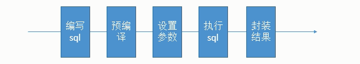
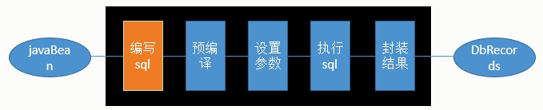
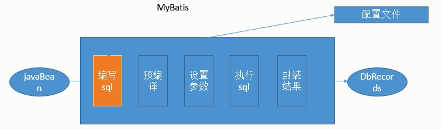

## Day1

> SSH SSM/SSI 三层结构 web service dao
>
>
> struts2/servlet spring hibernate
>
> springmvc spring mybatis
>
> 1.jdbc编程以及存在的问题
>
> 	* jdbc的操作步骤（DriverManger、Connection、Statement、ResultSet）
> 	* jdbc存在的问题（大量硬编码、占位符参数设置、结果集封装处理）
>
> 2.mybatis的入门案例
>
> 3.mybatis的开发模式（两种）
> ​	* 基于实现类的方法开发
> ​	* 基于接口代理的方式开发（官方推荐）
> ​		* 映射文件和接口必须放在同一目录下
> ​		* 映射文件和接口文件名必须一致
> ​		* 映射文件中的namespace必须为接口全类名
> ​		* 接口中的方法必须与映射文件中的sqlID一致
> ​		* mybatis核心配置文件中mapper映射为接口的全类名
>
> 4.mybatis的核心配置详解
> ​	* properties 属性
> ​	* typeAliases 类型别名
> ​	* mappers 映射器


## Day2

>1.输入映射（将数据映射到SQL语句的占位符中）
>* 通过包装参数实现数据库的查询操作
>* 课下深刻理解 传入参数如果是多个？（接口中方法的参数全部都是输入映射）
>
>2.输出映射（将结果集数据映射到Java对象中）
>
>* 实现简单数据类型的查询
>* 查询订单列表
>	* 注意：数据库中的列名与Java实体类中的属性不一致
>	* 解决方案有两种：
>		第一种：在sql语句中给字段取别名
>		第二种：使用resultMap来实现映射
>
>3.动态SQL拼接（其实就是一个拼接字符串的过程）
>* 动态sql之if判断
>
>* 动态sql之where标签
>* 动态sql之foreach标签
>* 动态sql之sql片段
>
>4.mybatis的一对一关联查询
>* Wife selectWifeByPrimaryKey(Integer wid);
>	* 根据主键查询Wife信息，同时查询出对应的Husband信息
>	* 不能将结果完全封装到Wife中
>
>
>* WifeExtrad selectWifeExtradByPrimaryKey(Integer wid);
>* 根据主键查询WifeExtrad信息，WifeExtrad对象包含Wife、Husband信息
>* 可以将结果完全封装到WifeExtrad中，不过比较麻烦
>
>* Wife selectWifeByPK(Integer wid);
>* 根据主键查询Wife信息，同时查询出对应的Husband信息
>* 配置Wife与结果集的映射关系
>
>5.mybatis的一对多关联查询
>
>6.mybatis的逆向工程
>
>7.动态代理

**封装对象(对象中封装其他对象)在SQL中的使用**

在xml中可以这样写直接使用封装对象中的对应对象`field.属性`.

	<select id="selectList" parameterType="cn.itcast.mybatis.pojo.QueryVo"
		resultType="cn.itcast.mybatis.pojo.User">
		select * from user u where u.username=#{user.username}
	</select>


### 1. Mybatis（ibatis）引入

Mybatis是一个半自动化的ORM框架(整体解决方案)，原本dao技术如下

由jdbc -> Dbutils（QueryRunner）-> jdbcTemplate（spring）

- sql在java代码中硬编码，sql变化时修改频繁



**Hibernate的问题**

hibernate是一个全自动的ORM框架，旨在消除sql。可以使用HQL进行sql定制。

- 希望sql由开发人员自己写，sql灵活性。Hibernate内部自动产生sql不容易优化
- Hibernate是全映射，一次会映射全部的对应关系。大量pojo字段进行部分映射困难，导致数据库性能下降



Mybatis将sql写入mapper配置文件中，这样实现了Sql与java编码的分离，sql交由开发人员控制更加灵活。




------

### 2.Mybatis的使用流程

```java
1.准备xml配置文件（全局配置文件SqlMapConfig.xml）
	数据库连接池信息，事务管理器信息，注册mapper信息...
2.sql映射文件准备：配置sql与sql的封装映射规则
3.将sql映射文件注册在全局配置文件中
4.java代码完善
	1）创建SqlSessionFactoryBuidler
	2）通过流对象读入全局配置文件，由SqlSessionFactoryBuidler.build创建SqlSessionFactory
	3）SqlSessionFactory.open创建SqlSession
	4）通过SqlSession执行sql(都在mapper文件中)，对数据库修改的要commit
```


------

### 3.Mybatis接口式编程

 **基于接口代理的方式开发（官方推荐），需要注意以下几点**

1. 映射文件和接口必须放在同一目录下

2. 映射文件和接口文件名必须一致
3. 映射文件中的namespace必须为接口全类名
4. 接口中的方法必须与映射文件中的sqlID一致
5. mybatis核心配置文件中mapper映射为接口的全类名

一个实例

准备好javabean，创建接口，准备好映射文件`WifeMapper.xml`保证两者名称一致。namespace为接口全类名，标签id为接口中方法，放在同一个文件夹下

```xml
<?xml version="1.0" encoding="UTF-8" ?>
<!DOCTYPE mapper
        PUBLIC "-//mybatis.org//DTD Mapper 3.0//EN"
        "http://mybatis.org/dtd/mybatis-3-mapper.dtd">
<mapper namespace="cn.itcast.mybatis.d_one2one.WifeMapper">
    <select id="selectWifeById" parameterType="int" resultType="cn.itcast.mybatis.pojo.one2one.Wife">
        select * from wife w,husband h
        <where>
            w.hid = h.hid and wid=#{value}
        </where>
    </select>
    
    <resultMap id="wifeWithHusband" type="cn.itcast.mybatis.pojo.one2one.Wife">
        <id column="wid" property="wid"></id>
        <!--<result column="wname" property="wname"></result>-->
        <association property="husband" javaType="cn.itcast.mybatis.pojo.one2one.Husband">
            <id column="hid" property="hid"></id>
            <result column="hname" property="hname"></result>
        </association>
    </resultMap>

    <select id="selectWifeWithHusband" parameterType="int" resultMap="wifeWithHusband">
        select * from wife w,husband h where w.hid=h.hid and w.wid=#{value}
    </select>
</mapper>
```

```java
package cn.itcast.mybatis.d_one2one;

import cn.itcast.mybatis.pojo.one2one.Wife;

public interface WifeMapper {
    Wife selectWifeById(Integer i);

    Wife selectWifeWithHusband(Integer i);
}
```

在核心配置文件中注册,这里采用包扫描的方式

```xml
<mappers>
	<package name="cn.itcast.mybatis" />
</mappers>
```

**使用**

通过SqlSession对象的getMapper获取在核心配置文件中注册好的接口，生成其实现类

```java
SqlSession sqlSession = build.openSession();//build是一个SqlSessionFactory实例
WifeMapper wifeMapper = sqlSession.getMapper(WifeMapper.class);//获取代理对象

System.out.println(wifeMapper.selectWifeWithHusband(1));
sqlSession.close();
```


------

### 4.Mybatis全局配置文件

MyBatis 的配置文件包含了会深深影响 MyBatis 行为的设置（settings）和属性（properties）信息。文档的顶层结构如下：

- configuration 配置            
  - [properties 属性](http://www.mybatis.org/mybatis-3/zh/configuration.html#properties)
  - [settings 设置](http://www.mybatis.org/mybatis-3/zh/configuration.html#settings)
  - [typeAliases 类型别名](http://www.mybatis.org/mybatis-3/zh/configuration.html#typeAliases)
  - [typeHandlers 类型处理器](http://www.mybatis.org/mybatis-3/zh/configuration.html#typeHandlers)
  - [objectFactory 对象工厂](http://www.mybatis.org/mybatis-3/zh/configuration.html#objectFactory)
  - [plugins 插件](http://www.mybatis.org/mybatis-3/zh/configuration.html#plugins)
  - environments 环境
    - environment 环境变量                    
      - transactionManager 事务管理器
      - dataSource 数据源
  - [databaseIdProvider 数据库厂商标识](http://www.mybatis.org/mybatis-3/zh/configuration.html#databaseIdProvider)
  - [mappers 映射器](http://www.mybatis.org/mybatis-3/zh/configuration.html#mappers)

#### 4.1引入dtd约束文件

SqlMapConfig和mapper的dtd约束如下，在联网状态下可以直接使用，也可以下载到本地关联

```
http://mybatis.org/dtd/mybatis-3-config.dtd
http://mybatis.org/dtd/mybatis-3-mapper.dtd
```

#### 4.2 properties

这些属性都是可外部配置且可动态替换的，既可以在典型的 Java  properties文件中配置，亦可通过 properties 元素的子元素来传递。resource引入类路径下的资源，url引入网络路径或磁盘路径下的资源。

```xml
<properties resource="org/mybatis/example/config.properties">
  <property name="username" value="dev_user"/>
  <property name="password" value="F2Fa3!33TYyg"/>
</properties>

<-然后其中的属性就可以在整个配置文件中被用来替换需要动态配置的属性值。比如:->
    
<dataSource type="POOLED">
  <property name="driver" value="${driver}"/>
  <property name="url" value="${url}"/>
  <property name="username" value="${username}"/>
  <property name="password" value="${password}"/>
</dataSource>
```

#### 4.3 settings

这是 MyBatis 中极为重要的调整设置，它们会改变 MyBatis 的运行时行为。


|设置参数|描述|有效值|有效值|
| ------------------------ | ------------------------------------------------------------ | ------------- | ----- |
| mapUnderscoreToCamelCase | 是否开启自动驼峰命名规则（camel case）映射，即从经典数据库列名 A_COLUMN 到经典 Java 属性名 aColumn 的类似映射。 | true \| false | False |

#### 4.4 typeAliases

类型别名是为 Java 类型设置一个短的名字。它只和 XML 配置有关，存在的意义仅在于用来减少类完全限定名的冗余。

```xml
<typeAliases>
  <typeAlias alias="Author" type="domain.blog.Author"/>
  <typeAlias alias="Blog" type="domain.blog.Blog"/>
  <typeAlias alias="Comment" type="domain.blog.Comment"/>
  <typeAlias alias="Post" type="domain.blog.Post"/>
  <typeAlias alias="Section" type="domain.blog.Section"/>
  <typeAlias alias="Tag" type="domain.blog.Tag"/>
</typeAliases>
```

当这样配置时，`Blog`可以用在任何使用`domain.blog.Blog`的地方。

也可以指定一个包名，MyBatis 会在包名下面搜索需要的 Java Bean，比如:         

```xml
<typeAliases>
  <package name="domain.blog"/>
</typeAliases>
```

每一个在包 `domain.blog` 中的 Java Bean，在没有注解的情况下，会使用 Bean 的首字母小写的非限定类名来作为它的别名。比如 `domain.blog.Author` 的别名为 `author`；若有注解，则别名为其注解值。看下面的例子：

```xml
@Alias("author")
public class Author {
    ...
}
```

#### 4.5 typeHandlers

无论是 MyBatis 在预处理语句（PreparedStatement）中设置一个参数时，还是从结果集中取出一个值时，
都会用类型处理器将获取的值以合适的方式转换成 Java 类型。

#### 4.6 插件（plugins）

MyBatis 允许你在已映射语句执行过程中的某一点进行拦截调用。

- Executo(update, query, flushStatements, commit, rollback, getTransaction, close, isClosed)           
- ParameterHandler             (getParameterObject, setParameters)           
- ResultSetHandler             (handleResultSets, handleOutputParameters)           
- StatementHandler             (prepare, parameterize, batch, update, query)           

#### 4.7 配置环境（environments）

MyBatis 可以配置成适应多种环境，这种机制有助于将 SQL 映射应用于多种数据库之中，           现实情况下有多种理由需要这么做。例如，开发、测试和生产环境需要有不同的配置；或者共享相同 Schema 的多个生产数据库，想使用相同的 SQL 映射。许多类似的用例。

**不过要记住：尽管可以配置多个环境，每个 SqlSessionFactory 实例只能选择其一。**         

所以，如果你想连接两个数据库，就需要创建两个 SqlSessionFactory 实例，每个数据库对应一个。而如果是三个数据库，就需要三个实例，依此类推，记起来很简单：         

- **每个数据库对应一个 SqlSessionFactory 实例**                        

为了指定创建哪种环境，只要将它作为可选的参数传递给 SqlSessionFactoryBuilder 即可。

```
<environments default="development">
  <environment id="development">
    <transactionManager type="JDBC">
      <property name="..." value="..."/>
    </transactionManager>
    <dataSource type="POOLED">
      <property name="driver" value="${driver}"/>
      <property name="url" value="${url}"/>
      <property name="username" value="${username}"/>
      <property name="password" value="${password}"/>
    </dataSource>
  </environment>
</environments>
```

 注意这里的关键点:         

- 默认的环境 ID（比如:default="development"）。           
- 每个 environment 元素定义的环境 ID（比如:id="development"）。           
- 事务管理器的配置（比如:type="JDBC"）。           
- 数据源的配置（比如:type="POOLED"）。           

默认的环境和环境 ID 是自解释的，因此一目了然。你可以对环境随意命名，但一定要保证默认的环境 ID 要匹配其中一个环境 ID。         

#### 4.8 事务管理器

在 MyBatis 中有两种类型的事务管理器（也就是 type=”[JDBC|MANAGED]”)

如果你正在使用 Spring + MyBatis，则没有必要配置事务管理器，因为 Spring 模块会使用自带的管理器来覆盖前面的配置。

#### **4.9 数据源（dataSource）**

有三种内建的数据源类型（也就是 type=”[UNPOOLED|POOLED|JNDI]”）：

- **UNPOOLED**– 这个数据源的实现只是每次被请求时打开和关闭连接。
- **POOLED**– 这种数据源的实现利用“池”的概念将 JDBC 连接对象组织起来，避免了创建新的连接实例时所必需的初始化和认证时间。
- **JNDI** – 这个数据源的实现是为了能在如 EJB 或应用服务器这类容器中使用，容器可以集中或在外部配置数据源，然后放置一个 JNDI 上下文的引用。

#### 4.10 映射器（mappers）

既然 MyBatis 的行为已经由上述元素配置完了，我们现在就要定义 SQL 映射语句了。但是首先我们需要告诉 MyBatis 到哪里去找到这些语句。           Java 在自动查找这方面没有提供一个很好的方法，所以最佳的方式是告诉 MyBatis 到哪里去找映射文件。

```xml
<!-- 使用相对于类路径的资源引用 -->
<mappers>
  <mapper resource="org/mybatis/builder/AuthorMapper.xml"/>
  <mapper resource="org/mybatis/builder/BlogMapper.xml"/>
  <mapper resource="org/mybatis/builder/PostMapper.xml"/>
</mappers>
<!-- 使用完全限定资源定位符（URL） -->
<mappers>
  <mapper url="file:///var/mappers/AuthorMapper.xml"/>
  <mapper url="file:///var/mappers/BlogMapper.xml"/>
  <mapper url="file:///var/mappers/PostMapper.xml"/>
</mappers>
<!-- 使用映射器接口实现类的完全限定类名 -->
<!-- 多用注册基于注解的 -->
<mappers>
  <mapper class="org.mybatis.builder.AuthorMapper"/>
  <mapper class="org.mybatis.builder.BlogMapper"/>
  <mapper class="org.mybatis.builder.PostMapper"/>
</mappers>
<!-- 将包内的映射器接口实现全部注册为映射器 -->
<!-- 批量注册在使用接口式编程这个用的多 -->
<mappers>
  <package name="org.mybatis.builder"/>
</mappers>
```


------

### 5.映射文件

5.1 映射文件中的CRUD

```xml
<select id="getEmpById" resultType="com.atguigu.mybatis.bean.Employee"
		databaseId="oracle">
		select EMPLOYEE_ID id,LAST_NAME	lastName,EMAIL email 
		from employees where EMPLOYEE_ID=#{id}
	</select>
	
	<!-- public void addEmp(Employee employee); -->
	<!-- parameterType：参数类型，可以省略， 
	获取自增主键的值：
		mysql支持自增主键，自增主键值的获取，mybatis也是利用statement.getGenreatedKeys()；
		useGeneratedKeys="true"；使用自增主键获取主键值策略
		keyProperty；指定对应的主键属性，也就是mybatis获取到主键值以后，将这个值封装给javaBean的哪个属性
	-->
	<insert id="addEmp" parameterType="com.atguigu.mybatis.bean.Employee"
		useGeneratedKeys="true" keyProperty="id" databaseId="mysql">
		insert into tbl_employee(last_name,email,gender) 
		values(#{lastName},#{email},#{gender})
	</insert>
	
	<!-- 
	获取非自增主键的值：
		Oracle不支持自增；Oracle使用序列来模拟自增；
		每次插入的数据的主键是从序列中拿到的值；如何获取到这个值；
	 -->
	<insert id="addEmp" databaseId="oracle">
		<!-- 
		keyProperty:查出的主键值封装给javaBean的哪个属性
		order="BEFORE":当前sql在插入sql之前运行
			   AFTER：当前sql在插入sql之后运行
		resultType:查出的数据的返回值类型
		
		BEFORE运行顺序：
			先运行selectKey查询id的sql；查出id值封装给javaBean的id属性
			在运行插入的sql；就可以取出id属性对应的值
		AFTER运行顺序：
			先运行插入的sql（从序列中取出新值作为id）；
			再运行selectKey查询id的sql；
		 -->
		<selectKey keyProperty="id" order="BEFORE" resultType="Integer">
			<!-- 编写查询主键的sql语句 -->
			<!-- BEFORE-->
			select EMPLOYEES_SEQ.nextval from dual 
			<!-- AFTER：
			 select EMPLOYEES_SEQ.currval from dual -->
		</selectKey>
		
		<!-- 插入时的主键是从序列中拿到的 -->
		<!-- BEFORE:-->
		insert into employees(EMPLOYEE_ID,LAST_NAME,EMAIL) 
		values(#{id},#{lastName},#{email<!-- ,jdbcType=NULL -->}) 
		<!-- AFTER：
		insert into employees(EMPLOYEE_ID,LAST_NAME,EMAIL) 
		values(employees_seq.nextval,#{lastName},#{email}) -->
	</insert>
	
	<!-- public void updateEmp(Employee employee);  -->
	<update id="updateEmp">
		update tbl_employee 
		set last_name=#{lastName},email=#{email},gender=#{gender}
		where id=#{id}
	</update>
	
	<!-- public void deleteEmpById(Integer id); -->
	<delete id="deleteEmpById">
		delete from tbl_employee where id=#{id}
	</delete>
```

### 6.参数处理

**单个参数**：mybatis不会做特殊处理，

- {参数名/任意名}：取出参数值。


**多个参数**：mybatis会做特殊处理。

- 多个参数会被封装成 一个map，

  - key：param1...paramN,或者参数的索引也可以
  - value：传入的参数值
    - `#{}`就是从map中获取指定的key的值；

  异常：
  org.apache.ibatis.binding.BindingException: 
  Parameter 'id' not found. 
  Available parameters are [1, 0, param1, param2]
  操作：
  ​	方法：public Employee getEmpByIdAndLastName(Integer id,String lastName);
  ​	取值：#{id},#{lastName}

【**命名参数**】：明确指定封装参数时map的key；@Param("id")
​	多个参数会被封装成 一个map，
​		key：使用@Param注解指定的值
​		value：参数值
​	#{指定的key}取出对应的参数值


#### 6.1 参数封装的流程：

```java
========================结合源码，mybatis怎么处理参数==========================
总结：参数多时会封装map，为了不混乱，我们可以使用@Param来指定封装时使用的key；
#{key}就可以取出map中的值；

(@Param("id")Integer id,@Param("lastName")String lastName);
ParamNameResolver解析参数封装map的；
//1、names：{0=id, 1=lastName}；构造器的时候就确定好了

	确定流程：
	1.获取每个标了param注解的参数的@Param的值：id，lastName；  赋值给name;
	2.每次解析一个参数给map中保存信息：（key：参数索引，value：name的值）
		name的值：
			标注了param注解：注解的值
			没有标注：
				1.全局配置：useActualParamName（jdk1.8）：name=参数名
				2.name=map.size()；相当于当前元素的索引
	{0=id, 1=lastName,2=2}
				

//args【1，"Tom",'hello'】:

public Object getNamedParams(Object[] args) {
    final int paramCount = names.size();
    //1、参数为null直接返回
    if (args == null || paramCount == 0) {
      return null;
     
    //2、如果只有一个元素，并且没有Param注解；args[0]：单个参数直接返回
    } else if (!hasParamAnnotation && paramCount == 1) {
      return args[names.firstKey()];
      
    //3、多个元素或者有Param标注
    } else {
      final Map<String, Object> param = new ParamMap<Object>();
      int i = 0;
      
      //4、遍历names集合；{0=id, 1=lastName,2=2}
      for (Map.Entry<Integer, String> entry : names.entrySet()) {
      
      	//names集合的value作为key;  names集合的key又作为取值的参考args[0]:args【1，"Tom"】:
      	//eg:{id=args[0]:1,lastName=args[1]:Tom,2=args[2]}
        param.put(entry.getValue(), args[entry.getKey()]);
        
        
        // add generic param names (param1, param2, ...)param
        //额外的将每一个参数也保存到map中，使用新的key：param1...paramN
        //效果：有Param注解可以#{指定的key}，或者#{param1}
        final String genericParamName = GENERIC_NAME_PREFIX + String.valueOf(i + 1);
        // ensure not to overwrite parameter named with @Param
        if (!names.containsValue(genericParamName)) {
          param.put(genericParamName, args[entry.getKey()]);
        }
        i++;
      }
      return param;
    }
  }
}
```


#### 6.2 参数获取(**`$()`**与**`#()`**)

**`#{}`**:是以预编译的形式，将参数设置到sql语句中；PreparedStatement；防止sql注入
**`${}`**:取出的值直接拼装在sql语句中；会有安全问题； 

大多情况下使用**`#{}`**，但是对于一些信息原生的不支持占位符的地方就使用**`${}`**

```sql
select * from user where address like '%${value}%'

select * from ${year}_salary where xxx;

select * from tbl_employee order by ${f_name} ${order}
```

**`#{}`**:更丰富的用法：

规定参数的一些规则：
​	javaType、 jdbcType、 mode（存储过程）、 numericScale、
​	resultMap、 typeHandler、 jdbcTypeName、 expression（未来准备支持的功能）；

jdbcType通常需要在某种特定的条件下被设置：

​	在我们数据为null的时候，有些数据库可能不能识别mybatis对null的默认处理。比如Oracle（报错）；
​	JdbcType OTHER：无效的类型；因为mybatis对所有的null都映射的是原生Jdbc的OTHER类型，oracle不能正确处理;

由于全局配置中：jdbcTypeForNull=OTHER；oracle不支持；两种办法
​		1、#{email,jdbcType=OTHER};
​		2、jdbcTypeForNull=NULL

```
<setting name="jdbcTypeForNull" value="NULL"/>
```


7.select