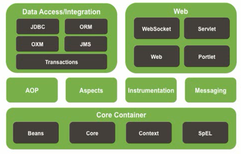
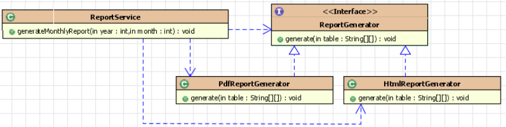
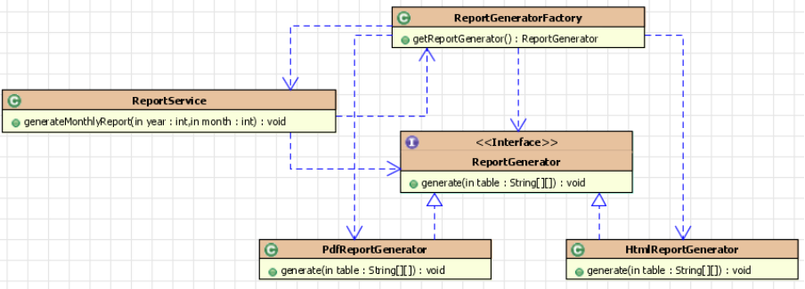
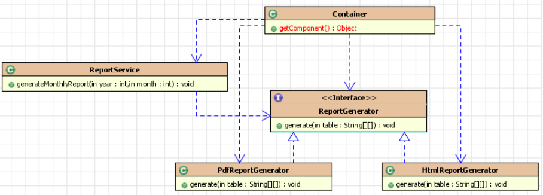
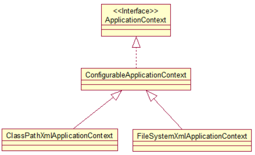
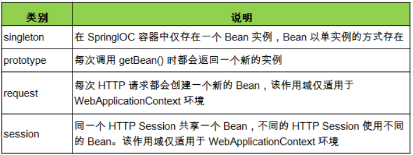
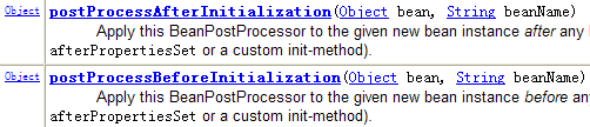
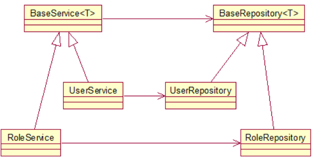
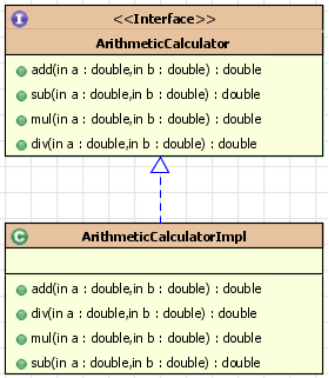
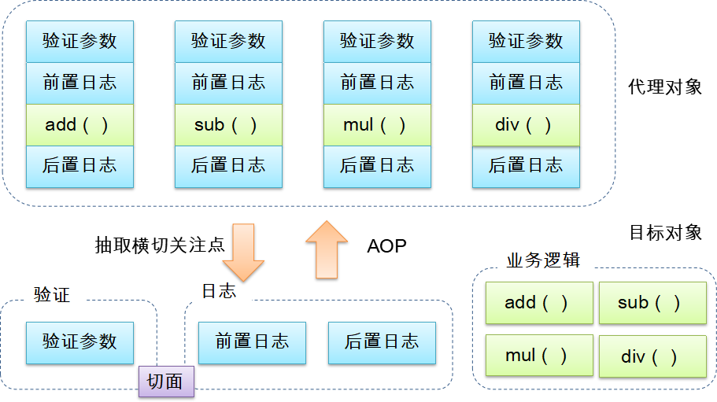

## Spring

Spring是一个开源框架，为简化企业级应用开发而生。使用spring可以用简单的JavaBean实现以前只有EJB才能实现的功能，它是一个`IOC`(DI)和`AOP`容器框架。

- 轻量级：Spring是非侵入性的
- 依赖注入
- 面向切面编程
- 容器
- 一站式框架



### 1. IOC和DI

**IOC(Inversion of Control)**:反转资源获取的方向。

传统的资源查找方式要求组件向容器发起请求查找资源. 作为回应, 容器适时的返回资源. 

IOC 则是容器主动地将资源推送给它所管理的组件, 组件所要做的仅是选择一种合适的方式来接受资源. 这种行为也被称为查找的被动形式

**DI(Dependency Injection)** — IOC 的另一种表述方式：即组件以一些预先定义好的方式(例如: setter 方法)接受来自如容器的资源注入. 


#### 1.1 IOC的由来

##### 1.1.1 分离接口与实现类




生成 HTML 或 PDF 格式的不同类型的报表，在Service中对接口与具体实现类产生依赖。

##### 1.1.2 工厂模式



##### 1.1.3 控制反转



#### 1.2 Spring配置Bean

> 配置 bean
> 配置形式：基于 XML 文件的方式；基于注解的方式
> Bean 的配置方式：通过全类名（反射）、通过工厂方法（静态工厂方法 & 实例工厂方法）、FactoryBean
> IOC 容器 BeanFactory & ApplicationContext 概述
> 依赖注入的方式：属性注入；构造器注入
> 注入属性值细节
> 自动转配
> bean 之间的关系：继承；依赖
> bean 的作用域：singleton；prototype；WEB 环境作用域
> 使用外部属性文件
> spEL 
> IOC 容器中 Bean 的生命周期
> Spring 4.x 新特性：泛型依赖注入

在 xml 文件中通过 bean 节点来配置 bean

```xml
<bean id="helloWorld" class="com.wxy.spring.bean.HelloWorld">
    <property name="username" value="spring"></property>
</bean>
```

id：Bean 的名称。

- 在 IOC 容器中必须是唯一的
- 若 id 没有指定，Spring 自动将权限定性类名作为 Bean 的名字
- id 可以指定多个名字，名字之间可用逗号、分号、或空格分隔

 

```java
ApplicationContext ctx = new ClassPathXmlApplicationContext("applicationContext.xml");
```

在 Spring IOC 容器读取 Bean 配置创建 Bean 实例之前, 必须对它进行实例化. 只有在容器实例化后, 才可以从 IOC容器里获取 Bean 实例并使用.
Spring 提供了两种类型的 IOC 容器实现. 

- BeanFactory: IOC 容器的基本实现.
- ApplicationContext: 提供了更多的高级特性. 是 BeanFactory 的子接口.

BeanFactory 是 Spring 框架的基础设施，面向 Spring 本身；
ApplicationContext 面向使用 Spring 框架的开发者，几乎所有的应用场合都直接使用 ApplicationContext 而非底层的 BeanFactory;
无论使用何种方式, 配置文件时相同的.

ApplicationContext 的主要实现类：

- ClassPathXmlApplicationContext：从 类路径下加载配置文件
- FileSystemXmlApplicationContext: 从文件系统中加载配置文件



ConfigurableApplicationContext 扩展于 ApplicationContext，新增加两个主要方法：refresh() 和 close()， 让 ApplicationContext 具有启动、刷新和关闭上下文的能力

ApplicationContext 在初始化上下文时就实例化所有单例的 Bean

WebApplicationContext 是专门为 WEB 应用而准备的，它允许从相对于 WEB 根目录的路径中完成初始化工作

#### 1.3 依赖注入的3种方式

1. 属性注入
2. 构造器注入
3. 工厂方法注入

**`属性注入`**：属性注入即通过 `setter` 方法注入Bean 的属性值或依赖的对象

属性注入使用 <property> 元素, 使用 name 属性指定 Bean 的属性名称，value 属性或 <value> 子节点指定属性值 ，属性注入是实际应用中最常用的注入方式

```xml
<property name="username" value="spring"></property>
```

使用**index**和**type**指定参数位置和类型区分重载构造器。

**`构造器注入`**:通过构造方法注入Bean 的属性值或依赖的对象，它保证了 Bean 实例在实例化后就可以使用。

如果存在特殊字符可以使用CDATA包裹

```xml
<constructor-arg type="java.lang.String">
	<value><![CDATA[<Shanghai^>]]></value>
</constructor-arg>
```

###### 引用其他bean使用`ref`，可使用内部bean

```xml
<property name="dao" ref="dao5"></property>

<!-- 声明使用内部 bean -->
<bean id="service2" class="com.atguigu.spring.ref.Service">
    <property name="dao">
        <!-- 内部 bean,类似于匿名内部类对象. 不能被外部的 bean 来引用, 也没有必要设置 id 属性 -->
        <bean class="com.atguigu.spring.ref.Dao">
            <property name="dataSource" value="c3p0"></property>
        </bean>
    </property>
</bean>
```

可以使用专用的 <null/> 元素标签为 Bean 的字符串或其它对象类型的属性注入 null 值
和 Struts、Hiberante 等框架一样，Spring 支持级联属性的配置。

对于**`集合元素`**需要通过一组内置的 xml 标签(例如: `<list>`, `<set> `或 `<map>`) 来配置集合属性.

配置 java.util.List 类型的属性, 需要指定 `<list> ` 标签, 在标签里包含一些元素. 这些标签可以通过 `<value>` 指定简单的常量值, 通过` <ref>` 指定对其他 Bean 的引用. 通过`<bean> `指定内置 Bean 定义. 通过 `<null/> `指定空元素. 甚至可以内嵌其他集合.

**list:**

```xml
<bean id="user" class="com.wxy.spring.bean.User">
    <property name="userName" value="bob"></property>
    <property name="wifeName" value="carry"></property>
    <property name="cars">
        <list>
            <ref bean="car"/>
            <ref bean="car2"/>
            <bean class="com.wxy.spring.bean.Car">
                <constructor-arg value="benz"></constructor-arg>
                <constructor-arg>
                    <value><![CDATA[wuhan]]></value>
                </constructor-arg>
                <constructor-arg value="300" type="int"></constructor-arg>
            </bean>
            <null/>
        </list>
    </property>
</bean>
```

**map:**

```xml
<property name="carMap">
    <map>
        <entry key="w" value-ref="car"></entry>
    </map>
</property>
```

**properties:**

和map相似，使用`props`和`prop`为其赋值


**Util共享**，使用util

```xml
<util:list id="cars">
    <ref bean="car" />
    <ref bean="car2" />
    <bean class="com.wxy.spring.bean.Car">
        <constructor-arg value="benz" type="java.lang.String"></constructor-arg>
        <constructor-arg type="java.lang.String">
            <value><![CDATA[wuhan]]></value>
        </constructor-arg>
        <constructor-arg value="300" type="int"></constructor-arg>
    </bean>
    <null />
</util:list>
```


**P命名空间**

```xml
<bean id="user3" class="com.wxy.spring.bean.User" p:userName="user3" p:wifeName="wifename" p:cars-ref="cars"></bean>
```


#### 1.4 自动装配

```xml
<!-- 自动装配: 只声明 bean, 而把 bean 之间的关系交给 IOC 容器来完成 -->
<!--  
  byType: 根据类型进行自动装配. 但要求 IOC 容器中只有一个类型对应的 bean, 若有多个则无法完成自动装配.
  byName: 若属性名和某一个 bean 的 id 名一致, 即可完成自动装配. 若没有 id 一致的, 则无法完成自动装配
 -->
<!-- 在使用 XML 配置时, 自动装配用的不多. 但在基于 注解 的配置时, 自动装配使用的较多.  -->
<bean id="dao" class="com.atguigu.spring.ref.Dao">
    <property name="dataSource" value="C3P0"></property>				
</bean>

<!-- 默认情况下 bean 是单例的! -->
<!-- 但有的时候, bean 就不能使单例的. 例如: Struts2 的 Action 就不是单例的! 可以通过 scope 属性来指定 bean 的作用域 -->
<!--  
  prototype: 原型的. 每次调用 getBean 方法都会返回一个新的 bean. 且在第一次调用 getBean 方法时才创建实例
  singleton: 单例的. 每次调用 getBean 方法都会返回同一个 bean. 且在 IOC 容器初始化时即创建 bean 的实例. 默认值 
 -->
<bean id="dao2" class="com.atguigu.spring.ref.Dao" scope="prototype"></bean>

<bean id="service" class="com.atguigu.spring.ref.Service" autowire="byName"></bean>

<bean id="action" class="com.atguigu.spring.ref.Action" autowire="byType"></bean>
```


#### 1.5 bean 之间的关系

##### 1.5.1 继承 Bean 配置

1. Spring 允许继承 bean 的配置, 被继承的 bean 称为父 bean. 继承这个父 Bean 的 Bean 称为子 Bean
2. 子 Bean 从父 Bean 中继承配置, 包括 Bean 的属性配置
3. 子 Bean 也可以覆盖从父 Bean 继承过来的配置
4. 父 Bean 可以作为配置模板, 也可以作为 Bean 实例. 若只想把父 Bean 作为模板, 可以设置 <bean> 的abstract 属性为 true, 这样 Spring 将不会实例化这个 Bean
5. 并不是 <bean> 元素里的所有属性都会被继承. 比如: autowire, abstract 等.
6. 也可以忽略父 Bean 的 class 属性, 让子 Bean 指定自己的类, 而共享相同的属性配置. 但**此时 abstract 必须设为 true**

```xml
<bean id="user4" class="com.wxy.spring.bean.User"
      p:userName="user" p:wifeName="wifename" p:cars-ref="cars"
      abstract="true"></bean>
<bean id="user5" class="com.wxy.spring.bean.User"
      p:userName="user5" p:cars-ref="cars" parent="user4"></bean>
```

##### 1.5.2 依赖bean

Spring 允许用户通过 depends-on 属性设定 Bean 前置依赖的Bean，前置依赖的 Bean 会在本 Bean 实例化之前创建好。如果前置依赖于多个 Bean，则可以通过逗号，空格或的方式配置 Bean 的名称


#### 1.6 Bean 的作用域

在 Spring 中, 可以在 `<bean>` 元素的 scope 属性里设置 Bean 的作用域. 
默认情况下, Spring 只为每个在 IOC 容器里声明的 Bean 创建唯一一个实例, 整个 IOC 容器范围内都能共享该实例：所有后续的 getBean() 调用和 Bean 引用都将返回这个唯一的 Bean 实例.该作用域被称为 singleton, 它是所有 Bean 的默认作用域.



#### 1.7 外部属性文件

在配置文件里配置 Bean 时, 有时需要在 Bean 的配置里混入系统部署的细节信息(例如: 文件路径, 数据源配置信息等). 而这些部署细节实际上需要和 Bean 配置相分离
Spring 提供了一个 PropertyPlaceholderConfigurer 的 BeanFactory 后置处理器, 这个处理器允许用户将 Bean 配置的部分内容外移到属性文件中. 可以在 Bean 配置文件里使用形式为 `${var}` 的变量, PropertyPlaceholderConfigurer 从属性文件里加载属性, 并使用这些属性来替换变量.
Spring 还允许在属性文件中使用 `${propName}`，以实现属性之间的相互引用。

```
jdbc.user=root
jdbc.password=1230
jdbc.driverClass=com.mysql.jdbc.Driver
jdbc.jdbcUrl=jdbc:mysql:///test

jdbc.initPoolSize=5
jdbc.maxPoolSize=10
```

```xml
<!-- <beans> 中添加 context Schema 定义 -->
<!-- 导入外部的资源文件 -->
<context:property-placeholder location="classpath:db.properties"/>

<!-- 配置数据源 -->
<bean id="dataSource" class="com.mchange.v2.c3p0.ComboPooledDataSource">
    <property name="user" value="${jdbc.user}"></property>
    <property name="password" value="${jdbc.password}"></property>
    <property name="driverClass" value="${jdbc.driverClass}"></property>
    <property name="jdbcUrl" value="${jdbc.jdbcUrl}"></property>

    <property name="initialPoolSize" value="${jdbc.initPoolSize}"></property>
    <property name="maxPoolSize" value="${jdbc.maxPoolSize}"></property>
</bean>
```


####  1.8 SpEL

1. 引用其他对象

2. 引用对象属性/静态属性
3. 调用其他方法，还可以链式操作
4. 动态赋值

> 通过 bean 的 id 对 bean 进行引用
> 调用方法以及引用对象中的属性
> 计算表达式的值
> 正则表达式的匹配


#### 1.9 Bean的生命周期

Spring IOC 容器可以管理 Bean 的生命周期, Spring 允许在 Bean 生命周期的特定点执行定制的任务. 
Spring IOC 容器对 Bean 的生命周期进行管理的过程:

1. 通过构造器或工厂方法创建 Bean 实例
2. 为 Bean 的属性设置值和对其他 Bean 的引用
3. 调用 Bean 的初始化方法
4. Bean 可以使用了
5. 当容器关闭时, 调用 Bean 的销毁方法

在 Bean 的声明里设置 init-method 和 destroy-method 属性, 为 Bean 指定初始化和销毁方法.

Bean 后置处理器允许在调用初始化方法前后对 Bean 进行额外的处理.
Bean 后置处理器对 IOC 容器里的所有 Bean 实例逐一处理, 而非单一实例. 其典型应用是: 检查 Bean 属性的正确性或根据特定的标准更改 Bean 的属性.
对Bean 后置处理器而言, 需要实现**BeanPostProcesser**接口. 在初始化方法被调用前后, Spring 将把每个 Bean 实例分别传递给上述接口的以下两个方法:



添加后置处理器后：

1. 通过构造器或工厂方法创建 Bean 实例
2. 为 Bean 的属性设置值和对其他 Bean 的引用
3. 将 Bean 实例传递给 Bean 后置处理器的 postProcessBeforeInitialization 方法
4. 调用 Bean 的初始化方法
5. 将 Bean 实例传递给 Bean 后置处理器的 postProcessAfterInitialization方法
6. Bean 可以使用了
7. 当容器关闭时, 调用 Bean 的销毁方法


#### 1.10 Bean配置 -- 通过工厂方法

```xml
 <!-- 通过静态工厂方法来配置bean。不是配置静态工厂方法实例 -->
	<!--
        class 指向静态工厂方法全类名
        factory-method 指向静态工厂方法
        constructor-arg 指定方法参数
    -->
<bean id="car1"
      class="com.springdemo.factory.StaticCarFactory"
      factory-method="getCar">
    <constructor-arg value="audi"></constructor-arg>
</bean>

<!-- 配置工厂的实例 -->
<bean id="carFactory" class="com.springdemo.factory.InstanceCarFactory"></bean>
<!-- 通过实例工场配置bean -->
	<!--
        factory-bean 指向实例工厂方法全类名
        factory-method 指向实例工厂方法 
        constructor-arg 指定方法参数
    -->
<bean id="car2" factory-bean="carFactory" factory-method="getCar">
    <constructor-arg value="benz"></constructor-arg>
</bean>
```

#### 1.11 Bean配置 -- FactoryBean


#### 1.12  Bean配置 -- 基于注解


#### 1.13 泛型依赖注入



------


### 2 AOP

#### 2.1 AOP使用场景



**需求1-日志：在程序执行期间追踪正在发生的活动**
**需求2-验证：希望计算器只能处理正数的运算**

引入的问题：

1. 代码混乱：越来越多的非业务需求(日志和验证等)加入后, 原有的业务方法急剧膨胀.  每个方法在处理核心逻辑的同时还必须兼顾其他多个关注点. 
2. 代码分散: 以日志需求为例, 只是为了满足这个单一需求, 就不得不在多个模块（方法）里多次重复相同的日志代码. 如果日志需求发生变化, 必须修改所有模块.

解决方式：

1. 代理
2. AOP

#### 2.2 AOP概念



AOP(Aspect-Oriented Programming, **面向切面编程**): 是一种新的方法论, 是对传统 OOP(Object-Oriented Programming, 面向对象编程) 的补充.AOP 的主要编程对象是**切面**(aspect), 而切面模块化横切关注点.

在应用 AOP 编程时, 仍然需要定义公共功能, 但可以明确的定义这个功能在哪里, 以什么方式应用, 并且不必修改受影响的类. 这样一来横切关注点就被模块化到特殊的对象(切面)里.

AOP 的好处:

1. 每个事物逻辑位于一个位置, 代码不分散, 便于维护和升级
2. 业务模块更简洁, 只包含核心业务代码.

**AOP术语**：

- `切面(Aspect):`  横切关注点(跨越应用程序多个模块的功能)被模块化的特殊对象
- `通知(Advice):`  切面必须要完成的工作
- `目标(Target):` 被通知的对象
- `代理(Proxy):` 向目标对象应用通知之后创建的对象
- `连接点（Joinpoint）：`程序执行的某个特定位置
- `切点（pointcut）：`每个类都拥有多个连接点

AspectJ：Java 社区里最完整最流行的 AOP 框架.
在 Spring2.0 以上版本中, 可以使用基于 AspectJ 注解或基于 XML 配置的 AOP

要在 Spring IOC 容器中启用 AspectJ 注解支持, 只要在 Bean 配置文件中定义一个空的 XML 元素 `<aop:aspectj-autoproxy>`.当 Spring IOC 容器侦测到 Bean 配置文件中的 `<aop:aspectj-autoproxy> `元素时, 会自动为与 AspectJ 切面匹配的 Bean 创建代理.

```xml
<?xml version="1.0" encoding="UTF-8"?>
<beans xmlns="http://www.springframework.org/schema/beans"
       xmlns:xsi="http://www.w3.org/2001/XMLSchema-instance"
       xmlns:aop="http://www.springframework.org/schema/aop"
       xmlns:context="http://www.springframework.org/schema/context"
       xsi:schemaLocation="http://www.springframework.org/schema/beans http://www.springframework.org/schema/beans/spring-beans.xsd
		http://www.springframework.org/schema/context http://www.springframework.org/schema/context/spring-context-4.3.xsd 
		http://www.springframework.org/schema/aop http://www.springframework.org/schema/aop/spring-aop-4.3.xsd">
    <context:component-scan base-package="com.springaop.impl"></context:component-scan>

    <!-- 使AspectJ的注解起作用 -->
    <aop:aspectj-autoproxy></aop:aspectj-autoproxy>
</beans>
```

AspectJ 支持 5 种类型的通知注解: 

1. @Before: 前置通知, 在方法执行之前执行
2. @After: 后置通知, 在方法执行之后执行 
3. @AfterRunning: 返回通知, 在方法返回结果之后执行
4. @AfterThrowing: 异常通知, 在方法抛出异常之后
5. @Around: 环绕通知, 围绕着方法执行

#### 2.3 基于注解和基于配置文件完成AOP


------


### 3 Spring对JDBC的支持

##### 3.1 JDBC Template

##### 3.2 NamedParameterJdbcTemplate


------

### 4 事务

#### 事务管理器

**PlatformTransactionManager** ：平台事务管理器，是一个接口，根据底层不同的实现，调用不同的事务管理的实现类

**DataSourceTransactionManager**：用于底层是jdbc操作数据库的时候的事务管理

**HibernateTransactionManager** ：用于底层是hibernate的时候，使用的事务管理


#### 事务定义信息

**TransactionDefinition**：事务的定义信息

- 定义事务的隔离级别
- 定义事务的传播行为
- 定义事务的超时信息
- 定义事务是否只读


#### 事务的状态信息

**TransactionStatus** ：定义事务的状态信息

- 事务是否有检查点

- 事务是否完成

- 是否是一个新事务

Spring当中事务的执行过程：首先，spring通过读取事务的定义信息，然后通过PlatformTransactionManager来对我们事务的定义进行操作，执行完了之后将我们事务的状态保存到TransactionStatus当中