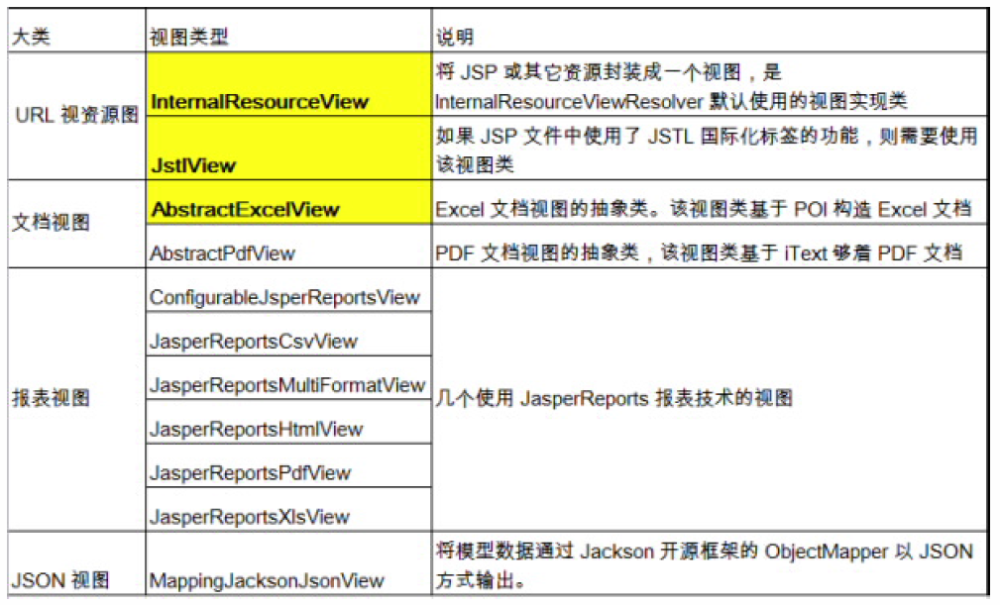

## SpringMVC

### 1.SpringMVC简介

Spring 为展现层提供的基于 MVC 设计理念的优秀的Web 框架，是目前最主流的 MVC 框架之一，它在Spring3.0 后全面超越 Struts2，成为最优秀的 MVC 框架 。Spring MVC 通过一套 MVC 注解，让 POJO 成为处理请求的控制器，而无须实现任何接口。
支持 REST 风格的 URL请求
采用了松散耦合可插拔组件结构，比其他 MVC 框架更具扩展性和灵活性

### 2.RequestMapping

#### 作用：

在控制器的类定义及方法定义处都可标注
`@RequestMapping`

- 类定义处：提供初步的请求映射信息。相对于 WEB 应用的根目录
- 方法处：提供进一步的细分映射信息。相对于类定义处的 URL。

若类定义处未标注 `@RequestMapping`，则方法处标记的 URL 相对于WEB 应用的根目录

**DispatcherServlet** 截获请求后，就通过控制器上`@RequestMapping` 提供的映射信息确定请求所对应的处理方法。

#### 控制请求

`@RequestMapping` 的 value、method、params 及 heads 分别表示请求 URL、请求方法、请求参数及请求头的映射条件，他们之间是与的关系，联合使用多个条件可让请求映射更加精确化。

```java
/**
 * 指定使用method属性来规范请求方式
 * @return
 */
@RequestMapping(value = "testMethod",method = RequestMethod.POST)
public String testMethod(){
    System.out.println("testMethod");
    return SUCCESS;
}
```

params 和 headers支持简单的表达式：

- param1: 表示请求必须包含名为 param1 的请求参数 –
- !param1: 表示请求不能包含名为 param1 的请求参数 –
- param1 != value1: 表示请求包含名为 param1 的请求参数，但其值不能为 value1
- {“param1=value1”, “param2”}: 请求必须包含名为 param1 和param2的两个请求参数，且 param1 参数的值必须为 value1


#### `@PathVariable`映射URL绑定占位符

通过 @PathVariable 可以将 URL 中占位符参数绑定到控制器处理方法的入参中：URL 中的 {xxx} 占位符可以通过`@PathVariable("xxx")` 绑定到操作方法的入参中。

```java
@RequestMapping(value = "/testPathVariable/{id}")
public String testPathVariable(@PathVariable("id") Integer id){
    System.out.println(id);
    return SUCCESS;
}
```


#### REST与`HiddenHttpMethodFilter`

**REST**：即 Representational State Transfer。（资源）表现层状态转化。是目前最流行的一种互联网软件架构。它结构清晰、符合标准、易于理解、扩展方便，所以正得到越来越多网站的采用

状态转化（State Transfer）：每发出一个请求，就代表了客户端和服务器的一次交互过程。HTTP协议，是一个无状态协议，即所有的状态都保存在服务器端。因此，如果客户端想要操作服务器，必须通过某种手段，让服务器端发生“状态转化”（State Transfer）。而这种转化是建立在表现层之上的，所以就是 “表现层状态转化”。

具体说，就是 HTTP 协议里面，四个表示操作方式的动词：**GET**、**POST**、**PUT**、**DELETE**。它们分别对应四种基本操作：GET 用来获取资源，POST 用来新建资源，PUT 用来更新资源，DELETE 用来删除资源。

```
/order/1 HTTP GET 	：得到 id = 1 的 order –
/order/1 HTTP DELETE：删除 id = 1的 order –
/order/1 HTTP PUT	：更新id = 1的 order –
/order 	 HTTP POST	：新增 order
```

**`HiddenHttpMethodFilter`**：浏览器 form 表单只支持 GET •与 POST 请求，而DELETE、PUT 等 method 并不支持，Spring3.0 添加了一个过滤器，可以将这些请求转换为标准的 http 方法，使得支持 GET、POST、PUT 与DELETE 请求。

```xml
<!-- 配置 HiddenHttpMethodFilter 实现将POST请求转换为 PUT 和 DELETE 请求 -->
<filter>
    <filter-name>HiddenHttpMethodFilter</filter-name>
    <filter-class>org.springframework.web.filter.HiddenHttpMethodFilter</filter-class>
</filter>
<filter-mapping>
    <filter-name>HiddenHttpMethodFilter</filter-name>
    <url-pattern>/*</url-pattern>
</filter-mapping>
```

在发送**DELETE**和**PUT**请求时，需要携带一个隐藏域`name`为`_method`，值为**DELETE**或**PUT**

使用`@PathVariable`获取后接id


------

### 3. 映射请求参数 & 请求参数

Spring MVC 通过分析处理方法的签名，将 HTTP 请求信息绑定到处理方法的相应入参中。

必要• 时可以对方法及方法入参标注相应的注解（@PathVariable、@RequestParam、@RequestHeader 等）、Spring MVC 框架会将 HTTP 请求的信息绑定到相应的方法入参中，并根据方法的返回值类型做出相应的后续处理。

#### @RequestParam 绑定请求参数值

下2同

```java
 /**
     * @RequestParam来映射请求参数
     * value = "password"   参数名
     * required = false     请求参数是否必须
     * defaultValue = ""    默认值
     */
@RequestMapping(value = "testRequestParam")
public String testRequestParam(@RequestParam(value = "username",required = false) String username,@RequestParam(value = "password",required = false,defaultValue = "") String pwd){
    System.out.println("testRequestParam:"+username+"  "+pwd);
    return SUCCESS;
}
```


#### @RequestHeader 绑定请求报头的属性值

了解，同上使用


#### @CookieValue 绑定请求中的 Cookie 值

了解，同上使用


#### <font color="#dd0000"> POJO 对象绑定请求参数值</font>


Spring MVC 会按请求参数名和 POJO 属性名进行自动匹·配，自动为该对象填充属性值。支持级联属性。

```html
<form action="hello/testpojo">
    username:<input type="text" name="username">
    <br>
    password:<input type="password" name="password">
    <br>
    email:<input type="text" name="email">
    <br>
    age:<input type="text" name="age">
    <br>
    province:<input type="text" name="address.province">
    <br>
    city:<input type="text" name="address.city">
    <br>
    <input type="submit" value="submit">
</form>
```

```java
public class User {
    private String username;
    private String password;
    private String email;
    private Integer age;

    private Address address;
    

public class Address {
    private String province;
    private String city;
```


#### Servlet API 作为入参


```
1. HttpServletRequest 
2. HttpServletResponse 
3. HttpSession 
4. java.security.Principal 
5. Locale 
6. InputStream 
7. OutputStream 
8. Reader 
9. Writer
```


------

### 4. 处理模型数据

#### ModelAndView

```java
    /**
     * ModelAndView可以包含视图和模型数据信息
     * SpringMVC会把Model的信息放入request域对象中
     */
    @RequestMapping("/testModelAndView")
    public ModelAndView testModelAndView() {
        ModelAndView modelAndView = new ModelAndView();
        modelAndView.setViewName(SUCCESS);
        modelAndView.addObject("time", new Date());

        return modelAndView;
    }
```

#### Map与Model

Spring MVC 在内部使用了一个org.springframework.ui.Model 接口存储模型数据
具体步骤
Spring MVC 在调用方法前会创建一个隐含的模型对象作为模型数据的存储容器。如果方法的入参为 Map 或Model类型，Spring MVC 会将隐含模型的引用传递给这些入参。在方法体内，开发者可以通过这个入参对象访问到模型中的所有数据，也可以向模型中添加新的属性数据


```java
    @RequestMapping(value = "testMap")
    public String testMap(Map<String,Object> map){
        map.put("name",new String[]{"a","b"});

        return SUCCESS;
    }
```


#### @SessionAttributes

这个注解只能放在类上面

通过属性名指定需要放到会话中的属性（value）

通过模型属性的对象类型指定哪些模型属性需要放到会话中（types）

若希望在多个请求之间共用某个模型属性数据，则可以在控制器类上标注一个 @SessionAttributes, Spring MVC 将在模型中对应的属性暂存到 HttpSession 中。

```JAVA
@SessionAttributes(value = {"user","address"},types = {String.class})
```


#### @ModelAttribute

解决问题有某些字段不能更新


在方法定义上使用 @ModelAttribute 注解：Spring MVC在调用目标处理方法前，会先逐个调用在方法级上标注了
@ModelAttribute 的方法。
在方法的入参前使用 @ModelAttribute 注解：

- 可以从隐含对象中获取隐含的模型数据中获取对象，再将请求参数绑定到对象中，再传入入参
- 将方法入参对象添加到模型中

```java


@ModelAttribute
private void getUser(@RequestParam(value = "id",required = false) Integer id,Map<String,Object> map){
    if(null != id){
        User user = new User(1,"tom","123456","www@aa.com",15);
        System.out.println("从数据库获取一个对象："+user);
        map.put("user",user);
    }
}

@RequestMapping("/testModelAttribute")
public String testModelAttribute(User user){
    System.out.println("修改："+user);
    return  SUCCESS;
}

/*
从数据库获取一个对象：User{id=1, username='tom', password='123456', email='www@aa.com', age=15, address=null}
修改：User{id=1, username='123', password='123456', email='a', age=45, address=null}
*/
```


------

### 5 视图与视图解析器


请求处理方法执行完成后，最终返回一个 ModelAndView对象。对于那些返回 String，View 或 ModeMap 等类型的处理方法，Spring MVC 也会在内部将它们装配成一个ModelAndView 对象，它包含了逻辑名和模型对象的视图

Spring MVC 借助**视图解析器（ViewResolver）**得到最终的视图对象（View），最终的视图可以是 JSP ，也可能是
Excel、JFreeChart 等各种表现形式的视图

**视图**对象由视图解析器负责实例化。由于视图是无状态的，所以他• 们不会有线程安全的问题

#### **视图解析器（ViewResolver）**



可以选择一种视图解析器或混用多种视图解析器 

每个视图解析器都实现了 Ordered 接口并开放出一个 order 属性，可以通过 order 属性指定解析器的优先顺序，order 越小优先级越高。

SpringMVC 会按视图解析器顺序的优先顺序对逻辑视图名进行解析，直到解析成功并返回视图对象，否则将抛出 ServletException 异常

#### InternalResourceViewResolver


#### JstlView

在lib中加入了jstl的jar包后就会自动使用JstlView来解析视图


##### 自定义视图

InternalResourceViewResolver的优先级order为Integer最大值

```xml
<!-- 视图解析器 -->
<bean class="org.springframework.web.servlet.view.InternalResourceViewResolver">
    <property name="prefix" value="/WEB-INF/views/"></property>
    <property name="suffix" value=".jsp"></property>
</bean>

<bean class="org.springframework.web.servlet.view.BeanNameViewResolver" id="beanNameViewResolver">
    <property name="order" value="150"></property>
</bean>
```


##### 重定向与转发

```java
//转发prefix		forward:
return "forward:/itemList.action";
	
//重定向prefix		redirect:
return "redirect:/skipToLogin.action";	
```


### 6 处理静态资源

优雅的 REST 风格的资源URL 不希望带 **.html** 或 **.do** 等后缀

若将 DispatcherServlet 请求映射配置为 /，则 Spring MVC 将捕获WEB 容器的所有请求，包括静态资源的请求， SpringMVC 会将他们当成一个普通请求处理，因找不到对应处理器将导致错误。

可以在 SpringMVC 的配置文件中配置 <mvc:default-servlet- •
handler/> 的方式解决静态资源的问题：`<mvc:default-servlet-handler/> `将在 SpringMVC 上下文中定义一个**`DefaultServletHttpRequestHandler`**，它会对进入 **`DispatcherServlet`** 的请求进行筛查，如果发现是没有经过映射的请求，就将该请求交由 WEB 应用服务器默认的 Servlet 处理，如果不是静态资源的请求，才由
DispatcherServlet 继续处理
一般 WEB 应用服务器默认的 Servlet 的名称都是 default。若所使用的WEB 服务器的默认 Servlet 名称不是default，则需要通过 default-servlet-name 属性显式指定

### 7 数据绑定

1. Spring MVC 主框架将 ServletRequest 对象及目标方法的入参实例传递给 **`WebDataBinderFactory`** 实例，创建 **`DataBinder`** 实例对象
2. **`DataBinder`** 调用装配在 Spring MVC 上下文中的 **`ConversionService`** 组件进行数据类型转换、数据格式化工作。将 Servlet 中的请求信息填充到入参对象中
3. 调用 **`Validator`** 组件对已经绑定了请求消息的入参对象进行数据合法性校验，并最终生成数据绑定结果**`BindingData`** 对象
4. Spring MVC 抽取 **`BindingResult`** 中的入参对象和校验错误对象，将它们赋给处理方法的响应入参

### 8 `<mvc:default-servlet-handler/> `数据格式化

<mvc:annotation-driven /> 会自动注册三个bean：
**`RequestMappingHandlerMapping`**
**`RequestMappingHandlerAdapter`** 
**`ExceptionHandlerExceptionResolver`**。
还将提供以下支持:

1. 支持使用 ConversionService 实例对表单参数进行类型转换 
2. 支持使用 @NumberFormat annotation、@DateTimeFormat 
3. 注解完成数据类型的格式化
4. 支持使用 @Valid 注解对 JavaBean 实例进行 JSR 303 验证 
5. 支持使用 @RequestBody 和 @ResponseBody 注解 

**@InitBinder**
由 @InitBinder 标识的方法• ，可以对 WebDataBinder 对象进行初始化。WebDataBinder 是 DataBinder 的子类，用于完成由表单字段到 JavaBean 属性的绑定
**@InitBinder**方法不能有返回值，它必须声明为**void** 。
**@InitBinder**方法的参数通常是是 **WebDataBinder** 

#### 数据校验

```xml
<!--
   1. 数据类型转换
   2. 数据类型格式化
   3. 数据校验.
   1). 如何校验 ? 注解 ?
   ①. 使用 JSR 303 验证标准
   ②. 加入 hibernate validator 验证框架的 jar 包
   ③. 在 SpringMVC 配置文件中添加 <mvc:annotation-driven />
   ④. 需要在 bean 的属性上添加对应的注解
   ⑤. 在目标方法 bean 类型的前面添加 @Valid 注解
   2). 验证出错转向到哪一个页面 ?
   注意: 需校验的 Bean 对象和其绑定结果对象或错误对象时成对出现的，它们之间不允许声明其他的入参
   3). 错误消息 ? 如何显示, 如何把错误消息进行国际化
-->
```

#### JSON处理

html+ajax取代jsp，使用json数据极为频繁

1. 参数上加**`@RequestBoby`**将传入json装换为对象，

2. 方法上加**`@ResponseBody`**将返回数据（对象或集合）转换为json

依赖jackson的相关jar包


使用 HttpMessageConverter<T> 将请求信息转化并绑定到处理方法的入参中或将响应结果转为对应类型的响应信息，Spring 提供了两种途径：

1. 使用 `@RequestBody` / `@ResponseBody` – 对处理方法进行标注
2. 使用 `HttpEntity<T>` / `ResponseEntity<T>` 作为处理方法的入参或返回值

当控制器处理方法使用到 **`@RequestBody`**/**`@ResponseBody`** 或**`HttpEntity<T>`**/**`ResponseEntity<T> `**时, Spring 首先根据请求头或响应头Accept 属性选择匹配的 HttpMessageConverter, 进而根据参数类型或泛型类型的过滤得到匹配的 HttpMessageConverter, 若找不到可用的HttpMessageConverter 将报错

#### 

#### 国际化

默认情况下，SpringMVC 根据 Accept-Language 参数判断客户端的本地化类型。
当接受到请求时，SpringMVC 会在上下文中查找一个本地化解析器（LocalResolver），找到后使用它获取请求
所对应的本地化类型信息。SpringMVC 还允许装配一个动态更改本地化类型的拦截器，这样通过指定一个请求参数就可以控制单个请求的本地化类型。


本地化解析器和本地化拦截器
AcceptHeaderLocaleResolver：根据 HTTP 请求头的Accept-Language 参数确定本地化类型，如果没有显式定义
本地化解析器， SpringMVC 使用该解析器。

CookieLocaleResolver：根据指定的 Cookie 值确定本地化类型

**SessionLocaleResolver**：根据 Session 中特定的属性确定本地化类型

**LocaleChangeInterceptor**：从请求参数中获取本次请求对应的本地化类型。


### 9 文件上传

Spring MVC 为文件上传提供了直接的支持，这种支持是通过即插即用的 MultipartResolver 实现的。Spring 用
Jakarta Commons FileUpload 技术实现了一个MultipartResolver 实现类：CommonsMultipartResovler

> Spring MVC 上下文中默认没有装配 MultipartResovler，因此默认情况下不能处理文件的上传工作，如果想使用 Spring 的文件上传功能，需现在上下文中配置 MultipartResolver

为了让 CommonsMultipartResovler 正确工作，必须先将 Jakarta Commons FileUpload 及 Jakarta Commons io的类包添加到类路径下。


### 10 SpringMVC流程分析


### 11 Spring和SpringMVC

在 Spring MVC 配置文件中引用业务层的 Bean多个 Spring IOC 容器之间可以设置为父子关系，以实现良好的解耦。
Spring MVC WEB 层容器可作为 “业务层” Spring 容器的子容器：即 WEB 层容器可以引用业务层容器的 Bean，而业务层容器却访问不到 WEB 层容器的 Bean


### 12 异常处理

配置全局处理，对应处理方法

```java
@ControllerAdvice
public class SpringMVCTestExceptionHandler {

	@ExceptionHandler({ArithmeticException.class})
	public ModelAndView handleArithmeticException(Exception ex){
		System.out.println("----> 出异常了: " + ex);
		ModelAndView mv = new ModelAndView("error");
		mv.addObject("exception", ex);
		return mv;
	}
}
```

在@Controller中配置，处理的当前handler

```java
@ExceptionHandler({RuntimeException.class})
public ModelAndView handleArithmeticException2(Exception ex){
	System.out.println("[出异常了]: " + ex);
	ModelAndView mv = new ModelAndView("error");
	mv.addObject("exception", ex);
	return mv;
}
	
/**
* 1. 在 @ExceptionHandler 方法的入参中可以加入 Exception 类型的参数, 该参数即对应发生的异常对象
* 2. @ExceptionHandler 方法的入参中不能传入 Map. 若希望把异常信息传导页面上, 需要使用 ModelAndView 作为返回值
* 3. @ExceptionHandler 方法标记的异常有优先级的问题. 
* 4. @ControllerAdvice: 如果在当前 Handler 中找不到 @ExceptionHandler 方法来出来当前方法出现的异常, 
* 则将去 @ControllerAdvice 标记的类中查找 @ExceptionHandler 标记的方法来处理异常. 
*/

@ExceptionHandler({ArithmeticException.class})
public ModelAndView handleArithmeticException(Exception ex){
	System.out.println("出异常了: " + ex);
	ModelAndView mv = new ModelAndView("error");
	mv.addObject("exception", ex);
	return mv;
}
```


#### 另外一种体系

配置自定义异常

```java
public class CustomerException extends Exception {
...
｝
```

实现接口

```java
public class CustomerExceptionResolver implements HandlerExceptionResolver {
    private String exceptMsg;
    /**
	 * 异常处理思路
	 * 1：判断异常的种类，究竟是业务异常，还是系统运行时异常
	 * 2：取出异常信息
	 * 3：跳转到异常页面，将异常信息带到页面上
	 * 4：发邮件，发短信，通知相关人员异常问题，以及异常信息
	 */
	@Override
	public ModelAndView resolveException(HttpServletRequest request, HttpServletResponse response, Object handler,
			Exception ex) {
		
		ModelAndView view = new ModelAndView();
		
		if(ex  instanceof CustomerException){
			//业务异常
			CustomerException exception = (CustomerException) ex;
			exceptMsg=exception.getExceptMsg();
		}else{
			//运行期异常
			StringWriter sWriter = new StringWriter();
			PrintWriter writer = new PrintWriter(sWriter);
			ex.printStackTrace(writer);
			exceptMsg= sWriter.toString();
		}
		
		view.setViewName("error");
		view.addObject("except", exceptMsg);
		return view;
	}
}
```

在springmvc.xml中添加

```xml
<!-- 添加我们的全局异常处理器 -->
<bean id="exceptionResolver" class="cn.itcast.springmvc.exception.CustomerExceptionResolver"></bean>
```

