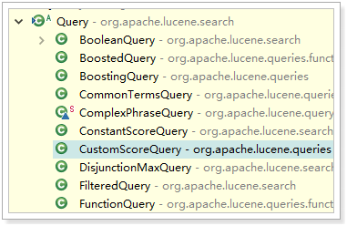

# Lucene

## 1. 基础介绍

Lucene  是一个高效的 ， 基于 Java  的全文检索库 。

那么什么叫做**全文检索**呢？这要从我们生活中的数据说起。我们生活中的数据总体分为两种： **结构化数据** 和 **非结构化数据** 。

- 结构化数据 ：指具有固定格式或有限长度的数据，如数据库，元数据等。
- 非结构化数据 ：指不定长或无固定格式的数据，如邮件，word 文档等。

当然有的地方还会提到第三种，半结构化数据，如 XML，HTML 等，当根据需要可按结构化数据来处理，也可抽取出纯文本按非结构化数据来处理。
**非结构化数据**又一种叫法叫**全文数据**。


按照数据的分类，搜索也分为两种：

- 对结构化数据的搜索：如对数据库的搜索，用 SQL 语句。再如对元数据的搜索，如利用windows 搜索对文件名，类型，修改时间进行搜索等。
- 对非结构化数据的搜索：如利用 windows 的搜索也可以搜索文件内容，Linux 下的 grep命令，再如用 Google 和百度可以搜索大量内容数据。

对非结构化数据也即对全文数据的搜索主要有两种方法：
一种是 **顺序扫描法**(Serial Scanning) ： 所谓顺序扫描，比如要找内容包含某一个字符串的文件，就是一个文档一个文档的看，对于每一个文档，从头看到尾，如果此文档包含此字符串，则此文档为我们要找的文件，接着看下一个文件，直到扫描完所有的文件。如利用 windows的搜索也可以搜索文件内容，只是相当的慢。如果你有一个 80G 硬盘，如果想在上面找到一个内容包含某字符串的文件，不花他几个小时，怕是做不到。Linux 下的 grep 命令也是这一种方式。大家可能觉得这种方法比较原始，但对于小数据量的文件，这种方法还是最直接，
最方便的。但是对于大量的文件，这种方法就很慢了。
有人可能会说，对非结构化数据顺序扫描很慢，对结构化数据的搜索却相对较快（由于结构化数据有一定的结构可以采取一定的搜索算法加快速度），那么把我们的非结构化数据想办法弄得有一定结构不就行了吗？这种想法很天然，却构成了全文检索的基本思路，也即将非结构化数据中的一部分信息提取出来，重新组织，使其变得有一定结构，然后对此有一定结构的数据进行搜索，从而达到搜索相对较快的目的。
这部分从非结构化数据中提取出的然后重新组织的信息，我们称之 索引 。
这种说法比较抽象，举几个例子就很容易明白，比如字典，字典的拼音表和部首检字表就相当于字典的索引，对每一个字的解释是非结构化的，如果字典没有音节表和部首检字表，在茫茫辞海中找一个字只能顺序扫描。然而字的某些信息可以提取出来进行结构化处理，比如读音，就比较结构化，分声母和韵母，分别只有几种可以一一列举，于是将读音拿出来按一定的顺序排列，每一项读音都指向此字的详细解释的页数。我们搜索时按结构化的拼音搜到
读音，然后按其指向的页数，便可找到我们的非结构化数据——也即对字的解释。

这种先建立索引，再对索引进行搜索的过程就叫**全文检索(Full-text Search)**。下面这幅图来自《Lucene in action》，但却不仅仅描述了 Lucene 的检索过程，而是描述了全文检索的一般过程。


全文检索大体分两个过程，**索引创建(Indexing)**和**搜索索引(Search)**。

- 索引创建：将现实世界中所有的结构化和非结构化数据提取信息，创建索引的过程。

- 搜索索引：就是得到用户的查询请求，搜索创建的索引，然后返回结果的过程。

于是全文检索就存在三个重要问题：

1.  索引里面究竟存些什么 ？(Index)
2.  如何创建索引 ？(Indexing)
3.  如何对索引进行搜索 ？(Search)

### 1.1 索引里面究竟存些什么 ？(Index)

**何为反向索引 ？**

顺序扫描的速度慢：是由于我们想要搜索的信息和非结构化数据中所存储的信息不一致造成的。非结构化数据中所存储的信息是每个文件包含哪些字符串，也即已知文件，欲求字符串相对容易，也即是从文件到字符串的映射。而我们想搜索的信息是哪些文件包含此字符串，也即已知字符串，欲求文件，也即从字符串到文件的映射。两者恰恰相反。于是如果索引总能够保存从字符串到文件的映射，则会大大提高搜索速度。

由于从字符串到文件的映射是文件到字符串映射的反向过程，于是保存这种信息的索引称为反向索引 。


假设我的文档集合里面有 100 篇文档，为了方便表示，我们为文档编号从 1 到 100，得到下面的结构
左边保存的是一系列字符串，称为 **词典**。


每个字符串都指向包含此字符串的文档(Document)链表，此文档链表称为 倒排表(Posting List)。

### 1.2 如何创建索引？(Indexing)

1. 一些要索引的原文档(**Document**) 

2. 将原文档传给分词组件(**Tokenizer**/**analyzer**)

3. 将 得 到 的 词 元 (Token)  传 给 语 言 处 理 组 件(**Linguistic Processor**) 。

4. 将得到的词(**Term**) 传给索引组件(**Indexer**) 

### 1.3 如何对索引进行搜索? (**Search**)

1. 用户输入查询语句 
2. 对查询语句进行词法分析、语法分析 
   - 词法分析主要用来识别单词和关键字
   - 语法分析主要是根据查询语句的语法规则来形成一棵语法树


3.  搜索索引 ，得到符合语法树的文档

4. 根据得到的文档和查询语句的相关性 ， 对结果进行排序 

   - 我们把查询语句看作一片短小的文档，对文档与文档之间的相关性(relevance)进行打分(scoring)，分数高的相关性好，就应该排在前面。

   一个文档有很多词(Term) 组成，如 search, lucene, full-text, this, a, what 等。其次对于文档之间的关系 ， 的 不同的 Term  重要性不同，比如对于本篇文档，search, Lucene, full-text就相对重要一些，this, a , what可能相对不重要一些。所以如果两篇文档都包含search, Lucene，fulltext，这两篇文档的相关性好一些，然而就算一篇文档包含 this, a, what，另一篇文档不包含 this, a, what，也不能影响两篇文档的相关性。
   因而判断文档之间的关系，首先找出哪些词(Term)对文档之间的关系最重要，如 search, Lucene, fulltext。然后判断这些词(Term)之间的关系。

**打分过程**：

文档中词(term)的权重(term weight) 看作一个向量。表示如下

Document = {term1, term2, …… ,term N}

Document Vector = {weight1, weight2, …… ,weight N}

同样我们把查询语句看作一个简单的文档，也用向量来表示。
Query = {term1, term 2, …… , term N}
Query Vector = {weight1, weight2, …… , weight N}
我们把所有搜索出的文档向量及查询向量放到一个 N 维空间中，每个词(term)是一维。如图：


我们认为两个向量之间的夹角越小，相关性越大。

在这里，既然要放到相同的向量空间，自然维数是相同的，不同时，取二者的并集，如果不
含某个词(Term)时，则权重(Term Weight)为 0。


 Lucene 是有索引和搜索的两个过程，包含索引创建，索引，搜索三个要点。

<font color='red'>**上述索引创建和搜索过程所一个总结，如图：**</font>


1.  索引过程 ：
  1) 有一系列被索引文件
  2) 被索引文件经过语法分析和语言处理形成一系列词(Term)。
  3) 经过索引创建形成词典和反向索引表。
  4) 通过索引存储将索引写入硬盘。
2.  搜索过程 ：
  a) 用户输入查询语句。
  b) 对查询语句经过语法分析和语言分析得到一系列词(Term)。
  c) 通过语法分析得到一个查询树。
  d) 通过索引存储将索引读入到内存。
  e) 利用查询树搜索索引，从而得到每个词(Term)的文档链表，对文档链表进行交，差，并得到结果文档。
  f) 将搜索到的结果文档对查询的相关性进行排序。
  g) 返回查询结果给用户。


## 2. Lucene处理流程

Lucene ：

- 一个高效的，可扩展的，全文检索库。
- 全部用 Java 实现，无须配置。
- 仅支持纯文本文件的索引(Indexing)和搜索(Search)。
- 不负责由其他格式的文件抽取纯文本文件，或从网络中抓取文件的过程。

计算机索引程序通过扫描文章中的每一个词，对每一个词建立一个索引，指明该词在文章中出现的次数和位置，当用户查询时，检索程序就根据事先建立的索引进行查找，并将查找的结果反馈给用户的检索方式


**认识Lucene相关组件**


1. **Document** 被索引的文档
   - 一个Document中可以有很多个不同的字段，每一个字段都是一个**Field**类的对象。一个Document中的字段其类型是不确定的，因此Field类就提供了各种不同的子类，来对应这些不同类型的字段。


2. **IndexWriter** 通过addDocument将文档添加到索引之中

   - 作用就是 实现对索引的增（创建索引）、删（删除索引）、改（修改索引）
   - 可以一次创建一个，也可以批量创建索引 (**`List<Document>`** **`docs`**)

   **IndexWriterConfig**（索引写入器配置类）

   ​	1）  设置配置信息：Lucene的版本和分词器类型

```java
public IndexWriter(Directory d, IndexWriterConfig conf){...}
```
​	**Analyzer**分词器
​	提供分词算法，可以把文档中的数据按照算法分词
​	这些分词器，并没有合适的中文分词器，因此一般我们会用第三方提供的分词器：


3. **Index** lucene的反向索引（倒排索引）


4. **IndexSearcher** 通过search函数来搜索 倒排索引

   IndexSearcher可以帮助我们实现：快速搜索、排序等功能。

   IndexSearcher需要依赖IndexReader类


5. **Query** 交给IndexSearcher使用的查询，IndexSearcher  计算 term weight  和 和 score  并且将结果返回给用户 

   - 通过**QueryParser**解析关键字，得到查询对象
     - QueryParser（单一字段的查询解析器）
     - MultiFieldQueryParser（多字段的查询解析器）
   - 我们可以通过Query的子类，直接创建查询对象，实现高级查询

   

6. **TopDocsCollector** 返回给用户的文档集合

   在TopDocs中，包含两部分信息：

   - int totalHits ：查询到的总条数

   - ScoreDoc[] scoreDocs ：得分文档对象的数组

     - ScoreDoc是得分文档对象，包含两部分数据：

       ​	int doc      	：文档的编号

     ​         	float score	：文档的得分信息

​    


Lucene API调用流程


上文中提到的lucene处理流程结合上图分析对应的包如下


- Lucene  的 analysis  模块主要负责词法分析及语言处理而形成 Term 。
- Lucene  的 index  模块主要负责索引的创建 ， 里面有 IndexWriter 。
- Lucene  的 store  模块主要负责索引的读写 。
- Lucene  的 QueryParser  主要负责语法分析 。
- Lucene  的 search  模块主要负责对索引的搜索 。
- Lucene  的 similarity  模块主要负责对相关性打分的实现

lucene结构流程解释到此


## 3. lucene具体CRUD

### 3.1 索引创建


代码实现流程：

```Java
public void indexCreate() throws IOException {
    // 创建文档对象
    Document document = new Document();
    // 添加字段，参数Field是一个接口，要new实现类的对象(StringField, TextField)
    // StringField的实例化需要3个参数：1-字段名，2-字段值，3-是否保存到文档，Store.YES存储，NO不存储
    document.add(new TextField("id", "1", Store.YES));
    // TextField：创建索引并提供分词，StringField创建索引但不分词
    document.add(new StringField("title", "谷歌地图之父跳槽FaceBook", Store.YES));

    /*
        // 创建目录对象，指定索引库的存放位置；FSDirectory文件系统；RAMDirectory内存
        Directory directory = FSDirectory.open(new File("E:\\tmp\\indexDir"));
        // 创建分词器对象
        Analyzer analyzer = new StandardAnalyzer();
        // 创建索引写入器配置对象，第一个参数版本VerSion.LATEST,第一个参数分词器
        IndexWriterConfig conf = new IndexWriterConfig(Version.LATEST, analyzer);
        // 创建索引写入器
        IndexWriter indexWriter = new IndexWriter(directory , conf);
        */
    IndexWriter indexWriter = new IndexWriter(FSDirectory.open(new File(MyLucene.INDEX_PATH)),new IndexWriterConfig(Version.LATEST,new IKAnalyzer()));
    // 向索引库写入文档对象
    indexWriter.addDocument(document);
    // 提交
    indexWriter.commit();
    // 关闭
    indexWriter.close();
}
```

使用IK分词器

```java
 public void createIndex2WithIK() throws Exception {
     List<Document> docs = new ArrayList<Document>();
     for (int i = 29; i < 30; i++) {

         // 2.创建文档
         Document doc = new Document();

         LongField idField = new LongField("id2", i, Store.YES);
         // 3.指定文档的字段 三个参数：第一个：字段名称，第二个：字段的值，第三个：是否存储（存储与不存储有区别）
         // TextField titleField = new TextField("title",
         // "邮科院的软件工程师程序员"+i, Store.YES);
         TextField contentField = new TextField("content", "邮科院的研究生已经是社会精英程序员" + i, Store.YES);

         contentField.setBoost(1000f);

         // 把字段添加到文档对象里
         doc.add(idField);
         doc.add(contentField);

         // 把每一个文档对象加入集合
         docs.add(doc);
     }
```


### 3.2 删除索引库


```java
// 删除索引库
@Test
public void deleteIndex() throws Exception {
    // 第一个参数：索引库的路径
    Directory indexDir = FSDirectory.open(new File("E:/tmp/index"));
    // 第二个参数：索引库的相关配置
    IndexWriterConfig indexConfig = new IndexWriterConfig(Version.LATEST, new StandardAnalyzer());
    // 索引写入器
    IndexWriter indexWriter = new IndexWriter(indexDir, indexConfig);

    // 删除索引库的所有内容
    // indexWriter.deleteAll();

    // indexWriter.deleteDocuments(new Term("title","数据"));

    // 提交操作
    indexWriter.commit();
    // 关闭资源
    indexWriter.close();

}
```


### 3.3 索引查找


### 3.4 索引修改


### 3.5 排序


### 3.6 分页


### 3.7 高亮 


