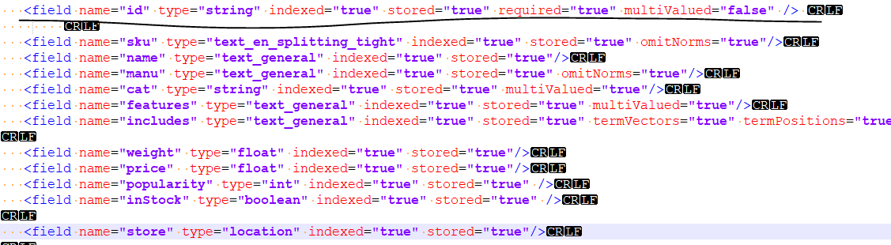

# solr


## solr运行方式

### 1. 直接start.jar

1）  进入solr-4.10.2/example目录

2）  打开命令行，执行java –jar start.jar命令，即可启动Solr服务

3）  打开浏览器，通过`http://localhost:8983/solr`来访问Solr管理页面。（Jetty服务的默认端口是8983）


### 2. 部署到Tomcat(Jetty)

#### 2.1. war包拷贝解压

- **solr-x.x.x/example/webapps/solr.war**复制到自己的**tomcat/webapps**目录中

- 解压

- 删除**solr.war**文件

#### 2.2 导入依赖jar包与配置文件

1. 依赖jar包如下：其中IKAnanlyzer是分词器的包，按需求使用

```
commons-logging-1.1.1.jar
log4j-1.2.16.jar
slf4j-api-1.7.6.jar
slf4j-log4j12-1.7.2.jar
IKAnalyzer2012FF_u1.jar
```

2. 在classes目录下添加`log4j.properties`，基本固定写法

```
### direct log messages to stdout ###
log4j.appender.stdout=org.apache.log4j.ConsoleAppender
log4j.appender.stdout.Target=System.out
log4j.appender.stdout.layout=org.apache.log4j.PatternLayout
log4j.appender.stdout.layout.ConversionPattern=%d{ABSOLUTE} %5p %c{1}:%L - %m%n

### direct messages to file mylog.log ###
log4j.appender.file=org.apache.log4j.FileAppender
log4j.appender.file.File=c:/mylog.log
log4j.appender.file.layout=org.apache.log4j.PatternLayout
log4j.appender.file.layout.ConversionPattern=%d{ABSOLUTE} %5p %c{1}:%L - %m%n

### set log levels - for more verbose logging change 'info' to 'debug' ###

log4j.rootLogger=info, stdout
```

3. 修改Tomcat配置文件，指向Solr的索引库及配置目录。注意，这里可以指向`solr-x.x.x/example/solr`目录，如果想独立出来，也可以将这个solr文件夹复制出来到任意位置（**不要出现中文**），例如：例如:`E:\solrindex`我们这里就把这个文件夹复制出来，独立使用

4. 进入Tomcat文件夹，用记事本打开：tomcat/bin/catalina.bat文件（这是window的使用脚本）

   添加一条配置信息，指向我们的索引库及配置目录：

   `set "JAVA_OPTS=-Dsolr.solr.home=E:\solrindex"`

5.  进入tomcat/bin目录，双击 startup.bat文件启动服务器

   打开浏览器，访问 `http://localhost:8080/solr>`进入Solr管理页面


## 3. 界面操作

### 3.1、DashBoard（仪表盘）


### 3.2、Logging（日志）


 

### 3.3、Core Admin（Core管理）

在Solr中，每一个Core，代表一个索引库，里面包含索引数据及其配置信息。

Solr中可以拥有多个Core，也就同时管理多个索引库！就像在MySQL中可以有多个database一样！


默认core的目录

 

### 3.4、JavaProperties和ThreadDump


 

### 3.5、CoreSelector（Core选择器）

#### 3.5.1、界面预览


 

这里可以看到目前存在的所有Core，并且可以选择其中一个，进行更详细的操作：


 

#### 3.5.2、添加修改索引数据


 

#### 3.5.3、查询索引数据


##  4.Solr中Core详解

- 在Solr中每个Core代表一个索引库，里面包含索引数据及其配置
- Solr可以拥有多个Core，也就是多个索引库。

### 4.1目录结构

Core中有两个重要目录：**conf**和**data**


conf目录中有两个非常重要的配置文件：

**schema.xml**：字段(field)信息与字段约束信息

**solrconfig.xml**：索引库的相关配置


在Core的根目录下有一个配置文件**core.properties**，它是Core的属性文件，记录当前core的名称、索引位置、配置文件名称等信息，也可以不写。这里替换了Core的名字信息


#### 4.2、添加多个core

1）在solr目录下创建新的文件夹core2,作为新的core目录

2）在core2下创建conf目录和data目录，并且创建文件core.properties，添加属性：name=core2

3）从core1/conf目录下复制配置文件core2/conf/下

4）重启Tomcat，访问管理页面


其实也可以直接复制core1到core2，但是需要修改**core.properties**并且把data文件夹清理，以免数据窜扰，


#### 4.3、shcema.xml与solrconfig.xml

#### 4.3.1、shcema.xml配置详解

Solr中会提前对文档中的字段进行定义，并且在schema.xml中对这些字段的属性进行约束，例如：字段数据类型、字段是否索引、是否存储、是否分词等等

##### 1）通过Field字段定义字段的属性信息：



属性及含义：
|标签属性|属性值|
|-|-|
|name：|字段名称，最好以下划线或者字母开头|
|type：|字段类型，指向的是本文件中的<fieldType>标签|
| indexed：|是否创建索引|
| stored：|是否被存储|
|multiValued：|是否可以有多个值，如果字段可以有多个值，设置为true|

**注意** **:** 在本文件中，有两个字段是Solr自带的字段，绝对不要删除：`_version_`节点和`_root_`节点


##### 2)  通过FieldType指定数据类型


|标签属性|属性值|
|-|-|
|name：|字段类型的名称，可以自定义，<field>标签的type属性可以引用该字段，来指定数据类型|
|class：|字段类型在Solr中的类。StrField可索引不可分词。TextField字段可索引，可以分词，所以需要指定分词器|
|**`<analyzer>`**：|这个子标签用来指定分词器，其中的class指定分词器|


##### 3) 唯一主键


Lucene中是没有主键的。删除和修改都需要根据词条进行匹配。

Solr却可以设置一个字段为唯一主键，这样删改操作都可以根据主键来进行！


##### 4)  动态字段


以上一般带多带一个**`s`**代表可以多值


#### 4.3.1、solrconfig.xml配置详解

这个配置文件主要配置跟索引库和请求处理相关的配置。solr服务的**优化**主要通过这个配置文件进行

##### **1)**  **`<lib/>`** **标签：**

- 用途：配置插件依赖的jar包

- 注意事项：

- - 如果引入多个jar包，要注意包和包的依赖关系，被依赖的包配置在前面
  - 这里的jar包目录如果是相对路径，那么是相对于core所在目录

例如，在配置文件中默认有以下配置：

​         这些是Solr中插件所依赖的Jar包

```xml
<lib dir="../contrib/extraction/lib" regex=".*\.jar" />
<lib dir="../dist/" regex="solr-cell-\d.*\.jar" />

<lib dir="../contrib/clustering/lib/" regex=".*\.jar" />
<lib dir="../dist/" regex="solr-clustering-\d.*\.jar" />

<lib dir="../contrib/langid/lib/" regex=".*\.jar" />
<lib dir="../dist/" regex="solr-langid-\d.*\.jar" />

<lib dir="../contrib/velocity/lib" regex=".*\.jar" />
<lib dir="../dist/" regex="solr-velocity-\d.*\.jar" />
```


##### **2)** **`<requestHandler/>`** **标签：**

- 用途：配置Solr处理各种请求（搜索`/select`、更新索引`/update`等）的各种参数

- 主要参数：

- - name：请求类型，例如：select、query、get、update
  - class：处理请求的类
  - initParams：可选。引用`<initParams>`标签中的配置
  - `<lst name="defaults">`：定义各种缺省的配置，比如缺省的parser、缺省返回条数

- 

这里有一个默认选项：rows=10 ，就是设置默认查10条数据

​         `<str name="df"> text</str> `

这个是设置默认搜索的字段为：**text**


##### **3)** **`<initParams/>`** **标签：**

- 用途：为一些requestHandlers定义通用的配置，以便在一个地方修改后，所有地方都生效

- 主要参数：

- - path：指明该配置应用于哪些请求路径，多个 的话用逗号分开，可以用通配符（*表示一层子路径，**表示无限层）
  - name：如果不指定path，可以指定一个name，然后在<requestHander>配置中可以引用这个name

例子（配置一个缺省的df）：

```xml
<initParams path="/update/**,/query,/select,/tvrh,/elevate,/spell,/browse">    
	<lst name="defaults">      
		<str name="df">text</str>    
	</lst>  
</initParams>
```

 如果配置name，在<requestHander>中引用的例子：

```xml
<requestHandler name="/dump1" class="DumpRequestHandler"  initParams="myParams"/>
```


##### 4) 高级篇

**`<updateHandler/>`** **标签：**

- 用途：定义一些更新索引相关的参数，比如定义commit的时机

- 主要参数：

- - autoCommit：定义自动commit的触发条件。如果没配置这个参数，则每次都必须手动commit

  - - maxDocs
    - maxTime（毫秒）
    - openSearcher：autoCommit结束后，是否开启一个新的searcher让更改生效。缺省为false

  - autoSoftCommit：定义自动softCommit的触发条件。相关参数同autoCommit

  - listener：配置事件监听器

  - - event：监听哪个事件，比如：event="postCommit", event="postOptimize"

    - class：处理的类，可以是自己的实现类。如果是RunExecutableListener，可以配置下面的参数：

    - - exe：可[执行文件](http://www.07net01.com/tags-%E6%89%A7%E8%A1%8C%E6%96%87%E4%BB%B6-0.html)，包括Solr Home的相对路径和文件名
      - dir：工作目录，缺省是“.”
      - wait： 调用者是否等待可执行文件执行结束，缺省是true
      - args：传递给可执行文件的参数
      - env：其他所需要的环境变量

  - updateLog：配置log的保存路径、等

  - - dir：保存路径
    - numRecordsToKeep：一个log保存的记录数，缺省为100
    - maxNumLogsToKeep：log的数量，缺省为10
    - num[version](http://www.07net01.com/tags-version-0.html)Buckets：追踪max version的bucket数量（？），缺省为65535


 配置这些参数要考虑到搜索的准确度和性能的平衡。^_^
 注：commit和softCommit：

- commit：正式提交、对索引的修改会被保存到永久[存储](http://www.07net01.com/storage_networking/)中（比如磁盘），会比较耗时
- softCommit：软提交，对索引的修改会被立即应用到工作中的索引中，即立即生效，但没有保存进磁盘


 **`<query/>`** **标签：**

- 用途：配置Solr如何处理和返回搜索的相关参数

- 主要参数：

- - filterCache：当搜索带有“fq”参数时，使用这个配置，它保存未经过排序的所有文档

  - - class：实现类，有三种：solr.search.LRUCache,        solr.search.FastLRUCache, solr.search.LFUCache
    - size：最大保存的记录数量
    - initialSize：初始数量
    - autowarmCount：新Index        Searcher启动的时候从旧的Index Searcher缓存拷贝过来的数据量

  - queryResultCache：存储最终的搜索结果（排序后的、有范围的文档id）

  - - class：实现类，有三种：solr.search.LRUCache,        solr.search.FastLRUCache, solr.search.LFUCache
    - size：最大保存的记录数量
    - initialSize：初始数量
    - autowarmCount：新Index        Searcher启动的时候从旧的Index Searcher缓存拷贝过来的数据量
    - maxRamMB：最大分配的容量（兆）

  - documentCache：缓存Lucene       Document对象（就是每个文档的fields）

  - - class：实现类，有三种：solr.search.LRUCache,        solr.search.FastLRUCache, solr.search.LFUCache
    - size：最大保存的记录数量
    - initialSize：初始数量
    - autowarmCount：因为Lucene的内部文档 id 是临时的，所以这个缓存不应该被auto-warm，这个值应该为“0”

  - cache：配置自定义的缓存，通过SolrIndexSearcher类的getCache()方法和name参数调用这个缓存

  - - name：被调用时的标识
    - 其他参数同上

  - maxBooleanClauses：BooleanQuery的最大子句数量

  - enableLazyFieldLoading：没有知道被请求的field是否懒加载，true/false

  - useFilterForSortedQuery：如果不是按照score排序，是否从filterCache中获取数据

  - queryResult[Windows](http://www.07net01.com/)ize：配合queryResultCache使用，缓存一个超集。如果搜索请求第10到19条记录，而这个参数是50，那么会缓存0到49条记录

  - queryResultMaxDocsCached：queryResultCache缓存的最大文档数量

  - useColdSearcher：但一个新searcher正在warm-up的时候，新请求是使用旧是searcher（true）还是等待新的search（false）

  - maxWarmingSearchers：定义同时在warn-up的searcher的最大数量

  - listener：监听一些事件并指定处理的类，比如在solr启动时加载一些数据到缓存中，相关参数：

  - - event：被监听的事件，比如：firstSearcher是第一个searcher启动、也就是solr启动的事件，newSearcher是当已经有searcher在运行的时候有新searcher启动的事件

    - class：处理类

    - name：="queries"就是需要处理的是query

    - - lst, name：针对哪些搜索条件需要处理


 **`<requestDispatcher/>`** **标签：**

 

- 用途：控制Solr HTTP RequestDispatche r响应请求的方式，比如：是否处理/select url、是否支持对流的处理、上传文件的大小、如何处理带有cache头的HTTP请求、等等

- 主要参数：

- - handleSelect：true/false，如果是false，则由requestHandler来处理/select请求。因为现在的requestHandler中/select是标配，所以这里应该填false

  - requestParsers：

  - - enableRemoteStreaming：是否接受流格式的内容，缺省为ture
    - multipartUploadLimitInKB：multi-part POST请求，上传文件的大小上限（K）
    - formdataUploadLimitInKB：HTTP POST的form data大小上限（K）
    - addHttpRequestToContext：原始的HttpServletRequest对象是否应该被包含在SolrQueryRequest的httpRequest中……一般自定义的插件使用这个参数……

  - httpCaching：如何处理带有cache       control头的HTTP请求

  - - nerver304：如果设为true（开发阶段），则就算所请求的内容没被修改，也不会返回304，并且下面两个参数会失效
    - lastModFrom：最后修改时间的计算方式，openTime：Searcher启动的时刻；dirLastMod：索引更新的时刻
    - etagSeed：HTTP返回的ETag头内容
    - cacheControl：HTTP返回的Cache-Control头内容


 **`<updateProcessor/>`** 和**`<updateProcessorChain/>`** **标签：**

- 用途：配置处理update请求的[处理器](http://www.07net01.com/tags-%E5%A4%84%E7%90%86%E5%99%A8-0.html)、处理器链。如果不配置的话，Solr会使用缺省的三个处理器：

- - LogUpdateProcessorFactory：追踪和记录日志
  - DistributedUpdateProcessorFactory：分流update请求到不同的node，比如SolrCloud的情况下把请求分配给一个shard的leader，然后把更新应用到所有replica中
  - RunUpdateProcessorFactory：调用Solr的内部API执行update操作

- 如果需要自定义update处理器：

- - updateProcessor：

  - - class：负责处理的类
    - name：名字，给updateProcessorChain引用是使用

  - updateProcessorChain：

  - - name：自己的名字标记
    - processor：指定updateProcessor的name，多个的话用逗号“,”分开


#### 4.4 引入IK分词器

##### 4.4.1 引入IK分词器的Jar包 与 配置文件


##### 4.4.2 在schemal.xml中自定义fieldType，引入IK分词器

```xml
 <fieldType name="text_ik" class="solr.TextField">
	<analyzer class="org.wltea.analyzer.lucene.IKAnalyzer"/>
</fieldType>
```


##### 4.4.3 在字段中指定自定义数据类型

```xml
<field name="name_ik" type="text_ik" indexed="true" stored="true" multiValued="true"/>
```


## 问题记录：

##### 1.把solr的index库拷贝到独立路径后，有一些依赖包读不出来的问题

查看core实例中的`conf/scripts.conf`,修改lib应用路径：

```xml
<lib dir="../contrib/extraction/lib" regex=".*\.jar" />
<lib dir="../dist/" regex="solr-cell-\d.*\.jar" />

<lib dir="../contrib/clustering/lib/" regex=".*\.jar" />
<lib dir="../dist/" regex="solr-clustering-\d.*\.jar" />

<lib dir="../contrib/langid/lib/" regex=".*\.jar" />
<lib dir="../dist/" regex="solr-langid-\d.*\.jar" />

<lib dir="../contrib/velocity/lib" regex=".*\.jar" />
<lib dir="../dist/" regex="solr-velocity-\d.*\.jar" />
```

将solr中的dist和contrib包都考到solr index库的core的同级目录(solr index库的根目录)


##### 2.java.lang.NoClassDefFoundError: org/apache/http/message/TokenParser

项目中使用solr作为搜索服务，因为solrJ底层使用httpclient作为通信方式，项目本身也是使用的httpclient作为服务器交互工具，然后与solrJ中的httpclient发生了冲突，产生java.lang.NoClassDefFoundError:org/apache/http/message/TokenParser，删除后并且排除solrJ中的client与core依赖，程序恢复正常。

```xml
<dependency>
    <groupId>org.apache.solr</groupId>
    <artifactId>solr-solrj</artifactId>
    <version>4.10.2</version>
    <exclusions>
        <exclusion>
            <artifactId>httpclient</artifactId>
            <groupId>org.apache.httpcomponents</groupId>
        </exclusion>
        <exclusion>
            <artifactId>httpcore</artifactId>
            <groupId>org.apache.httpcomponents</groupId>
        </exclusion>
    </exclusions>
</dependency>
```