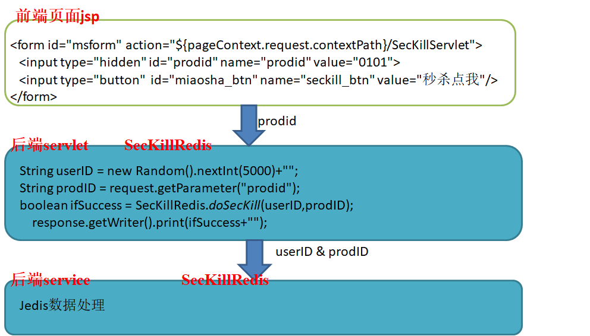

## redis 秒杀

### 阶段一	完成基本抢购功能

基本流程如下



##### 出现问题：超卖

```shell
ab -n 300 -c 100 -p ./postfile -T 'application/x-www-form-urlencoded' http://192.168.24.64:8080/redisSecKill/SecKillServlet
#结果：
127.0.0.1:6379> smembers sk:0101:user
 1) "44"
 2) "218"
 3) "725"
 4) "1047"
 5) "1142"
 6) "1545"
 7) "1722"
 8) "2137"
 9) "2954"
10) "3017"
11) "3322"
12) "3524"
13) "3820"
14) "3899"
15) "4732"
127.0.0.1:6379> get sk:0101:qt
"-5"
```

并发写的问题


### 阶段二	利用CAS锁解决超卖并添加事务

在第3步的处理中加入watch，添加事务淘汰用户


```java
jedis.watch(qtkey);
int qt = Integer.parseInt(jedis.get(qtkey));
if (qt<=0){
    jedis.close();
    System.err.println("没有库存");
    return false;
}
//数据库信息改变
Transaction trans = jedis.multi();
trans.decr(qtkey);
trans.sadd(userkey, userID);
List<Object> execList = trans.exec();

if (null==execList || execList.size()==0){
    jedis.close();
    System.out.println("抢购失败...");
    return  true;
}
//结果如下
//127.0.0.1:6379> get sk:0101:qt
//"0"
```

如上结果解决了超卖问题，但是引入了后抢者购买的问题。

redis并发连接数资源建立与释放影响性能，使用jedispool连接池解决问题。

最后的后抢者购入问题使用乐观锁无法解决，使用**lua**脚本解决。


