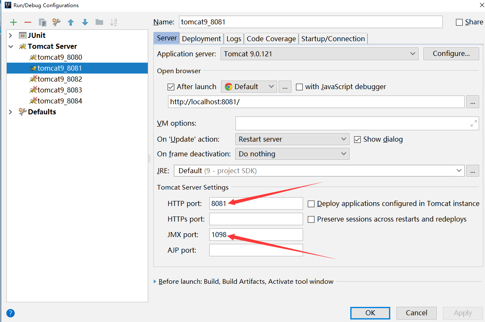
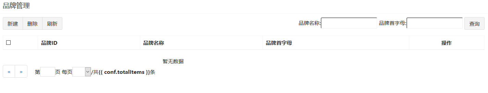
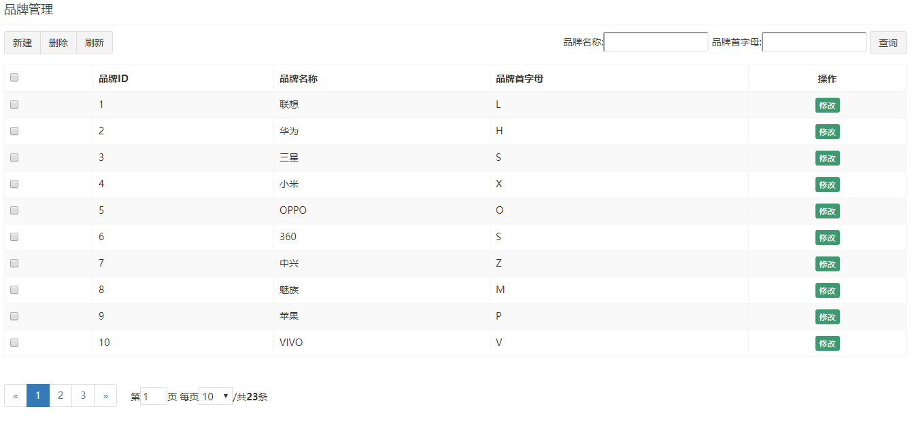
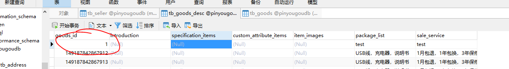
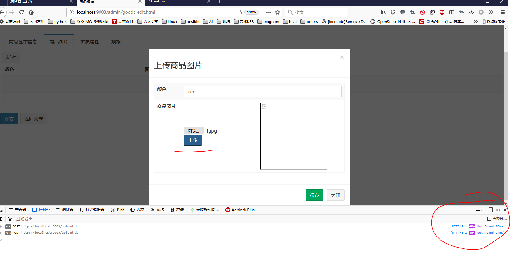
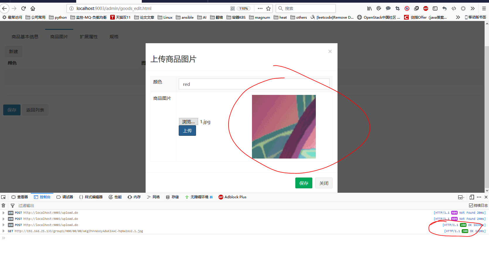

## dobbu问题

### 1. 注册中心没有服务

```sh
java.lang.IllegalStateException: Failed to check the status of the service
com.pinyougou.sellergoods.service.BrandService. No provider available for the service
com.pinyougou.sellergoods.service.BrandService from the url
zookeeper://192.168.25.129:2181/com.alibaba.dubbo.registry.RegistryService?application=pinyo
ugou-manager-
web&dubbo=2.8.4&interface=com.pinyougou.sellergoods.service.BrandService&methods=updat
e,get,delete,selectOptionList,add,getListByPage&pid=3980&revision=0.0.1-
SNAPSHOT&side=consumer&timestamp=1501146823396 to the consumer 172.16.17.14 use
dubbo version 2.8.4
```

#### 原因与解决方式

服务层代码没有成功注册到注册中心导致，请检查一下你的服务层代码是否添加了@service 注解，并且该注解的包一定是 com.alibaba.dubbo.config.annotation 包，不是org.springframework.stereotype.Service，这个地方极容易出错。另外还有一个原因就是你的服务层工程由于某些原因没有正常启动，也无法注册到注册中心里。


### 2. 无法连接到注册中心

```sh
org.I0Itec.zkclient.exception.ZkTimeoutException: Unable to connect to zookeeper server within
timeout: 5000 org.I0Itec.zkclient.ZkClient.connect(ZkClient.java:876)
org.I0Itec.zkclient.ZkClient.<init>(ZkClient.java:98)
org.I0Itec.zkclient.ZkClient.<init>(ZkClient.java:92)
org.I0Itec.zkclient.ZkClient.<init>(ZkClient.java:80)
com.alibaba.dubbo.remoting.zookeeper.zkclient.ZkclientZookeeperClient.<init>(ZkclientZook
eeperClient.java:26)
```

#### 原因与解决办法

检查 IP 与端口是否填写正确

检查注册中心是否正常启动


## 环境问题

### 3. idea集成Tomcat，多Tomcat实例启动多Module

eclipse使用tomcat插件完成多实例启动，idea使用如下图方式：



改动如图两处，添加deployment，就可以多实例启动tomcat了


### 4. 启动tomcat报端口占用

linux下很简单

window命令记录下

```sh
#1. 查找进程
C:\Users\pinkill>netstat -ano | findstr "109"
  TCP    0.0.0.0:1098           0.0.0.0:0              LISTENING       12024
  TCP    0.0.0.0:1099           0.0.0.0:0              LISTENING       7644
  TCP    [::]:1098              [::]:0                 LISTENING       12024
  TCP    [::]:1099              [::]:0                 LISTENING       7644

#2. 查看进程应用
C:\Users\pinkill>tasklist|findstr "12024"
java.exe                     12024 Console                    1    130,760 K

C:\Users\pinkill>kill 12024
'kill' 不是内部或外部命令，也不是可运行的程序
或批处理文件。

#3. 杀死进程
C:\Users\pinkill>tskill 12024

C:\Users\pinkill>tskill 7644

C:\Users\pinkill>netstat -ano | findstr "109"

C:\Users\pinkill>
```


### 5.angularJS跨域请求

```
Access to XMLHttpRequest at 'http://127.0.0.1:3000/api/xxx?page=1' from origin 'http://localhost:8080' has been blocked by CORS policy: No 'Access-Control-Allow-Origin' header is present on the requested resource.
```

##### 原因

跨域指浏览器不允许当前页面的所在的源去请求另一个源的数据。源指协议，端口，域名。只要这个3个中有一个不同就是跨域。 这里列举一个经典的列子：

协议跨域 
http://a.baidu.com访问https://a.baidu.com； 
端口跨域 
http://a.baidu.com:8080访问http://a.baidu.com:80； 
域名跨域 

http://a.baidu.com访问http://b.baidu.com；

现在很多公司都是采用前后分离的方式开发。那么出现经常和会跨域打交道。

##### 解决方案

https://blog.csdn.net/jumtre/article/details/49790815


### 6.tomcat启动失败，报bean构建失败

查看tomcat日志出现如下问题：

```
org.springframework.beans.factory.BeanCreationException: Error creating bean with name 'brandServiceImpl' defined in file [E:\tomcat9s\apache-tomcat-9.0.12\webapps\ROOT\WEB-INF\classes\com\pinyougou\sellergoods\service\impl\BrandServiceImpl.class]: Initialization of bean failed; nested exception is java.lang.RuntimeException: java.io.IOException: invalid constant type: 18
```

##### 原因：

该问题确实没有定位出来，只能确定和打包有关系

后来确定是javassist包的问题，别问我怎么知道的，说多了都是泪。3.18.1以上支持java 1.8

##### 解决：

这个包怎么都拖不下来，自己手动下载安装了一个，暂时感觉很头疼

换了版本正常了3.19-GA


另外：

逆向工程 配置文件 加一行 ：
`<plugin type="org.mybatis.generator.plugins.SerializablePlugin" />`
自动实现pojo序列化


### 7.前端页面乱码


##### 原因:

这个和文件编码有关，但是整体排查了一遍以后都是文件UTF-8，只能确定和tomcat部署war包有关，具体是哪一步还没有完全排查出来。

个人分析：本地文件系统为默认编码gbk，在copy进入idea后idea用设置的utf-8读取文件，导致乱码

##### 解决1：

直接改编码为GBK正常了


##### 解决2：

上面的解决是为idea+tomcat的部署方式准备的，每个文件改GBK实在太麻烦

后面用idea+tomcat7-maven-plugin的方式部署。其实也很简单，加上插件配置一下就行了。

在不改文件编码的情况下乱码问题得到解决


### 8.页面加载到一半不动了，`<script>`不加载了

正确写法如下

```html
<script type="text/javascript" src="../js/base_pagination.js" ></script>
<script type="text/javascript" src="../js/service/brandService.js" ></script>
<script type="text/javascript" src="../js/controller/brandController.js" ></script>
```

**自作聪明的用了自结束标签**

```html
<script type="text/javascript" src="../js/base_pagination.js" />
<script type="text/javascript" src="../js/service/brandService.js" />
<script type="text/javascript" src="../js/controller/brandController.js" />
```

看颜色都不对了 ^0^


### 9.继承baseController后前端不显示



**清理缓存重新刷新**



另外：有可能是service的js文件没有引用


### 10.返回主键获取错误导致插入信息出错



##### 原因:

很明显问题在service或者dao，但是如果是dao的问题，id应该是null。直接出异常

```xml
<selectKey resultType="java.lang.Long" order="AFTER" keyProperty="id">
    SELECT LAST_INSERT_ID() AS id
</selectKey>
```

在insert中加入上面的配置，在插入后返回id。

问题就是id返回到哪里了，而其mapper的insert方法又返回的是什么？

**id实际上返回到了插入的实例中，而insert返回的是影响的记录条数**


出错点：

```java
//设置未申请状态
goods.getGoods().setAuditStatus("0");
long goodsId = goodsMapper.insert(goods.getGoods());
System.out.println(goodsId);
goods.getGoodsDesc().setGoodsId(goodsId);
goodsDescMapper.insert(goods.getGoodsDesc());
```

上述实现将影响条数添加到了记录中，出错

##### 解决：

```java
//设置未申请状态
goods.getGoods().setAuditStatus("0");
goodsMapper.insert(goods.getGoods());
System.out.println(goods.getGoods().getGoodsId());
goods.getGoodsDesc().setGoodsId(goods.getGoods().getGoodsId());
goodsDescMapper.insert(goods.getGoodsDesc());
```


## 图片上传部分

### 11.Error: uploadService.upload.success is not a function

调用时前端报错

##### 解决：

方法调用掉了**`()`**

加上去

```
uploadService.uploadFile().success
```


### 12.后端500错误，提示MultipartResolver没添加

确定加了配置

```xml
<bean id="multipartResolver" 	class="org.springframework.web.multipart.commons.CommonsMultipartResolver">
	<property name="maxUploadSize" value="5242880"></property>
</bean>
```

这里缺了编码的配置

这个错原因知道和编码有关？

添加编码后解决

```xml
<bean id="multipartResolver" class="org.springframework.web.multipart.commons.CommonsMultipartResolver">
    <property name="defaultEncoding" value="UTF-8"></property>
    <property name="maxUploadSize" value="5242880"></property>
</bean>
```


### 13.配了路径仍然404



确定后端有**`/upload`**

需要注意的是,返回的json，加@Controller不加@ResponseBody就会出这个问题,改动如下

```java
@RestController
public class UpLoadFileController {...
```

**成功撒花**




### 14 前端循环报错

```html
Error: [ngRepeat:dupes] http://errors.angularjs.org/1.2.9/ngRepeat/dupes?p0=pojo%20in%20entity.goodsDesc.customAttributeItems&p1=string%3At
```

数组没有转换，还是json字符串(string)。


### 15 轮播图不动

本问题不知道是pc性能问题还是后端问题。

只是在``加上了宽高的`100%`就正常了，应该是当时进程启动比较多电脑比较卡


## 配置文件问题

### 1.读取子工程的xml配置文件

```xml
<!-- 加载spring容器 -->
<context-param>
    <param-name>contextConfigLocation</param-name>
    <param-value>classpath*:spring/applicationContext*.xml</param-value>
</context-param>
<listener>
    <listener-class>org.springframework.web.context.ContextLoaderListener</listener-class>
</listener>
```

比如上面的路径**`classpath*:spring/applicationContext*.xml`**其中两个**`*`**，第一个就是读取子工程

还经常莫名的读不到子工程的*.properties文件

```xml
<context:property-placeholder location="classpath*:**/*.properties"></context:property-placeholder>
```

强制在父工程读一遍，实在不想花太多时间在这里。


### 2.对于打成war包和直接在本地运行的区别

idea很容易遇到能够**`ctrl+左键`**找的到文件，但是在tomcat上运行配文件无法读取的问题

```xml
<context:property-placeholder location="classpath:conf/solr.properties"></context:property-placeholder>
```

一定要加**`classpath`**


### 3.本地运行的java程序文件无法读取

idea这个毛病暂时没有去深入研究，应该和配置文件文件夹与java资源文件夹在未打包情况下存在隔离有关

```xml
<resources>
    <resource>
        <directory>src/main/java</directory>
        <includes>
            <include>**/*.xml</include>
            <include>**/*.properties</include>
        </includes>
    </resource>
    <resource>
        <directory>src/main/resources</directory>
        <includes>
            <include>**/*.xml</include>
            <include>**/*.properties</include>
        </includes>
    </resource>
</resources>
```

在pom.xml配置中加入如上内容，大多数情况能够解决。实际上java下一般都不放置配置文件，只是为了以防万一

如果遇到本地运行的文件读取不到子工程的配置，根据本栏第一项排查，如果是变量配置信息无法读取可以考虑直接加一个


### 4.无法读取maven子spring工程的配置文件

这个的原因起初不知道，后来根据现象和老师的讲解获得正确解决方式

```xml
<context:property-placeholder location="classpath*:conf/*.properties"></context:property-placeholder>
```

在所有需要使用properties的的spring工程中，都使用了上面的标签扫描配置文件。

但是需要注意的是该标签只会有**`一个`**生效，最先读到的会覆盖说有后面的同类标签。

在上面的情况下在上层工程中引用了以后，其依赖工程如果配置文件不在**`conf`**目录下，那么就会出现读不到的问题。


## solr问题

### 1.访问solr出错

```
org.apache.solr.client.solrj.impl.HttpSolrServer$RemoteSolrException:Expectedmimetypeapplication/octet-streambutgottext/html
```

查资料发现是solrsever的地址出现问题:http://localhost:8080/solr/MyCore1结果发现,需要指定solr core

在配置文件中修改

```xml
<!-- solr服务器地址 -->
<solr:solr-server id="solrServer" url="http://192.168.25.128:8080/solr/MyCore1" />

<!-- solr模板，使用solr模板可对索引库进行CRUD的操作 -->
<bean id="solrTemplate" class="org.springframework.data.solr.core.SolrTemplate">
    <constructor-arg ref="solrServer" />
</bean>
```


## idea springboot

### 1.热部署

https://blog.csdn.net/xusheng_Mr/article/details/78771746


### 2.异常

```
Exception in thread "main" java.lang.ClassCastException: java.base/jdk.internal.loader. ClassLoaders$AppClassLoader cannot be cast to java.base/java.net.URLClassLoader at org.springframework.boot.devtools.restart.DefaultRestartInitializer.getUrls(DefaultRestartInitializer.java:93)
```

换jkd8


### 3.认证不过

```properties
accessKeyId=xxxxxxx
accessKeySecret=xxxxxxxxxxxxxx
```

配置严格遵循规范，不带空格，不带**双引号**("")，不带分号(;)