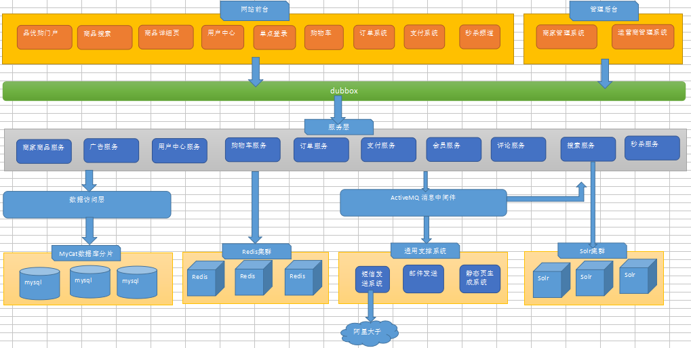
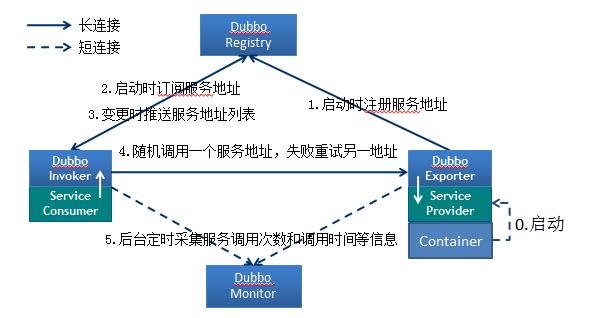
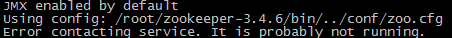

# 项目构建		dubbox		zookeeper

## 1.电商行业特点以及电商的模式

整体架构特点

能够运用Dubbox+SSM搭建分布式应用

搭建工程框架，完成品牌列表后端代码掌握

 

#### 分布式说明

##### 1、  什么是分布式

举例说明：

分布式计算-多台计算机共同完成一个计算任务

分布式存储-一个文件分片存储在多个计算机中​     

项目上：

一个业务分拆多个子业务，部署在不同的服务器上

​         多个运行的子系统共同配合完成业务需求，这样的项目是分布式的

##### 2、  为什么要用分布式

单台计算机的内存，cpu计算能力有限

一个tomcat最高可承载的并发大概是500，而我们现在做的是互联网电商项目，是面向大量用户访问使用的，其并发量非常巨大，远远超过500，显然一台计算机是无法完成这个任务的，因此才需要分布式。

##### 3、  分布式用到的关键技术

Dubbox 


#### 行业特点

技术新
技术范围广
分布式
高并发、集群、负载均衡、高可用
海量数据

技术需求

##### 简单:

##### 中等:

并发：当有多个线程在操作时,如果系统只有一个CPU,则它根本不可能真正同时进行一个以上的线程，它只能把CPU运行时间划分成若干个时间段,再将时间 段分配给各个线程执行，在一个时间段的线程代码运行时，其它线程处于挂起状。.这种方式我们称之为并发(Concurrent)。

并行：当系统有一个以上CPU时,则线程的操作有可能非并发。当一个CPU执行一个线程时，另一个CPU可以执行另一个线程，两个线程互不抢占CPU资源，可以同时进行，这种方式我们称之为并行(Parallel)。

区别：并发和并行是即相似又有区别的两个概念，并行是指两个或者多个事件在同一时刻发生；而并发是指两个或多个事件在同一时间间隔内发生。在多道程序环境下，并发性是指在一段时间内宏观上有多个程序在同时运行，但在单处理机系统中，每一时刻却仅能有一道程序执行，故微观上这些程序只能是分时地交替执行。倘若在计算机系统中有多个处理机，则这些可以并发执行的程序便可被分配到多个处理机上，实现并行执行，即利用每个处理机来处理一个可并发执行的程序，这样，多个程序便可以同时执行。

##### 复杂:

系统容量预估

预估步骤：

1、注册用户数-日均UV量-每日的PV量-每天的并发量；

2、峰值预估：平常量的2~3倍；

3、根据并发量（并发，事务数），存储容量计算系统容量；

客户需求：3~5年用户数达到1000万注册用户；

1、每秒并发数预估：

每天的UV为200万（二八原则）；

每日每天点击浏览30次；

PV量：200*30=6000万；

集中访问量：24*0.2=4.8小时会有6000万*0.8（有效值）=4800万（二八原则）；

每分并发量：4.8*60=288分钟，每分钟访问4800/288=16.7万（约等于）；

每秒并发量：16.7万/60=2780（约等于）；

假设：高峰期为平常值的三倍，则每秒的并发数可以达到8340次。

 

2、服务器预估：（以tomcat服务器举例）

按一台web服务器，支持每秒300个并发计算。平常需要10台服务器（约等于）；[tomcat默认配置是150]

高峰期：需要30台服务器；

3、容量预估：70/90原则

系统CPU一般维持在70%左右的水平，高峰期达到90%的水平，是不浪费资源，并比较稳定的。内存，IO类似。

以上预估仅供参考，因为服务器配置，业务逻辑复杂度等都有影响。在此CPU，硬盘，网络等不再进行评估。


#### 电商模式

##### 1. B2B（Busuness to Business）

##### 2. C2C（Customer to Customer）

##### 3. B2C（Business-to-Customer) 

##### 4.C2B（Consumer to Business）

​	消费者到企业

##### 5. O2O（Online To Offline）

​	是指将线下的商务机会与互联网结合，让互联网成为线下交易的平台，这个概念最早来源于美国

##### 6. F2C（Factory to customer）

​	F2C 指的是 Factory to customer，即从厂商到消费者的电子商务模式。

##### 7. 2B2C - 企业- 企业- 个人

​	B2B2C 是一种电子商务类型的网络购物商业模式，B是 BUSINESS的简称，C 是 CUSTOMER的简称，第一个 B 指的是商品或服务的供应商，第二个 B 指的是从事电子商务的企业，C 则是表示消费者。
​	第一个 BUSINESS，并不仅仅局限于品牌供应商、影视制作公司和图书出版商，任何的商品供应商或服务供应商都能可以成为第一个 BUSINESS；第二 B 是 B2B2C 模式的电子商务企业，通过统一的经营管理对商品和服务、消费者终端同时进行整合，是广大供应商和消费者之间的桥梁，为供应商和消费者提供优质的服务，是互联网电子商务服务供应商。C 表示消费者，在第二个 B 构建的统一电子商务平台购物的消费者；
​	B2B2C 的来源于目前的 B2B、B2C 模式的演变和完善，把 B2C 和 C2C 完美地结合起来，通过 B2B2C 模式的电子商务企业构建自己的物流供应链系统，提供统一的服务。


## 2. 需求分析

架构




## 3. Dubbox

### 3.1Apache Dubbo

​	Apache Dubbo™ (incubating) is a high-performance, java based open source RPC framework.

​	Dubbox 是一个分布式服务框架，其前身是阿里巴巴开源项目 Dubbo ，被国内电商及互联网项目中使用，后期阿里巴巴停止了该项目的维护，当当网便在 Dubbo 基础上进行优化，并继续维护，为了与原有的 Dubbo 区分，故将其命名为 Dubbox。

​	Dubbox 致力于提供高性能和透明化的 **RPC** 远程服务调用方案，以及 SOA 服务治理方案。简单的说，dubbox 就是个服务框架，如果没有分布式的需求，其实是不需要用的，只有在分布式的时候，才有 dubbox 这样的分布式服务框架的需求，并且本质上是个服务调用的东西，说白了就是个远程服务调用的分布式框架。


Dubbo：基于RPC，使用者无需关心底层调用，像是本定调用效率很高

Spring Config：基于RESTful




Dubbox  本地 JAR  包部署与安装（了解）
Dubbox 的 jar 包并没有部署到 Maven 的中央仓库中，大家在 Maven 的中央仓库中可以查找到 Dubbo 的最终版本是 2.5.3 , 阿里巴巴解散了 Dubbo 团队后由当当网继续维护此项目，并改名为 Dubbox ,坐标不变，版本变更了，但是并没有提交到中央仓库。（末前已经重启维护）我们现在需要手动将 Dubbox 的 jar 包安装到我的本地仓库中。

```
mvn install:install-file -Dfile=d:\dubbo-2.8.4.jar -DgroupId=com.alibaba -DartifactId=dubbo -Dversion=2.8.4 -Dpackaging=jar
```


### 3.2 Zookeeper  介绍

官方推荐使用 zookeeper 注册中心。注册中心负责服务地址的注册与查找，相当于目录服务，服务提供者和消费者只在启动时与注册中心交互，注册中心不转发请求，压力较小。Zookeeper 是 Apacahe Hadoop 的子项目，是一个树型的目录服务，支持变更推送，适合作为 Dubbox 服务的注册中心，工业强度较高，可用于生产环境。

#### 安装与启动：

##### 安装

1. 安装jdk

```shell
#配置好ali源后下列指令会安装java 1.8
yum install java
```

2. 拷贝zookeeper压缩包到linux
3. 解压压缩包

```shell
tar -zxvf zookeeper-3.4.6.tar.gz
```

4. 创建data文件夹，存放数据

```sh
mkdir data
```

5. 进入conf，改动配置文件名为zoo.cfg，并修改配置

```sh
cd conf
cp zoo_sample.cfg zoo.cfg

#改动配置
vim zoo.cfg
#下列路径为data的绝对路径
#dataDir=/root/zookeeper-3.4.6/data
```

##### 启动

1. 进入bin目录，通过zkServer.sh start启动

```sh
./zkServer.sh start
```

2. 查看状态

```sh
./zkServer.sh status

启动成功
# [root@localhost bin]# ./zkServer.sh status
# JMX enabled by default
# Using config: /root/zookeeper-3.4.6/bin/../conf/zoo.cfg
# Mode: standalone
启动失败如下图
```



### 3.3 管理中心的部署

我们在开发时，需要知道注册中心都注册了哪些服务，以便我们开发和测试。我们可以通过部署一个管理中心来实现。其实管理中心就是一个 web 应用，部署到 tomcat 即可。

#### 3.3.1  管理端安装

（1）编译源码，得到 war 包
dubbox-master.zip ，这个是 dubbox 的源码，我们可以使用 maven命令编译源码得到“管理端”的 war 包
将此压缩包解压，在命令符下进入 dubbo-admin 目录 ，输入 maven 命令

```sh
mvn package -Dmaven.skip.test=true
```

（2）进入 target 文件夹，会看到一个 dubbo-admin-2.8.4.war ， 在 linux 服务器上安装tomcat, 将此 war 包上传到 linux 服务器的 tomcat 的 webapps 下。为了访问方便，可以把版本号去掉。 启动 tomcat 后自动解压。

**`ps`**:如果你部署在 zookeeper 同一台主机并且端口是默认的 2181，则无需修改任何配置。如果不是在一台主机上或端口被修改，需要修改 WEB-INF 下的 dubbo.properties ，修改如下配置：

```
dubbo.registry.address=zookeeper://127.0.0.1:2181
```


修改后重新启动 tomcat