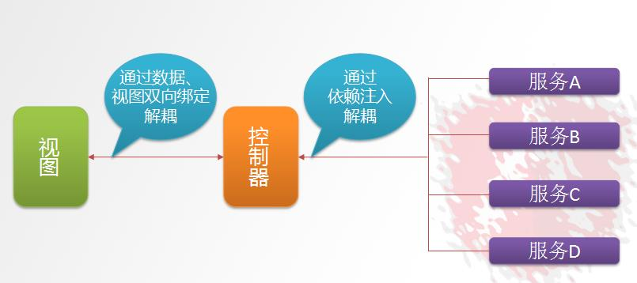

# AngularJS

AngularJS 诞生于 2009 年，由 Misko Hevery 等人创建，后为 Google 所收购。是一款优秀的前端 JS 框架，已经被用于 Google 的多款产品当中。AngularJS 有着诸多特性，最为核心的是：MVC、模块化、自动化双向数据绑定、依赖注入等等。

## 1. AngularJS四大特征

### 1.1 MVC



`Model`			:	数据,其实就是 angular 变量($scope.XX);
`View	`			: 	数据的呈现,Html+Directive(指令);
`Controller`		:	操作数据,就是 function,数据的增删改查;

### 1.2 双向绑定

​	AngularJS 是建立在这样的信念上的：即声明式编程应该用于构建用户界面以及编写软件构建，而指令式编程非常适合来表示业务逻辑。框架采用并扩展了传统 HTML，通过双向的数据绑定来适应动态内容，双向的数据绑定允许模型和视图之间的自动同步。因此，AngularJS 使得对 DOM 的操作不再重要并提升了可测试性。


### 1.3 依赖注入

​	依赖注入(Dependency Injection,简称 DI)是一种设计模式, 指某个对象依赖的其他对象无需手工创建，只需要“吼一嗓子”，则此对象在创建时，其依赖的对象由框架来自动创建并注入进来,其实就是最少知识法则;模块中所有的 service 和 provider 两类对象，都可以根据形参名称实现 DI.

### 1.4 模块化设计

高内聚低耦合法则
​	1) 官方提供的模块 ng、ngRoute、ngAnimate
​	2) 用户自定义的模块 angular.module('模块名',[ ])


### 1.5 AngularJS使用案例

```html
<html>
<head>
<meta http-equiv="X-UA-Compatible" content="IE=edge">
<meta name="viewport" content="width=device-width, initial-scale=1">
<meta http-equiv="Content-Type" content="text/html; charset=UTF-8">
<head>
	<meta charset="utf-8" />
	<title>入门小 Demo-8 内置服务</title>
	<script src="angular.min.js"></script>
	<script>
		var app=angular.module('myApp',[]); //定义了一个叫 myApp 的模块
		//定义控制器
		app.controller('myController',function($scope,$http){
			$scope.findAll=function(){
				$http.get('http://localhost:8080/brand/findAll.do').success(
					function(response){
						$scope.list=response;
					} 
				);
			} 
		});
	</script>
</head>
<body ng-app="myApp" ng-controller="myController" ng-init="findAll()">
	<table>
		<tr>
			<td>firstChar</td>
			<td>id</td>
			<td>name</td>
		</tr>
		<tr ng-repeat="brand in list">
			<td>{{brand.firstChar}}</td>
			<td>{{brand.id}}</td>
			<td>{{brand.name}}</td>
		</tr>
	</table>
</body>
</html>
```

angularJS:

angularJS指令都是通过元素（标签）的属性这种形式来定义的

1. `ng-app` 指定angularJS的是哦那个范围。如果页面有自定义的控制器需要指定其所属module名字
2. `ng-controller` 自定义模块中控制器的名字
3. `ng-init` 模块在加载时会去的调用的方法
4. `ng-repeat` 循环标签会从当前位子开始循环，`"brand in list"`指定数据
5. `{{xxx.xxx}}` 数据获取
6. `$scope` 双向绑定的数据存放域服务
7. `$http` 请求服务,用于读取远程服务器的数据。
