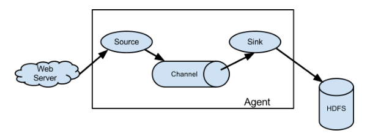
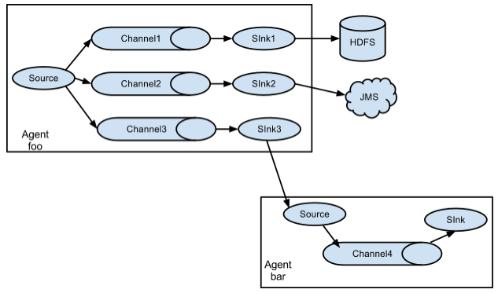
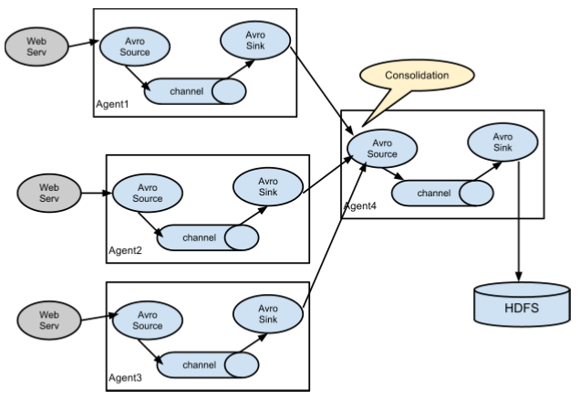

## Flume

### 1.Flume  简介

1) Flume 提供一个分布式的，可靠的，对大数据量的日志进行高效收集、聚集、移动的服务，Flume 只能在 Unix 环境下运行。
2) Flume 基于流式架构，容错性强，也很灵活简单。
3) Flume、Kafka 用来实时进行数据收集，Spark、Storm 用来实时处理数据，impala 用来实时查询。

### 2.角色



#### 2.1 、Source

用于采集数据，Source 是产生数据流的地方，同时 Source 会将产生的数据流传输到 Channel，这个有点类似于 Java IO 部分的 Channel。

#### 2.2 、Channel

用于桥接 Sources 和 Sinks，类似于一个队列。

#### 2.3 、Sink

从Channel收集数据，将数据写到目标源(可以是下一个Source，也可以是HDFS或者HBase)。

#### 2.4 、Event

传输单元，Flume 数据传输的基本单元，以事件的形式将数据从源头送至目的地。


source 监控某个文件或数据流，数据源产生新的数据，拿到该数据后，将数据封装在一个Event 中，并 put 到 channel 后 commit 提交，channel 队列先进先出，sink 去 channel 队列中拉取数据，然后写入到 HDFS 中。


### 3.案列

#### 3.1

安装telnet，telnet-server

创建agent配置文件

```shell
# example.conf: A single-node Flume configuration

# Name the components on this agent
a1.sources = r1
a1.sinks = k1
a1.channels = c1

# Describe/configure the source
a1.sources.r1.type = netcat
a1.sources.r1.bind = localhost
a1.sources.r1.port = 44444

# Describe the sink
a1.sinks.k1.type = logger

# Use a channel which buffers events in memory
a1.channels.c1.type = memory
a1.channels.c1.capacity = 1000
a1.channels.c1.transactionCapacity = 100

# Bind the source and sink to the channel
a1.sources.r1.channels = c1
a1.sinks.k1.channel = c1
```

启动监听

```bash
bin/flume-ng agent \
--conf conf \
--conf-file /opt/module/apache-flume-1.7.0-bin/job/job_flume_netcat.conf \
--name a1 \
-Dflume.root.logger=INFO,console
```

发送消息

```shell
# 验证使用
netstat -tunlp | grep 44444

# 链接 -- 发送
telnet localhost 44444
```


#### 3.2 案例二 ： flume实时读取本地文件到 HDFS 

hadoop相关jar拷贝到Flume的lib下

配置文件

```shell
# Name the components on this agent
a2.sources = r2
a2.sinks = k2
a2.channels = c2

# Describe/configure the source
a2.sources.r2.type = exec
a2.sources.r2.command = tail -F -n +0 /opt/module/hive/logs/hive.log
a2.sources.r2.shell = /bin/bash -c

# Describe the sink
a2.sinks.k2.type = hdfs
a2.sinks.k2.hdfs.path = hdfs://hadoop102:9000/flume/%Y%m%d/%H
#上传文件的前缀
a2.sinks.k2.hdfs.filePrefix = logs-
#是否按照时间滚动文件夹
a2.sinks.k2.hdfs.round = true
#多少时间单位创建一个新的文件夹
a2.sinks.k2.hdfs.roundValue = 1
#重新定义时间单位
a2.sinks.k2.hdfs.roundUnit = hour
#是否使用本地时间戳
a2.sinks.k2.hdfs.useLocalTimeStamp = true
#积攒多少个 Event 才 flush 到 HDFS 一次
a2.sinks.k2.hdfs.batchSize = 1000
#设置文件类型，可支持压缩
a2.sinks.k2.hdfs.fileType = DataStream
#多久生成一个新的文件
a2.sinks.k2.hdfs.rollInterval = 600
#设置每个文件的滚动大小
a2.sinks.k2.hdfs.rollSize = 134217700
#文件的滚动与 Event 数量无关
a2.sinks.k2.hdfs.rollCount = 0
#最小副本数
a2.sinks.k2.hdfs.minBlockReplicas = 1

# Use a channel which buffers events in memory
a2.channels.c2.type = memory
a2.channels.c2.capacity = 1000
a2.channels.c2.transactionCapacity = 100
# Bind the source and sink to the channel
a2.sources.r2.channels = c2
a2.sinks.k2.channel = c2
```


### 3 、案例三 ：实时读取目录文件到 HDFS

目 标：使用 flume 监听整个目录的文件

```shell
a3.sources = r3
a3.sinks = k3
a3.channels = c3

# Describe/configure the source
a3.sources.r3.type = spooldir
a3.sources.r3.spoolDir = /opt/module/apache-flume-1.7.0-bin/upload
a3.sources.r3.fileSuffix = .COMPLETED
a3.sources.r3.fileHeader = true
#忽略所有以.tmp 结尾的文件，不上传
a3.sources.r3.ignorePattern = ([^ ]*\.tmp)


# Describe the sink
a3.sinks.k3.type = hdfs
a3.sinks.k3.hdfs.path = hdfs://hadoop102:9000/flume/upload/%Y%m%d/%H
#上传文件的前缀
a3.sinks.k3.hdfs.filePrefix = upload-
#是否按照时间滚动文件夹
a3.sinks.k3.hdfs.round = true
#多少时间单位创建一个新的文件夹
a3.sinks.k3.hdfs.roundValue = 1
#重新定义时间单位
a3.sinks.k3.hdfs.roundUnit = hour
#是否使用本地时间戳
a3.sinks.k3.hdfs.useLocalTimeStamp = true
#积攒多少个 Event 才 flush 到 HDFS 一次
a3.sinks.k3.hdfs.batchSize = 100
#设置文件类型，可支持压缩
a3.sinks.k3.hdfs.fileType = DataStream
#多久生成一个新的文件
a3.sinks.k3.hdfs.rollInterval = 600
#设置每个文件的滚动大小大概是 128M
a3.sinks.k3.hdfs.rollSize = 134217700
#文件的滚动与 Event 数量无关
a3.sinks.k3.hdfs.rollCount = 0
#最小冗余数
a3.sinks.k3.hdfs.minBlockReplicas = 1


# Use a channel which buffers events in memory
a3.channels.c3.type = memory
a3.channels.c3.capacity = 1000
a3.channels.c3.transactionCapacity = 500


# Bind the source and sink to the channel
a3.sources.r3.channels = c3
a3.sinks.k3.channel = c3
```

```
bin/flume-ng agent --conf conf/ --name a3 --conf-file job/flume_dir.conf -Dflume.root.logger=INFO,console
```

在使用 Spooling Directory Source 时
1) 不要在监控目录中创建并持续修改文件
2) 上传完成的文件会以.COMPLETED 结尾
3) 被监控文件夹每 600 毫秒扫描一次文件变动




### 4.案例四：Flume与Flume 之间：数据传递单 Flume多Channel、Sink

使用 flume-1 监控文件变动，flume-1 将变动内容传递给 flume-2，flume-2 负责存储到HDFS。同时 flume-1 将变动内容传递给 flume-3，flume-3 负责输出到local filesystem。

```shell
# Name the components on this agent
a1.sources = r1
a1.sinks = k1 k2
a1.channels = c1 c2
# 将数据流复制给多个 channel
a1.sources.r1.selector.type = replicating

# Describe/configure the source
a1.sources.r1.type = exec
a1.sources.r1.command = tail -F -n +0 /opt/module/hive/logs/hive.log
a1.sources.r1.shell = /bin/bash -c

# Describe the sink
a1.sinks.k1.type = avro
a1.sinks.k1.hostname = hadoop102
a1.sinks.k1.port = 4141

a1.sinks.k2.type = avro
a1.sinks.k2.hostname = hadoop102
a1.sinks.k2.port = 4142

# Describe the channel
a1.channels.c1.type = memory
a1.channels.c1.capacity = 1000
a1.channels.c1.transactionCapacity = 300

a1.channels.c2.type = memory
a1.channels.c2.capacity = 1000
a1.channels.c2.transactionCapacity = 300

# Bind the source and sink to the channel
a1.sources.r1.channels = c1 c2
a1.sinks.k1.channel = c1
a1.sinks.k2.channel = c2
```

创建 flume-2.conf，用于接收 flume-1 的 event，同时产生 1 个 channel 和 1 个 sink，将数据输送给 hdfs

```shell
# Name the components on this agent
a2.sources = r1
a2.sinks = k1
a2.channels = c1

# Describe/configure the source
a2.sources.r1.type = avro
a2.sources.r1.bind = hadoop102
a2.sources.r1.port = 4141

# Describe the sink
a2.sinks.k1.type = hdfs
a2.sinks.k1.hdfs.path = hdfs://hadoop102:9000/flume2/%Y%m%d/%H
#上传文件的前缀
a2.sinks.k1.hdfs.filePrefix = flume2-
#是否按照时间滚动文件夹
a2.sinks.k1.hdfs.round = true
#多少时间单位创建一个新的文件夹
a2.sinks.k1.hdfs.roundValue = 1
#重新定义时间单位
a2.sinks.k1.hdfs.roundUnit = hour
#是否使用本地时间戳
a2.sinks.k1.hdfs.useLocalTimeStamp = true
#积攒多少个 Event 才 flush 到 HDFS 一次
a2.sinks.k1.hdfs.batchSize = 100
#设置文件类型，可支持压缩
a2.sinks.k1.hdfs.fileType = DataStream
#多久生成一个新的文件
a2.sinks.k1.hdfs.rollInterval = 600
#设置每个文件的滚动大小大概是 128M
a2.sinks.k1.hdfs.rollSize = 134217700
#文件的滚动与 Event 数量无关
a2.sinks.k1.hdfs.rollCount = 0
#最小冗余数
a2.sinks.k1.hdfs.minBlockReplicas = 1

# Describe the channel
a2.channels.c1.type = memory
a2.channels.c1.capacity = 1000
a2.channels.c1.transactionCapacity = 100

# Bind the source and sink to the channel
a2.sources.r1.channels = c1
a2.sinks.k1.channel = c1
```

```shell
# Name the components on this agent
a3.sources = r1
a3.sinks = k1
a3.channels = c1

# Describe/configure the source
a3.sources.r1.type = avro
a3.sources.r1.bind = hadoop102
a3.sources.r1.port = 4142

# Describe the sink
a3.sinks.k1.type = file_roll
a3.sinks.k1.sink.directory = /home/wxy/Desktop/flume3

# Describe the channel
a3.channels.c1.type = memory
a3.channels.c1.capacity = 1000
a3.channels.c1.transactionCapacity = 100

# Bind the source and sink to the channel
a3.sources.r1.channels = c1
a3.sinks.k1.channel = c1
```


```shell
bin/flume-ng agent --conf conf/ --name a3 --conf-file job/group_job1/job_flume3.conf -Dflume.root.logger=INFO,console

bin/flume-ng agent --conf conf/ --name a2 --conf-file job/group_job1/job_flume2.conf -Dflume.root.logger=INFO,console

bin/flume-ng agent --conf conf/ --name a1 --conf-file job/group_job1/job_flume1.conf -Dflume.root.logger=INFO,console
```


### 5.案例五：Flume 与Flume  之间数据传递 ,多 Flume汇总数据到单 Flume



```shell
# name the components on this agent
a1.sources = r1
a1.channels = c1
a1.sinks = k1

#describe/configure the source
a1.sources.r1.type = exec
a1.sources.r1.command = tail -F /opt/module/hive/logs/hive.log
a1.sources.r1.shell = /bin/bash -c

#describe/configure the sink
a1.sinks.k1.type = avro
a1.sinks.k1.hostname = hadoop102
a1.sinks.k1.port = 4141

#describe/configure the channel
a1.channels.c1.type = memory
a1.channels.c1.capacity = 1000
a1.channels.c1.transactionCapacity = 100

# bind the source and sink to channel
a1.sources.r1.channels = c1
a1.sinks.k1.channel = c1
```


```shell
# name the components on this agent
a1.sources = r1
a1.channels = c1
a1.sinks = k1

#describe/configure the source
a1.sources.r1.type = netcat
a1.sources.r1.bind = hadoop102
a1.sources.r1.port = 44444

#describe/configure the sink
a1.sinks.k1.type = avro
a1.sinks.k1.hostname = hadoop102
a1.sinks.k1.port = 4141

#describe/configure the channel
a1.channels.c1.type = memory
a1.channels.c1.capacity = 1000
a1.channels.c1.transactionCapacity = 100

# bind the source and sink to channel
a1.sources.r1.channels = c1
a1.sinks.k1.channel = c1
```


```shell
# describe/configure the channel
a1.sources = r1
a1.sinks = k1
a1.channels = c1

# Describe/configure the source
a1.sources.r1.type = avro
a1.sources.r1.bind = hadoop102
a1.sources.r1.port = 4141

# describe the sink
a1.sinks.k1.type = hdfs
a1.sinks.k1.hdfs.path = hdfs://hadoop102:9000/flume3/%Y%m%d/%H
a1.sinks.k1.hdfs.filePrefix = flume3-
a1.sinks.k1.hdfs.round = true
a1.sinks.k1.hdfs.roundValue = 1
a1.sinks.k1.hdfs.roundUnit = hour
a1.sinks.k1.hdfs.useLocalTimeStamp = true
a1.sinks.k1.hdfs.batchSize = 100
a1.sinks.k1.hdfs.fileType = DataStream
a1.sinks.k1.hdfs.rollInterval = 600
a1.sinks.k1.hdfs.rollSize = 134217700
a1.sinks.k1.hdfs.rollCount = 0
a1.sinks.k1.hdfs.minBlockReplicas = 1

#describe/configure the channel
a1.channels.c1.type = memory
a1.channels.c1.capacity = 1000
a1.channels.c1.transactionCapacity = 100

# bind the source and sink to channel
a1.sources.r1.channels = c1
a1.sinks.k1.channel = c1
```

```shell
$ bin/flume-ng agent --conf conf/ --name a1 --conf-file job/group_job3/flume-3.conf -Dflume.root.logger=INFO,console
$ bin/flume-ng agent --conf conf/ --name a1 --conf-file job/group_job3/flume-2.conf
$ bin/flume-ng agent --conf conf/ --name a1 --conf-file job/group_job3/flume-1.conf
```


### 安装ganglia

```
# yum -y install ganglia-gmetad
# yum -y install ganglia-web
# yum install -y ganglia-gmond
```

vi /etc/httpd/conf.d/ganglia.conf

```
<Location /ganglia>
	Require all granted
<Location>
```

 vi /etc/ganglia/gmetad.conf
修改集群名和ip为： 

```
data_source "linux" 192.168.216.20
```

vi /etc/ganglia/gmond.conf
修改

cluster name 和上面对应

udp_send_channel  mcast_join注释掉

添加udp_send_channel下的host = 192.168.216.20，表示单播

udp_recv_channel下注掉广播，修改bind = 192.168.216.20

为：

```
cluster {
name = "linux"
owner = "unspecified"
latlong = "unspecified"
url = "unspecified"
}
udp_send_channel {
#bind_hostname = yes # Highly recommended, soon to be default.
# This option tells gmond to use a source address
# that resolves to the machine's hostname. Without
# this, the metrics may appear to come from any
# interface and the DNS names associated with
# those IPs will be used to create the RRDs.
# mcast_join = 239.2.11.71
host = 192.168.216.20
port = 8649
ttl = 1
}
udp_recv_channel {
# mcast_join = 239.2.11.71
port = 8649
bind = 192.168.216.20
retry_bind = true
# Size of the UDP buffer. If you are handling lots of metrics you really
# should bump it up to e.g. 10MB or even higher.
# buffer = 10485760
}
```

安全放开

$ sudo setenforce 0

修改 flume-env.sh  配置： 

```
export JAVA_OPTS="-Dflume.monitoring.type=ganglia
-Dflume.monitoring.hosts=192.168.15.102:8649
-Xms100m
-Xmx200m"
```


启动 flume  任务

```
bin/flume-ng agent \
--conf conf/ \
--name a1 \
--conf-file job/job_flume_netcat.conf \
-Dflume.root.logger==INFO,console \
-Dflume.monitoring.type=ganglia \
-Dflume.monitoring.hosts=192.168.15.102:8649
```


