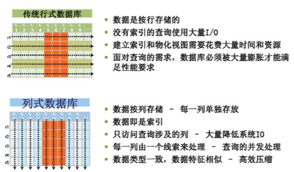
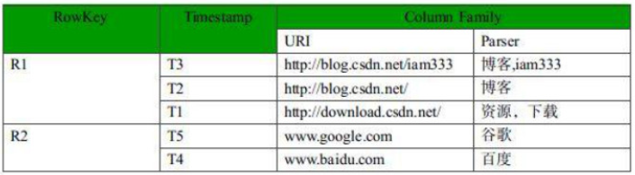
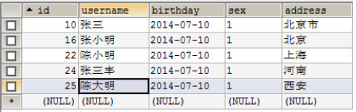
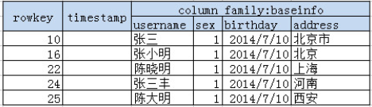

### 1.1 基本概念

hbase是bigtable的开源java版本，是建立在hdfs之上。
提供高可靠性、高性能、列存储、可伸缩、实时读写nosql的数据库系统。
它介于**nosql**和**RDBMS**之间，仅能通过主键(**row key**)和主键的**range**来检索数据，仅支持单行事务(可通过hive支持来实现多表join等复杂操作)。
主要用来存储结构化和半结构化的松散数据。
Hbase查询数据功能很简单，不支持join等复杂操作，不支持复杂的事务（行级的事务）
Hbase中支持的数据类型：**`byte[]`**
与hadoop一样，Hbase目标主要依靠横向扩展，通过不断增加廉价的商用服务器，来增加计算和存储能力。
HBase中的表一般有这样的特点：

1. 大：一个表可以有上十亿行，上百万列
2. 面向列:面向列(族)的存储和权限控制，列(族)独立检索。
3. 稀疏:对于为空(null)的列，并不占用存储空间，因此，表可以设计的非常稀疏。

和行式数据库的区别

1. 行式数据库在分析的时候，将id,name,age,sex,score;完整的信息读入内存，造成大量的内存和IO浪费。
2. 列式数据库的思维是把行式数据库全部拆开，按照列的方式重新组合存储，一列所有的行的数据存放在一起。带来的好处就是，要分析男女就直接访问所有的男女信息，要分析销售额，就直接访问消费额相关的数据。

### 1.2 HBase表结构

1.表(**table**)：
用于存储管理数据，具有稀疏的、面向列的特点。HBase中的每一张表，就是所谓的大表(Bigtable)，可以有上亿行，上百万列。对于为值为空的列，并不占用存储空间，因此表可以设计的非常稀疏。

2.行键(**RowKey**)：
类似于MySQL中的主键，HBase根据行键来快速检索数据，一个行键对应一条记录。与MySQL主键不同的是，HBase的行键是天然固有的，每一行数据都存在行键。

3.列族(**ColumnFamily**)：
是列的集合。列族在表定义时需要指定，而列在插入数据时动态指定。列中的数据都是以二进制形式存在，没有数据类型。在物理存储结构上，每个表中的每个列族单独以一个文件存储(参见图1.2)。一个表可以有多个列簇。

4.时间戳(**TimeStamp**)：
是列的一个属性，是一个64位整数。由行键和列确定的单元格，可以存储多个数据，每个数据含有时间戳属性，数据具有版本特性。
可根据版本(VERSIONS)或时间戳来指定查询历史版本数据，如果都不指定，则默认返回最新版本的数据。

5.区域(**Region**)：
HBase自动把表水平划分成的多个区域，划分的区域随着数据的增大而增多。

#### 1.2.1 HBase与RDBMS表对比

mysql表

HBase表

相当于每个Cloumn Family对应一个关系型数据库的表

#### 1.2.2 HBase逻辑视图与物理视图

**逻辑视图**如下：

| Row Key           | Time Stamp | ColumnFamily `contents`   | ColumnFamily `anchor`         | ColumnFamily `people`      |
| ----------------- | ---------- | ------------------------- | ----------------------------- | -------------------------- |
| "com.cnn.www"     | t9         |                           | anchor:cnnsi.com = "CNN"      |                            |
| "com.cnn.www"     | t8         |                           | anchor:my.look.ca = "CNN.com" |                            |
| "com.cnn.www"     | t6         | contents:html = "<html>…" |                               |                            |
| "com.cnn.www"     | t5         | contents:html = "<html>…" |                               |                            |
| "com.cnn.www"     | t3         | contents:html = "<html>…" |                               |                            |
| "com.example.www" | t5         | contents:html = "<html>…" |                               | people:author = "John Doe" |

Cells中为空的字段是不会占用空间的，HBase存储的“稀疏”的数据

**物理视图**如下：

| Row Key       | Time Stamp | Column Family `anchor`          |
| ------------- | ---------- | ------------------------------- |
| "com.cnn.www" | t9         | `anchor:cnnsi.com = "CNN"`      |
| "com.cnn.www" | t8         | `anchor:my.look.ca = "CNN.com"` |

| Row Key       | Time Stamp | ColumnFamily `contents:`  |
| ------------- | ---------- | ------------------------- |
| "com.cnn.www" | t6         | contents:html = "<html>…" |
| "com.cnn.www" | t5         | contents:html = "<html>…" |
| "com.cnn.www" | t3         | contents:html = "<html>…" |

在逻辑视图中的“html”的“t8”和“t9”版本根本就没有存储，这样对于这个版本的查询就没有返回值，但是如果版本不指定就会返回最近的一个版本数据
Thus a request for the values of all columns in the row **`com.cnn.www`** if **no timestamp** is specified would be: 
the value of **`contents:html`** from timestamp t6,
the value of **`anchor:cnnsi.com`** from timestamp t9, 
the value of **`anchor:my.look.ca`** from timestamp t8.

