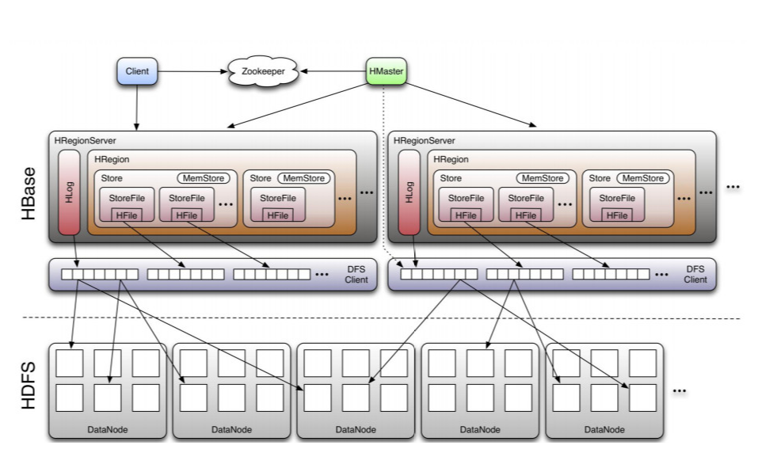
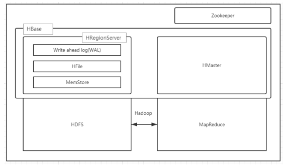

### 2.1 基于HDFS的HBase

HDFS 一种是作为存储的分布式文件系统，另一种是作为数据处理模型的 MR 框架。因为日常开发人员比较熟练的是结构化的数据进行处理，但是在 HDFS 直接存储的文件往往不具有结构化，所以催生出了 HBase 在 HDFS 上的操作。如果需要查询数据，只需要通过键值便可以成功访问。
下图是HBase的整体架构





Table                    (HBase table)
​    Region               (Regions for the table)
​        Store            (Store per ColumnFamily for each Region for the table)
​            MemStore     (MemStore for each Store for each Region for the table)
​            StoreFile    (StoreFiles for each Store for each Region for the table)
​                Block    (Blocks within a StoreFile within a Store for each Region for the table)

### 2.2 HBase的角色

#### 2.2.1 、HMaster

功能：
1) 监控 RegionServer
2) 处理 RegionServer 故障转移
3) 处理元数据的变更
4) 处理 region 的分配或移除
5) 在空闲时间进行数据的负载均衡
6) 通过 Zookeeper 发布自己的位置给客户端

#### 2.2.2 、RegionServer

功能：
1) 负责存储 HBase 的实际数据
2) 处理分配给它的 Region
3) 刷新缓存到 HDFS
4) 维护 HLog
5) 执行压缩
6) 负责处理 Region 分片

#### 2.2.3.Client

HBase Client通过查询hbase:meta表来查找服务于特定RowKey范围的RegionServers 。
在找到所需的RegionServers之后，Client与服务于该区域的RegionServer通信发出读或写请求，不通过HMaster。这些信息会缓存在客户机中，以便后续请求不需要经过查找过程

```java
//Pre-Creating a Connection
// Create a connection to the cluster.
Configuration conf = HBaseConfiguration.create();
try (Connection connection = ConnectionFactory.createConnection(conf);
     Table table = connection.getTable(TableName.valueOf(tablename))) {
  // use table as needed, the table returned is lightweight
}
```

### 2.3. HBase的组件：

#### 2.3.1 HLog

​	HBase 的修改记录，当对 HBase 读写数据的时候，数据不是直接写进磁盘，它会在内存中保留一段时间（时间以及数据量阈值可以设定）。但把数据保存在内存中可能有更高的概率引起数据丢失，为了解决这个问题，数据会先写在一个叫做 Write-Ahead logfile 的文件中，然后再写入内存中。所以在系统出现故障的时候，数据可以通过这个日志文件重建。
​	每个HRegionServer中都会有一个HLog对象，HLog是一个实现Write Ahead Log的类，每次用户操作写入Memstore的同时，也会写一份数据到HLog文件，HLog文件定期会滚动更新，并删除旧的文件(已持久化到StoreFile中的数据)。当HRegionServer意外终止后，HMaster会通过Zookeeper感知，HMaster首先处理遗留的HLog文件，将不同region的log数据拆分，分别放到相应region目录下，然后再将失效的region重新分配，领取到这些region的HRegionServer在Load Region的过程中，会发现有历史HLog需要处理，因此会Replay HLog中的数据到MemStore中，然后flush到StoreFiles，完成数据恢复。

#### 2.3.2 HRegion

Hbase 表的分片，HBase 表会根据 RowKey 值被切分成不同的 region 存储在 RegionServer 中，在一个 RegionServer 中可以有多个不同的 region
一个表最开始存储的时候，是一个region也可以初始指定多个region。
一个Region中会有个多个store，每个store用来存储一个列簇。如果只有一个column family，就只有一个store。
region会随着插入的数据越来越多，会进行拆分。默认大小是10G一个。

#### 2.3.3 Store/MemStore/HFile

- **`Store`**是HBase存储的核心，由MemStore和StoreFile组成，一个 Store 对应 HBase 表中的一个列族。
- **`MemStore`**就是内存存储，位于内存中，用来保存当前的数据操作，所以当数据保存在 WAL中之后，RegsionServer 会在内存中存储键值对。
- **`HFile`**这是在磁盘上保存原始数据的实际的物理文件，是实际的存储文件。

用户写入数据的流程为：
client写入 -> 存入MemStore，一直到MemStore满 -> Flush成一个StoreFile，直至增长到一定阈值 -> 触发Compact合并操作 -> 多个StoreFile合并成一个StoreFile，同时进行版本合并和数据删除 -> 当StoreFiles Compact后，逐步形成越来越大的StoreFile -> 单个StoreFile大小超过一定阈值后，触发Split操作，把当前Region Split成2个Region，Region会下线，新Split出的2个孩子Region会被HMaster分配到相应的HRegionServer上，使得原先1个Region的压力得以分流到2个Region上，如图所示。