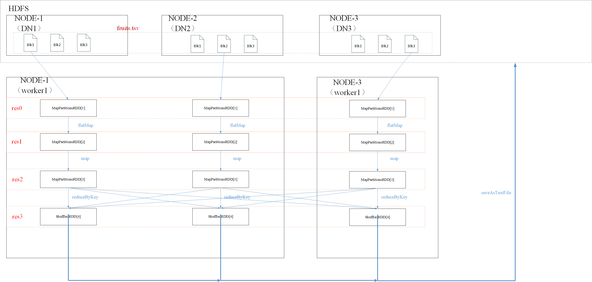
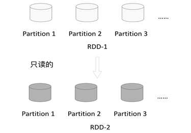
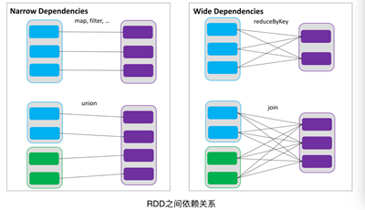
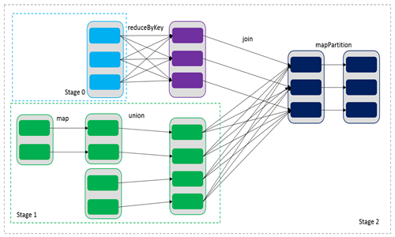

## 1.1 RDD概念

RDD（Resilient Distributed Dataset）叫做弹性分布式数据集，是Spark中最基本的数据抽象，它代表一个不可变、可分区、里面的元素可并行计算的集合。RDD具有数据流模型的特点：自动容错、位置感知性调度和可伸缩性。RDD允许用户在执行多个查询时显式地将数据缓存在内存中，后续的查询能够重用这些数据，这极大地提升了查询速度。

- Dataset:一个数据集，简单的理解为集合，用于存放数据的
- Distributed：它的数据是分布式存储，并且可以做分布式的计算
- Resilient：
  - 可容错，可扩容
  - 它表示的是数据可以保存在磁盘，也可以保存在内存中

## 1.2 RDD的五大特性

1. A list of partitions：每个RDD都有一个分区列表
2. A function for computing each split：作用在每个分区上面的函数
3. A list of dependencies on other RDDs：一个RDD依赖其他多个RDD,这个特性很重要，rdd的容错机制就是根据这个特性而来的
4. Optionally, a Partitioner for key-value RDDs (e.g. to say that the RDD is hash-partitioned)：可选项：针对于 kv 键值对的RDD才具有该分区特性
5. Optionally, a list of preferred locations to compute each split on (e.g. block locations for
   an HDFS file)：可选项 ：   数据本地性，数据最优，选择存有数据的worker节点进行计算任务。 

以一个WordCount为例来理解：

```scala
val file = sc.textFile("hdfs://hadoop102:9000/input_fruit/fruits.tsv")

val result = file.flatMap(_.split("\t")).map((_,1)).reduceByKey(_+_)
result.saveAsTextFile("hdfs://hadoop102:9000/fruitsWordCount.txt")
```

例如**`fruits.tsv`**有**3**个**`block`**，交给2个spack worker处理



说明：
1.一个分区列表，
​	如res0 MapPartitionRDD有3个分区.
2.计算函数
​	res1的生成函数为 flatMap
3.一个RDD依赖其他多个RDD,
​	如res1依赖res2，也有可能一个RDD依赖多个RDD生成（rdd1.jion(rdd2)）
4.Partitioner
​	针对于 kv 键值对的RDD才具有该分区特性，默认为HashParitioner
5.数据本地性
​	将计算移动贴近数据


### **`也有以下说法`**

#### 分区

​	RDD逻辑上是分区的，每个分区的数据是抽象存在的，计算的时候会通过一个compute函数得到每个分区的数据。

#### 只读

​    如下图所示，RDD是只读的，要想改变RDD中的数据，只能在现有的RDD基础上创建新的RDD。

​				        

### 依赖

​        RDDs通过操作算子进行转换，转换得到的新RDD包含了从其他RDDs衍生所必需的信息，RDDs之间维护着这种血缘关系，也称之为依赖。如下图所示，依赖包括两种，一种是窄依赖，RDDs之间分区是一一对应的，另一种是宽依赖，下游RDD的每个分区与上游RDD(也称之为父RDD)的每个分区都有关，是多对多的关系。



​	通过RDDs之间的这种依赖关系，一个任务流可以描述为DAG(有向无环图)，如下图所示，在实际执行过程中宽依赖对应于Shuffle(图中的reduceByKey和join)，窄依赖中的所有转换操作可以通过类似于管道的方式一气呵成执行(图中map和union可以一起执行)。



### 缓存

​    如果在应用程序中多次使用同一个RDD，可以将该RDD缓存起来，该RDD只有在第一次计算的时候会根据血缘关系得到分区的数据，在后续其他地方用到该RDD的时候，会直接从缓存处取而不用再根据血缘关系计算，这样就加速后期的重用。

### checkpoint

   虽然RDD的血缘关系天然地可以实现容错，当RDD的某个分区数据失败或丢失，可以通过血缘关系重建。但是对于长时间迭代型应用来说，随着迭代的进行，RDDs之间的血缘关系会越来越长，一旦在后续迭代过程中出错，则需要通过非常长的血缘关系去重建，势必影响性能。为此，RDD支持checkpoint将数据保存到持久化的存储中，这样就可以切断之前的血缘关系，因为checkpoint后的RDD不需要知道它的父RDDs了，它可以从checkpoint处拿到数据。

## 3. 为什么会产生RDD

（1）    传统的MapReduce虽然具有自动容错、平衡负载和可拓展性的优点，但是其最大缺点是采用非循环式的数据流模型，使得在迭代计算中要进行大量的磁盘IO操作。RDD正是解决这一缺点的抽象方法。 

（2）     RDD是Spark提供的最重要的抽象的概念，它是一种具有容错机制的特殊集合，可以分布在集群的节点上，以函数式编程来操作集合，进行各种并行操作。**可以把RDD的结果数据进行缓存，方便进行多次重用，避免重复计算。**