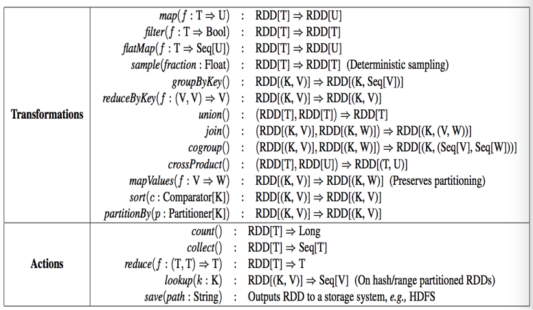
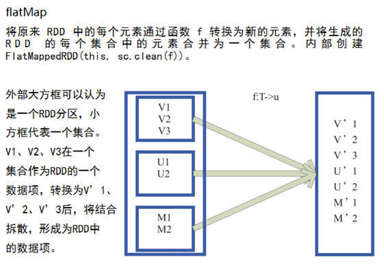
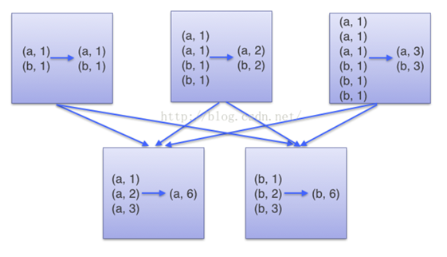
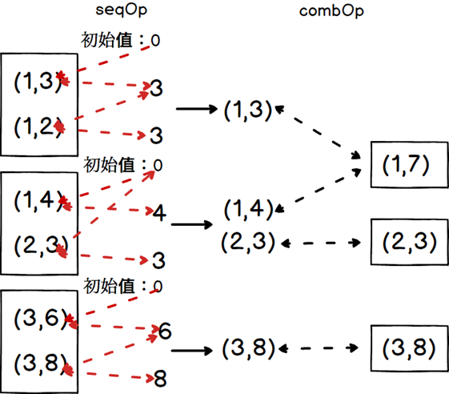
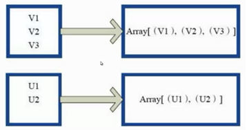
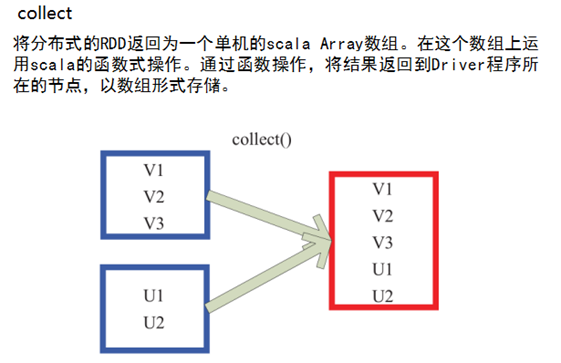
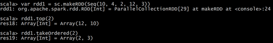
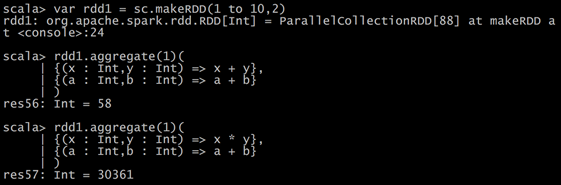
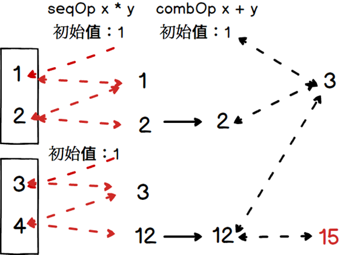
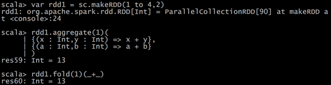

## 1    RDD的算子分类

**Transformation**（转换）：根据数据集创建一个新的数据集，计算后返回一个新RDD；例如：一个rdd进行map操作后生了一个新的rdd。

**Action**（动作）：对rdd结果计算后返回一个数值value给驱动程序；

例如：collect算子将数据集的所有元素收集完成返回给驱动程序。




## 2   RDD的Transformation算子

### 2.1 map			RDD[T: ClassTag]

```scala
  def map[U: ClassTag](f: T => U): RDD[U]
```

使用：

```scala
scala> sc.parallelize(1 to 100)
res0: org.apache.spark.rdd.RDD[Int] = ParallelCollectionRDD[0] at parallelize at <console>:25

scala> res0.map(_+10)
res1: org.apache.spark.rdd.RDD[Int] = MapPartitionsRDD[1] at map at <console>:27

scala> res1.collect
res2: Array[Int] = Array(11, 12, 13...)

```

### 2.2 filter		RDD[T: ClassTag]

```scala
def filter(f: T => Boolean): RDD[T] 
```

使用

```
scala> res2.filter(_<21)
res3: Array[Int] = Array(11, 12, 13, 14, 15, 16, 17, 18, 19, 20)
```

### 2.3 flatMap		RDD[T: ClassTag]

```scala
def flatMap[U: ClassTag](f: T => TraversableOnce[U]): RDD[U]
```

使用

```
scala> val sourceFlat = sc.parallelize(1 to 5)
sourceFlat: org.apache.spark.rdd.RDD[Int] = ParallelCollectionRDD[12] at parallelize at <console>:24

scala> sourceFlat.collect()
res11: Array[Int] = Array(1, 2, 3, 4, 5)

scala> val flatMap = sourceFlat.flatMap(1 to _)
flatMap: org.apache.spark.rdd.RDD[Int] = MapPartitionsRDD[13] at flatMap at <console>:26

scala> flatMap.collect()
res12: Array[Int] = Array(1, 1, 2, 1, 2, 3, 1, 2, 3, 4, 1, 2, 3, 4, 5)
```



### 2.4 mapPartitions	RDD[T: ClassTag]

类似于map，但独立地在RDD的每一个分片上运行，因此在类型为T的RDD上运行时，func的函数类型必须是`Iterator[T]=> Iterator[U]`。假设有N个元素，有M个分区，那么map的函数的将被调用N次,而mapPartitions被调用M次,一个函数一次处理所有分区

```scala
def mapPartitions[U: ClassTag](
    f: Iterator[T] => Iterator[U],
    preservesPartitioning: Boolean = false): RDD[U]
```

使用

```scala
val result = IPLogInfoRDD.mapPartitions(iter => {
  val IPLocation:Array[(String, String, String, String, String)] = IPLocationBroadcast.value

  iter.map(x => {
    val ipLong: Long = ipToLong(x)
    val IPLocationItem: (String, String, String, String, String) = IPLocation(binarySearh(ipLong, IPLocation).toInt)
    ((IPLocationItem._4, IPLocationItem._5), 1)
  })
})
```

### 2.5 sample

以指定的随机种子随机抽样出数量为**fraction**的数据，**withReplacement**表示是抽出的数据是否放回，true为有放回的抽样，false为无放回的抽样，**seed**用于指定随机数生成器种子。例子从RDD中随机且有放回的抽出50%的数据，随机种子值为3（即可能以1 2 3的其中一个起始值）

```scala
def sample(
    withReplacement: Boolean,
    fraction: Double,
    seed: Long = Utils.random.nextLong): RDD[T]
```

使用

```
scala> var source = sc.parallelize(1 to 20)
source: org.apache.spark.rdd.RDD[Int] = ParallelCollectionRDD[5] at parallelize at <console>:24

scala> source.sample(true,0.3,4).collect
res20: Array[Int] = Array(2, 6, 7, 10, 11, 11)

scala> source.sample(false,0.3,4).collect
res21: Array[Int] = Array(2, 6, 11, 15)
```

### 2.6 union

对源RDD和参数RDD求并集后返回一个新的RDD

```scala
def union(other: RDD[T]): RDD[T]
```

```
scala> val rdd1 = sc.parallelize(1 to 5)
rdd1: org.apache.spark.rdd.RDD[Int] = ParallelCollectionRDD[13] at parallelize at <console>:24

scala> val rdd2 = sc.parallelize(3 to 10)
rdd2: org.apache.spark.rdd.RDD[Int] = ParallelCollectionRDD[14] at parallelize at <console>:24

scala> rdd1.union(rdd2).collect
res22: Array[Int] = Array(1, 2, 3, 4, 5, 3, 4, 5, 6, 7, 8, 9, 10)
```

### 2.7 intersection

```scala
def intersection(other: RDD[T]): RDD[T]
```

```
scala> rdd1.intersection(rdd2).collect
res23: Array[Int] = Array(4, 5, 3) 
```

### 2.8 distinct([numTasks]))

```scala
def distinct(numPartitions: Int)(implicit ord: Ordering[T] = null): RDD[T]
```

### 2.9 partitionBy

对RDD进行分区操作，如果原有的partionRDD和现有的partionRDD是一致的话就不进行分区， 否则会生成ShuffleRDD. 

```
scala> val rdd = sc.parallelize(Array((1,"aaa"),(2,"bbb"),(3,"ccc"),(4,"ddd")),4)
rdd: org.apache.spark.rdd.RDD[(Int, String)] = ParallelCollectionRDD[28] at parallelize at <console>:24

scala> rdd.partitions.size
res25: Int = 4

scala> var rdd2 = rdd.partitionBy(new org.apache.spark.HashPartitioner(2))
rdd2: org.apache.spark.rdd.RDD[(Int, String)] = ShuffledRDD[29] at partitionBy at <console>:26

scala> rdd.partitions.size
res26: Int = 4
```

### 2.10 reduceByKey

在一个(K,V)的RDD上调用，返回一个(K,V)的RDD，使用指定的reduce函数，将相同key的值聚合到一起，reduce任务的个数可以通过numPartitions可选的参数来设置

```scala
def reduceByKey(func: (V, V) => V, numPartitions: Int): RDD[(K, V)] = self.withScope {
    reduceByKey(new HashPartitioner(numPartitions), func)
 }

def reduceByKey(partitioner: Partitioner, func: (V, V) => V): RDD[(K, V)] = self.withScope {
    combineByKeyWithClassTag[V]((v: V) => v, func, func, partitioner)
 }
```

```
scala> val rdd = sc.parallelize(List(("female",1),("male",5),("female",5),("male",2)))
rdd: org.apache.spark.rdd.RDD[(String, Int)] = ParallelCollectionRDD[46] at parallelize at <console>:24

scala> val reduce = rdd.reduceByKey((x,y) => x+y)
reduce: org.apache.spark.rdd.RDD[(String, Int)] = ShuffledRDD[47] at reduceByKey at <console>:26

scala> reduce.collect()
res29: Array[(String, Int)] = Array((female,6), (male,7))
```

### 2.11 groupByKey

**groupByKey**也是对每个key进行操作，但只生成一个sequence。



```
scala> val words = Array("one", "two", "two", "three", "three", "three")
words: Array[String] = Array(one, two, two, three, three, three)

scala> val wordPairsRDD = sc.parallelize(words).map(word => (word, 1))
wordPairsRDD: org.apache.spark.rdd.RDD[(String, Int)] = MapPartitionsRDD[1] at map at <console>:26

scala> val group = wordPairsRDD.groupByKey().collect
group: Array[(String, Iterable[Int])] = Array((two,CompactBuffer(1, 1)), (one,CompactBuffer(1)), (three,CompactBuffer(1, 1, 1)))
```

### 2.12 combineByKey

对相同K，把V合并成一个集合.

**createCombiner**: combineByKey() 会遍历分区中的所有元素，因此每个元素的键要么还没有遇到过，要么就 和之前的某个元素的键相同。如果这是一个新的元素,combinerByKey() 会使用一个叫作 createCombiner() 的函数来创建  那个键对应的累加器的初始值

**mergeValue:** 如果这是一个在处理当前分区之前已经遇到的键， 它会使用 mergeValue() 方法将该键的累加器对应的当前值与这个新的值进行合并mergeCombiners:由于每个分区都是独立处理的，因此对于同一个键可以有多个累加器。如果有两个或者更多的分区都有对应同一个键的累加器，就需要使用用户提供的

mergeCombiners() 方法将各个分区的结果进行合并。

```scala
def combineByKey[C](
    createCombiner: V => C,
    mergeValue: (C, V) => C,
    mergeCombiners: (C, C) => C,
    numPartitions: Int): RDD[(K, C)] = self.withScope {
  combineByKeyWithClassTag(createCombiner, mergeValue, mergeCombiners, numPartitions)(null)
}
```
求平均分

```
scala> val scores = Array(("Fred", 88), ("Fred", 95), ("Fred", 91), ("Wilma", 93), ("Wilma", 95), ("Wilma", 98))
scores: Array[(String, Int)] = Array((Fred,88), (Fred,95), (Fred,91), (Wilma,93), (Wilma,95), (Wilma,98))

scala> val input = sc.parallelize(scores)
input: org.apache.spark.rdd.RDD[(String, Int)] = ParallelCollectionRDD[3] at parallelize at <console>:26

scala> val combine = input.combineByKey(
     |     (v)=>(v,1),
     |     (acc:(Int,Int),v)=>(acc._1+v,acc._2+1),
     |     (acc1:(Int,Int),acc2:(Int,Int))=>(acc1._1+acc2._1,acc1._2+acc2._2))
combine: org.apache.spark.rdd.RDD[(String, (Int, Int))] = ShuffledRDD[53] at combineByKey at <console>:28

scala> val result = combine.map{
     |     case (key,value) => (key,value._1/value._2.toDouble)}
result: org.apache.spark.rdd.RDD[(String, Double)] = MapPartitionsRDD[54] at map at <console>:30

scala> result.collect()
res33: Array[(String, Double)] = Array((Wilma,95.33333333333333), (Fred,91.33333333333333))

```

### 2.13 aggregateByKey

```scala
def aggregateByKey[U: ClassTag](zeroValue: U, partitioner: Partitioner)(seqOp: (U, V) => U,combOp: (U, U) => U): RDD[(K, U)]
```

在kv对的RDD中，，按key将value进行分组合并，合并时，将每个value和初始值作为seq函数的参数，进行计算，返回的结果作为一个新的kv对，然后再将结果按照key进行合并，最后将每个分组的value传递给combine函数进行计算（先将前两个value进行计算，将返回结果和下一个value传给combine函数，以此类推），将key与计算结果作为一个新的kv对输出。seqOp函数用于在每一个分区中用初始值逐步迭代value，combOp函数用于合并每个分区中的结果



```
scala> val rdd = sc.parallelize(List((1,3),(1,2),(1,4),(2,3),(3,6),(3,8)),3)
rdd: org.apache.spark.rdd.RDD[(Int, Int)] = ParallelCollectionRDD[0] at parallelize at <console>:24

scala> val agg = rdd.aggregateByKey(0)(math.max(_,_),_+_)
agg: org.apache.spark.rdd.RDD[(Int, Int)] = ShuffledRDD[1] at aggregateByKey at <console>:26

scala> val rdd = sc.parallelize(List((1,3),(1,2),(1,4),(2,3),(3,6),(3,8)),3)
rdd: org.apache.spark.rdd.RDD[(Int, Int)] = ParallelCollectionRDD[0] at parallelize at <console>:24

scala> val agg = rdd.aggregateByKey(0)(math.max(_,_),_+_)
agg: org.apache.spark.rdd.RDD[(Int, Int)] = ShuffledRDD[1] at aggregateByKey at <console>:26
```

### 2.14 foldByKey

```scala
def foldByKey(zeroValue: V)(func: (V, V) => V): RDD[(K, V)]
```

**aggregateByKey的简化操作，seqop和combop相同**

```
scala> val file = sc.textFile("hdfs://hadoop102:9000/input_fruit/fruits.tsv")
file: org.apache.spark.rdd.RDD[String] = hdfs://hadoop102:9000/input_fruit/fruits.tsv MapPartitionsRDD[1] at textFile at <console>:24

scala> file.flatMap(_.split("\t"))
res0: org.apache.spark.rdd.RDD[String] = MapPartitionsRDD[2] at flatMap at <console>:27

scala> res0.map((_,1))
res1: org.apache.spark.rdd.RDD[(String, Int)] = MapPartitionsRDD[3] at map at <console>:29

scala> res1.foldByKey(0)(_+_)
res5: org.apache.spark.rdd.RDD[(String, Int)] = ShuffledRDD[4] at foldByKey at <console>:31

scala> res5.collect
res6: Array[(String, Int)] = Array((pear,1), (1001,1), (pineapple,1), (apple,1), (yellow,2), (1003,1), (1002,1), (red,1))
```

### 2.15 **sortByKey([ascending],[numTasks])**

在一个(K,V)的RDD上调用，K必须实现Ordered接口，返回一个按照key进行排序的(K,V)的RDD

### 2.16 **sortBy(func,[ascending],[numTasks])**

与sortByKey类似，但是更灵活,可以用func先对数据进行处理，按照处理后的数据比较结果排序。

### 2.17 **join(otherDataset,[numTasks])**

在类型为(K,V)和(K,W)的RDD上调用，返回一个相同key对应的所有元素对在一起的(K,(V,W))的RDD

### 2.18 **cogroup(otherDataset,[numTasks])**

在类型为(K,V)和(K,W)的RDD上调用，返回一个(K,(Iterable<V>,Iterable<W>))类型的RDD

### 2.19 **coalesce(numPartitions)**

缩减分区数，用于大数据集过滤后，提高小数据集的执行效率

### 2.20 **repartition(numPartitions)**

根据分区数，从新通过网络随机洗牌所有数据

### 2.21 **glom**

将每一个分区形成一个数组，形成新的RDD类型时RDD[Array[T]]



### 2.22 **mapValues**

针对于(K,V)形式的类型只对V进行操作


## 3 RDD的action算子

### 3.1 reduce

全部聚合

```scala
def reduce(f: (T, T) => T): T
```



### 3.2 reduceByKey

通过key聚合

```scala
def reduceByKey(func: (V, V) => V): RDD[(K, V)]
```

```scala
//todo:分组聚合
val resultFinal: RDD[((String, String), Int)] = result.reduceByKey(_+_)
```


### 3.3 count

返回RDD的元素个数

### 3.4 first

返回RDD的第一个元素（类似于take(1)）

### 3.5 take

返回一个由数据集的前n个元素组成的数组

### 3.6 takeSample(withReplacement,num,[seed])

返回一个数组，该数组由从数据集中随机采样的num个元素组成，可以选择是否用随机数替换不足的部分，seed用于指定随机数生成器种子

### 3.7 takeOrdered(n)

返回前几个的排序



### 3.8 aggregate(zeroValue: U)(seqOp: (U, T) ⇒ U, combOp: (U, U) ⇒ U)

aggregate函数将每个分区里面的元素通过seqOp和初始值进行聚合，然后用combine函数将每个分区的结果和初始值(zeroValue)进行combine操作。这个函数最终返回的类型不需要和RDD中元素类型一致





### 3.9 fold(num)(func)

折叠操作，aggregate的简化操作，seqop和combop一样。



### 3.10 saveAsTextFile(path)

将数据集的元素以textfile的形式保存到HDFS文件系统或者其他支持的文件系统，对于每个元素，Spark将会调用toString方法，将它装换为文件中的文本

### 3.11 countByKey

针对(K,V)类型的RDD，返回一个(K,Int)的map，表示每一个key对应的元素个数。

### 3.12 foreach(func)

在数据集的每一个元素上，运行函数func进行更新


## 4 数值RDD的统计操作