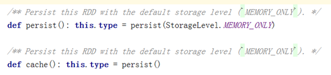
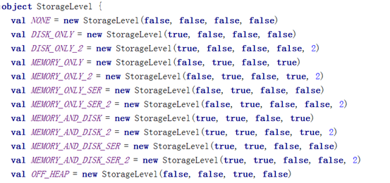
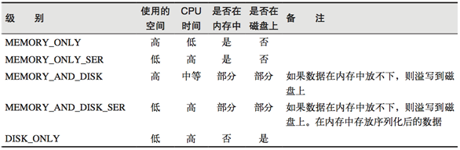
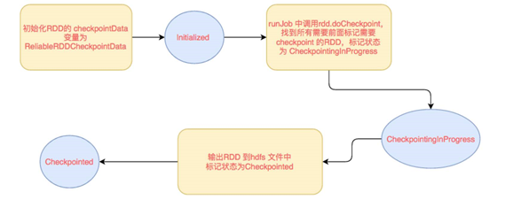
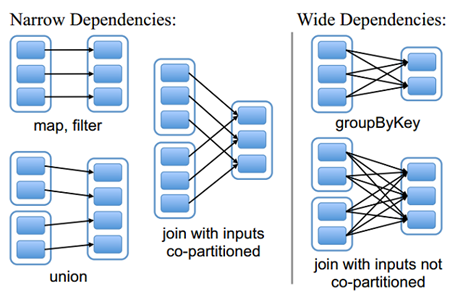
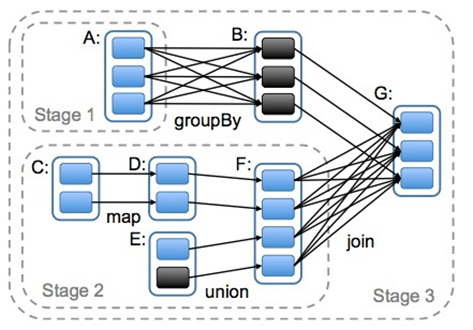

## 1.RDD持久化

### 1.1    RDD的缓存

Spark速度非常快的原因之一，就是在不同操作中可以在内存中持久化或缓存个数据集。当持久化某个RDD后，每一个节点都将把计算的分片结果保存在内存中，并在对此RDD或衍生出的RDD进行的其他动作中重用。这使得后续的动作变得更加迅速。RDD相关的持久化和缓存，是Spark最重要的特征之一。

### 1.2    RDD缓存方式

RDD通过persist方法或cache方法可以将前面的计算结果缓存，默认情况下 persist() 会把数据以序列化的形式缓存在 JVM 的堆空 间中。 但是并不是这两个方法被调用时立即缓存，而是触发后面的action时，该RDD将会被缓存在计算节点的内存中，并供后面重用。通过查看源码发现cache最终也是调用了persist方法，默认的存储级别都是仅在内存存储一份，Spark的存储级别还有好多种，存储级别在object StorageLevel中定义的

## 2.RDD检查点

cache 和 checkpoint 是有显著区别的，  缓存把 RDD 计算出来然后放在内存中，但是RDD 的依赖链（相当于数据库中的redo 日志）， 也不能丢掉， 当某个点某个 executor 宕了，上面cache 的RDD就会丢掉， 需要通过 依赖链重放计算出来， 不同的是， checkpoint 是把 RDD 保存在 HDFS中， 是多副本可靠存储，所以依赖链就可以丢掉了，就斩断了依赖链， 是通过复制实现的高容错。

如果存在以下场景，则比较适合使用检查点机制：

1)   DAG中的Lineage过长，如果重算，则开销太大（如在PageRank中）。

2)   在宽依赖上做Checkpoint获得的收益更大。为当前RDD设置检查点。该函数将会创建一个二进制的文件，并存储到checkpoint目录中，该目录是用SparkContext.setCheckpointDir()设置的。在checkpoint的过程中，该RDD的所有依赖于父RDD中的信息将全部被移出。

### 2.1 checkpoint写流程

### 2.2 checkpoint读流程

## 3.RDD依赖

### 3.1    窄依赖

窄依赖指的是每一个父RDD的Partition最多被子RDD的一个Partition使用

多对一的映射关系

### 3.2    宽依赖

宽依赖指的是多个子RDD的Partition会依赖同一个父RDD的Partition，会引起shuffle

多对多的映射关系

### 3.3    Lineage

RDD只支持粗粒度转换，即在大量记录上执行的单个操作。将创建RDD的一系列Lineage（即血统）记录下来，以便恢复丢失的分区。RDD的Lineage会记录RDD的元数据信息和转换行为，当该RDD的部分分区数据丢失时，它可以根据这些信息来重新运算和恢复丢失的数据分区。

## 4.DAG

DAG(Directed Acyclic Graph)叫做有向无环图，原始的RDD通过一系列的转换就就形成了DAG，根据RDD之间的依赖关系的不同将DAG划分成不同的Stage，对于窄依赖，partition的转换处理在Stage中完成计算。对于宽依赖，由于有Shuffle的存在，只能在parent RDD处理完成后，才能开始接下来的计算，因此宽依赖是划分Stage的依据。

# 5.键值对RDD