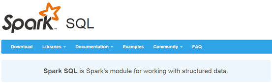
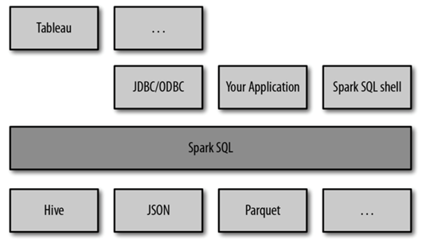
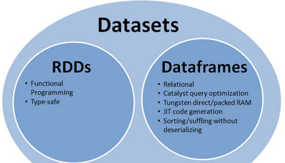
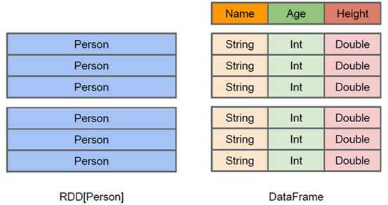
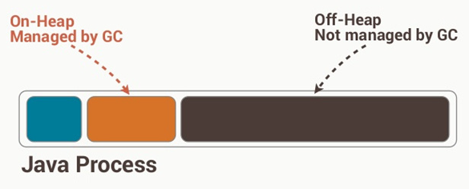
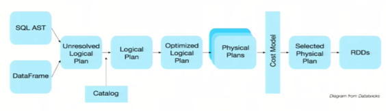
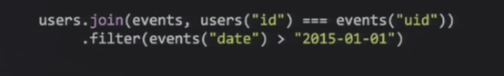
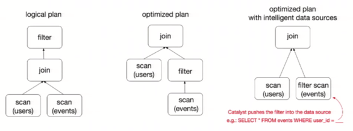
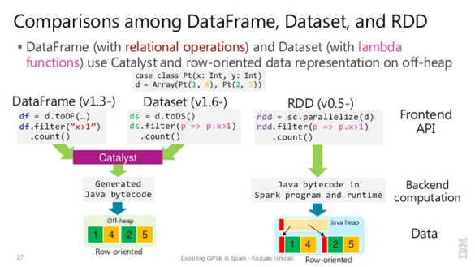

Spark SQL是Spark用来处理结构化数据的一个模块，它提供了一个编程抽象叫做DataFrame并且作为分布式SQL查询引擎的作用。

我们已经学习了Hive，它是将Hive SQL转换成MapReduce然后提交到集群上执行，大大简化了编写MapReduce的程序的复杂性，由于MapReduce这种计算模型执行效率比较慢。所有Spark SQL的应运而生，它是将Spark SQL转换成RDD，然后提交到集群执行，执行效率非常快！



SparkSQL可以看做是一个转换层，向下对接各种不同的结构化数据源，向上提供不同的数据访问方式。


## 1  RDD     DataFrames     DataSet



### 1.1  RDD

1. RDD是一个懒执行的不可变的可以支持Lambda表达式的并行数据集合。
2. RDD的最大好处就是简单，API的人性化程度很高。
3. RDD的劣势是性能限制，它是一个JVM驻内存对象，这也就决定了存在GC的限制和数据增加时Java序列化成本的升高。

### 1.2  Dataframe

与RDD类似，DataFrame也是一个分布式数据容器。然而DataFrame更像传统数据库的二维表格，除了数据以外，还记录数据的结构信息，即schema。同时，与Hive类似，DataFrame也支持嵌套数据类型（struct、array和map）。从API易用性的角度上看，DataFrame API提供的是一套高层的关系操作，比函数式的RDD API要更加友好，门槛更低。由于与R和Pandas的DataFrame类似，Spark DataFrame很好地继承了传统单机数据分析的开发体验。



RDD是分布式的Java对象的集合。DataFrame是分布式的Row对象的集合。DataFrame是为数据提供了**Schema的视图**。可以把它当做**数据库中的一张表**来对待

DataFrame也是懒执行的。性能上比RDD要高，主要有两方面原因： 

**1.定制化内存管理**

数据以二进制的方式存在于非堆内存，节省了大量空间之外，还摆脱了GC的限制。



**2.优化的执行计划**
 查询计划通过Spark catalyst optimiser进行优化. 


比如下面一个例子：

 

 为了说明查询优化，我们来看上图展示的人口数据分析的示例。图中构造了两个DataFrame，将它们join之后又做了一次filter操作。如果原封不动地执行这个执行计划，最终的执行效率是不高的。因为join是一个代价较大的操作，也可能会产生一个较大的数据集。如果我们能将filter下推到 join下方，先对DataFrame进行过滤，再join过滤后的较小的结果集，便可以有效缩短执行时间。而Spark SQL的查询优化器正是这样做的。简而言之，逻辑查询计划优化就是一个利用基于关系代数的等价变换，将高成本的操作替换为低成本操作的过程。 

得到的优化执行计划在转换成物 理执行计划的过程中，还可以根据具体的数据源的特性将过滤条件下推至数据源内。最右侧的物理执行计划中Filter之所以消失不见，就是因为溶入了用于执行最终的读取操作的表扫描节点内。 

对于普通开发者而言，查询优化器的意义在于，即便是经验并不丰富的程序员写出的次优的查询，也可以被尽量转换为高效的形式予以执行。

Dataframe的劣势在于在编译期缺少类型安全检查，导致运行时出错


### 1.3 Dataset

1)     是Dataframe API的一个扩展，是Spark最新的数据抽象

2)     用户友好的API风格，既具有类型安全检查也具有Dataframe的查询优化特性。

3)     Dataset支持编解码器，当需要访问非堆上的数据时可以避免反序列化整个对象，提高了效率。

4)     样例类被用来在Dataset中定义数据的结构信息，样例类中每个属性的名称直接映射到DataSet中的字段名称。

5)     Dataframe是Dataset的特列，DataFrame=Dataset[Row] ，所以可以通过as方法将Dataframe转换为Dataset。Row是一个类型，跟Car、Person这些的类型一样，所有的表结构信息我都用Row来表示。

6)     DataSet是强类型的。比如可以有Dataset[Car]，Dataset[Person].

DataFrame只是知道字段，但是不知道字段的类型，所以在执行这些操作的时候是没办法在编译的时候检查是否类型失败的，比如你可以对一个String进行减法操作，在执行的时候才报错，而DataSet不仅仅知道字段，而且知道字段类型，所以有更严格的错误检查。就跟JSON对象和类对象之间的类比。




## 2   三者的共性

1、RDD、DataFrame、Dataset全都是spark平台下的分布式弹性数据集，为处理超大型数据提供便利

2、三者都有惰性机制，在进行创建、转换，如map方法时，不会立即执行，只有在遇到Action如foreach时，三者才会开始遍历运算，极端情况下，如果代码里面有创建、转换，但是后面没有在Action中使用对应的结果，在执行时会被直接跳过.

3、三者都会根据spark的内存情况自动缓存运算，这样即使数据量很大，也不用担心会内存溢出

4、三者都有partition的概念

5、三者有许多共同的函数，如filter，排序等

6、在对DataFrame和Dataset进行操作许多操作都需要这个包进行支持

  ```scala
import spark.implicits._
  ```

​    7、DataFrame和Dataset均可使用模式匹配获取各个字段的值和类型

DataFrame:

 ```scala
testDF.map{
      case Row(col1:String,col2:Int)=>
        println(col1);println(col2)
        col1
      case _=>
        ""
    }
 ```

Dataset:

```scala
case class Coltest(col1:String,col2:Int)extends Serializable //定义字段名和类型
    testDS.map{
      case Coltest(col1:String,col2:Int)=>
        println(col1);println(col2)
        col1
      case _=>
        ""
    }
```


### 3  三者的区别

### **3.1 RDD:**

1、RDD一般和spark mlib同时使用

2、RDD不支持sparksql操作

### 3.2 **DataFrame**

1、与RDD和Dataset不同，DataFrame每一行的类型固定为Row，只有通过解析才能获取各个字段的值，如

```scala
testDF.foreach{
  line =>
    val col1=line.getAs[String]("col1")
    val col2=line.getAs[String]("col2")
}

```

2、DataFrame与Dataset一般不与spark ml同时使用

3、DataFrame与Dataset均支持sparksql的操作，比如select，groupby之类，还能注册临时表/视窗，进行sql语句操作，如

```scala
dataDF.createOrReplaceTempView("tmp")
spark.sql("select  ROW,DATE from tmp where DATE is not null order by DATE").show(100,false)
```

4、DataFrame与Dataset支持一些特别方便的保存方式，比如保存成csv，可以带上表头，这样每一列的字段名一目了然

```scala
//保存
val saveoptions = Map("header" -> "true", "delimiter" -> "\t", "path" -> "hdfs://master01:9000/test")
datawDF.write.format("spark.csv").mode(SaveMode.Overwrite).options(saveoptions).save()
//读取
val options = Map("header" -> "true", "delimiter" -> "\t", "path" -> "hdfs://master01:9000/test")
val datarDF= spark.read.options(options).format("spark.csv").load()
```

### 3.3 **Dataset:**

Dataset和DataFrame拥有完全相同的成员函数，区别只是每一行的数据类型不同。

DataFrame也可以叫Dataset[Row],每一行的类型是Row，不解析，每一行究竟有哪些字段，各个字段又是什么类型都无从得知，只能用上面提到的getAS方法或者共性中的第七条提到的模式匹配拿出特定字段

而Dataset中，每一行是什么类型是不一定的，在自定义了case class之后可以很自由的获得每一行的信息

```scala
case class Coltest(col1:String,col2:Int)extends Serializable //定义字段名和类型
/**
 rdd
 ("a", 1)
 ("b", 1)
 ("a", 1)
**/
val test: Dataset[Coltest]=rdd.map{line=>
      Coltest(line._1,line._2)
    }.toDS
test.map{
      line=>
        println(line.col1)
        println(line.col2)
    }
```

