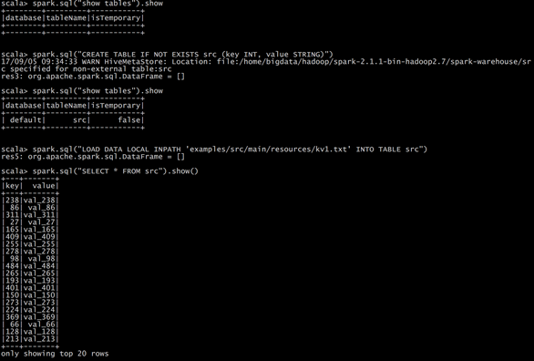
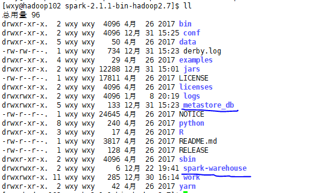

## 1.DataFrames创建

 在Spark SQL中SparkSession是创建DataFrames和执行SQL的入口，创建DataFrames有三种方式，

1.可以从一个存在的RDD进行转换

```scala
scala> val peopleRdd = sc.textFile("examples/src/main/resources/people.txt")
peopleRdd: org.apache.spark.rdd.RDD[String] = examples/src/main/resources/people.txt MapPartitionsRDD[7] at textFile at <console>:24

scala> val peopleDF3 = peopleRdd.map(_.split(",")).map(paras => (paras(0),paras(1).trim().toInt)).toDF("name","age")
peopleDF3: org.apache.spark.sql.DataFrame = [name: string, age: int]

scala> peopleDF3.show
+-------+---+
|   name|age|
+-------+---+
|Michael| 29|
|   Andy| 30|
| Justin| 19|
+-------+---+
```

2.可以从Hive Table进行查询返回


3.通过Spark的数据源进行创建(json/parquet/jdbc)

```scala
scala> spark.read.json("examples/src/main/resources/people.json")
res0: org.apache.spark.sql.DataFrame = [age: bigint, name: string]              

scala> res0.show
+----+-------+
| age|   name|
+----+-------+
|null|Michael|
|  30|   Andy|
|  19| Justin|
+----+-------+

```


## 2.DataSet创建

Dataset是具有强类型的数据集合，需要提供对应的类型信息。

### 2.1 通过反射推断Schema创建

同样适用于DataFrame（type DataFrame = DataSet[Row]）

```scala
scala> case class Person(name:String,age:Int)
defined class Person

scala> val peopleDF4 = peopleRdd.map(_.split(",")).map(paras => Person(paras(0),paras(1).trim().toInt)).toDF
peopleDF4: org.apache.spark.sql.DataFrame = [name: string, age: int]

scala> peopleDF4.show
+-------+---+
|   name|age|
+-------+---+
|Michael| 29|
|   Andy| 30|
| Justin| 19|
+-------+---+


scala> val peopleDS = peopleRdd.map(_.split(",")).map(paras => Person(paras(0),paras(1).trim().toInt)).toDS
peopleDS: org.apache.spark.sql.Dataset[Person] = [name: string, age: int]

scala> peopleDS.show
+-------+---+
|   name|age|
+-------+---+
|Michael| 29|
|   Andy| 30|
| Justin| 19|
+-------+---+
```

### 2.2 指定Schema创建

```scala
def apply(fields: Seq[StructField]): StructType

def apply(fields: java.util.List[StructField]): StructType
```

```scala
import org.apache.spark.sql.types._

// Create an RDD
val peopleRDD = spark.sparkContext.textFile("examples/src/main/resources/people.txt")

// The schema is encoded in a string,应该是动态通过程序生成的
val schemaString = "name age"

// Generate the schema based on the string of schema   Array[StructFiled]
val fields = schemaString.split(" ")
.map(fieldName => StructField(fieldName, StringType, nullable = true))

// val filed = schemaString.split(" ").map(filename=> filename match{ case "name"=> StructField(filename,StringType,nullable = true); case "age"=>StructField(filename, IntegerType,nullable = true)} )

val schema = StructType(fields)

// Convert records of the RDD (people) to Rows
import org.apache.spark.sql._
val rowRDD = peopleRDD
.map(_.split(","))
.map(attributes => Row(attributes(0), attributes(1).trim))

// Apply the schema to the RDD
val peopleDF = spark.createDataFrame(rowRDD, schema)

// Creates a temporary view using the DataFrame
peopleDF.createOrReplaceTempView("people")

// SQL can be run over a temporary view created using DataFrames
val results = spark.sql("SELECT name FROM people")

// The results of SQL queries are DataFrames and support all the normal RDD operations
// The columns of a row in the result can be accessed by field index or by field name
results.map(attributes => "Name: " + attributes(0)).show()
// +-------------+
// |        value|
// +-------------+
// |Name: Michael|
// |   Name: Andy|
// | Name: Justin|
// +-------------+
```


### 2.3 **DataFrame/Dataset/RDD相互装换**

```scala
// to RDD
val rdd1=testDF.rdd
val rdd2=testDS.rdd

// rddd to DF/DS
// spark是创建的SparkSeession对象，要导入隐式转换不然没有toDS/toDF
import spark.implicits._
val testDF1 = rdd.map {line=>
      (line._1,line._2)
    }.toDF("col1","col2")

import org.apache.spark.sql._
val testDF2 = rdd.map {line=>
      Row(line._1,line._2)
    }.toDF

import spark.implicits._
case class Coltest(col1:String,col2:Int)extends Serializable //定义字段名和类型
val testDS = rdd.map {line=>
      Coltest(line._1,line._2)
    }.toDS

// DS <==> DF
import spark.implicits._
val testDF = testDS.toDF

import spark.implicits._
case class Coltest(col1:String,col2:Int)extends Serializable //定义字段名和类型
val testDS = testDF.as[Coltest]
```


## 3.DSL与SQL

我们已经学习了Hive，它是将Hive SQL转换成MapReduce然后提交到集群中去执行，大大简化了编写MapReduce程序的复杂性，由于MapReduce这种计算模型执行效率比较慢，所以Spark SQL应运而生，它是将Spark SQL转换成RDD，然后提交到集群中去运行，执行效率非常快

```scala
import org.apache.spark.sql.SparkSession

val spark = SparkSession
.builder()
.appName("Spark SQL basic example")
.config("spark.some.config.option", "some-value")
.enableHiveSupport()
.getOrCreate()

// For implicit conversions like converting RDDs to DataFrames
import spark.implicits._
case class tbStock(ordernumber:String,locationid:String,dateid:String) extends Serializable
case class tbStockDetail(ordernumber:String, rownum:Int, itemid:String, number:Int, price:Double, amount:Double) extends Serializable
case class tbDate(dateid:String, years:Int, theyear:Int, month:Int, day:Int, weekday:Int, week:Int, quarter:Int, period:Int, halfmonth:Int) extends Serializable

val tbStockRdd = spark.sparkContext.textFile("tbStock.txt")
val tbStockDS = tbStockRdd.map(_.split(",")).map(attr=>tbStock(attr(0),attr(1),attr(2))).toDS

val tbStockDetailRdd = spark.sparkContext.textFile("tbStockDetail.txt")
val tbStockDetailDS = tbStockDetailRdd.map(_.split(",")).map(attr=> tbStockDetail(attr(0),attr(1).trim().toInt,attr(2),attr(3).trim().toInt,attr(4).trim().toDouble, attr(5).trim().toDouble)).toDS

val tbDateRdd = spark.sparkContext.textFile("tbDate.txt")
val tbDateDS = tbDateRdd.map(_.split(",")).map(attr=> tbDate(attr(0),attr(1).trim().toInt, attr(2).trim().toInt,attr(3).trim().toInt, attr(4).trim().toInt, attr(5).trim().toInt, attr(6).trim().toInt, attr(7).trim().toInt, attr(8).trim().toInt, attr(9).trim().toInt)).toDS

tbStockDS.createOrReplaceTempView("tbStock")
tbDateDS.createOrReplaceTempView("tbDate")
tbStockDetailDS.createOrReplaceTempView("tbStockDetail")
```

```scala
//计算所有订单中每年最畅销货品
/*1.求出每年每个货品的销售额
SELECT c.theyear, b.itemid, SUM(b.amount) AS SumOfAmount
FROM tbStock a
	JOIN tbStockDetail b ON a.ordernumber = b.ordernumber
	JOIN tbDate c ON a.dateid = c.dateid
GROUP BY c.theyear, b.itemid
*/

/*2.统计每年单个货品中的最大金额
SELECT d.theyear, MAX(d.SumOfAmount) AS MaxOfAmount
FROM (SELECT c.theyear, b.itemid, SUM(b.amount) AS SumOfAmount
	FROM tbStock a
		JOIN tbStockDetail b ON a.ordernumber = b.ordernumber
		JOIN tbDate c ON a.dateid = c.dateid
	GROUP BY c.theyear, b.itemid
	) d
GROUP BY d.theyear

*/

/*
SELECT DISTINCT e.theyear, e.itemid, f.MaxOfAmount
FROM (SELECT c.theyear, b.itemid, SUM(b.amount) AS SumOfAmount
	FROM tbStock a
		JOIN tbStockDetail b ON a.ordernumber = b.ordernumber
		JOIN tbDate c ON a.dateid = c.dateid
	GROUP BY c.theyear, b.itemid
	) e
	JOIN (SELECT d.theyear, MAX(d.SumOfAmount) AS MaxOfAmount
		FROM (SELECT c.theyear, b.itemid, SUM(b.amount) AS SumOfAmount
			FROM tbStock a
				JOIN tbStockDetail b ON a.ordernumber = b.ordernumber
				JOIN tbDate c ON a.dateid = c.dateid
			GROUP BY c.theyear, b.itemid
			) d
		GROUP BY d.theyear
		) f ON e.theyear = f.theyear
		AND e.SumOfAmount = f.MaxOfAmount
ORDER BY e.theyear
*/

spark.sql("SELECT DISTINCT e.theyear, e.itemid, f.maxofamount FROM (SELECT c.theyear, b.itemid, SUM(b.amount) AS sumofamount FROM tbStock a JOIN tbStockDetail b ON a.ordernumber = b.ordernumber JOIN tbDate c ON a.dateid = c.dateid GROUP BY c.theyear, b.itemid ) e JOIN (SELECT d.theyear, MAX(d.sumofamount) AS maxofamount FROM (SELECT c.theyear, b.itemid, SUM(b.amount) AS sumofamount FROM tbStock a JOIN tbStockDetail b ON a.ordernumber = b.ordernumber JOIN tbDate c ON a.dateid = c.dateid GROUP BY c.theyear, b.itemid ) d GROUP BY d.theyear ) f ON e.theyear = f.theyear AND e.sumofamount = f.maxofamount ORDER BY e.theyear").show
```


## 4.UDF

### 4.1 弱类型用户自定义聚合函数

```scala
import org.apache.spark.sql.expressions.MutableAggregationBuffer
import org.apache.spark.sql.expressions.UserDefinedAggregateFunction
import org.apache.spark.sql.types._
import org.apache.spark.sql.Row
import org.apache.spark.sql.SparkSession

object MyAverage extends UserDefinedAggregateFunction {
// 聚合函数输入参数的数据类型 
def inputSchema: StructType = StructType(StructField("inputColumn", LongType) :: Nil)
// 聚合缓冲区中值得数据类型 
def bufferSchema: StructType = {
StructType(StructField("sum", LongType) :: StructField("count", LongType) :: Nil)
}
// 返回值的数据类型 
def dataType: DataType = DoubleType
// 对于相同的输入是否一直返回相同的输出。 
def deterministic: Boolean = true
// 初始化
def initialize(buffer: MutableAggregationBuffer): Unit = {
// 存工资的总额
buffer(0) = 0L
// 存工资的个数
buffer(1) = 0L
}
// 相同Execute间的数据合并。 
def update(buffer: MutableAggregationBuffer, input: Row): Unit = {
if (!input.isNullAt(0)) {
buffer(0) = buffer.getLong(0) + input.getLong(0)
buffer(1) = buffer.getLong(1) + 1
}
}
// 不同Execute间的数据合并 
def merge(buffer1: MutableAggregationBuffer, buffer2: Row): Unit = {
buffer1(0) = buffer1.getLong(0) + buffer2.getLong(0)
buffer1(1) = buffer1.getLong(1) + buffer2.getLong(1)
}
// 计算最终结果
def evaluate(buffer: Row): Double = buffer.getLong(0).toDouble / buffer.getLong(1)
}

object AvarageSal {
  def main(args: Array[String]): Unit = {
    val sparkconf = new SparkConf().setAppName("udaf").setMaster("local[*]")
    val sparkSession = SparkSession.builder().config(sparkconf).getOrCreate()
    val sc = sparkSession.sparkContext

    val employee = sparkSession.read.json("employees.json")
    employee.createOrReplaceTempView("employee")

    StructType

    sparkSession.udf.register("myAve",new AvarageSal)
    sparkSession.sql("select myAve(salary) as AverageSalary from employee").show
    sparkSession.close()
  }
}
```

### 4.2 强类型用户自定义聚合函数

上面是自己定义Schema，下面通过类型指定传入参数，buffer类型

```scala
import org.apache.spark.SparkConf
import org.apache.spark.sql.{Encoder, Encoders, SparkSession}
import org.apache.spark.sql.expressions.Aggregator

case class Employee(name: String, salary: Long)

case class Aver(var sum: Long, var count: Int)

class Average extends Aggregator[Employee, Aver, Double] {
  //初始化方法，初始化每个分区中的共享变量
  override def zero: Aver = Aver(0L, 0)

  //每个分区的每一条数据聚合时调用
  override def reduce(b: Aver, a: Employee): Aver = {
    b.sum = b.sum + a.salary
    b.count = b.count + 1
    b
  }

  //每个分区内的数据处理形成buffer
  override def merge(b1: Aver, b2: Aver): Aver = {
    b1.sum = b1.sum + b2.sum
    b1.count = b1.count + b2.count
    b1
  }

  //给出最终计算结果
  override def finish(reduction: Aver): Double = {
    reduction.sum.toDouble / reduction.count
  }

  //主要用于对共享变量进行编码
  override def bufferEncoder: Encoder[Aver] = Encoders.product

  //主要用于将输出进行编码
  override def outputEncoder: Encoder[Double] = Encoders.scalaDouble
}

object Average{
  def main(args: Array[String]): Unit = {
    val sparkconf = new SparkConf().setAppName("udaf").setMaster("local[*]")
    val sparkSession = SparkSession.builder().config(sparkconf).getOrCreate()
    val sc = sparkSession.sparkContext

    import sparkSession.implicits._
    val employee = sparkSession.read.json("employees.json").as[Employee]

    val aver = new Average().toColumn.name("average")
    employee.select(aver).show()
    //sparkSession.sql("select myAve(salary) as AverageSalary from employee").show
    sparkSession.close()
  }
}
```


## 5.SparkSQL数据源

### 5.1通用的加载和保存

可以通过SparkSession提供的read.load方法用于通用加载数据，使用write和save保存数据

**DataFrame.read.format("`格式`").load("`path`")**

**DataFrame.write.format("`格式`").save("`path`")**

```scala
val peopleDF=spark.read.format("json").load("examples/src/main/resources/people.json")

peopleDF.write.format("parquet").save("hdfs://master01:9000/namesAndAges.parquet")
```

### 5.2 Hive数据库

#### 5.2.1 内嵌





**内部hive使用HDFS：**

如果你使用的是内部的Hive，在Spark2.0之后，spark.sql.warehouse.dir用于指定数据仓库的地址，如果你需要是用HDFS作为路径，那么需要将core-site.xml和hdfs-site.xml 加入到Spark conf目录，否则只会创建master节点上的warehouse目录，查询时会出现文件找不到的问题，这是需要向使用HDFS，则需要将metastore删除，重启集群。

#### 5.2.2 外部

1)   将Hive中的hive-site.xml拷贝或者软连接到Spark安装目录下的conf目录下。

2)   打开spark shell

```shell
scala> spark.sql("show tables").show
+--------+--------------------+-----------+
|database|           tableName|isTemporary|
+--------+--------------------+-----------+
| default|                dept|      false|
| default|      dept_partition|      false|
| default|     dept_partition3|      false|
| default|                 emp|      false|
+--------+--------------------+-----------+
```


### 5.3 JDBC

```scala
// Note: JDBC loading and saving can be achieved via either the load/save or jdbc methods
// Loading data from a JDBC source
val jdbcDF = spark.read.format("jdbc").option("url", "jdbc:mysql://master01:3306/rdd").option("dbtable", " rddtable").option("user", "root").option("password", "000000").load()

val connectionProperties = new Properties()
connectionProperties.put("user", "root")
connectionProperties.put("password", "000000")
val jdbcDF2 = spark.read
.jdbc("jdbc:mysql://master01:3306/rdd", "rddtable", connectionProperties)

// Saving data to a JDBC source
jdbcDF.write
.format("jdbc")
.option("url", "jdbc:mysql://master01:3306/rdd")
.option("dbtable", "rddtable2")
.option("user", "root")
.option("password", "000000")
.save()

jdbcDF2.write
.jdbc("jdbc:mysql://master01:3306/mysql", "db", connectionProperties)

// Specifying create table column data types on write
jdbcDF.write
.option("createTableColumnTypes", "name CHAR(64), comments VARCHAR(1024)")
.jdbc("jdbc:mysql://master01:3306/mysql", "db", connectionProperties)
```

