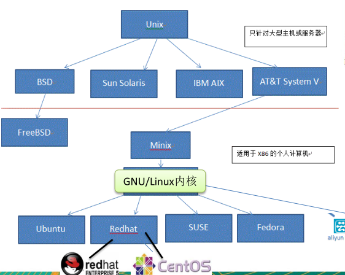
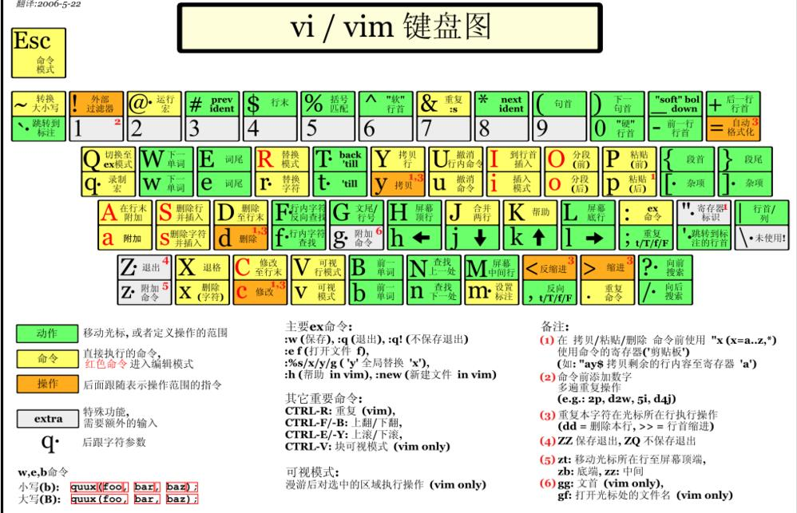

# Linux

## 第一部分 Linux基本命令

### 1.认识Linux

​	linux是一个开源、免费的操作系统，其稳定性、安全性、处理多并发已经得到了业界认可。

**linux的学习路径**

- 第1 阶段 ： linux环境下的基本操作命令，包括 文件操作命令(rm mkdir chmod, chown) 编
- 辑工具使用（vi vim）linux用户管理(useradd userdel usermod)等
- 第2 阶段 ： linux的各种配置（环境变量配置，网络配置，服务配置）
- 第3 阶段 ： linux下如何搭建对应语言的开发环境（大数据，JavaEE, Python等）
- 第4 阶段 ： 能编写shell脚本，对Linux服务器进行维护。
- 第5 阶 段 ： 能进行安全设置，防止攻击，保障服务器正常运行，能对系统调优。
- 第6 阶 段 ： 深入理解Linux系统（对内核有研究），熟练掌握大型网站应用架构组成、并熟
- 悉各个环节的部署和维护方法。

**linux和unix的关系**

**linux和windows的区别**

|比较| Window| Linux|
|-|-|-|
|免费与收费 |收费且很贵| Linux 免费或少许费用。|
|软件与支持 | 数量和质量的优势，不过大部分为收费软件；由微软官方提供支持和服务；|开源自由软件，用户可以修改定制和再发布，由于基本免费没有资金支持，部分软件质量和体验欠缺；有全球所有的Linux开发者和自由软件社区提供支持。|
|安全性 |三天两头打补丁安装系统安全更新，还是会中病毒木马；|要说 Linux 没有安全问题，那当然是不可能的，这一点仁者见仁智者见智，相对来说肯定比Windows 平台要更加安全|
|使用习惯|普通用户基本都是纯图形界面下操作使用，依靠鼠标和键盘完成一切操作，用户上手容易入门简单；|兼具图形界面操作和完全的命令行操作，可以只用键盘完成一切操作，新手入门较困难，需要一些学习和指导，一旦熟练之后效率极高。|
|可定制性 |封闭的，系统可定制性很差；| 开源，可定制化非常强。|
|应用场景 |桌面操作系统主要使用的是window。| 支撑百度，谷歌，淘宝等应用软件和服务的，是后台成千上万的Linux服务器主机。世界上大部分软件和服务都是运行在Linux之上的。|

### 2.Linux文件目录

linux的文件系统是采用级层式的树状目录结构，在此结构中的最上层是根目录“/”，然后在此目录下再创建其他的目录。

**`在Linux世界里，一切皆文件。`**

**/dev**
• 类似于windows的设备管理器，把所有的硬件用文件的形式存储。
**/media [重点]**
• linux系统会自动识别一些设备，例如U盘、光驱等等，当识别后，linux会把识别的设备挂载到这个目录下。
**/mnt [重点]**
• 系统提供该目录是为了让用户临时挂载别的文件系统的，我们可以将外部的存储挂载在/mnt/上，然后进入该目录就可以查看里的内容了。 d:/myshare
**/opt**
• 这是给主机额外安装软件所摆放的目录。如安装ORACLE数据库就可放到该目录下。
默认为空。
**/usr/local [重点]**
• 这是另一个给主机额外安装软件所安装的目录。一般是通过编译源码方式安装的程序。
**/var [重点]**
• 这个目录中存放着在不断扩充着的东西，习惯将经常被修改的目录放在这个目录下。
包括各种日志文件。
**/selinux [security-enhanced linux]**
• SELinux是一种安全子系统,它能控制程序只能访问特定文件 。

### 3.实际操作

#### 3.1vi与vim

所有的 Linux 系统都会内建 vi 文本编辑器。

Vim 具有程序编辑的能力，可以看做是Vi的增强版本，可以主动的以字体颜色辨别
语法的正确性，方便程序设计。代码补完、编译及错误跳转等方便编程的功能特别
丰富，在程序员中被广泛使用。

##### 3.1.1 三种模式

1. 正常模式
   - 可以使用各种快捷键操作文件

2. 插入/编辑模式
   - i、I、a、A、o、O进入插入模式

3. 命令行模式
   - 使用各种命令

##### 3.1.2常用快捷键

#### 3.2 关机与重启

shutdown：

- shutdown -h now		立刻关机
- shutdown -h 1              1min后关机
- shutdown -r now         1min后重启

halt

- 直接使用，关机

reboot

- 重启系统

sync

- 将内存数据同步到磁盘

建议：使用关机前使用sync同步

#### 3.3 用户管理

用户登录和注销：logout（图形运行级别下无效）

