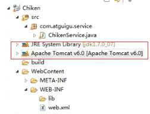
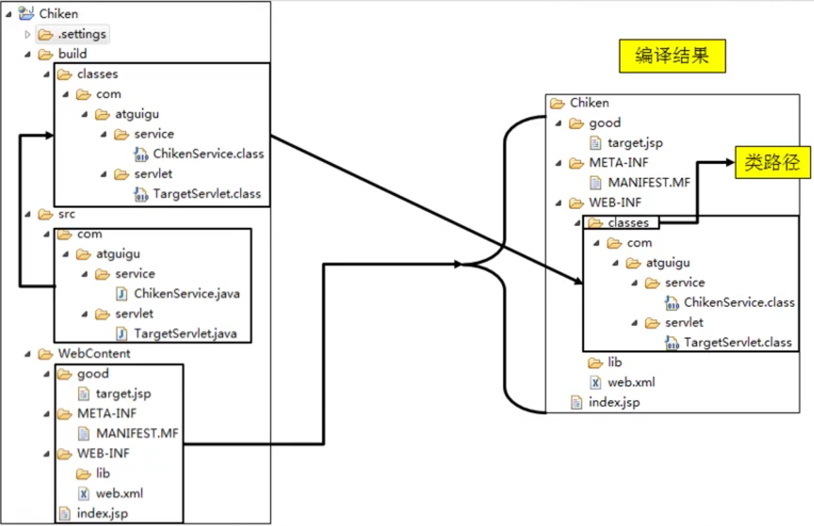
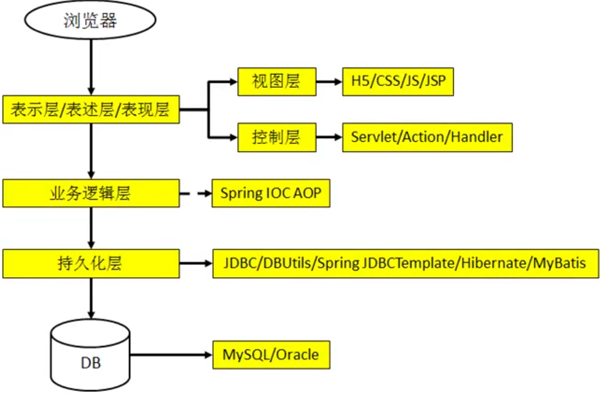
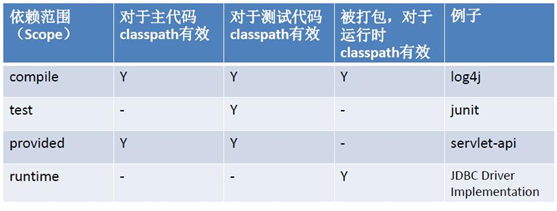

## Maven

### 1.what

- Maven是一款服务与Java平台的自动化构建工具。

  - Make-->Ant-->Maven-->Gradle

- 构建

  - 概念：以java源文件、框架配置文件、JSP、HTML等为原料生产一个可以运行项目的过程

  可运行项目是web工程编译后的结果

#### web工程-->编译、部署-->编译后结果



上面红色的并不发布到服务器是一个运行时环境，是jar包的引用并没有把它复制到工程中，所以不是目录不会发布



这是真正的对应关系，真正运行工程以编译后的结果为标准


maven是一个项目管理工具，包含项目管理，插件以及目标的逻辑等。

Maven的一系列执行流程：

1. 清理：删除上次得到的旧的字节码文件
2. 编译：将java源程序编为class字节码文件
3. 测试：自动测试
4. 报告：测试的结果
5. 打包：动态web工程打成war包，java打成jar包
6. 安装：将包复制到“仓库”
7. 部署：件动态web工程复制到servlet容器使其运行

​     


### Maven引入

项目结构与技术



**目前的问题：**

**1.一个项目就是一个工程**

- 如果一个项目很大，就不适合继续使用package划分模块。最好每个模块对应一个工程，利于分工。
- 借助于Maven可以将一个项目拆分成多个工程。

**2.项目中的jar包必须手动导入到WEB_INF/lib目录下**

- 问题：同样的jar包文件重复出现在不同的项目中，出现冗余
- 借助于Maven，可以将jar包仅仅保存在“仓库”中，有需要使用的工程引用这个文件接口，并不需要真的复制jar包本身。

**3.jar包需要别人替我们准备好，或是从官网下载**

- 不同技术的官网提供jar包下载比较麻烦，有些官网都是通过Maven或是SVN来提供下载的。

- 借助Maven可以使用同一规范下载jar包，所有知名框架和第三方工具的jar包都在Maven的中央仓库存放。

**4.一个jar包的依赖包也需要自己导入**

- Maven会自动将被依赖的jar包导入

**5.项目构建问题**

### 2.Maven安装

1. 检查JAVA_HOME

2. 下载 -> 解压 -> 环境变量 -> 配置文件

### 3.入门

使用maven命令来创建一个mave的Java工程

mvn archetype:generate -DgroupId=cn.wxy.maven.quickstart -DartifactId=simple -DarchetypeArtifactId=maven-archetype-quickstart -DarchetypeCatalog=internal

```sh
[INFO] -------------------------------------------------------------
[INFO] Using following parameters for creating project from Old (1.x) Archetype: maven-archetype-quickstart:1.0
[INFO] -------------------------------------------------------------
[INFO] Parameter: basedir, Value: E:\Maven_repo
[INFO] Parameter: package, Value: cn.wxy.maven.quickstart
[INFO] Parameter: groupId, Value: cn.wxy.maven.quickstart
[INFO] Parameter: artifactId, Value: simple
[INFO] Parameter: packageName, Value: cn.wxy.maven.quickstart
[INFO] Parameter: version, Value: 1.0
[INFO] project created from Old (1.x) Archetype in dir: E:\Maven_repo\simple
[INFO] -------------------------------------------------------------
[INFO] BUILD SUCCESS
[INFO] -------------------------------------------------------------
[INFO] Total time: 04:28 min
[INFO] Finished at: 2018-09-26T09:45:07+08:00
[INFO] Final Memory: 14M/120M
[INFO] -------------------------------------------------------------
```

一个java文件的目录结构

```
Java 工程目录结构
quickstart 
  src 
	main
		java
			cn.wxy.maven.quickstart
test
		java
			cn.wxy.maven.quickstart
pom.xml

```

#### maven基本命令

后面会先执行前面的命令

```
clean	  compile		package		install
```

#### maven集成eclipse

插件添加

修改配置

创建project

 	1. 直接使用create simple project选war
 	2. 使用配置勾选动态工程版本加入web.xml信息

### 4.maven核心概念

#### 4.1目录结构说明

```shell
根目录
	src
		main
			java
			resource
        test	
            java
            resource
	pom.xml
```

约定>配置>编码

#### **4.2POM**

Project Object Model项目对象模型

pom.xml是Maven的核心配置文件，与构建相关过程都在这里进行设置

```xml
<project xmlns="http://maven.apache.org/POM/4.0.0" xmlns:xsi="http://www.w3.org/2001/XMLSchema-instance" xsi:schemaLocation="http://maven.apache.org/POM/4.0.0 http://maven.apache.org/xsd/maven-4.0.0.xsd">
  <modelVersion>4.0.0</modelVersion>
  
  <groupId>a</groupId>
  <artifactId>a</artifactId>
  <version>0.0.1-SNAPSHOT</version>
  
  <packaging>war</packaging>
  
  <dependencies>
  	<dependency>
  		<groupId>xxxx</groupId>
  		<artifactId>xxxx</artifactId>
  		<version>xxxx</version>
  	</dependency>
  </dependencies>
</project>
```

#### 4.3maven坐标

**什么是坐标？**

- 在平面几何中坐标（x,y）可以标识平面中唯一的一点

**Maven坐标主要由下面3个向量组成**

- groupId(公司组织域名倒序+项目名)：定义当前Maven项目隶属项目
- artifactId(模块名称)：定义实际项目中的一个模块
- version(版本)：定义当前项目的当前版本

gav

**Maven为什么使用坐标**

- Maven世界拥有大量构建，我们需要找一个用来唯一标识一个构建的统一规范

- 拥有了统一规范，就可以把查找工作交给机器

#### 4.4 maven的依赖管理与依赖范围

maven的依赖会首先到本地仓库中寻找jar包。

对我们自己的工程需要自行install，安装到本地仓库

如何进行依赖配置？

```xml
<dependencies>
		<dependency>
			<groupId>javax.servlet</groupId>
			<artifactId>servlet-api</artifactId>
			<version>2.5</version>
			<scope>provided</scope>
		</dependency>
		
		<dependency>
			<groupId>javax.servlet</groupId>
			<artifactId>jsp-api</artifactId>
			<version>2.0</version>
			<scope>provided</scope>
		</dependency>
	</dependencies>
</project>
```


其中依赖范围scope 用来控制依赖和编译，测试，运行的classpath的关系. 主要的是三种依赖关系如下：

1.compile： 默认编译依赖范围。对于主程序，测试都有效，参与打包

2.test：测试依赖范围。只对于测试有效

3.provided：已提供依赖范围。对于主程序，测试的classpath都有效，但对于运行无效。因为由容器已经提供，例如servlet-api

4.runtime:运行时提供。例如:jdbc驱动



Maven的直接依赖与间接依赖

依赖的原则：

1. 就近优先
2. 先声明者优先（dependency的声明顺序）

##### Maven的依赖控制与依赖排除

1. 对于公用的在最底层导入即可
2. **注意**：非compile传递不了

依赖控制：控制自己的依赖的包是否往下传递

1. 不想要的工程exclusions
2. 底层设置不传递optional

```xml
<dependency>
    <groupId>cn.itcast.friend</groupId>
    <artifactId>Friend</artifactId>
    <version>0.0.1-SNAPSHOT</version>
    <scope>compile</scope>
    <!-- 表示依赖的Friend是否往下传递
    如果是true，表示不往下传递，如果是false，表示继续往下传递
    -->
    <optional>true</optional>
 </dependency>
```

#### 4.5 maven仓库管理

何为Maven仓库？

- 用来统一存储所有Maven共享构建的位置就是仓库

1. Maven自身所需的插件
2. 第三方框架或工具jar包
3. 自己开发的Maven工程

Maven仓库布局

-  根据Maven坐标定义每个构建在仓库中唯一存储路径

- 大致为：groupId/artifactId/version/artifactId-version.packaging

仓库的分类

- 本地仓库
  -  ~/.m2/repository/
     -  每个用户只有一个本地仓库

- 远程仓库

  - 私服(Nexus)：是一种特殊的远程仓库，它是架设在局域网内的仓库
  - 中央仓库：Maven默认的远程仓库
    - http://repo1.maven.org/maven2
  - 中央仓库的镜像


#### 4.6 maven生命周期

各个构建环节的顺序不能打乱，必须按照既定的正确顺序来执行。Maven的核心仅仅定义了抽象的生命周期，具体的任务都是交由插件完成的

不管执行生命周期的那个阶段，都会从头开始执行到该阶段。

有3套独立的生命周期：

1. Clean：在构建前进行清理清理（pre-clean、clean、post-clean）
2. Default：构建的核心部分，编译，测试，打包，安装，部署等
3. Sit：声场项目报告，站点，发布站点。（pre-sit、sit、post-sit、sit-deploy）

#### 4.7 maven插件

Maven的核心仅仅定义了抽象的生命周期，具体的任务都是交由插件完成的

每个插件都能实现多个功能，每个功能就是一个插件目标比如：maven-compiler-plugin

```xml
<build>
    <finalName>ROOT</finalName>
    <plugins>
        <!-- 模拟配置Tomcat插件 -->
        <plugin>
            <groupId>org.apache.tomcat.maven</groupId>
            <artifactId>tomcat7-maven-plugin</artifactId>
            <configuration>
                <path>/</path>
                <port>8086</port>
            </configuration>
        </plugin>
        <!-- 配置j2se版本 -->
        <plugin>  
            <groupId>org.apache.maven.plugins</groupId>  
            <artifactId>maven-compiler-plugin</artifactId>  
            <version>3.1</version>  
            <configuration>  
                <source>1.8</source>  
                <target>1.8</target> 
                <encoding>utf-8</encoding> 
            </configuration>  
        </plugin>  
        <!--  maven的源码打包插件 -->
        <plugin>  
            <artifactId>maven-source-plugin</artifactId>  
            <version>2.4</version>  
            <configuration>  
                <attach>true</attach>  
            </configuration>  
            <executions>  
                <execution>  
                    <phase>package</phase>  
                    <goals>  
                        <goal>jar-no-fork</goal>  
                    </goals>  
                </execution>  
            </executions>  
        </plugin>  
		<!--  将maven工程的源码包括依赖的jar包全部打包 -->
        <plugin>
            <artifactId> maven-assembly-plugin </artifactId>
            <configuration>
                <descriptorRefs>
                    <descriptorRef>jar-with-dependencies</descriptorRef>
                </descriptorRefs>
                <archive>
                    <manifest>
                        <mainClass>com.cetc.di.App</mainClass>
                    </manifest>
                </archive>
            </configuration>
            <executions>
                <execution>
                    <id>make-assembly</id>
                    <phase>package</phase>
                    <goals>
                        <goal>single</goal>
                    </goals>
                </execution>
            </executions>
        </plugin>
    </plugins>
</build>
```

#### 4.8 Maven_统一管理依赖的版本号

1. 使用properties统一使用版本号
2. 在需要的地方使用`${自定义标签名}`

```xml
<dependencies>
    <dependency>
        <groupId>javax.servlet</groupId>
        <artifactId>servlet-api</artifactId>
        <version>${servlet-api.version}</version>
        <scope>provided</scope>
    </dependency>

    <dependency>
        <groupId>javax.servlet</groupId>
        <artifactId>jsp-api</artifactId>
        <version>2.0</version>
        <scope>provided</scope>
    </dependency>
</dependencies>

<properties>
    <servlet-api.version>2.5</servlet-api.version>
</properties>
```

#### 4.9 继承

由于test不能传递会分散造成版本不一致。

**需求**：统一各个模块工程中junit依赖的版本

**方式**：将junit统一提取到“父”中，在子工程中不指定版本。

**步骤**：

1. 创建Maven父工程，打包方式为->pom

```
<packaging>pom</packaging>
```

2. 在子工程中声明父工程的引用

```xml
<parent>
    <groupId></groupId>
    <artifactId></artifactId>
    <version></version>
    <!-- 从当前pom出发找到父pom.xml -->
    <relativePath></relativePath>
</parent>
```

3. 将子工程的坐标中与父工程中重复的内容删除

   ​	删除一些坐标

4. 在父工程中统一junit的依赖

```xml
<dependencyManagement>
	<dependencies>
	</dependencies>
</dependencyManagement>
```

5. 在子工程中删除junit的版本号

一定要注意，配置继承后执行安装命令要先安装父工程。

#### 4.10聚合

一次性安装多个模块

配置方式：在一个总的聚合工程中配置参与的模块

```xml
<modules>
	<module>../Hello</module>
    <module>../HelloFriend</module>
</modules>
```

会自动解析安装顺序，最好按照依赖顺序来配

#### 4.11自动部署


http://mvnrepository.com/插件可以在这里找。