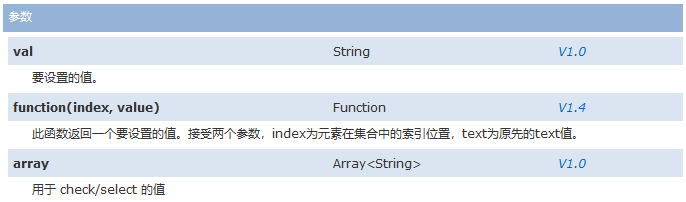
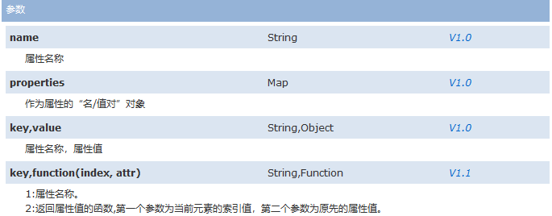
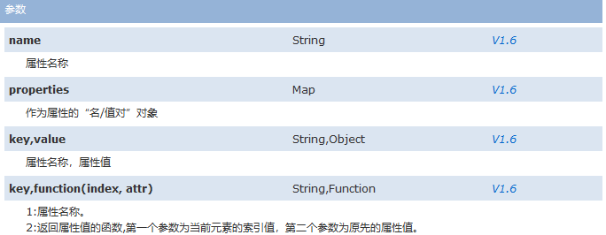
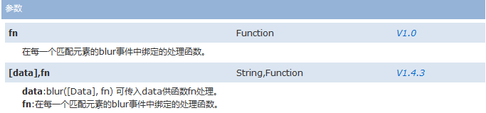
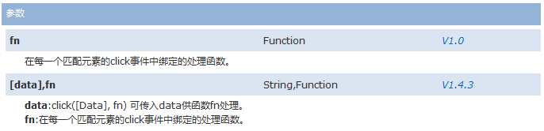
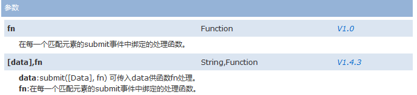

<!-- -->

# jquery

## 第一天

```js
1、jQuery入门
    a)重点1：掌握当页面加载完成时要执行的jquery函数；
    $(function(){
    //当页面加载完成之后执行
    });
    b)重点2：掌握dom对象和jquery对象之间的转换
    var div1=document.getElementById(“d1”);
    dom对象=====>jquery对象：$(div1)     $("<input type='checkbox'>")得到的也是一个jquery对象；
    jquery对像====>转dom对象：jQuery对象.get(0)或者jQuery对象[0]
2、jQuery选择器:
    基本选择器：#id  .class  element  #id,.class,element组合
    层级选择器：父子关系($(“div #d”)   $(“div>#d”))；兄弟选择器($(“div+p”)  $(“div~p”))
    基本过滤选择器：:first    :last      :not(selector)      :even     :odd 
	内容过滤选择器：:contains(text)   :empty    :has(selector) 
	属性过滤选择器：[attribute]    [attribute=value]    [attribute*=value]     [attrSel1][attrSel2][attrSelN] 
	子元素过滤选择器:	: nth-child  	:first-child 	:last-child 
	表单元素过滤选择器：:input     :text     :password     :radio     :checkbox     :submit     :button 
	表单元素属性过滤选择器：:checked   :selected 
3、jQuery文档操作:
	插入：内部插入(父子关系)和外部插入(兄弟关系)
	删除：清空：empty() ,html("")  移除：remove()
4、jQuery事件:
```

### 1.jquery介绍

jquery是基于js的一个框架，对js做了一些列的封装，给我们提供更加方便、快捷的操作，支持链式语法

- dojo                                    面向对象js框架
- extjs                                    要钱
- prototype                           早期的js框架
- angularJS                            一个mvc的js框架提供双向数据绑定

jQuery插件比较丰富

### 2.jQuery核心函数

1. **jQuery(callback)**核心函数、

2. **jQuery(html,[ownerDocument])**核心函数、
3. **jQuery([selector,[context]])**

4. **jQuery对象和javascript对象**(dom对象)如何互转？

#### 2.1 jQuery(callback)

$(document).ready()的简写。

允许你绑定一个在DOM文档载入完成后执行的函数。这个函数的作用如同`$(document).ready()`一样，只不过用这个函数时，需要把页面中所有需要在  DOM 加载完成时执行的()操作符都包装到其中来。从技术上来说，这个函数是可链接的－－但真正以这种方式链接的情况并不多。  你可以在一个页面中使用任意多个`$(document).ready`事件。参考ready(Function) 获取更多 ready  事件的信息。

**callback**	Function	*V1.0*

当DOM加载完成后要执行的函数

实例：

```js
//写法1
jQuery(document).ready(function() {
    alert("hello1");
});

//简写
$(document).ready(function() {
    alert("hello2");
});
jQuery(function() {
    alert("hello3");
});
//一般用这个
$(function() {
    alert("hello4");
});
```

#### 2.2**jQuery([selector,[context]])**

​	根据提供的原始 HTML 标记字符串，动态创建由 jQuery 对象包装的 DOM 元素。同时设置一系列的属性、事件等。你可以传递一个手写的 HTML 字符串，或者由某些模板引擎或插件创建的字符串，也可以是通过 AJAX 加载过来的字符串。但是在你创建 input  元素的时会有限制，可以参考第二个示例。当然这个字符串可以包含斜杠 (比如一个图像地址)，还有反斜杠。当你创建单个元素时，请使用闭合标签或 XHTML  格式。例如，创建一个 span ，可以用$("<span></span>") 或 $("<span></span>") ，但不推荐  `$("<span>")`。在jQuery 中，这个语法等同于`$(document.createElement("span"))` 。

在jQuery 1.8中，通过$(html,props)，  您可以使用任何jQuery对象的方法或插件。在此之前，你只能使用一个方法名的短名单，并有没有成文的方式添加到列表中。现在并不需要是一个列表，在所有！然而，请注意，这可能会导致你的代码的行为改变，如果插件添加后，有相同的名称作为HTML属性。  

**参数**

#### **html,[ownerDocument]**		String,Document		*V1.0*

**html**:用于动态创建DOM元素的HTML标记字符串

**ownerDocument**:创建DOM元素所在的文档

#### **html,props					**String,Map				*V1.4*

**html**:用于动态创建DOM元素的HTML标记字符串

**props**:用于附加到新创建元素上的属性、事件和方法


### 3. jquery选择器

#### 3.1.基本选择器

`$("#d1")`、`$("div")`、`$(".d")`、分别是使用id、元素、class获取一个元素的jQuery对象。

`$(".d,#d1")`是获取并集。

**方法**

|||
|-|-|
|**html**() :|无参数代表获取元素中的html代码，如果有参数代表设置元素的html信息|
|**text**():|无参数代表获取元素中的文本信息，如果有参数代表设置元素的文本信息|
|**each**(function(index){}):|它可以帮助我们遍历元素，可以传递一个函数each(function(n)),n就代表的是每一个元素的序号，在函数中可以通过this来获取其dom对象|
|**index**():|获取元素索引值|
|**size**():|元素的个数|

注意在each遍历时`$(this)`才是js中的当前对象 一定要加`$`

```js
$(function() {
    //1.得到id=d1的元素中的内容显示出
    var html = $("#d1").html(); //html方法得到div的id=d1元素中的所有html
    //alert(html);
    var text = $("#d1").text(); //text方法得到div的id=d1元素中的所有文本
    //alert(text);

    //2.	将class=d元素中的内容后面添加欢迎你
    $(".d").each(function(i) {
        //alert(i);
        //this它是一个dom对象，我们要调用jquery的方法，应该将其转换为jquery对象
        $(this).html($(this).html() + " 欢迎你");
    });

    //3.	得到id=d1这个div在整个页面上是第几个.
    //3.1得到所有的div
    //3.2得到id=d1这个div
    var index = $("div").index($("#d1")); //判断id=d1元素在所有div中的索引值，从0开始
    //alert(index);

    //4.	得到class=d的元素有几个
    var size=$(".d").size();
    //alert(size);

    //5.	将所有的class=d或id=d1元素中的内容设置为java
    $(".d,#d1").html("java");
});
```


#### 3.2层级选择器

理解层级选择器：父子、兄弟关系的选择器

css()方法的作用和格式是怎样的？

|格式|desc|
|-|-|
|ancestor descendant    使用空格|在给定的祖先元素下匹配所有的后代元素|
|parent > child                 使用>|在给定的父元素下匹配所有的子元素|
|prev + next                     使用+|匹配所有紧接在 prev 元素后的 next 元素|
|prev ~ siblings                使用~|匹配 prev 元素之后的所有同辈元素|

```js
$(function(){
    //1.	获取id=d的所有<a>子元素
    var size=$("#d a").size();
    //2.	获取id=d 的直接<a>子元素
    var size=$("#d>a").size();
    //3.	获取id=d第一个<p>兄弟元素
    alert($("#d+ p").html());
    //4.	获取id=d的所有<p>兄弟元素
    var size=$("#d~p").size();
    //alert(size);
    //5.	将id=d下的所有子元素<a>的文字颜色设置成红色
    $("#d >a").css({"color":"red"});
});
```

#### css()方法

##### 参数name 描述:

取得第一个段落的color样式属性的值。

jQuery 代码:

```
$("p").css("color");
```

##### 参数properties 描述:

将所有段落的字体颜色设为红色并且背景为蓝色。

jQuery 代码:

```
$("p").css({ color: "#ff0011", background: "blue" });
```

##### 参数name,value 描述:

将所有段落字体设为红色

jQuery 代码:

```
$("p").css("color","red");
```


#### 3.3 基本过滤选择器


|选择器||
|-|-|
|- [:first](first_1.html)  |获取第一个元素|
|- [:last](last_1.html)  |获取最后个元素|
|- [:not(selector)](not_1.html)  |去除所有与给定选择器匹配的元素|
|- [:even](even.html)  |匹配所有索引值为偶数的元素，从 0 开始计数|
|- [:odd](odd.html)  |匹配所有索引值为偶数的元素，从 0 开始计数|
|- [:eq(index)](eq_1.html)  |匹配一个给定索引值的元素|
|- [:gt(index)](gt.html)  |匹配大于给定索引值的元素|
|- [:lt(index)](lt.html)  |匹配小于给定索引值的元素|
|- [:header](header.html)  |匹配如 h1, h2, h3之类的标题元素|
|- [:animated](animated.html)  |匹配所有正在执行动画效果的元素|
|- [:focus](focus_1.html)1.6+ |匹配当前获取焦点的元素。|

如果`：`前不写东西表示范围为当前操作的范围下所有的
```js
$(function() {
    //1.设置表格第一行，显示为红色
    $("tr:first").css("color","red");

    //2.设置表格除了第一行以外，显示为蓝色
    $("tr:not(tr:first)").css("color",'blue');
    $("tr:gt(0)").css("color","blue");

    //3.设置表格的奇数与偶数行颜色不一致，例如，偶数行设置为红色，奇数行设置为蓝色
    $("tr:odd").css("color","red");
    $("tr:even").css("color","blue");

    //设置页面上的标题为灰色
    $(":header").css("color","gray");
});
```


#### 3.4内容过滤选择器
|选择器|desc|
|-|-|
|- [:contains(text)](contains.html)  |匹配包含给定文本的元素|
|- [:empty](empty_1.html)  |匹配所有不包含子元素或者文本的空元素|
|- [:has(selector)](has_1.html)  |匹配含有选择器所匹配的元素的元素|
|- [:parent](parent_1.html) |匹配含有子元素或者文本的元素|

```html
<script type="text/javascript">
	$(function() {
		//1.设置含有文本内容JAVA的div字体颜色为红色
		$("div:contains('JAVA')").css("color","red");
		//2.设置没有子元素的div文本内容为"这是一个空的DIV"
		$("div:empty").html("这是一个空的DIV");
		//3.包含<a>元素的div字体颜色为黄色
		$("div:has(a)").addClass("divColor");
		//4.设置所有含有子元素的span字体为蓝色
		$("span:parent").css("color","blue");
	});
</script>
</head>
<body>
	<div>itcast JAVA</div>
	<div>itcast IOS</div>
	<div></div>
	<div>
		<a>传智播客</a>欢迎您
	</div>
	<div>
		<a>JAVA</a>
	</div>
	<div>
		<span>今天天天气不错</span>
	</div>
	</body>
</html>
```


#### 3.5可见性过滤选择器
|||
|-|-|
|- [:hidden](hidden_1.html)  ||
|- [:visible](visible.html) ||

#### 3.6属性过滤选择器
|||
|-|-|
|[attribute]  |匹配包含给定属性的元素。|
|  [attribute=value]  |匹配给定的属性是某个特定值的元素|
| [attribute!=value]  |匹配给定的属性不是某个特定值的元素|
| [attribute^=value]  |匹配给定的属性是某个特定值的元素开头|
|  [attribute$=value]  |匹配给定的属性是某个特定值的元素结尾|
| [attribute*=value] |匹配给定的属性是以包含某些值的元素|
| `[attrSel1][attrSel2][attrSelN]` |多个|

**val([val|fn|arr])**获得匹配元素的当前值**value**值。



**attr(name|properties|key,value|fn)**设置或返回被选元素的属性值。



**prop(name|properties|key,value|fn)**获取在匹配的元素集中的第一个元素的属性值。




#### 3.7 子元素过滤选择器
|||
|-|-|
|- [:nth-child](nthChild.html)  |要匹配元素的序号，从1开始,匹配其父元素下的第N个子或奇偶元素|
|- [:first-child](firstChild.html)  ||
|- [:last-child](lastChild.html)  ||
|- [:only-child](onlyChild.html) |如果某个元素是父元素中唯一的子元素，那将会被匹配|

#### 3.8 表单过滤选择器
|||
|-|-|
|- [:input](input.html)  ||
| - [:text](text_1.html)  ||
| - [:password](password.html)  ||
|- [:radio](radio.html)  ||
|- [:checkbox](checkbox.html)  ||
| - [:submit](submit_1.html)  ||
| - [:image](image.html)  ||
| - [:reset](reset.html)  ||
| - [:button](button.html)  ||
| - [:file](file.html)  ||
| - :hidden ||

**blur([[data],fn])**当元素失去焦点时触发 blur 事件。



**click([[data],fn])**

触发每一个匹配元素的click事件。

这个函数会调用执行绑定到click事件的所有函数。



**submit([[data],fn])**

当提交表单时，会发生 submit 事件。

该事件只适用于表单元素。



##### 3.9 表单对象属性过滤选择器
|||
|-|-|
|- [:enabled](enabled.html)  |匹配所有可用元素|
|- [:disabled](disabled.html)  |匹配所有不可用元素|
|- [:checked](checked.html)  |匹配所有选中的被选中元素(复选框、单选框等，不包括select中的option)|
|- [:selected](selected.html) |匹配所有选中的option元素|

#### 4.jQuery操作

##### 4.1 添加 

append

##### 4.2 移除

empty

remove

detach

##### 4.3 替换和克隆

replace

clone

**4.4 事件切换**

hover

toggle